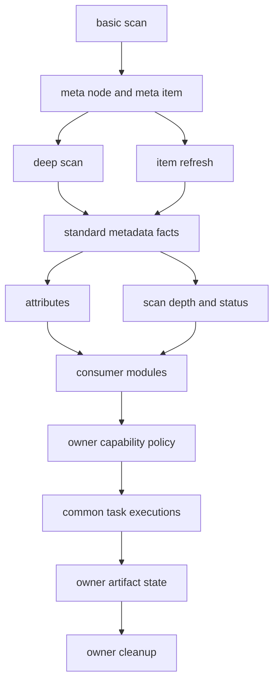
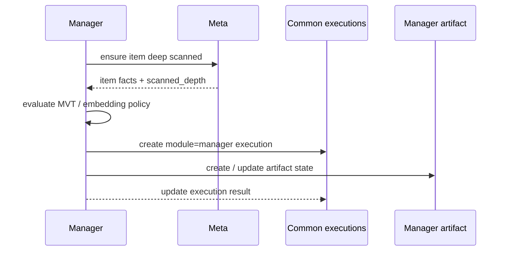

# 扫描后派生能力与任务边界

> 状态：讨论稿。本文用于收敛 basic scan、deep scan、扫描后派生能力、任务定义、执行记录和产物 owner 的概念边界；不代表当前立即改造任务体系。

## 背景

Meta scan 是 ADDP 在后台为用户默认完成的数据项发现和元数据提取能力。它的职责边界是：用户不应该为了看见数据项、理解基本结构或获得通用读取能力而手动拼装流程。

Meta 扫描主线已经收敛为：

1. `scan` 发现或刷新 data item 事实，写入 `meta_node`、`meta_item` 和标准 `meta_item.attributes`。
2. Manager preview、Meta 查询 API 等消费方只读取已落库事实，不在预览或查询链路偷偷写回 attributes。
3. `access_index` 当前作为 deep scan / item refresh 的默认尝试目标保留；缺失时由消费方降级读取或提示用户刷新。

本文不再为这类能力新增 Meta 对外概念。后续真正需要统一的是：

- 哪些能力属于 basic scan。
- 哪些能力属于 deep scan。
- 哪些轻量加工可以作为 deep scan 的内部阶段默认完成。
- 哪些能力是基于已识别 item 的扫描后派生产物。
- 派生产物的策略、执行、状态、清理应由哪个模块拥有。
- 统一执行记录和模块私有任务定义之间如何关联。

## 核心结论

对外只保留 `basic scan`、`deep scan` 和 `item refresh`。其中 `item refresh` 不是独立扫描类型，而是针对已入库 item 重新执行 deep scan 的入口；它使用已落库 item 标准事实还原读取输入，不重新裁决 item 边界。Meta 内部可以把 deep scan 继续拆成事实提取、内容索引、轻量加工等阶段，但不新增对外的额外任务概念。

| 概念 | Owner | 定义 | 典型对象 |
| --- | --- | --- | --- |
| basic scan | Meta | 快速发现 node / item，写入低成本基础元数据 | node、item 身份、storage、layout、轻量格式判断 |
| deep scan | Meta | 在成本受控前提下补齐必须元数据和通用读取辅助能力 | fields、container children、document info、spatial、statistics、`access_index` |
| item refresh | Meta | 已入库 item 的 deep scan 入口，通常用于用户显式刷新当前 item | item attributes、format info、access index、横切能力 |
| derived execution | 产物 owner 模块 | 基于已落库 item facts 生成派生能力、索引、缓存或物化产物的一次执行 | 瓦片缓存生成、embedding、缩略图生成、大文件外部索引 |
| artifact state | 产物 owner 模块 | 描述外部产物当前位置、状态、版本、缓存键、失败原因和清理条件 | `manager.quick_view`、MVT tiles、embedding vectors、preview cache |

判断某个能力是否应进入 Meta scan，不能只看它是否发生在扫描之后，而要同时看三件事：

1. 是否是平台默认应该具备的通用能力。
2. 是否不需要用户额外选择模型、输出位置或业务参数。
3. 是否成本有明确上限，不需要长时间进度、取消、重试和审计。

满足以上条件的能力可以成为 deep scan 内部阶段；不满足的能力应进入 owner 模块的任务体系。

## 主线模型

这条模型保留三条边界：

1. Meta scan 负责后台完成默认元数据能力，不负责所有后续产物。
2. `common.task_executions` 只统一执行记录，不吞并各模块任务定义。
3. artifact 的状态和 cleanup 跟随 owner 模块，不反向进入 Meta cleanup。

## Basic Scan 边界

basic scan 的目标是快，负责构建资源树和 data item。

允许：

- 构建 `meta_node` 和 `meta_item`。
- 写入 item 身份、catalog leaf 类型、基础 storage facts。
- 写入无需打开内容或只需极小 header 的轻量格式判断。
- 写入低成本摘要，例如 catalog 直接返回的 size、etag、last_modified_at。

不允许：

- 全文扫描。
- 全表扫描。
- 读取大文件内容。
- 为了 extent、真实 geometry 类型分布或行数统计扫描全部数据。
- 写入 preview cache、MVT、embedding、thumbnail 等派生产物。

## Deep Scan 边界

deep scan 的目标是补齐平台默认需要的元数据和低成本通用读取辅助能力。

Meta scan 只回答：

- 当前 engine / node / item 范围内有哪些 data item。
- 每个 item 的身份、layout、primary content、refs 和 whole scope 是什么。
- 已知 item 的标准 attributes 应如何刷新。
- 当前 item / node 是否已经达到 `basic` 或 `deep`。

deep scan 可以：

- 读取内容以提取字段、文档结构、容器 children、空间能力和格式私有信息。
- 在成本受控时生成 `access_index`。
- 记录 provider 跳过、失败或不支持的稳定原因。

deep scan 不应：

- Manager 要不要生成 MVT。
- embedding 应使用哪个模型和索引表。
- preview cache、tile cache、缩略图应该存到哪个 bucket / key。
- 某个派生产物何时过期、如何清理。
- 因为某个派生能力失败而让 data item 元数据不可用。

Manager、Transfer、Asset、Search 等模块如需补齐元数据，只能请求 Meta 对目标 item / node / engine 执行扫描；不得绕过 Meta detector 重新裁决 item 边界，也不得在预览链路直接写 attributes。

## `access_index` 边界

`access_index` 当前保留在 Meta deep scan / item refresh 主线内：

- 标准落点仍是 `attributes.access_index.<data_type>`。
- 它服务通用内容窗口读取，不绑定 Manager 某个展示缓存。
- provider 可因格式不支持、成本限制、文件过大等原因跳过。
- 跳过不应导致 deep scan 失败。
- Manager preview 只消费已有索引；缺失或不可用时降级读取，不触发写回。
- Manager 可以基于 Meta 已落库状态提示用户执行 item refresh，但不得在预览链路自动写 attributes。

如果未来出现成本明显高于 deep scan 的大文件 access index，应先单独讨论是否拆成 Meta-owned derived execution。即使拆出，它仍是 Meta owner，因为产物是平台通用读取能力，而不是 Manager 展示产物。对外仍可表现为 item refresh 或 deep scan 的后台执行，不需要新增用户可见入口。

## Execution 与 Artifact

`derived execution` 和 `artifact state` 是两类不同对象：

| 对象 | 关注点 | 生命周期 | 典型问题 |
| --- | --- | --- | --- |
| derived execution | 某一次派生能力执行过程 | 一次执行一条记录，完成后成为历史 | 这次由谁触发、跑到哪一步、成功还是失败、耗时多久 |
| artifact state | 某个派生产物当前状态 | 随产物持续存在，可被多次执行更新 | 当前产物在哪里、是否可用、由什么配置生成、如何失效和清理 |

二者关系是：execution 负责“这次做了什么”，artifact state 负责“现在留下了什么”。一次 execution 可以创建、更新、跳过或删除 artifact；一个 artifact 也可能被多次 execution 重建或刷新。

以 MVT 快显为例：

- `common.task_executions` 中的一条 `tile_cache_generation` 记录表示一次瓦片生成执行。
- `manager.quick_view` 只表示当前用户预览模式偏好；快显能力、fingerprint、extent、zoom、缓存进度和错误信息应分别来自 Capability API、瓦片缓存结果和 execution。
- MinIO 中的 tiles 是实际 artifact 内容。

以 embedding 为例：

- `common.task_executions` 中的一条 `embedding` 记录表示一次向量化执行。
- `manager.embeddings` 或未来语义索引表表示当前可检索向量状态。
- 模型、维度、模态、数据指纹和更新时间决定这个 artifact 是否仍然有效。

## 派生产物 owner 规则

判断 owner 时不看“是否发生在 scan 之后”，而看产物服务谁、状态在哪里、谁知道删除规则。

| 产物 | 推荐 owner | 理由 |
| --- | --- | --- |
| 小/中型 `access_index` | Meta | 标准 attributes 分区，服务通用读取能力 |
| Meta Meilisearch item index | Meta | Meta 负责索引自身标准事实和文档抽取引用 |
| MVT / Quick View 物化视图 | Manager | 服务空间快显，依赖 Manager tile config、zoom、缓存策略 |
| MVT tiles / tile metadata | Manager | bucket、key、压缩、租户路径和失效策略都属于 Manager |
| 轻量 thumbnail 引用 | 待定，倾向 Manager / Asset | 若成本极低且平台默认需要，可作为 owner 模块后台能力 |
| 重型 thumbnail / 文档渲染 / 视频抽帧 | Manager / Asset / Media 专题 | 需要进度、重试、缓存和清理，不属于 Meta scan |
| Manager embedding vectors | Manager | 当前模型、任务定义、索引表和检索入口在 Manager |
| 平台级全文或语义索引 | 待定，倾向 Search / Index 专题 | 若成为跨模块统一检索能力，应独立讨论 owner |
| Transfer 临时文件或导入中间产物 | Transfer | 由 Transfer 生命周期和执行计划决定 |

MVT / Quick View 的 extent、SRID、target SRID、transform status 属于空间展示派生事实，不得写回 `attributes.capabilities.spatial`。具体边界由 [快显规范与技术路线](快显/02-规范与技术路线.md) 专题处理，本文只保留 owner 判断原则。

## 任务定义与执行记录

任务定义、执行记录、TaskProvider、编排和监控的通用规范见 [ADDP 任务体系规范](../spec/addp任务体系规范.md)。本文只保留扫描后派生能力的边界：不要因为执行记录统一就合并业务 owner。

| 对象 | 存储 | 含义 |
| --- | --- | --- |
| 任务定义 | owner 模块私有表 | “未来应该按什么策略处理什么对象” |
| 执行记录 | `common.task_executions` | “某一次实际执行了什么、状态如何、结果如何” |
| 产物状态 | owner 模块私有表或外部 artifact manifest | “产物现在是否可用、在哪里、由什么配置生成” |

约束：

1. Meta `ScanTask` 只定义扫描，不定义 MVT、embedding、thumbnail。
2. Manager `TileCacheTask`、`EmbeddingTask` 这类任务定义仍归 Manager。
3. 各模块执行都可以写入 `common.task_executions`，通过 `module`、`task_type`、`source_task_id` 和 `source` 关联自身任务定义。
4. `trigger_type` 仍只表达 `manual` / `scheduled`，不要把 `mvt`、`embedding`、`thumbnail` 塞进触发类型。
5. scan execution 可以在结果中暴露可消费事实或建议，但不直接成为下游派生产物的 owner。

推荐流程：

## Cleanup 边界

cleanup 跟随 owner，不跟随触发事件来源。本文不展开 cleanup 协议、consumer、结果模型和迁移步骤；详细现状和建议由 [Meta cleanup 边界与派生产物清理设计](meta-cleanup边界与派生产物清理设计.md) 专题处理。

## 当前实现不变

本讨论稿不直接改变当前实现：

- 不拆出 `access_index` 独立任务。
- 不改变 `attributes.access_index.<data_type>` 结构。
- 不改变 Manager preview 的降级读取策略。
- 不改变 MVT / embedding 现有模块归属。
- 不新增统一扫描后派生任务表。
- 不立即调整 cleanup API 行为。

## 后续需要讨论

1. Manager preview 如何提示生成 access index。
   建议：Manager 只消费 Meta 已落库状态；如果发现可提速但缺失索引，提示用户执行 item refresh，不在预览链路自动写 attributes。
2. embedding 长期归属。
   建议：短期维持 Manager owner；长期若成为跨模块默认语义检索能力，应进入 Search / Index 专题，不放进 Meta scan。
3. 缩略图长期归属。
   建议：轻量缩略图可考虑 owner 模块后台生成；文档渲染、视频抽帧等重型产物必须任务化，不进入 Meta scan。
4. MVT 生成的两种语义。
   建议：快显缓存继续归 Manager；用户选择输出位置的 MVT 应作为算子或数据处理结果，产物进入用户 business 存储，再由 Meta scan 识别。
5. 大文件 `access_index` 是否拆出执行。
   建议：仍归 Meta owner；若成本不可控，可拆为 Meta-owned 后台 execution，但对外仍表现为 deep scan / item refresh 的执行结果。
6. 任务体系命名和 task type。
   建议：以 [ADDP 任务体系规范](../spec/addp任务体系规范.md) 为准；[任务体系统一设计](任务体系统一设计.md) 只保留调研背景、迁移过程和后续专题边界。
