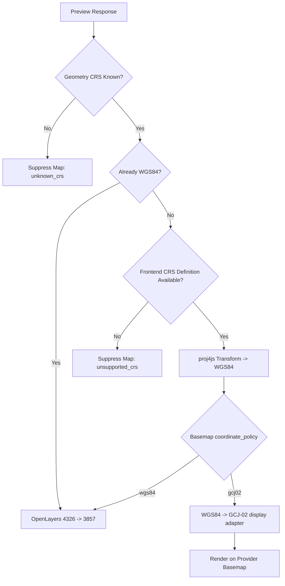

# 空间坐标参考转换能力边界讨论

本文讨论 ADDP 对空间坐标参考转换（CRS transform）的能力边界，不作为正式规范。待方案确认后，再同步修订 `docs/spec/`、`docs/concepts/` 和相关实现。

当前讨论倾向：

- 统一术语使用“坐标参考转换 / CRS transform”，不再使用“动态投影”表达该问题。
- ADDP 核心后端不提供通用 CRS transform 能力。
- PostGIS、Python 工作流引擎、Spark/Sedona 等运行时可以具备 CRS transform 能力，但这些属于具体引擎或计算环境能力，不属于 ADDP 核心模块能力。
- Manager 前端预览可以提供小样本、交互级 CRS transform，用于地图预览和在线底图适配。
- 后端 `cgo + PROJ` 不作为默认能力引入；现有 PROJ 相关代码、文档和部署脚本应在方案确认后收敛或移除。

## 一、问题背景

空间数据的坐标参考不一致时，会影响两类体验：

1. 地图绘制：数据坐标与地图视图或在线底图不一致时，图层会偏移、缩放异常或完全不可见。
2. 空间匹配：用户在地图上绘制范围、点击要素、框选视口后，如果前后端没有明确坐标参考，空间查询会命中错误对象。

ADDP 当前已经把空间能力建模为 `capabilities.spatial` 横切事实，这个方向是正确的。平台需要继续保存真实空间事实，例如几何列、SRID、CRS 和原生 CRS 下的 extent；但是否执行 CRS transform，应按能力边界拆分，而不是让所有后端模块都隐式具备任意坐标转换能力。

## 二、目标边界

### 1. ADDP 核心后端只管理事实和契约

ADDP 核心后端应负责：

- 记录并提供空间元数据事实：
  - `geometry_columns`
  - `primary_geometry_column`
  - `srid`
  - `crs_ref`
  - `crs_definitions`
  - `extent`，且只表示当前空间对象或 primary geometry column 原生 CRS 下的范围
- 明确数据当前坐标参考、预览目标坐标参考和底图坐标策略。
- 在无法确认 CRS 时返回明确状态，例如 `unknown_crs`，而不是猜测或静默渲染。
- 为前端和引擎提供统一契约，例如 `source_crs`、`source_crs_definition`、`source_srid`、`target_crs`、`transform_status`。

ADDP 核心后端不应负责：

- 内置任意 EPSG/WKT/PROJJSON 的通用坐标转换。
- 默认依赖 `libproj`、`proj.db` 或格网数据。
- 在普通 Manager / Meta / Transfer / Service 后端进程中通过 cgo 执行 PROJ 转换。
- 把 GCJ-02、BD-09 等在线底图坐标偏移写入数据事实。

### 2. 引擎能力归属于引擎

PostGIS 的 `ST_Transform`、Python 工作流里的 `pyproj/geopandas`、Spark/Sedona 的 `ST_Transform` 等能力，应被视为具体引擎或运行环境能力。

这意味着：

- PostGIS 查询、MVT 生成、预缓存可以继续使用 PostGIS 自身的 CRS transform 能力。
- Python 工作流可以在工作流执行环境内做 CRS transform。
- ADDP 不应把这些能力抽象成“所有后端都可用”的平台核心能力。
- 不新增引擎级 CRS transform 能力声明字段。某条具体调用路径能否转换，由该路径使用的引擎、SQL 或工作流实现自己决定；平台核心只表达输入 CRS、输出 CRS 和转换状态。

### 3. Manager 前端负责预览级转换

Manager 前端适合处理：

- 小样本 GeoJSON / 表格预览 geometry 的 CRS transform。
- 用户绘制、点击、框选等交互坐标转换。
- 在线底图坐标策略适配，例如标准 WGS84/WebMercator 底图、高德 GCJ-02 底图等。
- 在不能转换时显示明确提示，而不是错位渲染。

Manager 前端不适合处理：

- 大表全量转换。
- MVT 瓦片生成。
- 需要空间索引的后端查询和匹配。
- 批量 ETL 型 CRS transform。

## 三、当前存在的不足

### 1. `common/spatial` 当前职责偏重

第一阶段改造前，`common/spatial` 文档和代码中包含 CRS transform facade，并提供 `pure_go` 与 `proj` executor。`proj` executor 使用 `cgo`、`pkg-config` 和系统 `libproj`。

第一阶段已按 ADDP 核心后端不提供通用 CRS transform 的方向收敛：

- `common/spatial` 可以保留 PostGIS SQL 表达式、MVT SQL 构造、WKB/WKT/EWKB 编码等空间通用工具。
- `common/spatial` 不应继续声明“通用 CRS transform facade”是核心能力。
- `proj` build tag、`common/spatial/internal/proj`、PROJ 集成测试和相关 README 描述已从核心后端移除。

### 2. 后端接口存在转换语义不一致

当前不同 Manager 后端路径对坐标转换的处理不完全一致：

- 某些表格预览路径会把 PostGIS geometry 转成 WGS84 GeoJSON 渲染列。
- 某些 GeoJSON 分页接口直接输出 `ST_AsGeoJSON(geom)`，如果源数据不是 WGS84，前端按 GeoJSON 渲染会错位。
- MVT 路径会转成 3857 或使用 3857 物化视图，但这是 PostGIS/MVT 场景能力，不应被误认为 ADDP 后端通用 CRS transform。

后续应统一契约：

- 如果后端返回的是可直接地图渲染的 GeoJSON，应明确 `target_crs=EPSG:4326`。
- 如果后端返回原始 CRS geometry，应明确 `source_crs/source_srid`；需要前端转换时返回 `source_crs_definition`，由前端决定是否可预览转换。
- SRID=0 不应被当作 4326 或可直接渲染。没有 CRS 事实时，应返回 `unknown_crs`。

### 3. 前端地图框架与当前能力

当前 Manager / common-frontend 地图预览不是单一渲染器：

- 通用空间预览主路径使用 OpenLayers。
- 天地图底图走 OpenLayers renderer。
- 高德底图走 AMap JSAPI renderer。
- `MapContainer` 根据 `baseMapType` 在 OpenLayers renderer 与 Gaode renderer 之间切换。

当前 OpenLayers 地图预览默认把 GeoJSON 输入视为 `EPSG:4326`，地图视图为 `EPSG:3857`。前端已有非 WGS84 数据压制展示逻辑，但缺少通用 CRS transform 能力。

当前高德渲染器使用 AMap JSAPI 的 `LngLat`、`Marker`、`Polygon`、`Polyline` 等对象直接绘制经纬度坐标。后续如果高德底图继续作为可选底图，前端需要明确处理 WGS84 与 GCJ-02 展示坐标之间的关系，否则会出现底图和业务图层偏移。

如果方案确认，前端应补齐：

- CRS 定义注册能力，例如基于 `proj4js` 与 OpenLayers projection registry。
- 从后端接收 `source_srid/source_crs/source_crs_definition` 的统一 DTO。
- 可转换时执行前端 transform，不可转换时显示明确状态。
- 对大样本设置阈值，超过阈值时不在前端执行转换。

第二阶段已先落地最小前端 CRS registry：内置 `EPSG:4326`、`EPSG:3857`，并优先尝试注册后端返回的 `source_crs_definition.definition`；暂不接入外部 EPSG 查询。

第三阶段已落地高德底图的最小展示适配：底图选项携带 profile，高德 profile 声明 `coordinate_policy=gcj02`，高德 renderer 在调用 AMap JSAPI 前把 WGS84 预览要素转换为 GCJ-02 展示坐标。该偏移只存在于渲染边界，不写入 `source_crs`、`source_srid` 或 `capabilities.spatial`。组件交互事件中的 `coordinate` 仍表示 WGS84 坐标，`position` 表示 provider 展示坐标。选择 GCJ-02 底图时前端显示业务浏览提示，避免被误用为精确空间校验。BD-09 尚未实现。

### 4. 在线底图坐标策略缺失

当前前端支持或配置了天地图、高德、OSM 等在线底图，但底图不仅有瓦片投影差异，还可能有坐标加偏策略差异。

需要明确：

- OSM、标准 XYZ、标准 MVT 通常按 WebMercator / EPSG:3857 工作。
- 天地图当前使用 `_w` 瓦片矩阵集，应按 WebMercator 类底图处理；如果后续支持 `_c`，则需要单独声明。
- 高德等国内商业底图通常涉及 GCJ-02 坐标体系。GCJ-02 不是标准 EPSG CRS，不应进入 `capabilities.spatial.srid/crs_ref/crs_definitions`。
- 如果使用高德底图，前端展示层需要单独做 WGS84 与 GCJ-02 的展示适配；用户交互坐标回传后端前也必须反向还原。

建议引入底图 profile：

```json
{
  "provider": "amap",
  "tile_matrix_set": "xyz",
  "view_crs": "EPSG:3857",
  "coordinate_policy": "gcj02"
}
```

标准 WebMercator 底图示例：

```json
{
  "provider": "osm",
  "tile_matrix_set": "WebMercatorQuad",
  "view_crs": "EPSG:3857",
  "coordinate_policy": "wgs84"
}
```

`coordinate_policy` 属于渲染层，不属于数据事实。

### 5. `cgo + PROJ` 会增加部署复杂度

当前 PROJ 集成存在以下部署风险：

- 构建环境需要 C 编译器、`pkg-config`、PROJ header 和开发包。
- 运行环境需要 `libproj`、`proj.db`，可能还需要格网数据。
- 当前实现运行时调用 `pkg-config --variable=datadir proj` 查找 `proj.db`，这会要求运行镜像也安装 `pkg-config` 和 `proj.pc`。
- 交叉编译、Alpine/musl、distroless/scratch 镜像都会更复杂。
- 镜像体积会因原生库、数据库和数据文件增加。
- 原生依赖带来额外 CVE、ABI 和版本一致性维护成本。

因此，`cgo + PROJ` 不宜作为 ADDP 默认后端能力。

## 四、建议改进方向

### 1. 移除后端核心 PROJ 集成

方案确认后建议处理：

- 删除或隔离 `common/spatial/internal/proj`。
- 删除 `proj` build tag executor。
- 删除 `proj` integration test 或迁移到实验目录。
- 修订 `common/spatial/README.md`，移除“通用 CRS transform facade”作为核心能力的表述。
- 检查并同步修改构建、部署、Docker、CI、打包脚本，确保不再需要 `libproj`、`pkg-config`、`proj.db`。

### 2. 重写后端 CRS transform 契约

后端接口不再承诺“我会帮你转换任意 CRS”。后端只返回：

- 数据原始 CRS。
- 是否已经可直接渲染。
- 如果由引擎完成了转换，说明目标 CRS。
- 如果不能转换，返回明确状态。

示例：

```json
{
  "geometry_column": "geom",
  "source_srid": 4547,
  "source_crs": "EPSG:4547",
  "transform_status": "not_transformed",
  "preview_hint": "frontend_transform_required"
}
```

已由 PostGIS 输出 WGS84 GeoJSON 时：

```json
{
  "geometry_column": "geom",
  "source_srid": 4547,
  "target_srid": 4326,
  "transform_status": "engine_transformed",
  "transform_engine": "postgis"
}
```

### 3. 前端预览增加 CRS transform 能力

Manager 前端预览可引入：

- `proj4js` 用于注册 CRS 定义。
- OpenLayers projection registry。
- 可配置 CRS 定义来源，优先使用后端返回的 WKT、ESRI WKT 或 proj4 文本，不依赖前端运行时访问外部 EPSG 服务；当前前端不直接注册 PROJJSON。
- 样本量阈值，超过阈值时提示用户使用 MVT / PostGIS 引擎预览。
- 转换失败状态展示。

前端预览流程建议：



### 4. 在线底图配置规范化

底图配置应从“URL 列表”提升为受控 profile：

| 字段 | 含义 |
|---|---|
| `provider` | `osm`、`tianditu`、`amap`、`custom_xyz` |
| `tile_matrix_set` | `WebMercatorQuad`、`tianditu_w`、`tianditu_c` 等 |
| `view_crs` | 地图视图 CRS，通常 `EPSG:3857` |
| `coordinate_policy` | `wgs84`、`gcj02`、`bd09` |
| `requires_key` | 是否需要 key |
| `attribution` | 版权与署名 |
| `network_policy` | `online`、`intranet`、`offline` |

默认空间校验场景应优先使用 `coordinate_policy=wgs84` 的底图或无底图模式；`gcj02/bd09` 底图用于业务浏览时必须显式提示。

## 五、后续改造清单

待方案确认后，建议按以下顺序开工：

1. 文档收敛：
   - 修订 `docs/spec/addp元数据attributes规范.md` 中 CRS transform 消费规则。
   - 修订 `common/spatial/README.md`。
   - 增加 Manager 前端预览 CRS transform 规范。
2. 移除后端 PROJ：
   - 删除 cgo PROJ executor。
   - 删除部署脚本中 PROJ 依赖。
   - 删除或调整 `-tags proj` 测试。
3. 后端接口契约调整：
   - 统一返回 `source_srid/source_crs/source_crs_definition/transform_status`。
   - SRID=0 改为 `unknown_crs`，不得默认渲染。
   - Manager 普通预览接口返回原始 geometry 或源坐标下的 geometry 表达，不做隐式 CRS transform。
4. 前端能力建设：
   - 引入前端 CRS registry。
   - 接入 `proj4js`。
   - 支持底图 profile。
   - 增加 GCJ-02 展示适配策略。（已完成高德 renderer 最小展示适配；BD-09 未实现）
5. 验证：
   - 4326 数据 + OSM/天地图 WebMercator 底图。
   - 3857 数据 + OSM/天地图 WebMercator 底图。
   - CGCS2000 / UTM 小样本数据 + 前端 CRS transform。
   - 高德底图 + GCJ-02 展示适配。
   - unknown CRS 数据应明确压制地图。

## 六、待确认问题

### 1. 前端 CRS 定义来源

问题：前端 CRS 定义是否只允许后端返回，还是允许维护一份内置常用 EPSG 字典？

分析：完全依赖后端返回最稳定，但对常见 EPSG 不够方便；维护过大的内置字典又会带来版本、体积和准确性问题。前端运行时访问外部 EPSG 服务不适合企业内网和可重复部署。

建议：采用“小内置 + 后端优先”的策略。前端只内置少量高频 CRS，例如 4326、3857，以及项目明确支持的少量国内常用坐标系；其他 CRS 必须由后端返回 `source_crs_definition`，定义表达方式第一阶段限定为 WKT、ESRI WKT 或 proj4。第一阶段不做外部在线 EPSG 查询。

### 2. 第一阶段是否支持 GCJ-02

问题：是否需要在第一阶段支持 GCJ-02，还是先只支持 `coordinate_policy=wgs84` 的底图？

分析：GCJ-02 不是标准 EPSG CRS，不能放进通用 CRS transform 模型。它属于在线底图展示适配。如果第一阶段支持高德底图，又不支持 GCJ-02，数据会出现可见偏移。

建议：第一阶段默认只保证 `coordinate_policy=wgs84` 的精确预览。GCJ-02 可以作为显式实验/业务浏览模式进入，但必须有醒目提示：不用于精确空间校验。若产品要求高德底图可用，则同阶段必须实现 WGS84 与 GCJ-02 的前端展示适配。

### 3. 高德底图是否作为默认候选

问题：高德底图是否作为默认底图候选，还是只在用户显式选择时启用？

分析：当前 Manager 前端不是固定默认高德。地图配置加载时先应用天地图配置，再应用高德配置；表格预览和 GeoJSON 预览会把 `baseMapOptions[0]` 作为默认底图。因此两者都配置时默认是天地图；只有高德配置可用、天地图未配置时，默认才会落到高德。高德底图在国内访问体验好，但存在 key、网络、合规、坐标偏移和精确叠加问题。把它作为默认底图容易让用户误以为平台空间数据错位。

建议：保持“非 GCJ 底图优先”的默认策略，并把该策略显式化。两者都配置时默认天地图或其他 `coordinate_policy=wgs84` 底图；只有高德可用时，可以允许显示高德，但必须标记为“GCJ-02 展示模式”，并避免把它作为精确校验默认底图。

### 4. PostGIS GeoJSON API 的转换边界

问题：PostGIS GeoJSON API 是否继续由后端转成 WGS84，还是改为返回原始 geometry + CRS 元数据后交给前端？

分析：如果该 API 的语义是 `application/geo+json` 并用于地图展示，返回非 WGS84 坐标会违反前端默认预期并造成错位。但为了保持 ADDP 核心后端不承担 CRS transform，PostGIS 路径也不应在 Manager 后端中隐式转换。

建议：统一改为“后端返回原始 geometry + CRS 元数据，前端负责预览转换”的契约：

- PostGIS GeoJSON / geometry 预览接口返回原始 geometry 或源坐标下的 geometry 表达，并明确 `source_srid/source_crs`；如可获得 CRS 定义，返回 `source_crs_definition`。
- 如果返回格式为了前端解析方便使用 GeoJSON geometry，也必须标记 `transform_status=not_transformed`，不得宣称 `target_srid=4326`。
- 前端根据 `source_srid/source_crs/source_crs_definition` 做预览级转换；无法转换时压制地图并显示原因。
- 后端只在 MVT、PostGIS 专用服务或工作流等明确属于引擎能力的路径中使用引擎自身转换能力；Manager 普通预览接口不做隐式转换。

### 5. MVT 与高德底图叠加

问题：MVT 与高德底图叠加时，是否明确标记为非精确校验模式？

分析：当前 MVT 主线是 WebMercator / 3857。高德底图涉及 GCJ-02 展示偏移时，即使 MVT 本身正确，也可能和底图出现偏移。若用户用它做点选、范围判断或空间核验，会产生误解。

建议：明确标记。MVT + `coordinate_policy=gcj02` 底图属于业务浏览模式，不作为精确校验模式。精确校验默认使用 `coordinate_policy=wgs84` 的底图、无底图或自托管 WebMercator 底图。

### 6. 是否提供空间转换工作流算子

问题：是否需要单独提供“空间转换工作流算子”，归属 Python/Spark 工作流，而不是 Manager / Meta 后端？

分析：批量 CRS transform 本质是 ETL / 计算任务，不是 Manager 预览能力，也不是 Meta 元数据管理能力，更不应进入 `common/spatial`。放在工作流中更符合执行成本、审计、重试和产物管理。

建议：可以后续提供，但不作为本轮 Manager 预览改造的前置条件。若提供，应归属于 Python/Spark 工作流算子，由工作流运行环境自行依赖 `pyproj`、GeoPandas、Sedona 或数据库能力；Manager 和 `common/spatial` 不承载该算子实现。
