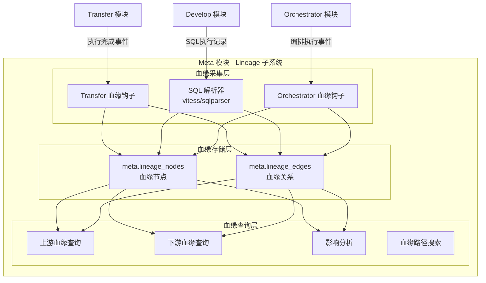

# Meta 模块血缘扩展设计

**版本**: v1.0
**创建日期**: 2026-02-18
**依赖文档**: [数据治理模块群规划](./数据治理模块群规划.md)

---

## 一、扩展定位

**不新建模块，在现有 Meta 模块基础上增加 Lineage（血缘追踪）子系统**。

**为什么放在 Meta**:
- Meta 已管理技术元数据（Node/Item/TableInfo）
- 血缘是元数据的"关系维度"：记录 Node/Item 之间的派生关系
- Transfer/Develop/Orchestrator 执行后都向 Meta 发送元数据更新事件，是血缘采集的天然入口
- 避免新增模块，保持架构简洁

**血缘 vs 元数据**:
| 维度 | 元数据（现有） | 血缘（新增） |
|-----|------------|------------|
| 关注点 | 数据"是什么" | 数据"从哪来" |
| 数据结构 | 表/字段结构 | 有向图（节点+边） |
| 更新时机 | 扫描时更新 | 执行操作时采集 |
| 存储模型 | 关系表 | 图模型（用 PostgreSQL JSONB 模拟） |

---

## 二、血缘架构设计



---

## 三、数据模型设计

**复用现有 `meta` Schema，新增血缘相关表**。

```sql
-- meta.lineage_nodes: 血缘节点
-- 节点可以是表、字段、任务或外部数据源
CREATE TABLE meta.lineage_nodes (
    id              BIGSERIAL PRIMARY KEY,
    tenant_id       BIGINT NOT NULL,
    node_type       VARCHAR(30) NOT NULL,        -- table/field/job/external
    node_key        VARCHAR(500) NOT NULL,        -- 唯一标识（如：engine:1/schema:public/table:users）
    display_name    VARCHAR(500) NOT NULL,        -- 展示名称
    engine_id       BIGINT,                      -- 关联引擎（table/field 类型）
    schema_name     VARCHAR(200),
    table_name      VARCHAR(200),
    column_name     VARCHAR(200),                -- 仅 field 类型
    meta_item_id    BIGINT,                      -- 关联 meta.meta_item（可选）
    properties      JSONB,                       -- 扩展属性
    created_at      TIMESTAMPTZ DEFAULT NOW(),
    updated_at      TIMESTAMPTZ DEFAULT NOW(),

    UNIQUE(tenant_id, node_key)
);

CREATE INDEX idx_lineage_nodes_type ON meta.lineage_nodes(tenant_id, node_type);
CREATE INDEX idx_lineage_nodes_table ON meta.lineage_nodes(tenant_id, engine_id, table_name);

-- meta.lineage_edges: 血缘关系（有向边）
CREATE TABLE meta.lineage_edges (
    id              BIGSERIAL PRIMARY KEY,
    tenant_id       BIGINT NOT NULL,
    source_node_id  BIGINT NOT NULL REFERENCES meta.lineage_nodes(id) ON DELETE CASCADE,
    target_node_id  BIGINT NOT NULL REFERENCES meta.lineage_nodes(id) ON DELETE CASCADE,
    edge_type       VARCHAR(30) NOT NULL,        -- transform（转换）/ copy（复制）/ reference（引用）/ aggregation（聚合）
    job_type        VARCHAR(30),                 -- sql_query/transfer/workflow/orchestration（产生血缘的操作类型）
    job_id          VARCHAR(100),                -- 关联任务 ID（如 Transfer 任务 ID）
    job_name        VARCHAR(500),                -- 关联任务名称
    sql_text        TEXT,                        -- 产生血缘的 SQL（如有）
    confidence      DECIMAL(3,2) DEFAULT 1.0,    -- 血缘可信度（1.0=确定，0.5=推断）
    created_at      TIMESTAMPTZ DEFAULT NOW(),

    UNIQUE(tenant_id, source_node_id, target_node_id, job_type, job_id)
);

CREATE INDEX idx_lineage_edges_source ON meta.lineage_edges(tenant_id, source_node_id);
CREATE INDEX idx_lineage_edges_target ON meta.lineage_edges(tenant_id, target_node_id);
CREATE INDEX idx_lineage_edges_job ON meta.lineage_edges(tenant_id, job_type, job_id);
```

---

## 四、血缘采集策略

### 4.1 采集来源一：Transfer 执行（表级血缘）

Transfer 模块执行导入/导出/同步任务时，产生明确的表级血缘。

**触发方式**: Transfer 任务完成后，发布事件到 Redis：
```json
{
  "event": "transfer:completed",
  "job_id": "t-123",
  "job_name": "MySQL users → PostgreSQL users",
  "job_type": "import",
  "source": {"engine_id": 2, "schema": "app", "table": "users"},
  "target": {"engine_id": 1, "schema": "ods", "table": "ods_users"},
  "row_count": 50000,
  "status": "success"
}
```

**Meta Lineage 子系统处理**:
```go
func HandleTransferCompleted(event TransferCompletedEvent) {
    // 1. 查找或创建源节点
    sourceNode := UpsertNode(lineage_nodes{
        NodeType:   "table",
        NodeKey:    fmt.Sprintf("engine:%d/schema:%s/table:%s", event.Source.EngineID, event.Source.Schema, event.Source.Table),
        EngineID:   event.Source.EngineID,
        SchemaName: event.Source.Schema,
        TableName:  event.Source.Table,
    })

    // 2. 查找或创建目标节点
    targetNode := UpsertNode(lineage_nodes{
        NodeType:   "table",
        NodeKey:    fmt.Sprintf("engine:%d/schema:%s/table:%s", event.Target.EngineID, event.Target.Schema, event.Target.Table),
        EngineID:   event.Target.EngineID,
        SchemaName: event.Target.Schema,
        TableName:  event.Target.Table,
    })

    // 3. 创建血缘边（copy 类型）
    UpsertEdge(lineage_edges{
        SourceNodeID: sourceNode.ID,
        TargetNodeID: targetNode.ID,
        EdgeType:     "copy",
        JobType:      "transfer",
        JobID:        event.JobID,
        JobName:      event.JobName,
    })
}
```

### 4.2 采集来源二：Develop SQL 执行（SQL 解析血缘）

用户在 Develop 模块执行 INSERT...SELECT、CREATE TABLE AS SELECT 等 SQL 时，解析 SQL 提取血缘。

**SQL 类型与血缘关系**:

| SQL 类型 | 示例 | 血缘关系 |
|---------|-----|---------|
| INSERT...SELECT | `INSERT INTO b SELECT * FROM a` | a → b (transform) |
| CREATE TABLE AS | `CREATE TABLE c AS SELECT * FROM a JOIN b` | a,b → c (transform) |
| CREATE VIEW | `CREATE VIEW v AS SELECT * FROM a` | a → v (reference) |
| INSERT | `INSERT INTO b VALUES(...)` | 无数据血缘 |
| UPDATE | `UPDATE a SET x = (SELECT y FROM b)` | b → a (reference) |

**SQL 解析器选型**: `vitess/sqlparser`（支持 MySQL/PostgreSQL 语法）

**解析流程**:
```go
func ParseSQLLineage(sql string, defaultSchema string) ([]LineageRelation, error) {
    stmt, err := sqlparser.Parse(sql)
    if err != nil {
        return nil, err
    }

    var relations []LineageRelation

    switch stmt := stmt.(type) {
    case *sqlparser.Insert:
        // 处理 INSERT...SELECT
        if selectStmt, ok := stmt.Rows.(*sqlparser.Select); ok {
            targetTable := extractTable(stmt.Table)
            sourceTables := extractFromTables(selectStmt.From)
            for _, source := range sourceTables {
                relations = append(relations, LineageRelation{
                    Source:   source,
                    Target:   targetTable,
                    EdgeType: "transform",
                })
            }
        }

    case *sqlparser.CreateTable:
        // 处理 CREATE TABLE AS SELECT
        if stmt.TableSpec.SelectStatement != nil {
            targetTable := extractTable(stmt.Table)
            sourceTables := extractFromTables(stmt.TableSpec.SelectStatement.From)
            for _, source := range sourceTables {
                relations = append(relations, LineageRelation{
                    Source:   source,
                    Target:   targetTable,
                    EdgeType: "transform",
                })
            }
        }
    }

    return relations, nil
}
```

**触发方式**: Develop 模块在 SQL 执行成功后，异步发送事件：
```json
{
  "event": "develop:query_executed",
  "execution_id": "exec-456",
  "engine_id": 1,
  "sql": "INSERT INTO dwd.dwd_orders SELECT * FROM ods.ods_orders WHERE ...",
  "status": "success",
  "user_id": 10
}
```

### 4.3 采集来源三：Orchestrator 编排执行（任务级血缘）

Orchestrator 执行编排流时，按步骤追踪数据流向。

**触发方式**: Orchestrator 每个步骤完成后发布事件：
```json
{
  "event": "orchestrator:step_completed",
  "orchestration_id": "orch-789",
  "orchestration_name": "日度ETL流程",
  "step_id": "step_2",
  "step_name": "数据清洗",
  "engine_type": "transfer",
  "input_tables": [{"engine_id": 1, "table": "ods.ods_orders"}],
  "output_tables": [{"engine_id": 1, "table": "dwd.dwd_orders"}]
}
```

---

## 五、血缘查询 API

### 5.1 查询上游血缘（数据从哪来）

```
GET /api/meta/lineage/upstream?engine_id=1&schema=dwd&table=dwd_orders&depth=3
```

响应（图结构）:
```json
{
  "root": {
    "node_key": "engine:1/schema:dwd/table:dwd_orders",
    "display_name": "dwd.dwd_orders",
    "node_type": "table"
  },
  "nodes": [
    {"id": 1, "key": "engine:1/schema:dwd/table:dwd_orders", "name": "dwd.dwd_orders"},
    {"id": 2, "key": "engine:1/schema:ods/table:ods_orders", "name": "ods.ods_orders"},
    {"id": 3, "key": "engine:2/schema:app/table:orders", "name": "MySQL.orders"}
  ],
  "edges": [
    {"source": 3, "target": 2, "type": "copy", "job": "Transfer任务#1"},
    {"source": 2, "target": 1, "type": "transform", "job": "日度ETL/数据清洗"}
  ]
}
```

### 5.2 查询下游血缘（影响哪些表）

```
GET /api/meta/lineage/downstream?engine_id=1&schema=ods&table=ods_orders&depth=3
```

### 5.3 影响分析

```
GET /api/meta/lineage/impact?engine_id=1&schema=ods&table=ods_orders
```

响应:
```json
{
  "source": "ods.ods_orders",
  "impacted_tables": [
    {"table": "dwd.dwd_orders", "distance": 1, "jobs": ["日度ETL/数据清洗"]},
    {"table": "dws.dws_order_summary", "distance": 2, "jobs": ["日度ETL/汇总计算"]},
    {"table": "ads.ads_daily_report", "distance": 3, "jobs": ["报表生成"]}
  ],
  "impacted_count": 3,
  "risk_level": "high"  // 下游有重要表
}
```

### 5.4 血缘路径查询

```
GET /api/meta/lineage/path?source_engine_id=2&source_table=orders&target_engine_id=1&target_table=ads_daily_report
```

响应:
```json
{
  "path": [
    "MySQL.orders",
    "ods.ods_orders",
    "dwd.dwd_orders",
    "dws.dws_order_summary",
    "ads.ads_daily_report"
  ],
  "jobs": [
    "Transfer:MySQL→ODS",
    "ETL:数据清洗",
    "ETL:汇总计算",
    "报表生成"
  ]
}
```

---

## 六、血缘可视化（前端）

**技术选型**: `antv/g6`（阿里 AntV 图可视化库）

**可视化特性**:
- 节点按类型着色（表/字段/任务/外部源）
- 边按类型区分（复制/转换/引用/聚合）
- 支持上游/下游切换查看
- 支持展开/折叠节点
- 点击节点跳转到 Manager 的数据预览
- 支持导出为 PNG/SVG

**集成位置**:
- Meta 模块前端新增"血缘图谱"页面
- Manager 模块的数据详情页面集成血缘快速预览（显示直接上下游 1 跳）

---

## 七、新增 API 清单

以下 API 新增到 **Meta 模块**（路径以 `/api/meta/lineage/` 开头）：

| 方法 | 路径 | 说明 |
|-----|-----|-----|
| GET | `/api/meta/lineage/upstream` | 查询上游血缘 |
| GET | `/api/meta/lineage/downstream` | 查询下游血缘 |
| GET | `/api/meta/lineage/impact` | 影响分析 |
| GET | `/api/meta/lineage/path` | 血缘路径查询 |
| GET | `/api/meta/lineage/jobs` | 产生血缘的任务列表 |
| POST | `/api/meta/lineage/scan` | 手动触发血缘采集（扫描历史执行记录） |
| DELETE | `/api/meta/lineage/nodes/:id` | 删除血缘节点（及相关边） |

---

## 八、实施优先级

### Phase 1（MVP - Transfer 血缘）
- [ ] 新增 `meta.lineage_nodes` 和 `meta.lineage_edges` 表
- [ ] 订阅 Transfer 执行完成事件，自动采集表级血缘
- [ ] 血缘上游/下游查询 API
- [ ] Meta 前端新增"血缘图谱"页面（antv/g6）

### Phase 2（SQL 血缘）
- [ ] 集成 `vitess/sqlparser`
- [ ] 订阅 Develop SQL 执行事件，解析 SQL 提取血缘
- [ ] 支持 INSERT...SELECT / CREATE TABLE AS SELECT / CREATE VIEW 的血缘提取
- [ ] 影响分析 API

### Phase 3（编排血缘 + 深化）
- [ ] 订阅 Orchestrator 步骤完成事件，追踪编排血缘
- [ ] 血缘路径查询（Dijkstra 最短路径）
- [ ] Manager 集成：数据详情页显示血缘快速预览
- [ ] 字段级血缘（精细化，从 SQL 解析字段级依赖）

---

**文档状态**: 详细设计完成
**相关文档**:
- [Meta 模块说明](../../meta/CLAUDE.md)
- [数据治理模块群规划](./数据治理模块群规划.md)
