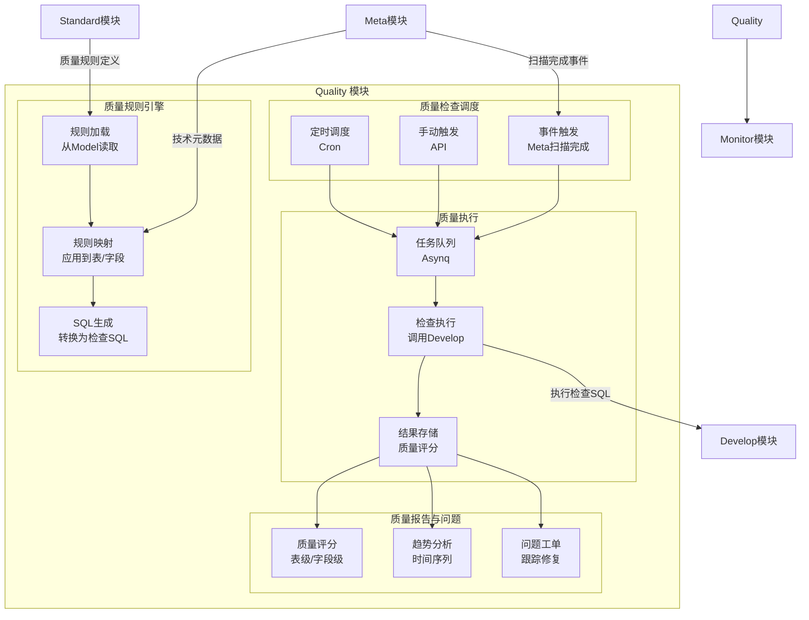
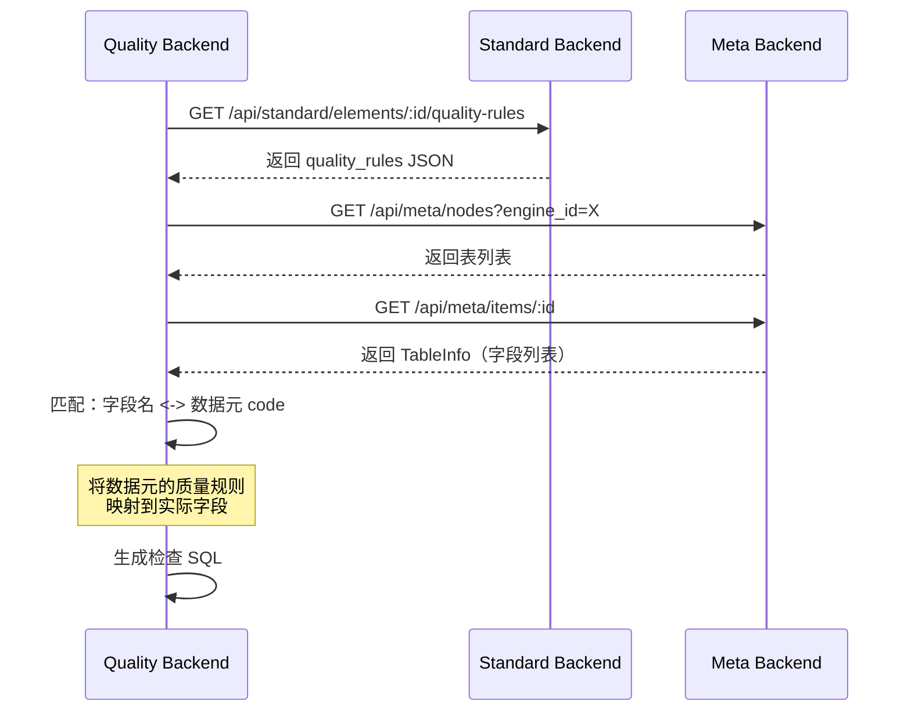
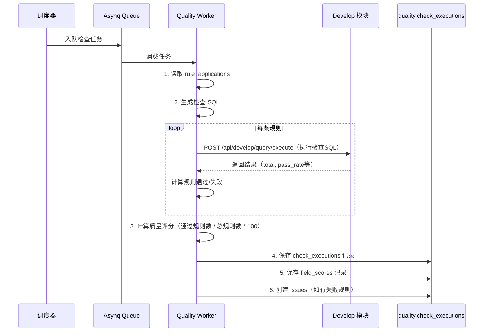

# Quality 模块详细设计

**版本**: v1.0
**创建日期**: 2026-02-18
**依赖文档**:
- [数据治理模块群规划](./数据治理模块群规划.md)
- [Model 模块详细设计](./model模块详细设计.md)

---

## 一、模块定位

Quality 模块是 ADDP 数据治理体系的**规范执行层**，依赖 Model 模块定义的质量规则，对实际数据进行自动化检查和监控。

**端口**: Backend 8182 / Frontend 5183（开发）/ 8113（Docker）
**PostgreSQL Schema**: `quality`
**MinIO Bucket**: `quality`（存储质量报告导出文件）

**核心价值**:
- 保障数据质量，提升数据可信度
- 自动化质量检查，减少人工巡检成本
- 问题工单化管理，形成质量改进闭环

---

## 二、整体架构



---

## 三、核心功能设计

### 3.1 质量规则引擎

**职责**: 从 Model 的数据元定义中读取质量规则，并将抽象规则应用到具体的表和字段上。

#### 规则加载流程



#### 规则映射策略

**映射方式 1：自动匹配**（推荐用于初始化）
- 按字段名（`column_name`）匹配数据元的 `code`
- 如：表字段 `mobile_phone` 自动匹配数据元 `mobile_phone`

**映射方式 2：手动关联**（推荐用于精准控制）
- 用户手动指定某个字段使用哪个数据元的质量规则

---

### 3.2 数据模型设计

```sql
-- quality.rule_applications: 质量规则应用（将数据元规则应用到具体字段）
CREATE TABLE quality.rule_applications (
    id              BIGSERIAL PRIMARY KEY,
    tenant_id       BIGINT NOT NULL,
    element_id      BIGINT NOT NULL,             -- 数据元 ID（来自 Model 模块）
    engine_id       BIGINT NOT NULL,             -- 目标引擎
    schema_name     VARCHAR(200),                -- 目标 Schema
    table_name      VARCHAR(200) NOT NULL,       -- 目标表名
    column_name     VARCHAR(200) NOT NULL,       -- 目标字段名
    rule_config     JSONB NOT NULL,              -- 从数据元复制的质量规则
    enabled         BOOLEAN DEFAULT true,        -- 是否启用
    created_by      BIGINT NOT NULL,
    updated_by      BIGINT,
    created_at      TIMESTAMPTZ DEFAULT NOW(),
    updated_at      TIMESTAMPTZ DEFAULT NOW(),

    UNIQUE(tenant_id, engine_id, schema_name, table_name, column_name)
);

CREATE INDEX idx_rule_applications_tenant_engine ON quality.rule_applications(tenant_id, engine_id);
CREATE INDEX idx_rule_applications_enabled ON quality.rule_applications(tenant_id, enabled);

-- quality.check_tasks: 质量检查任务
CREATE TABLE quality.check_tasks (
    id              BIGSERIAL PRIMARY KEY,
    tenant_id       BIGINT NOT NULL,
    name            VARCHAR(200) NOT NULL,       -- 任务名称
    description     TEXT,
    engine_id       BIGINT NOT NULL,             -- 目标引擎
    schema_name     VARCHAR(200),
    table_name      VARCHAR(200),                -- NULL = 检查整个库
    check_scope     VARCHAR(20) DEFAULT 'table', -- table（单表）/ schema（整库）/ field（字段级）
    trigger_type    VARCHAR(20) DEFAULT 'manual', -- manual（手动）/ cron（定时）/ event（事件触发）
    cron_expression VARCHAR(100),                -- Cron 表达式
    enabled         BOOLEAN DEFAULT true,
    last_run_at     TIMESTAMPTZ,
    next_run_at     TIMESTAMPTZ,
    created_by      BIGINT NOT NULL,
    updated_by      BIGINT,
    created_at      TIMESTAMPTZ DEFAULT NOW(),
    updated_at      TIMESTAMPTZ DEFAULT NOW()
);

CREATE INDEX idx_check_tasks_tenant_enabled ON quality.check_tasks(tenant_id, enabled);
CREATE INDEX idx_check_tasks_next_run ON quality.check_tasks(tenant_id, next_run_at) WHERE enabled = true;

-- quality.check_executions: 检查执行记录
CREATE TABLE quality.check_executions (
    id              BIGSERIAL PRIMARY KEY,
    tenant_id       BIGINT NOT NULL,
    task_id         BIGINT REFERENCES quality.check_tasks(id),
    engine_id       BIGINT NOT NULL,
    schema_name     VARCHAR(200),
    table_name      VARCHAR(200),
    status          VARCHAR(20) DEFAULT 'running', -- running/success/failed
    trigger_by      VARCHAR(20),                 -- manual/cron/event
    start_time      TIMESTAMPTZ DEFAULT NOW(),
    end_time        TIMESTAMPTZ,
    duration_ms     BIGINT,                      -- 执行时长（毫秒）
    total_rules     INT DEFAULT 0,               -- 总规则数
    passed_rules    INT DEFAULT 0,               -- 通过规则数
    failed_rules    INT DEFAULT 0,               -- 失败规则数
    quality_score   DECIMAL(5,2),                -- 质量评分（0-100）
    error_message   TEXT,
    result_details  JSONB,                       -- 详细结果（规则级别）
    created_at      TIMESTAMPTZ DEFAULT NOW()
);

CREATE INDEX idx_check_executions_tenant_task ON quality.check_executions(tenant_id, task_id);
CREATE INDEX idx_check_executions_created_at ON quality.check_executions(tenant_id, created_at DESC);
CREATE INDEX idx_check_executions_score ON quality.check_executions(tenant_id, quality_score);

-- quality.field_scores: 字段级质量评分（细粒度）
CREATE TABLE quality.field_scores (
    id              BIGSERIAL PRIMARY KEY,
    execution_id    BIGINT NOT NULL REFERENCES quality.check_executions(id) ON DELETE CASCADE,
    column_name     VARCHAR(200) NOT NULL,
    total_rules     INT DEFAULT 0,
    passed_rules    INT DEFAULT 0,
    failed_rules    INT DEFAULT 0,
    score           DECIMAL(5,2),                -- 字段质量评分
    issues          JSONB                        -- 问题列表（规则失败详情）
);

CREATE INDEX idx_field_scores_execution ON quality.field_scores(execution_id);

-- quality.issues: 质量问题工单
CREATE TABLE quality.issues (
    id              BIGSERIAL PRIMARY KEY,
    tenant_id       BIGINT NOT NULL,
    execution_id    BIGINT REFERENCES quality.check_executions(id),
    engine_id       BIGINT NOT NULL,
    schema_name     VARCHAR(200),
    table_name      VARCHAR(200) NOT NULL,
    column_name     VARCHAR(200),                -- 字段级问题（可选）
    rule_type       VARCHAR(50) NOT NULL,        -- 规则类型（not_null/format等）
    severity        VARCHAR(20) DEFAULT 'warning', -- error/warning/info
    title           VARCHAR(500) NOT NULL,       -- 问题标题
    description     TEXT,                        -- 问题描述
    suggestion      TEXT,                        -- 修复建议
    status          VARCHAR(20) DEFAULT 'open',  -- open/assigned/resolved/closed
    assigned_to     BIGINT,                      -- 分配给谁处理
    resolved_at     TIMESTAMPTZ,
    resolved_by     BIGINT,
    resolution      TEXT,                        -- 解决方案描述
    created_by      BIGINT NOT NULL,
    updated_by      BIGINT,
    created_at      TIMESTAMPTZ DEFAULT NOW(),
    updated_at      TIMESTAMPTZ DEFAULT NOW()
);

CREATE INDEX idx_issues_tenant_status ON quality.issues(tenant_id, status);
CREATE INDEX idx_issues_severity ON quality.issues(tenant_id, severity);
CREATE INDEX idx_issues_table ON quality.issues(tenant_id, engine_id, schema_name, table_name);
```

---

### 3.3 质量检查 SQL 生成

**核心逻辑**: 将数据元的抽象质量规则转换为可执行的 SQL 检查语句。

#### 规则类型与 SQL 模板映射

**1. not_null（非空检查）**

```sql
-- 模板
SELECT COUNT(*) AS total,
       COUNT({column}) AS non_null_count,
       COUNT(*) - COUNT({column}) AS null_count,
       ROUND((COUNT({column})::NUMERIC / COUNT(*)) * 100, 2) AS pass_rate
FROM {schema}.{table};

-- 实际生成（如检查 users.mobile_phone）
SELECT COUNT(*) AS total,
       COUNT(mobile_phone) AS non_null_count,
       COUNT(*) - COUNT(mobile_phone) AS null_count,
       ROUND((COUNT(mobile_phone)::NUMERIC / COUNT(*)) * 100, 2) AS pass_rate
FROM public.users;
```

**2. format（格式校验 - 正则）**

```sql
-- 模板
SELECT COUNT(*) AS total,
       COUNT(CASE WHEN {column} ~ '{regex}' THEN 1 END) AS matched_count,
       COUNT(CASE WHEN {column} !~ '{regex}' THEN 1 END) AS unmatched_count,
       ROUND((COUNT(CASE WHEN {column} ~ '{regex}' THEN 1 END)::NUMERIC / COUNT(*)) * 100, 2) AS pass_rate
FROM {schema}.{table}
WHERE {column} IS NOT NULL;

-- 实际生成（手机号正则校验）
SELECT COUNT(*) AS total,
       COUNT(CASE WHEN mobile_phone ~ '^1[3-9]\d{9}$' THEN 1 END) AS matched_count,
       COUNT(CASE WHEN mobile_phone !~ '^1[3-9]\d{9}$' THEN 1 END) AS unmatched_count,
       ROUND((COUNT(CASE WHEN mobile_phone ~ '^1[3-9]\d{9}$' THEN 1 END)::NUMERIC / COUNT(*)) * 100, 2) AS pass_rate
FROM public.users
WHERE mobile_phone IS NOT NULL;
```

**3. length（长度检查）**

```sql
-- 模板
SELECT COUNT(*) AS total,
       COUNT(CASE WHEN LENGTH({column}) BETWEEN {min} AND {max} THEN 1 END) AS valid_count,
       COUNT(CASE WHEN LENGTH({column}) NOT BETWEEN {min} AND {max} THEN 1 END) AS invalid_count,
       ROUND((COUNT(CASE WHEN LENGTH({column}) BETWEEN {min} AND {max} THEN 1 END)::NUMERIC / COUNT(*)) * 100, 2) AS pass_rate
FROM {schema}.{table}
WHERE {column} IS NOT NULL;
```

**4. unique（唯一性检查）**

```sql
-- 模板
SELECT COUNT(*) AS total,
       COUNT(DISTINCT {column}) AS distinct_count,
       COUNT(*) - COUNT(DISTINCT {column}) AS duplicate_count,
       ROUND((COUNT(DISTINCT {column})::NUMERIC / COUNT(*)) * 100, 2) AS pass_rate
FROM {schema}.{table}
WHERE {column} IS NOT NULL;
```

**5. value_range（取值范围 - 数值）**

```sql
-- 模板
SELECT COUNT(*) AS total,
       COUNT(CASE WHEN {column} BETWEEN {min} AND {max} THEN 1 END) AS in_range_count,
       COUNT(CASE WHEN {column} NOT BETWEEN {min} AND {max} THEN 1 END) AS out_range_count,
       ROUND((COUNT(CASE WHEN {column} BETWEEN {min} AND {max} THEN 1 END)::NUMERIC / COUNT(*)) * 100, 2) AS pass_rate
FROM {schema}.{table}
WHERE {column} IS NOT NULL;
```

**6. value_range（取值范围 - 枚举）**

```sql
-- 模板
SELECT COUNT(*) AS total,
       COUNT(CASE WHEN {column} IN ({enum_values}) THEN 1 END) AS valid_count,
       COUNT(CASE WHEN {column} NOT IN ({enum_values}) THEN 1 END) AS invalid_count,
       ROUND((COUNT(CASE WHEN {column} IN ({enum_values}) THEN 1 END)::NUMERIC / COUNT(*)) * 100, 2) AS pass_rate
FROM {schema}.{table}
WHERE {column} IS NOT NULL;

-- 实际生成（性别枚举检查）
SELECT COUNT(*) AS total,
       COUNT(CASE WHEN gender IN ('M', 'F', 'U') THEN 1 END) AS valid_count,
       COUNT(CASE WHEN gender NOT IN ('M', 'F', 'U') THEN 1 END) AS invalid_count,
       ROUND((COUNT(CASE WHEN gender IN ('M', 'F', 'U') THEN 1 END)::NUMERIC / COUNT(*)) * 100, 2) AS pass_rate
FROM public.users
WHERE gender IS NOT NULL;
```

**7. custom（自定义 SQL 规则）**

```sql
-- 直接执行用户配置的 SQL（必须返回 total 和 pass_rate 字段）
-- 示例：业务规则 - 订单金额必须大于0
SELECT COUNT(*) AS total,
       COUNT(CASE WHEN order_amount > 0 THEN 1 END) AS valid_count,
       ROUND((COUNT(CASE WHEN order_amount > 0 THEN 1 END)::NUMERIC / COUNT(*)) * 100, 2) AS pass_rate
FROM orders;
```

---

### 3.4 质量检查调度

**三种触发方式**:

#### 1. 定时调度（Cron）

```go
// 伪代码
type CheckTaskScheduler struct {
    cron *cron.Cron
}

func (s *CheckTaskScheduler) Start() {
    tasks := GetEnabledCheckTasks() // 从 quality.check_tasks 读取
    for _, task := range tasks {
        if task.TriggerType == "cron" && task.CronExpression != "" {
            s.cron.AddFunc(task.CronExpression, func() {
                EnqueueCheckTask(task.ID) // 入队到 Asynq
            })
        }
    }
    s.cron.Start()
}
```

#### 2. 手动触发

```
POST /api/quality/check-tasks/:id/run
```

#### 3. 事件触发（Meta 扫描完成）

```go
// 订阅 Redis 事件
func SubscribeMetaScanCompleted() {
    redis.Subscribe("meta:events:scan_completed", func(msg string) {
        // msg = {"engine_id": 1, "scan_id": 123}
        data := ParseJSON(msg)

        // 查找是否有针对该引擎的自动检查任务
        tasks := GetCheckTasksByEngineAndTriggerType(data.EngineID, "event")

        for _, task := range tasks {
            EnqueueCheckTask(task.ID) // 自动触发质量检查
        }
    })
}
```

---

### 3.5 质量检查执行流程



**质量评分计算公式**:

```
表级评分 = (通过规则数 / 总规则数) * 100

字段级评分 = (该字段通过规则数 / 该字段总规则数) * 100

加权评分（可选）= Σ(规则权重 * 规则通过状态) / Σ(规则权重)
```

---

### 3.6 质量报告

**报告类型**:

#### 1. 单次执行报告

```json
{
  "execution_id": 123,
  "task_name": "用户表质量检查",
  "engine": "PostgreSQL (ID: 1)",
  "table": "public.users",
  "status": "success",
  "start_time": "2026-02-18 10:00:00",
  "end_time": "2026-02-18 10:05:30",
  "duration": "5分30秒",
  "total_rules": 15,
  "passed_rules": 13,
  "failed_rules": 2,
  "quality_score": 86.67,
  "field_scores": [
    {"field": "mobile_phone", "score": 95.5, "passed": 3, "failed": 1},
    {"field": "email", "score": 100, "passed": 2, "failed": 0},
    {"field": "age", "score": 75, "passed": 2, "failed": 1}
  ],
  "issues": [
    {
      "field": "mobile_phone",
      "rule_type": "format",
      "severity": "error",
      "message": "手机号格式校验失败，450条记录不符合正则规则"
    },
    {
      "field": "age",
      "rule_type": "value_range",
      "severity": "warning",
      "message": "年龄超出合理范围（0-150），12条记录异常"
    }
  ]
}
```

#### 2. 趋势分析报告

```json
{
  "table": "public.users",
  "time_range": "最近30天",
  "trend": [
    {"date": "2026-01-20", "score": 85.2},
    {"date": "2026-01-21", "score": 86.5},
    {"date": "2026-01-22", "score": 84.8},
    // ...
    {"date": "2026-02-18", "score": 86.67}
  ],
  "avg_score": 85.5,
  "max_score": 92.1,
  "min_score": 81.3,
  "improvement": "+1.47分"
}
```

#### 3. 全局质量概览

```json
{
  "total_tables": 50,
  "checked_tables": 45,
  "avg_score": 87.3,
  "score_distribution": {
    "excellent": 15,  // >= 90分
    "good": 20,       // 70-89分
    "fair": 8,        // 50-69分
    "poor": 2         // < 50分
  },
  "top_issues": [
    {"rule_type": "not_null", "count": 120},
    {"rule_type": "format", "count": 85},
    {"rule_type": "value_range", "count": 45}
  ]
}
```

---

### 3.7 问题工单管理

**问题工单流转**:

```
创建 (open) → 分配 (assigned) → 解决 (resolved) → 关闭 (closed)
```

**自动创建问题规则**:
- 规则严重性为 `error` 且检查失败 → 自动创建工单
- 规则严重性为 `warning` 且通过率 < 80% → 自动创建工单

**API 接口**:

| 方法 | 路径 | 说明 |
|-----|-----|-----|
| GET | `/api/quality/issues` | 获取问题列表（支持状态、严重性过滤） |
| GET | `/api/quality/issues/:id` | 获取问题详情 |
| PUT | `/api/quality/issues/:id/assign` | 分配问题给某人 |
| PUT | `/api/quality/issues/:id/resolve` | 标记问题已解决 |
| PUT | `/api/quality/issues/:id/close` | 关闭问题 |
| POST | `/api/quality/issues/:id/comments` | 添加评论 |

---

## 四、API 接口设计

### 4.1 规则应用管理

| 方法 | 路径 | 说明 |
|-----|-----|-----|
| GET | `/api/quality/rule-applications` | 获取规则应用列表（支持引擎、表过滤） |
| POST | `/api/quality/rule-applications/auto-map` | 自动匹配（批量创建规则应用） |
| POST | `/api/quality/rule-applications` | 手动创建规则应用 |
| PUT | `/api/quality/rule-applications/:id` | 更新规则应用 |
| DELETE | `/api/quality/rule-applications/:id` | 删除规则应用 |
| PUT | `/api/quality/rule-applications/:id/toggle` | 启用/禁用规则 |

### 4.2 检查任务管理

| 方法 | 路径 | 说明 |
|-----|-----|-----|
| GET | `/api/quality/check-tasks` | 获取检查任务列表 |
| POST | `/api/quality/check-tasks` | 创建检查任务 |
| GET | `/api/quality/check-tasks/:id` | 获取任务详情 |
| PUT | `/api/quality/check-tasks/:id` | 更新任务 |
| DELETE | `/api/quality/check-tasks/:id` | 删除任务 |
| POST | `/api/quality/check-tasks/:id/run` | 手动触发执行 |
| PUT | `/api/quality/check-tasks/:id/toggle` | 启用/禁用任务 |

### 4.3 执行记录查询

| 方法 | 路径 | 说明 |
|-----|-----|-----|
| GET | `/api/quality/executions` | 获取执行记录列表（支持任务、时间、状态过滤） |
| GET | `/api/quality/executions/:id` | 获取执行详情（含字段评分） |
| GET | `/api/quality/executions/:id/issues` | 获取该次执行产生的问题 |

### 4.4 质量报告

| 方法 | 路径 | 说明 |
|-----|-----|-----|
| GET | `/api/quality/reports/execution/:id` | 单次执行报告 |
| GET | `/api/quality/reports/trend` | 趋势分析（按表、时间范围） |
| GET | `/api/quality/reports/overview` | 全局质量概览 |
| GET | `/api/quality/reports/export` | 导出报告（Excel/PDF） |

---

## 五、前端页面规划

### 导航结构

```
Quality 模块
├── 规则管理
│   ├── 规则应用配置（从Model加载，映射到表字段）
│   └── 规则自动匹配
├── 检查任务
│   ├── 任务列表
│   ├── 创建任务
│   └── 执行历史
├── 质量报告
│   ├── 执行详情
│   ├── 趋势分析（图表）
│   └── 全局概览（仪表盘）
└── 问题管理
    ├── 问题列表
    ├── 问题详情
    └── 问题统计
```

### 关键页面设计要点

**1. 规则应用配置页面**:
- 左侧树：引擎 → Schema → Table → Column
- 右侧面板：选中字段后，展示可应用的数据元（自动匹配或手动选择）
- 规则预览：展示数据元的质量规则定义（从 Model 读取）

**2. 检查任务配置页面**:
- 基本信息：任务名、描述
- 检查范围：选择引擎、Schema、表（支持多选）
- 触发方式：手动/定时（Cron 表达式配置）/事件
- 高级选项：并发数、超时时间

**3. 执行详情页面**:
- 顶部：执行概要（评分、时长、通过率）
- 中部：字段级评分列表（表格，可排序）
- 底部：失败规则详情（展开查看具体问题数据）

**4. 趋势分析页面**:
- 图表：评分趋势线图（ECharts）
- 表格：每次执行的对比数据

**5. 问题管理页面**:
- 列表：Kanban 看板（Open / Assigned / Resolved）
- 详情：问题描述、修复建议、评论区、状态变更历史

---

## 六、与其他模块集成细节

### 6.1 依赖 Standard 模块（质量规则定义）

**接口**: `GET /api/standard/elements/:id/quality-rules`

质量规则应用配置时，通过此接口读取数据元的质量规则定义，复制到 `quality.rule_applications.rule_config`。

### 6.2 依赖 Meta 模块（技术元数据）

**接口**:
- `GET /api/meta/nodes?engine_id=X` - 获取表列表
- `GET /api/meta/items/:id` - 获取 TableInfo（字段列表）

用于：
- 规则自动匹配：按字段名匹配数据元
- 检查任务配置：选择要检查的表

### 6.3 调用 Develop 模块（执行检查 SQL）

**接口**: `POST /api/develop/query/execute`

质量检查执行时，将生成的检查 SQL 提交给 Develop 模块执行，获取检查结果。

### 6.4 订阅 Meta 模块事件（扫描完成触发）

**Redis 事件**: `meta:events:scan_completed`

订阅此事件，当 Meta 扫描完成后，自动触发对应引擎的质量检查任务（如果配置了事件触发）。

### 6.5 向 Monitor 模块写入执行记录

**表**: `common.task_executions`

每次质量检查执行，写入统一执行记录表，供 Monitor 模块监控。

---

## 七、实施优先级

### Phase 1（首轮实现 - MVP）
- [ ] `quality` PostgreSQL schema 和建表 DDL
- [ ] 规则应用 API（从 Model 加载规则，应用到字段）
- [ ] 规则自动匹配逻辑
- [ ] 质量检查 SQL 生成器（支持 not_null、format、length、unique、value_range）
- [ ] 检查任务 CRUD API
- [ ] 手动触发执行
- [ ] 检查执行逻辑（调用 Develop 执行 SQL，保存结果）
- [ ] 质量评分计算
- [ ] Quality Backend（Go）
- [ ] Quality Frontend（Vue 3）- 规则配置、任务管理、执行详情页面

### Phase 2（第二轮实现）
- [ ] 定时调度（Cron 集成）
- [ ] 事件触发（订阅 Meta 扫描完成事件）
- [ ] 趋势分析报告
- [ ] 全局质量概览仪表盘
- [ ] 问题工单创建与管理

### Phase 3（第三轮实现）
- [ ] 自定义规则（custom SQL）
- [ ] 一致性规则（跨字段/跨表）
- [ ] 质量报告导出（Excel/PDF）
- [ ] 质量告警（评分低于阈值时通知）

---

## 八、性能优化建议

### 8.1 批量检查优化
- 相同表的多个规则合并为一条 SQL（减少查询次数）
- 使用 UNION ALL 批量执行多个检查 SQL

### 8.2 大表检查优化
- 采样检查：质量检查时只抽样 10% 数据
- 分区表优化：只检查最新分区

### 8.3 并发控制
- Asynq 队列优先级：critical（紧急检查）/ default / low
- 限制同时执行的检查任务数，避免打垮数据库

---

**文档状态**: 详细设计完成
**下一步**: Security 模块详细设计
