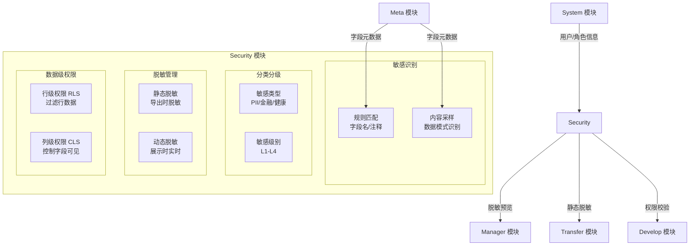

# Security 模块详细设计

**版本**: v1.0
**创建日期**: 2026-02-18
**依赖文档**: [数据治理模块群规划](./数据治理模块群规划.md)

---

## 一、模块定位

Security 模块是 ADDP 数据治理体系的**安全防护层**，管理敏感数据识别、分类分级、脱敏规则和数据级权限控制。

**端口**: Backend 8090 / Frontend 5183
**PostgreSQL Schema**: `security`

**与 System 模块的边界**:

| 职责 | 归属 |
|-----|-----|
| 用户认证（JWT） | System 模块 |
| 模块级权限（能不能访问某功能） | System 模块 |
| 数据级权限（进入后能看哪些数据） | **Security 模块** |
| 敏感字段识别和分级 | **Security 模块** |
| 脱敏规则配置和应用 | **Security 模块** |

---

## 二、整体架构



---

## 三、数据模型设计

```sql
-- security.sensitive_rules: 敏感识别规则
CREATE TABLE security.sensitive_rules (
    id              BIGSERIAL PRIMARY KEY,
    tenant_id       BIGINT NOT NULL,
    name            VARCHAR(200) NOT NULL,       -- 规则名称
    sensitive_type  VARCHAR(50) NOT NULL,        -- pii/financial/health/location/device/custom
    match_target    VARCHAR(20) NOT NULL,        -- column_name（字段名匹配）/ column_comment（注释匹配）/ data_sample（内容采样）
    match_pattern   TEXT NOT NULL,               -- 正则表达式
    description     TEXT,
    enabled         BOOLEAN DEFAULT true,
    sort_order      INT DEFAULT 0,               -- 规则优先级（越小越优先）
    created_by      BIGINT NOT NULL,
    created_at      TIMESTAMPTZ DEFAULT NOW(),
    updated_at      TIMESTAMPTZ DEFAULT NOW()
);

-- 内置规则数据
INSERT INTO security.sensitive_rules (tenant_id, name, sensitive_type, match_target, match_pattern) VALUES
(0, '身份证号', 'pii', 'column_name', '.*(id_card|identity|id_no|身份证).*'),
(0, '手机号码', 'pii', 'column_name', '.*(mobile|phone|tel|手机|电话).*'),
(0, '姓名', 'pii', 'column_name', '.*(name|姓名|用户名).*'),
(0, '银行卡号', 'financial', 'column_name', '.*(bank_card|card_no|account_no|银行卡|账号).*'),
(0, '工资/薪资', 'financial', 'column_name', '.*(salary|wage|income|工资|薪资|薪酬).*'),
(0, 'IP地址', 'device', 'column_name', '.*(ip_addr|ip_address|ip).*'),
(0, '地理位置', 'location', 'column_name', '.*(longitude|latitude|location|address|lng|lat|经度|纬度|地址).*');

-- security.sensitive_fields: 已识别的敏感字段注册表
CREATE TABLE security.sensitive_fields (
    id              BIGSERIAL PRIMARY KEY,
    tenant_id       BIGINT NOT NULL,
    engine_id       BIGINT NOT NULL,
    schema_name     VARCHAR(200),
    table_name      VARCHAR(200) NOT NULL,
    column_name     VARCHAR(200) NOT NULL,
    sensitive_type  VARCHAR(50) NOT NULL,        -- pii/financial/health/location/device/custom
    security_level  VARCHAR(10) DEFAULT 'L2',    -- L1/L2/L3/L4
    detected_by     VARCHAR(20) NOT NULL,        -- auto（自动识别）/ manual（手动标注）
    rule_id         BIGINT REFERENCES security.sensitive_rules(id),
    confirmed       BOOLEAN DEFAULT false,       -- 是否已人工确认
    masking_rule_id BIGINT,                      -- 应用的脱敏规则
    note            TEXT,
    created_by      BIGINT,
    updated_by      BIGINT,
    created_at      TIMESTAMPTZ DEFAULT NOW(),
    updated_at      TIMESTAMPTZ DEFAULT NOW(),

    UNIQUE(tenant_id, engine_id, schema_name, table_name, column_name)
);

CREATE INDEX idx_sensitive_fields_tenant ON security.sensitive_fields(tenant_id);
CREATE INDEX idx_sensitive_fields_table ON security.sensitive_fields(tenant_id, engine_id, table_name);
CREATE INDEX idx_sensitive_fields_level ON security.sensitive_fields(tenant_id, security_level);

-- security.masking_rules: 脱敏规则配置
CREATE TABLE security.masking_rules (
    id              BIGSERIAL PRIMARY KEY,
    tenant_id       BIGINT NOT NULL,
    name            VARCHAR(200) NOT NULL,       -- 规则名称（如：手机号中间遮盖）
    sensitive_type  VARCHAR(50),                 -- 适用敏感类型（可选，为空则通用）
    masking_type    VARCHAR(50) NOT NULL,        -- hash/replace/partial_mask/randomize/nullify
    config          JSONB NOT NULL,              -- 脱敏参数（各类型不同）
    description     TEXT,
    is_builtin      BOOLEAN DEFAULT false,       -- 是否内置规则
    created_by      BIGINT,
    created_at      TIMESTAMPTZ DEFAULT NOW(),
    updated_at      TIMESTAMPTZ DEFAULT NOW()
);

-- 内置脱敏规则
INSERT INTO security.masking_rules (tenant_id, name, sensitive_type, masking_type, config, is_builtin) VALUES
(0, '手机号中间遮盖', 'pii', 'partial_mask', '{"start": 3, "end": 7, "char": "*"}', true),
(0, '身份证号脱敏', 'pii', 'partial_mask', '{"start": 6, "end": 14, "char": "*"}', true),
(0, '银行卡脱敏', 'financial', 'partial_mask', '{"start": 4, "end": -4, "char": "*"}', true),
(0, '姓名脱敏', 'pii', 'partial_mask', '{"start": 1, "end": -1, "char": "*"}', true),
(0, 'SHA256哈希', NULL, 'hash', '{"algorithm": "sha256", "salt": ""}', true),
(0, '固定值替换', NULL, 'replace', '{"value": "***"}', true),
(0, '置空', NULL, 'nullify', '{}', true);

-- security.data_permissions: 数据级权限配置
CREATE TABLE security.data_permissions (
    id              BIGSERIAL PRIMARY KEY,
    tenant_id       BIGINT NOT NULL,
    engine_id       BIGINT NOT NULL,
    schema_name     VARCHAR(200),
    table_name      VARCHAR(200) NOT NULL,
    permission_type VARCHAR(10) NOT NULL,        -- rls（行级）/ cls（列级）
    role_id         BIGINT,                      -- 适用角色（NULL = 所有角色）
    user_id         BIGINT,                      -- 适用用户（NULL = 所有用户）
    config          JSONB NOT NULL,              -- 权限配置
    enabled         BOOLEAN DEFAULT true,
    description     TEXT,
    created_by      BIGINT NOT NULL,
    created_at      TIMESTAMPTZ DEFAULT NOW(),
    updated_at      TIMESTAMPTZ DEFAULT NOW()
);

-- RLS config 示例:
-- {"condition": "tenant_id = {current_user.tenant_id}"}
-- {"condition": "region = {current_user.region}"}

-- CLS config 示例:
-- {"denied_columns": ["salary", "id_card", "mobile_phone"]}
-- {"allowed_columns": ["id", "name", "email"]}  （白名单模式）

-- security.scan_jobs: 敏感扫描任务
CREATE TABLE security.scan_jobs (
    id              BIGSERIAL PRIMARY KEY,
    tenant_id       BIGINT NOT NULL,
    engine_id       BIGINT NOT NULL,
    schema_name     VARCHAR(200),                -- NULL = 扫描整个库
    table_name      VARCHAR(200),                -- NULL = 扫描整个 Schema
    status          VARCHAR(20) DEFAULT 'pending', -- pending/running/success/failed
    found_count     INT DEFAULT 0,               -- 发现的敏感字段数
    start_time      TIMESTAMPTZ,
    end_time        TIMESTAMPTZ,
    triggered_by    VARCHAR(20) DEFAULT 'manual', -- manual/auto
    error_message   TEXT,
    created_by      BIGINT NOT NULL,
    created_at      TIMESTAMPTZ DEFAULT NOW()
);
```

---

## 四、敏感数据识别逻辑

### 4.1 规则匹配（字段名/注释）

```go
// 伪代码
func DetectByFieldName(field FieldInfo, rules []SensitiveRule) []SensitiveMatch {
    var matches []SensitiveMatch
    for _, rule := range rules {
        if rule.MatchTarget == "column_name" {
            if regexp.MatchString(rule.MatchPattern, field.Name) {
                matches = append(matches, SensitiveMatch{
                    RuleID:        rule.ID,
                    SensitiveType: rule.SensitiveType,
                    DetectedBy:    "auto",
                })
            }
        }
        if rule.MatchTarget == "column_comment" && field.Comment != "" {
            if regexp.MatchString(rule.MatchPattern, field.Comment) {
                matches = append(matches, SensitiveMatch{...})
            }
        }
    }
    return matches
}
```

### 4.2 内容采样识别

```go
// 伪代码
func DetectBySampling(engine Engine, table, column string) []SensitiveMatch {
    // 采样 100 条数据
    samples := QuerySamples(engine, table, column, 100)

    var matches []SensitiveMatch

    // 内置模式检测
    patterns := []struct {
        regex string
        stype string
    }{
        {`^1[3-9]\d{9}$`, "pii"},         // 手机号
        {`^\d{15}|\d{18}$`, "pii"},        // 身份证号
        {`^\d{16,19}$`, "financial"},       // 银行卡号
    }

    for _, sample := range samples {
        for _, pattern := range patterns {
            if regexp.MatchString(pattern.regex, sample) {
                matches = append(matches, SensitiveMatch{
                    SensitiveType: pattern.stype,
                    DetectedBy:    "sampling",
                })
                break
            }
        }
    }

    return matches
}
```

---

## 五、脱敏规则实现

### 5.1 脱敏算法实现

| 类型 | 说明 | 配置参数 | 示例 |
|-----|-----|---------|-----|
| `partial_mask` | 部分遮盖 | `start`, `end`, `char` | `138****1234` |
| `hash` | 哈希脱敏 | `algorithm`, `salt` | `a2b3c4...` |
| `replace` | 固定值替换 | `value` | `***` |
| `randomize` | 随机化 | `type`（int/date/string），`range` | 年龄随机 ±5 |
| `nullify` | 置空 | - | `NULL` |

```go
// 伪代码 - 脱敏执行器
func ApplyMask(value string, rule MaskingRule) string {
    switch rule.MaskingType {
    case "partial_mask":
        start := rule.Config["start"].(int)
        end := rule.Config["end"].(int)
        char := rule.Config["char"].(string)
        return partialMask(value, start, end, char)

    case "hash":
        algorithm := rule.Config["algorithm"].(string)
        salt := rule.Config["salt"].(string)
        return hash(value, algorithm, salt)

    case "replace":
        return rule.Config["value"].(string)

    case "nullify":
        return ""

    case "randomize":
        return randomize(value, rule.Config)
    }
    return value
}

func partialMask(s string, start, end int, char string) string {
    runes := []rune(s)
    n := len(runes)
    if end < 0 { end = n + end }
    for i := start; i < end && i < n; i++ {
        runes[i] = []rune(char)[0]
    }
    return string(runes)
}
```

### 5.2 动态脱敏集成（与 Manager 预览集成）

**流程**:
```
用户请求预览表数据
→ Manager 调用 Security API 查询该表的敏感字段和脱敏规则
→ Manager 根据用户角色判断是否需要脱敏
→ 如需脱敏，对预览数据的对应字段应用脱敏算法
→ 返回脱敏后的数据给前端
```

**Security 提供的接口**:

```
GET /api/security/masking/table-config?engine_id=1&schema=public&table=users
```

响应：
```json
{
  "columns": [
    {
      "column_name": "mobile_phone",
      "sensitive_type": "pii",
      "security_level": "L3",
      "masking_rule": {
        "type": "partial_mask",
        "start": 3,
        "end": 7,
        "char": "*"
      },
      "require_role_ids": []  // 空 = 所有用户都脱敏
    }
  ]
}
```

### 5.3 静态脱敏集成（与 Transfer 导出集成）

Transfer 模块在执行数据导出任务时，调用 Security 模块获取脱敏配置，在导出数据前对敏感字段进行永久脱敏。

---

## 六、数据级权限（RLS / CLS）

### 6.1 行级权限（RLS）

**原理**: 在 SQL 查询的 WHERE 子句中自动注入过滤条件。

**配置示例**:
- 业务员只能看自己负责区域的数据：`region = '{current_user.region}'`
- 租户隔离：`tenant_id = '{current_user.tenant_id}'`
- 时间范围：`created_at >= '{current_user.data_start_date}'`

**SQL 改写流程**:
```
原始 SQL: SELECT * FROM orders
              ↓ 注入 RLS 条件
改写 SQL: SELECT * FROM orders WHERE region = 'east' AND tenant_id = 1
```

### 6.2 列级权限（CLS）

**原理**: 拦截查询请求，将被拒绝的字段替换为 NULL 或 '***'。

**配置示例**:
- 普通员工不能看工资字段：`denied_columns: ["salary"]`
- 外部接口不能暴露手机号：`denied_columns: ["mobile_phone", "id_card"]`

---

## 七、API 接口设计

| 方法 | 路径 | 说明 |
|-----|-----|-----|
| GET | `/api/security/sensitive-rules` | 获取识别规则列表 |
| POST | `/api/security/sensitive-rules` | 创建识别规则 |
| PUT | `/api/security/sensitive-rules/:id` | 更新识别规则 |
| DELETE | `/api/security/sensitive-rules/:id` | 删除识别规则 |
| POST | `/api/security/scan-jobs` | 触发敏感扫描 |
| GET | `/api/security/scan-jobs/:id` | 查看扫描任务状态 |
| GET | `/api/security/sensitive-fields` | 获取敏感字段列表 |
| PUT | `/api/security/sensitive-fields/:id` | 更新敏感字段（确认、修改级别） |
| POST | `/api/security/sensitive-fields/:id/confirm` | 确认敏感字段 |
| DELETE | `/api/security/sensitive-fields/:id` | 删除（取消标记） |
| GET | `/api/security/masking-rules` | 获取脱敏规则列表 |
| POST | `/api/security/masking-rules` | 创建脱敏规则 |
| PUT | `/api/security/masking-rules/:id` | 更新脱敏规则 |
| DELETE | `/api/security/masking-rules/:id` | 删除脱敏规则 |
| GET | `/api/security/masking/table-config` | 获取表的脱敏配置（供 Manager/Transfer 调用） |
| GET | `/api/security/data-permissions` | 获取数据级权限列表 |
| POST | `/api/security/data-permissions` | 创建数据级权限 |
| PUT | `/api/security/data-permissions/:id` | 更新权限 |
| DELETE | `/api/security/data-permissions/:id` | 删除权限 |
| GET | `/api/security/overview` | 安全概览（敏感字段统计、级别分布） |

---

## 八、前端页面规划

```
Security 模块
├── 敏感识别
│   ├── 识别规则配置
│   ├── 扫描任务管理
│   └── 敏感字段确认（待确认列表 + 已确认列表）
├── 分类分级
│   └── 敏感字段全局视图（按引擎/库/表分组）
├── 脱敏管理
│   ├── 脱敏规则配置
│   └── 字段脱敏规则绑定
└── 数据权限
    ├── 行级权限（RLS）配置
    └── 列级权限（CLS）配置
```

---

**文档状态**: 详细设计完成
**下一步**: Meta 模块血缘扩展设计
