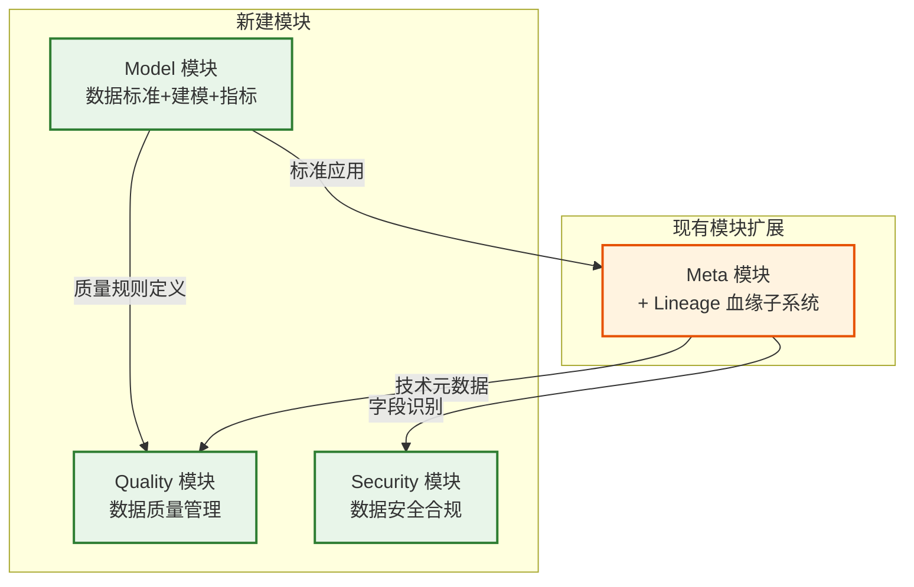
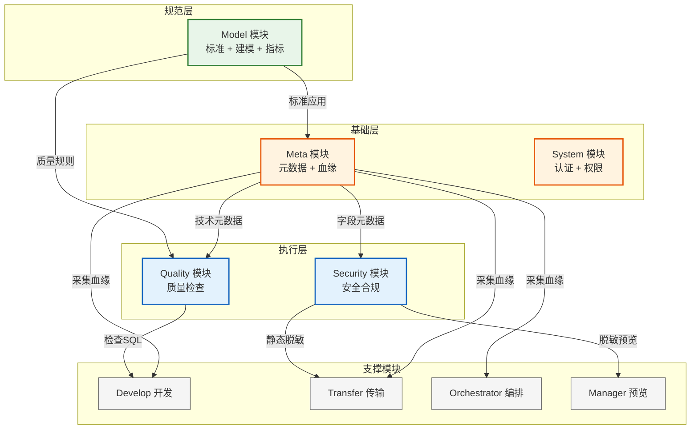

# ADDP 数据治理模块群规划

**版本**: v1.0
**创建日期**: 2026-02-18
**作者**: ADDP 开发团队

---

## 一、规划背景

ADDP 作为现代数据中台，当前已具备：
- ✅ 技术元数据管理（Meta 模块）
- ✅ 数据探查与预览（Manager 模块）
- ✅ 数据传输与同步（Transfer 模块）
- ✅ 数据开发与工作流（Develop 模块）
- ✅ 任务编排与调度（Orchestrator 模块）
- ✅ 统一执行监控（Monitor 模块）

但缺乏：
- ❌ 数据标准与建模能力
- ❌ 数据质量管理体系
- ❌ 数据安全与合规能力
- ❌ 数据血缘追踪能力

本规划旨在补齐这些关键能力，建设完整的数据治理体系。

---

## 二、模块划分方案

### 核心原则

**不设置单独的 Govern 模块**，而是按职责拆分为**三个独立模块 + 一个扩展子系统**：

### 职责划分

| 模块 | 核心职责 | 用户角色 | 依赖关系 |
|-----|---------|---------|---------|
| **Model** | 数据标准定义、业务建模、指标管理 | 数据架构师、数据建模师 | 基础模块，被其他模块依赖 |
| **Quality** | 质量规则执行、质量检查、问题跟踪 | 数据质量专员、DBA | 依赖 Model（规则定义）+ Meta（元数据） |
| **Security** | 敏感识别、分级分类、脱敏、数据级权限 | 安全合规专员 | 依赖 Meta（字段元数据） |
| **Meta（扩展）** | 元数据扫描 + 血缘追踪 + 影响分析 | 数据工程师、分析师 | 现有能力扩展 |

---

## 三、三大新模块详细定位

### 3.1 Model 模块（数据标准与建模）

**端口**: 8088（Backend）/ 5181（Frontend）

**核心定位**: 从概念到物理的完整数据建模链路，是数据治理的"规范定义层"。

**三大子系统**:

#### 子系统 1: 数据标准（Standard）
- **数据元（Data Element）**: 最小粒度的数据单位定义
  - 包含：名称、业务含义、数据类型、长度、格式、取值范围
  - **关键**: 每个数据元可附加质量规则（完整性、准确性、一致性等）
- **业务术语（Business Glossary）**: 业务概念词典
  - 面向业务人员的术语定义和释义
  - 与数据元形成映射关系
- **业务域（Business Domain）**: 术语和实体的分组容器
  - 如：客户域、商品域、交易域、财务域

#### 子系统 2: 数据建模（Modeling）
- **业务实体建模**: 概念层 E-R 建模
  - 实体定义（如：客户、订单、商品）
  - 实体关系（一对多、多对多）
  - 实体属性（引用数据元）
- **逻辑表设计**: 将实体映射为逻辑表
  - 字段定义（名称、类型、约束、默认值）
  - 主键、外键、索引
  - 逻辑表关系图
- **逻辑表物化**: 将逻辑表生成 DDL 并在实际引擎中创建
  - 支持多种引擎（PostgreSQL、MySQL、ClickHouse 等）
  - 物化任务调度（通过 Orchestrator）
- **数仓分层建模**: ODS/DWD/DWS/ADS 分层定义
  - 贴源层（ODS）：原始数据
  - 明细层（DWD）：清洗后的明细数据
  - 汇总层（DWS）：轻度聚合的主题数据
  - 应用层（ADS）：面向应用的数据集市
- **维度建模**: 星型模型/雪花模型
  - 事实表定义（度量、维度外键）
  - 维度表定义（维度属性、层级）

#### 子系统 3: 指标管理（Metric）
- **指标定义**: 原子指标、派生指标、复合指标
  - 原子指标：不可拆分的度量（如 GMV、DAU）
  - 派生指标：基于原子指标计算（如人均GMV）
  - 复合指标：多个指标组合（如转化率 = 下单人数/访问人数）
- **指标计算口径**: SQL 模板、数据来源、计算逻辑
- **指标目录**: 树状结构，支持搜索和订阅

**PostgreSQL Schema**: `model`

**与其他模块集成**:
- 向 Meta 提供标准，验证扫描的元数据是否符合规范
- 向 Quality 提供质量规则（从数据元的质量规则定义中读取）
- 向 Develop 发送物化任务（执行 DDL）
- 向 Orchestrator 注册建模任务（物化、指标计算）

---

### 3.2 Quality 模块（数据质量管理）

**端口**: 8089（Backend）/ 5182（Frontend）

**核心定位**: 数据质量的"规范执行层"，依赖 Model 定义的质量规则，对数据进行检查和监控。

**四大核心能力**:

#### 1. 质量规则引擎
- **规则来源**: 从 Model 的数据元中读取质量规则定义
- **规则类型**:
  - **完整性规则**: 非空检查、主键唯一性、外键完整性
  - **准确性规则**: 数据格式、取值范围、正则匹配
  - **一致性规则**: 跨表一致性、字段关联规则
  - **及时性规则**: 数据更新时间、延迟检查
- **规则配置**: 将数据元的抽象规则应用到具体表和字段

#### 2. 质量检查调度
- **触发方式**:
  - 定时检查（Cron 表达式）
  - 手动触发（用户主动执行）
  - 事件触发（Meta 扫描完成后自动检查）
- **执行引擎**: 通过 Develop 模块执行 SQL 检查查询
- **并发控制**: 基于 Asynq 任务队列的并发检查

#### 3. 质量报告
- **质量评分**: 表级/字段级质量评分（0-100分）
- **趋势分析**: 质量评分趋势图（时间序列）
- **问题分布**: 按规则类型、严重程度、数据源分组统计
- **质量仪表盘**: 全局质量概览

#### 4. 问题跟踪
- **问题工单化**: 质量问题转为工单，支持分配、处理、关闭
- **问题优先级**: 高/中/低优先级
- **修复流程**: 问题发现 → 分配 → 修复 → 验证 → 关闭
- **问题统计**: 问题累积趋势、平均修复时长

**PostgreSQL Schema**: `quality`

**与其他模块集成**:
- 依赖 Model 获取质量规则定义
- 依赖 Meta 获取技术元数据（表、字段）
- 调用 Develop 执行质量检查 SQL
- 向 Monitor 写入任务执行记录
- 订阅 Meta 的扫描完成事件，自动触发质量检查

---

### 3.3 Security 模块（数据安全与合规）

**端口**: 8090（Backend）/ 5183（Frontend）

**核心定位**: 数据安全的"防护层"，管理敏感数据识别、分级分类、脱敏和数据级权限。

**四大核心能力**:

#### 1. 敏感数据识别
- **识别方式**:
  - **规则匹配**: 基于字段名称、注释的正则匹配（如：`.*phone.*`、`.*id_card.*`）
  - **内容采样**: 采样数据内容，识别身份证号、手机号、银行卡等模式
  - **AI 模型**: 可选，基于 NLP 模型识别敏感字段（未来扩展）
- **敏感类型**:
  - 个人身份信息（PII）：姓名、身份证号、手机号
  - 金融信息：银行卡号、支付账户
  - 健康信息：病历、基因数据
  - 其他：IP地址、设备ID、地理位置

#### 2. 分类分级
- **分类维度**: 按敏感类型分类（PII、金融、健康等）
- **分级标准**:
  - **L1（公开）**: 无敏感信息，可公开访问
  - **L2（内部）**: 内部使用，限制外部访问
  - **L3（机密）**: 高度敏感，严格控制访问
  - **L4（绝密）**: 最高级别，极少数人可访问
- **标签标注**: 为表和字段打上分类分级标签

#### 3. 脱敏规则
- **脱敏方式**:
  - **静态脱敏**: 数据导出时永久脱敏（用于非生产环境）
  - **动态脱敏**: 查询/预览时实时脱敏（用户看到脱敏数据，原始数据不变）
- **脱敏算法**:
  - 哈希脱敏（MD5/SHA256）
  - 替换脱敏（固定值替换）
  - 部分遮盖（手机号中间4位：138****1234）
  - 随机化（年龄随机±5岁）
- **脱敏策略**: 按用户角色配置不同的脱敏规则

#### 4. 数据级权限（Data-Level Access Control）
- **行级权限（RLS）**: 基于规则过滤行数据
  - 如：销售人员只能看自己负责区域的订单
- **列级权限（CLS）**: 基于角色控制字段可见性
  - 如：普通员工看不到工资字段
- **与 System 权限的关系**:
  - System: 模块级权限（能不能进入这个功能）
  - Security: 数据级权限（进入后能看什么数据）

**PostgreSQL Schema**: `security`

**与其他模块集成**:
- 依赖 Meta 获取字段元数据（用于敏感识别）
- 与 Manager 集成，预览时应用脱敏规则
- 与 Transfer 集成，导出时应用静态脱敏
- 与 System 集成，扩展权限控制粒度

---

### 3.4 Meta 模块扩展（血缘追踪）

**核心扩展**: 在现有 Meta 模块基础上，增加 **Lineage（血缘追踪）** 子系统。

**为什么放在 Meta**:
- Meta 已管理技术元数据（表、字段、文件）
- 血缘本质是元数据的"关系视图"
- Transfer/Develop/Orchestrator 的任务执行都被 Meta 感知，是血缘采集的天然入口
- 不需要新增模块，保持架构简洁

**三大核心能力**:

#### 1. 血缘采集
- **采集来源**:
  - **Transfer 导入/导出**: 自动采集跨库血缘（如：MySQL.users → PostgreSQL.users）
  - **Develop SQL 执行**: 解析 SQL 提取血缘（`INSERT INTO target SELECT * FROM source`）
  - **Orchestrator 编排流**: 追踪任务级血缘（任务A输出 → 任务B输入）
  - **Develop 工作流**: 算子 DAG 的数据流向
- **采集粒度**:
  - **表级血缘**: 表之间的依赖关系
  - **字段级血缘**: 字段的派生关系（未来扩展）
- **SQL 解析器**: 使用 `vitess/sqlparser` 或 `pingcap/parser` 解析 SQL

#### 2. 血缘存储
- **存储方案**:
  - **初期**: PostgreSQL + JSONB 存储血缘图谱
  - **未来**: 可选迁移到 Neo4j（图数据库），适合复杂血缘查询
- **数据模型**:
  - `lineage_nodes`: 血缘节点（表、字段、任务）
  - `lineage_edges`: 血缘关系（上下游依赖）
  - `lineage_snapshots`: 血缘快照（版本管理）

#### 3. 血缘查询与可视化
- **影响分析**: 某表变更会影响哪些下游表/任务/指标
- **根因分析**: 某数据异常来自哪个上游表
- **血缘图谱**: 交互式血缘可视化（前端使用 `antv/g6` 或 `dagre-d3`）
- **血缘搜索**: 按表名/任务名搜索血缘路径

**PostgreSQL Schema**: `metadata`（复用现有 Schema，新增血缘相关表）

**与其他模块集成**:
- 订阅 Transfer 执行完成事件，采集血缘
- 订阅 Develop 查询执行事件，解析 SQL 提取血缘
- 订阅 Orchestrator 编排执行事件，追踪任务血缘
- 向 Quality 提供血缘信息（质量问题根因分析）
- 向 Model 提供血缘信息（逻辑表与物理表的映射关系）

---

## 四、模块间依赖关系

**关键依赖**:
- Model 是规范定义的基础，被 Quality 依赖
- Meta 是技术元数据的基础，被 Quality、Security 依赖
- Quality 依赖 Model（规则）+ Meta（元数据）+ Develop（执行）
- Security 依赖 Meta（字段识别）+ Manager/Transfer（脱敏应用）

---

## 五、实施路线图

### 阶段一：Model MVP（4-6周）
**目标**: 建立数据标准基础，为 Quality 铺路

**交付物**:
- ✅ 业务域管理
- ✅ 业务术语词典
- ✅ 数据元管理（含质量规则定义）
- ✅ Model Backend + Frontend
- ✅ PostgreSQL `model` schema
- ✅ 与 Meta 集成（标准应用）

**里程碑**: 数据元定义完成，质量规则可配置

---

### 阶段二：Quality MVP（3-4周）
**目标**: 基于数据元的质量规则，实现质量检查闭环

**交付物**:
- ✅ 质量规则引擎（从 Model 读取规则）
- ✅ 质量任务配置与调度
- ✅ 质量检查执行（调用 Develop SQL）
- ✅ 质量报告与评分
- ✅ Quality Backend + Frontend
- ✅ PostgreSQL `quality` schema
- ✅ 与 Meta、Model、Develop 集成

**里程碑**: 质量检查任务自动执行，质量报告可视化

---

### 阶段三：Meta 血缘扩展（3-4周）
**目标**: 追踪数据血缘，支持影响分析

**交付物**:
- ✅ SQL 解析器集成（vitess/sqlparser）
- ✅ 血缘采集（Transfer/Develop/Orchestrator）
- ✅ 血缘存储（PostgreSQL JSONB）
- ✅ 血缘查询 API
- ✅ 血缘可视化（前端 antv/g6）
- ✅ 影响分析与根因分析

**里程碑**: 血缘图谱可视化，影响分析可用

---

### 阶段四：Model 深化（3-4周）
**目标**: 完善数据建模能力，支持逻辑表和数仓分层

**交付物**:
- ✅ 业务实体建模（E-R 建模）
- ✅ 逻辑表设计与管理
- ✅ 逻辑表物化（DDL 生成 + 执行）
- ✅ 数仓分层定义（ODS/DWD/DWS）
- ✅ 维度建模（星型/雪花）

**里程碑**: 逻辑表可物化到实际引擎，数仓分层可视化

---

### 阶段五：Model 指标体系（2-3周）
**目标**: 建立指标管理体系

**交付物**:
- ✅ 指标定义（原子/派生/复合）
- ✅ 指标计算口径（SQL 模板）
- ✅ 指标目录与搜索
- ✅ 指标计算执行（调用 Develop）

**里程碑**: 指标定义完成，指标计算可调度

---

### 阶段六：Security（4-5周）
**目标**: 建立数据安全合规能力

**交付物**:
- ✅ 敏感数据识别（规则 + 采样）
- ✅ 分类分级标签
- ✅ 脱敏规则配置
- ✅ 动态脱敏（Manager 预览）
- ✅ 静态脱敏（Transfer 导出）
- ✅ 数据级权限（RLS/CLS）
- ✅ Security Backend + Frontend
- ✅ PostgreSQL `security` schema

**里程碑**: 敏感数据可识别，脱敏规则可应用

---

## 六、端口与 Schema 分配

| 模块 | Backend 端口 | Frontend 端口 | PostgreSQL Schema | MinIO Bucket |
|-----|------------|--------------|------------------|--------------|
| **Model** | 8088 | 5181 | `model` | `model` |
| **Quality** | 8089 | 5182 | `quality` | `quality` |
| **Security** | 8090 | 5183 | `security` | `security` |
| **Meta（扩展）** | 8082（不变） | 5175（不变） | `metadata`（新增血缘表） | 无 |

---

## 七、关键技术选型

| 组件 | 技术选型 | 说明 |
|-----|---------|-----|
| **后端语言** | Go 1.23 + Gin | 与现有模块一致 |
| **前端框架** | Vue 3 + Element Plus | 与现有模块一致 |
| **数据库** | PostgreSQL 15 | 主存储，新增 model/quality/security schema |
| **SQL 解析器** | vitess/sqlparser | 血缘采集（解析 SQL） |
| **任务队列** | Asynq (Redis) | 异步任务（质量检查、敏感识别） |
| **可视化** | antv/g6 | 血缘图谱、实体关系图 |
| **图数据库（可选）** | Neo4j | 血缘存储（初期用 PostgreSQL，未来可迁移） |

---

## 八、风险与挑战

| 风险 | 应对措施 |
|-----|---------|
| **SQL 解析复杂度高** | 初期只支持常见 SQL（SELECT/INSERT/UPDATE），复杂 SQL 逐步扩展 |
| **血缘采集性能影响** | 异步采集，不阻塞业务流程；支持开关控制 |
| **脱敏规则配置复杂** | 提供常用模板，支持自定义扩展 |
| **数据级权限性能** | RLS/CLS 通过 SQL 改写实现，需优化查询性能 |
| **模块间依赖过多** | 保持松耦合，通过事件 + API 集成，避免强依赖 |

---

## 九、成功标准

**阶段一结束**:
- [ ] 数据元可定义和管理
- [ ] 质量规则可配置（从数据元定义中读取）

**阶段二结束**:
- [ ] 质量检查任务可自动执行
- [ ] 质量评分可计算和展示

**阶段三结束**:
- [ ] 血缘图谱可视化
- [ ] 影响分析可用

**阶段四结束**:
- [ ] 逻辑表可物化到实际引擎
- [ ] 数仓分层可管理

**阶段五结束**:
- [ ] 指标定义完成
- [ ] 指标计算可调度

**阶段六结束**:
- [ ] 敏感数据可自动识别
- [ ] 脱敏规则可应用（预览 + 导出）

---

## 十、下一步行动

1. **开始 Model 模块详细设计**（数据元、业务术语、业务域）
2. 评审设计方案
3. 启动开发（按阶段逐步推进）

---

**文档状态**: 规划完成，待评审
**相关文档**:
- [Model 模块详细设计](./model模块详细设计.md)（待创建）
- [Quality 模块详细设计](./quality模块详细设计.md)（待创建）
- [Security 模块详细设计](./security模块详细设计.md)（待创建）
- [Meta 模块血缘扩展设计](./meta模块血缘扩展设计.md)（待创建）
