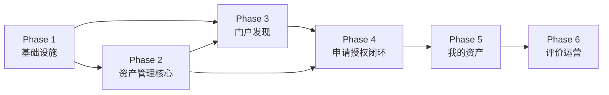

# 数据资产模块群开发计划

> 本文档是 [数据资产模块群规划.md](数据资产模块群规划.md) 的实施计划。
> 共分六个阶段，每个阶段形成一个可交付的里程碑。

---

## 阶段总览

| 阶段 | 核心目标 | 主要交付物 |
|------|---------|-----------|
| Phase 1 | 基础设施准备 | console 改名、asset/portal 模块框架、common 层补充、数据库 schema |
| Phase 2 | 资产管理核心 | 自动发现资产 + 批量编目上架（asset 模块可用，无审批流） |
| Phase 3 | 资产门户发现 | portal 首页、搜索、分类浏览、资产详情页 |
| Phase 4 | 申请与授权闭环 | 申请 → 审批 → 自动授权端到端打通 |
| Phase 5 | 我的资产与有效期 | 各类型使用入口、到期自动回收 |
| Phase 6 | 评价与运营看板 | 资产评价、运营统计 |

---

## Phase 1：基础设施准备

**目标**：搭建两个新模块的骨架，补充 common 共享层，完成 console 改名，设计好数据库 schema。此阶段不涉及业务功能，但是后续所有阶段的基础。

### 1.1 console 改名（portal → console）

- 确认 `console/` 目录已创建，`portal/` 旧目录已清除
- 同步更新：docker-compose.yml 服务名、nginx 配置、Gateway 路由、scripts/
- 验证 console 可正常启动并访问

### 1.2 common 层补充

**后端**：
- 新增 `common/client/asset.go`，实现调用 asset API 的基础 client（参考 `common/client/system.go` 模式）
- 预留主要接口签名：GetAssets、GetAssetDetail、CreateApplication、GetAuthorizations 等

**前端**：
- 梳理 manager 现有数据预览组件（表格预览、字段列表、空间数据预览等）
- 将预览组件迁移/提取到 `common-frontend/basic/`
- manager 前端改为从 `common-frontend/basic/` 引用，验证 manager 功能不回退

### 1.3 asset 模块框架

参考现有模块结构（如 manager/），搭建：

- `asset/backend/`：Go 后端骨架（main.go、router、middleware、config）
- `asset/frontend/`：Vue 前端骨架（Layout、路由、认证）
- 接入 Gateway 路由，注册端口（参考端口分配文档）
- 接入 console 侧边栏导航

### 1.4 portal 模块框架

- `portal/backend/`：Go 后端骨架（BFF 层，主要负责调用 asset client）
- `portal/frontend/`：Vue 前端骨架（独立 URL，风格与 console 区分）
- 接入 Gateway 路由，注册端口
- console 首页添加"访问数据门户"跳转链接

### 1.5 asset 数据库 schema 设计

在 PostgreSQL 中新建 `asset` schema，设计核心表：

| 表名 | 说明 |
|------|------|
| `asset.type_definitions` | 资产类型注册表（类型ID、名称、来源模块、授权处理器、使用入口类型） |
| `asset.type_field_schemas` | 各类型的扩展字段定义（JSON Schema） |
| `asset.categories` | 多级主题分类树 |
| `asset.assets` | 资产主表（名称、类型、状态、分类、标签、负责人、来源引用） |
| `asset.asset_ext_fields` | 资产扩展字段值（按类型存储） |
| `asset.applications` | 资产申请记录（申请人、资产、理由、时限、状态） |
| `asset.authorizations` | 授权记录（申请人、资产、凭证、有效期、状态） |
| `asset.ratings` | 评价记录（评分、评价文字、反馈标记） |

**里程碑**：两个新模块可启动，common 层就绪，数据库表结构初始化完成，manager 预览功能正常。

---

## Phase 2：资产管理核心 ✅ 已完成

**目标**：数据管理员可以在 asset 模块中完成资产发现、编目与上架管理。

> **重要设计决策**：Phase 2 开发过程中对原始方案进行了重大调整，放弃了"手动表单编目 + 审批流"模式，改为"自动发现 + 管理员直接上架"模式，原因是手动录入体验繁琐且孤立，且各源模块已有完整的资源数据。

### 2.1 资产类型注册

- 初始化内置类型（数据集、数据服务、指标、算法/模型）并配置各类型的 `discovery_path`
- 每种类型配置：来源模块、`discovery_path`（发现端点路径）、授权处理器标识
- 本期不支持手动录入的类型（报表/看板、应用）标记为 `enabled=false`
- 管理界面：资产类型列表只读查看

### 2.2 多级主题分类管理（集成在统一工作台）

- 后端：分类 CRUD API（支持多级父子关系）
- 前端：分类树集成在 AssetManager 左侧面板（不再独立页面）
  - "未分类"虚拟节点固定置顶，显示未分配资产数
  - 节点操作：新建子分类、重命名、删除（有关联时阻止删除）

### 2.3 资产自动发现与去重

各源模块新增统一格式的可发现资产端点：

| 模块 | 端点 | 入门条件 | source_reference 格式 |
|------|------|---------|----------------------|
| Meta | `GET /api/meta/assets/discoverable` | MetaItem.scanned_at IS NOT NULL | `{engine_id}:{full_name}` |
| Service | `GET /api/service/assets/discoverable` | RegisteredService.status = "active" | `{service_id}` |
| Standard | `GET /api/standard/assets/discoverable` | Metric.status = "approved" | `{metric_id}` |
| Develop | `GET /api/develop/assets/discoverable` | DevItem.status = "active" | `{devItem_id}` |

- asset 后端定期调用各端点，按指纹去重（`sha256(tenant_id:source_module:source_reference)`）自动创建草稿
- 新增字段：`fingerprint`（唯一索引）、`source_available`（来源资源是否仍存在）

### 2.4 简化状态流与批量操作

**状态模型**（移除 pending/rejected，无需审批）：

```
draft ──[Publish]──▶ published ◀──[Republish]──▶ offline
                                   [Offline]──▶
```

- 后端：`POST /sync`（触发发现）、`POST /batch-publish`、`POST /batch-offline`、`POST /batch-categorize`
- 保留单条操作：`POST /:id/publish`、`POST /:id/offline`
- 前端（AssetManager.vue 统一工作台）：
  - 左侧分类树 + 右侧资产列表的两栏布局
  - 顶部过滤栏：名称搜索、类型筛选、状态筛选
  - 批量操作栏（选中 > 0 时显示）：批量上架、批量下架、分配目录
  - 点击"同步资源"触发发现，页面首次加载自动同步一次

**里程碑**：数据管理员可通过同步发现各模块资产，批量分配目录并上架，AssetManager 工作台可用。

---

## Phase 3：资产门户 — 发现与详情

**目标**：数据消费者可以访问 portal，浏览、搜索和查看已上架资产的详细信息（暂不含申请功能）。

> **当前状态**：portal 模块框架已就绪，所有页面（Home、Search、Category、AssetDetail、MyApplications、MyAuthorizations）为占位符，等待本阶段实现。

### 3.1 Meilisearch 索引同步

- asset 后端在资产**直接上架**（`publish` / `batch-publish`）时，将资产信息同步写入 Meilisearch 索引
- 资产**下架**时从索引中移除（`offline` / `batch-offline`）
- 注意：无"驳回"触发（Phase 2 已移除审批流，不存在驳回状态）
- 索引字段：资产名称、描述、标签、类型、分类路径、来源模块

### 3.2 portal 首页

- 精选推荐区（asset 管理员可标记置顶资产）
- 热门资产区（按访问量排行，前 N 条）
- 最新上架区（按上架时间倒序）
- console 跳转入口（"访问数据门户"）

### 3.3 资产搜索与分类浏览

- 全文检索框（调用 Meilisearch，高亮匹配词）
- 左侧筛选面板：资产类型多选、多级主题分类、标签
- 结果列表：卡片形式，展示名称、类型、描述摘要、评分、上架时间
- 排序：相关度 / 上架时间 / 热度 / 评分

### 3.4 资产详情页

- 基础信息区：名称、类型徽标、主题分类、标签、负责人、更新时间
- 内容预览区（按类型渲染，复用 `common-frontend/basic/` 预览组件）：
  - **数据集**：通过 `source_reference`（格式 `{engine_id}:{full_name}`）调用 meta API 获取字段列表 + 前 N 行数据样本
  - **数据服务**：通过 `source_reference`（service_id）调用 service API 获取接口列表、请求/响应示例
  - **指标**：通过 `source_reference`（metric_id）调用 standard API 获取定义、口径、计算逻辑
  - **算法/模型**：描述、输入输出说明
- 申请须知区（使用限制、申请条件，由管理员在 asset 模块填写）
- 评价展示区（此阶段为空，Phase 6 补充）
- 申请入口（此阶段展示按钮但不可用，Phase 4 激活）

**里程碑**：消费者可以完整浏览、搜索、查看资产详情，portal 门户可公开访问。

---

## Phase 4：申请与授权闭环

**目标**：端到端打通"消费者申请 → 管理员审批 → 系统自动授权"链路，并接入通知。

> **注意**：此处的"审批"是**访问申请审批**（消费者申请使用某资产 → 资产管理员审批），与 Phase 2 中已移除的"资产上架审批"（编目员提交 → 管理员审批是否上架）是两个完全不同的流程，不要混淆。

> **当前状态**：asset 后端已预留 `/applications` 和 `/authorizations` 路由组（placeholder 实现），等待本阶段填充。

### 4.1 资产申请（portal 侧）

- 详情页"申请使用"按钮激活
- 申请表单弹窗：申请理由、使用目的、预计使用时限（日期选择）
- 重复申请校验：已有待审核或有效授权时，提示不可重复提交
- "我的申请"页面：申请列表，展示状态（待审核/已通过/已驳回）

### 4.2 申请审批管理（asset 侧）

- 申请列表页：所有资产申请，支持按状态/类型/时间筛选
- 审批操作：通过（可填备注）/ 驳回（必填原因）
- 批量操作：批量通过/驳回

### 4.3 自动授权

审批通过后，asset 后端按资产类型执行对应的授权处理器：

- **数据服务**：调用 service 模块生成 API Token（含 expires_at），写入 asset_authorizations.credential
- **其他类型**：直接写入授权记录（credential 为空，expires_at 按申请时限填写）

### 4.4 站内通知

- 申请提交后：给资产管理员发送待审批通知
- 审批通过/驳回后：给申请人发送结果通知（驳回时含原因）
- 通知实现方式：复用 system 模块现有通知机制（若无则先用简单的消息记录表）

**里程碑**：完整申请-审批-授权链路可用，消费者提交申请后管理员可审批并自动授权。

---

## Phase 5：我的资产与有效期管理

**目标**：消费者可以查看和使用已授权资产，有效期到期后系统自动回收。

### 5.1 "我的资产"页面（portal 侧）

按资产类型展示不同的使用入口：

| 资产类型 | 展示内容 |
|----------|---------|
| 数据集 | 在线预览（`common-frontend/basic/` 组件）、JDBC 连接串/API 端点复制 |
| 数据服务 | 专属 Token 展示复制、调用文档、curl 示例 |
| 指标 | 指标定义查看、查询接口说明 |
| 报表/看板 | 跳转链接或内嵌 iframe |
| 算法/模型 | 调用说明文档 |
| 应用 | 跳转链接或内嵌 iframe |

- 有效期剩余时间展示（所有类型）
- 已过期资产：标记"已过期"，展示"重新申请"入口

### 5.2 授权有效期定时任务（asset 后端）

- 定时任务（Cron）：每小时/每天扫描 `asset.authorizations WHERE expires_at < NOW() AND status='有效'`
- 数据服务类型：额外调用 service 模块撤销 API Token
- 所有类型：更新 `status='已过期'`
- portal 查询时自动感知状态变化，展示"已过期"

### 5.3 管理员手动撤销授权

- asset 侧授权记录列表（可按用户/资产筛选）
- 支持手动撤销单条授权（数据服务类型同步撤销 Token）

**里程碑**：消费者可完整使用已授权资产，有效期管理形成闭环。

---

## Phase 6：评价与运营看板

**目标**：完善产品生态，为资产管理者提供运营决策数据。

### 6.1 资产评价（portal 侧）

- 详情页底部展示已有评价列表（评分 + 评价文字）
- 已授权用户可提交评价：星级评分（1-5）、文字评价（选填）、问题反馈标记
- 每用户每资产只能评价一次，可修改
- 写入 `asset.ratings` 表，portal 通过 asset API 提交

### 6.2 评价在 asset 侧的处理

- asset 审批管理中，问题反馈标记的评价单独列出
- 支持管理员标记"已处理"

### 6.3 资产运营看板（asset 侧）

- 资产概览：各类型资产数量，近 N 天上架趋势
- 热门资产 Top N：按访问量/申请量双维度
- 申请量趋势图（近 30 天）
- 评分分布统计、最新问题反馈汇总
- 访问量统计依赖 portal 访问日志（portal 后端在请求时写入埋点记录）

**里程碑**：产品功能全部上线，具备基础运营分析能力。

---

## 各阶段依赖关系



- Phase 3 需要 Phase 2 先上架一些资产，否则门户是空的
- Phase 4 需要 Phase 3 的详情页入口作为申请触发点
- Phase 5 依赖 Phase 4 产生的授权记录
- Phase 6 是独立功能，可在 Phase 5 之后随时启动

---

## 关键技术约束备忘

| 约束项 | 说明 |
|--------|------|
| asset client | 放 `common/client/asset.go`，不在 portal 内自己实现 HTTP 调用 |
| 数据预览组件 | 从 `common-frontend/basic/` 引用，禁止 portal 直接依赖 manager |
| portal schema | portal 无独立 schema，所有数据通过 asset API 读写 |
| 授权有效期 | 所有类型均软性到期；数据服务额外撤销 Token（硬性） |
| 类型扩展 | 新增资产类型只需在 `asset.type_definitions` 注册，不改业务代码 |
| 端口分配 | asset / portal 后端端口需在 `docs/spec/addp端口分配.md` 中注册 |
