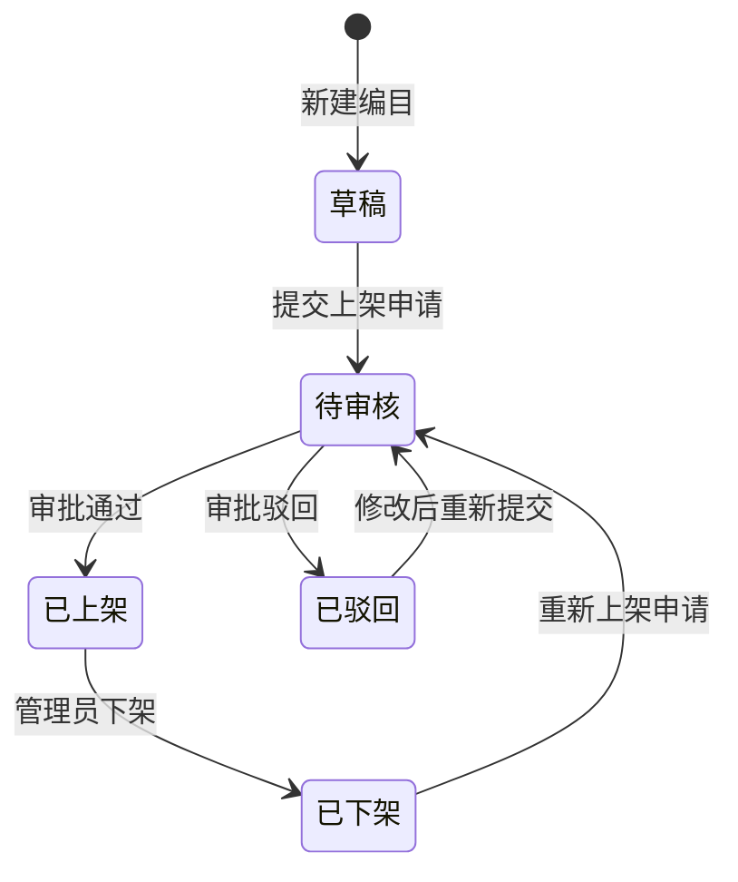
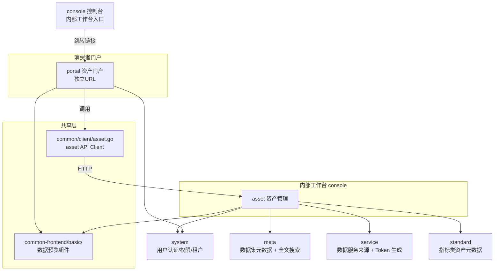
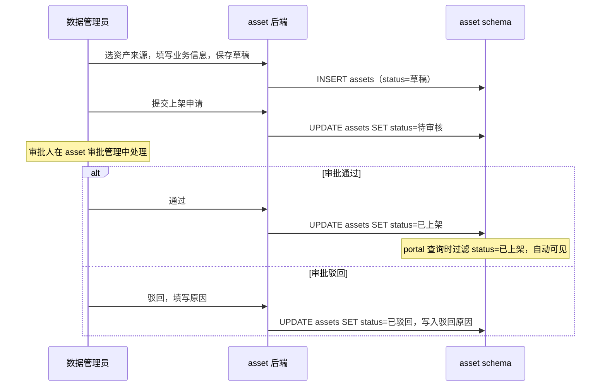
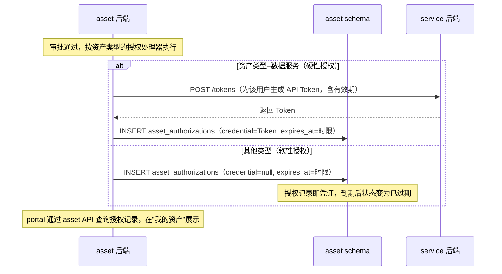
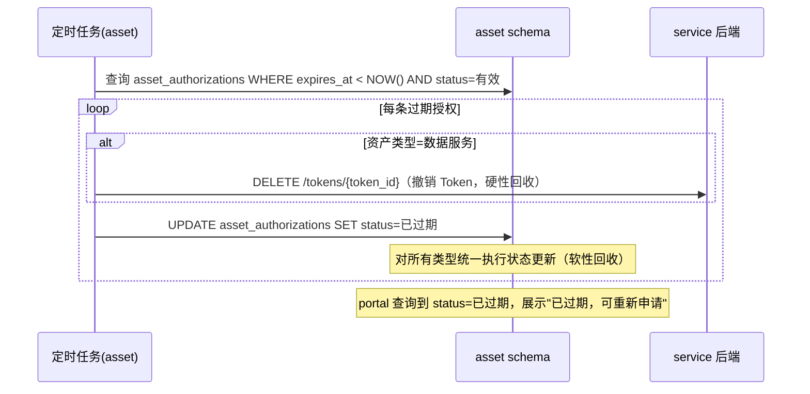
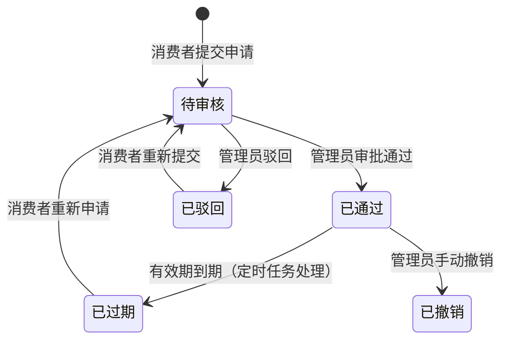

# 数据资产模块群规划

## 一、背景与决策记录

### 已达成的共识

| 议题 | 结论 |
|------|------|
| 资产管理模块命名 | `asset` |
| 资产门户模块命名 | `portal`（新建） |
| 现有 portal 改名 | → `console`（内部工作台集成入口） |
| 应用是否纳入资产体系 | 是，应用作为资产的一种类型 |
| 应用开发/注册 | 在 `asset` 模块内注册，不单独建模块 |
| portal 用户体系 | 复用 system 用户管理，不单独建立用户体系 |
| 申请审批层级 | 单级审批（申请人 → 资产管理员），不做多级 |
| 资产类型可扩展性 | 类型注册机制，配置驱动，不硬编码 |
| 资产编目方式 | 统一编目入口 + 分类型动态扩展字段 |
| portal 与 asset 依赖关系 | portal 通过 `common/client/asset.go` 调用 asset API（单向依赖） |
| 数据库归属 | asset schema 是所有资产数据的唯一 owner，portal 无独立 schema |
| 资产分类体系 | 多级分类（主题域 → 子分类） |
| 访问权限到期处理 | 所有类型均软性到期：更新状态为已过期，不发通知；数据服务额外撤销 Token |
| 数据集变更对已申请用户的影响 | 不受影响，不做变更通知 |
| 数据预览能力归属 | 预览组件/逻辑下沉到 `common-frontend/` 和 `common/`，manager 和 portal 均复用 |
| asset API 调用方式 | 统一通过 `common/client/asset.go`，与 meta/system client 保持一致 |
| portal 与 console 的关系 | portal 独立 URL，console 首页提供"访问数据门户"跳转链接，不做 iframe 集成 |

---

## 二、模块总览

```
数据资产模块群
├── asset       （资产管理，面向数据管理员/生产者，通过 console 访问）
└── portal      （资产门户，面向数据消费者，独立 URL 部署）

改造
└── portal → console  （现有统一工作台入口改名）

共享能力下沉
├── common/client/asset.go         （portal 后端调用 asset API 的统一 client）
├── common-frontend/basic/         （数据预览组件，manager 和 portal 共用）
└── common/                        （后端数据预览逻辑，manager 和 portal 共用）
```

**模块职责边界**：
- asset：资产的全生命周期管理（类型注册、编目、审核、授权、运营统计）
- portal：数据消费体验（发现、申请、使用、评价），通过 asset client 调用 asset API
- console：内部工作台统一入口，首页提供跳转链接到 portal，不嵌入 portal
- portal 无独立 schema，asset schema 是所有资产相关数据的唯一来源

---

## 三、asset 模块 — 资产管理

**受众**：数据管理员、数据生产者、审批人员（内部工作人员，通过 console 访问）

### 3.1 资产类型注册机制

资产类型不硬编码，通过类型注册表（`asset_type_definitions`）配置驱动。每种类型定义：

| 定义项 | 说明 |
|--------|------|
| 类型 ID / 名称 | 唯一标识 + 显示名称 |
| 元数据来源 | 从哪个模块拉取（meta / service / standard / develop / manual） |
| 编目扩展字段 | 该类型特有的业务元数据字段列表（JSON Schema 描述） |
| 授权处理器 | 审批通过后执行哪种授权逻辑（soft / token） |
| 使用入口类型 | 消费者如何使用（预览/下载/Token/跳转链接/iframe） |

**内置资产类型**（可扩展）：

| 类型 | 说明 | 元数据来源 | 授权方式 |
|------|------|----------|---------|
| 数据集 | 数据库表、文件、空间数据等 | meta 模块（已扫描的元数据） | 软性 |
| 数据服务 | REST API 服务、OGC 服务 | service 模块（已发布的服务） | Token（硬性） |
| 指标 | 业务 KPI、统计指标定义 | standard 模块（指标目录） | 软性 |
| 报表/看板 | BI 报表、分析看板 | 手动录入（含访问地址、截图） | 软性 |
| 算法/模型 | 工作流、Notebook、训练模型 | develop 模块 / 手动录入 | 软性 |
| 应用 | 外部系统/工具，注册接入 | 手动录入 | 软性 |

### 3.2 资产编目

**统一编目入口 + 分类型扩展字段**：所有类型资产走相同的编目流程，扩展字段部分按类型配置动态渲染，无需改代码即可适配新类型。

编目流程：
1. 选择资产类型
2. 关联来源（从对应模块选取，或手动填写）
3. 填写通用字段：中文名、业务描述、主题分类（多级）、标签、数据负责人
4. 填写该类型的扩展字段（由类型定义配置决定）
5. 保存为草稿或直接提交审核

### 3.3 资产上架/下架管理

**状态流转**：



- **草稿**：编目暂存，portal 不可见
- **待审核**：已提交，等待审批，portal 不可见
- **已上架**：portal 中正式可见可申请
- **已驳回**：审批不通过，修改后可重新提交
- **已下架**：从 portal 撤下，已授权用户记录保留不受影响

### 3.4 资产申请审批管理

- 申请列表：查看来自 portal 用户的所有资产申请，支持按状态/资产类型/时间筛选
- 审批操作：通过（可填写备注）/ 驳回（必填驳回原因）
- 批量操作：支持批量通过/驳回同类型申请
- 权限自动授权：审批通过后，按资产类型的授权处理器自动执行（见第六节时序图）
- 申请记录永久保留，可追溯

**审批通过后的自动授权规则**：

| 资产类型 | 授权内容 | 到期行为 |
|----------|---------|---------|
| 数据集 | 记录授权 + 展示连接信息 | 软性：状态变为已过期 |
| 数据服务 | 调用 service 模块生成专属 API Token | 硬性：定时任务撤销 Token + 状态变为已过期 |
| 指标 | 记录授权，开放指标查询接口说明 | 软性：状态变为已过期 |
| 报表/看板 | 记录授权，portal 中展示访问链接 | 软性：状态变为已过期 |
| 算法/模型 | 记录授权，提供调用说明 | 软性：状态变为已过期 |
| 应用 | 记录授权，portal 中展示访问入口 | 软性：状态变为已过期 |

**软性到期**：授权记录状态更新为"已过期"，从"我的资产"消失，用户需重新申请。无技术手段阻断数据源层面访问，属于治理和审计层面的控制。

### 3.5 资产运营视图

面向数据管理员的运营看板：

- 资产概览：各类型资产数量、上架/下架趋势
- 访问统计：各资产页面访问量、申请量排行
- 热门资产 Top N 榜单
- 消费者评价/反馈汇总查看，支持回复/处理标记

---

## 四、portal 模块 — 资产门户

**受众**：数据消费者（内部业务人员、开发者、外部合作方）

portal 是面向数据消费者的"数据市场"，独立 URL 部署，风格偏向产品展示而非管理后台。console 首页提供"访问数据门户"跳转链接，portal 本身不嵌入 console。

**portal 后端为轻量 BFF 层**，通过 `common/client/asset.go` 调用 asset API，无独立 schema。

### 4.1 资产发现

- **首页**：精选推荐（管理员手动置顶）、热门资产（按访问/申请量）、最新上架
- **全文检索**：基于 Meilisearch，支持按资产名称、描述、标签、字段名搜索
- **分类浏览**：按资产类型 + 多级主题分类（主题域 → 子分类）+ 标签多维过滤
- **排序**：相关度、上架时间、热度（访问量）、评分

### 4.2 资产详情页

- **基础信息**：资产名称、类型、主题分类、标签、负责人、更新时间、质量评分
- **内容预览**（按类型渲染，预览组件来自 `common-frontend/basic/`）：
  - 数据集：字段列表（字段名/类型/说明）、前 N 行数据样本预览
  - 数据服务：接口列表、请求/响应示例、服务文档
  - 指标：指标定义、口径说明、计算逻辑
  - 报表/看板：截图展示、功能介绍
  - 算法/模型：描述、输入输出说明
  - 应用：截图展示、功能介绍、访问说明
- **申请须知**：使用限制、申请条件说明
- **评价展示**：其他用户的评分和评价

### 4.3 资产申请

- 已登录用户在详情页点击"申请使用"
- 申请表单：填写申请理由、使用目的、预计使用时限
- "我的申请"列表：查看所有申请的审批状态（待审核/已通过/已驳回）
- 审批结果通过站内通知告知（驳回时包含原因）
- 已有待审核或有效授权时，不允许重复提交

### 4.4 资产使用（"我的资产"）

申请通过后，在"我的资产"页面集中管理：

| 资产类型 | 使用方式 |
|----------|----------|
| 数据集 | 在线数据预览（`common-frontend/basic/` 预览组件）、下载、JDBC 串/API 端点 |
| 数据服务 | 调用文档、专属 Token 查看/复制、curl 示例 |
| 指标 | 指标定义查看、查询接口调用说明 |
| 报表/看板 | 直接跳转链接或内嵌 iframe |
| 算法/模型 | 调用说明文档 |
| 应用 | 直接跳转链接或内嵌 iframe |

- 授权有效期展示：剩余有效时间（所有类型均有）
- 已过期资产：标记"已过期"，可重新发起申请

### 4.5 资产评价

使用过资产的用户可以评价：

- 星级评分（1-5 星）
- 文字评价（选填）
- 问题反馈标记（标记为"问题反馈"，asset 管理员可在运营视图中处理）
- 每个用户对同一资产只能评价一次，可修改

---

## 五、与现有模块的关系



**边界说明**：
- portal → asset：通过 `common/client/asset.go` 单向调用，portal 不直接读写 asset schema
- portal 不直接依赖 manager；数据预览能力由 `common-frontend/basic/` 组件提供，manager 和 portal 均复用
- portal 不调用 meta/service/standard，这些由 asset 在编目时已整合
- console 与 portal 的关系是"跳转链接"，不是 iframe 嵌入

---

## 六、关键业务流程时序图

### 6.1 资产上架审批流程



### 6.2 资产申请审批流程

```mermaid
sequenceDiagram
    participant U as 数据消费者
    participant P as portal 后端(BFF)
    participant C as common/client/asset.go
    participant A as asset 后端
    participant DB as asset schema
    participant PM as 资产管理员

    U->>P: 浏览/搜索资产
    P->>C: GetAssets(status=已上架)
    C->>A: GET /assets?status=已上架
    A->>DB: 查询 assets
    DB-->>A: 返回资产列表
    A-->>C-->>P-->>U: 展示资产列表

    U->>P: 进入详情，点击"申请使用"，填写表单
    P->>C: CreateApplication(asset_id, 理由, 目的, 时限)
    C->>A: POST /asset-applications
    A->>DB: INSERT asset_applications（status=待审核）
    A-->>C-->>P-->>U: 提交成功，等待审批

    PM->>A: 查看申请列表
    A->>DB: 查询 asset_applications

    alt 审批通过
        PM->>A: 通过审批
        A->>DB: UPDATE asset_applications SET status=已通过
        A->>DB: INSERT asset_authorizations（expires_at=申请时填写的时限）
        A-->>U: 站内通知：申请已通过
    else 审批驳回
        PM->>A: 驳回，填写原因
        A->>DB: UPDATE asset_applications SET status=已驳回，写入原因
        A-->>U: 站内通知：申请已驳回（含原因）
    end
```

### 6.3 审批通过后的权限自动授权



### 6.4 授权有效期到期处理



### 6.5 资产申请状态机



---

## 七、改造项

### console（现 portal）改名

- 原 `portal/` 目录已删除，`console/` 为内部工作台统一入口
- 对外展示名称：控制台（Console）
- 新建的 `portal/` 是全新的数据消费门户，与原来的 portal 无关

### common 共享能力补充

- 新增 `common/client/asset.go`：portal 后端（及未来其他需要调用 asset 的模块）通过此 client 访问 asset API
- `common-frontend/basic/` 补充数据预览相关组件，manager 和 portal 均从此引用，不再各自维护

---

## 八、待定事项

所有关键决策已录入第一节"已达成的共识"表格，当前无待讨论事项。
