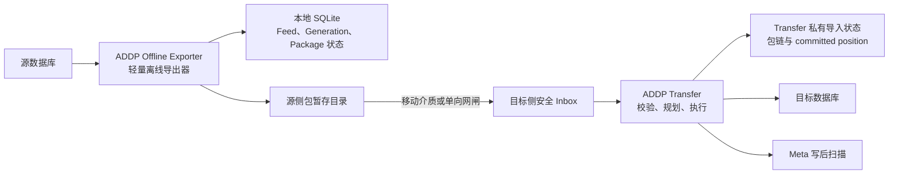
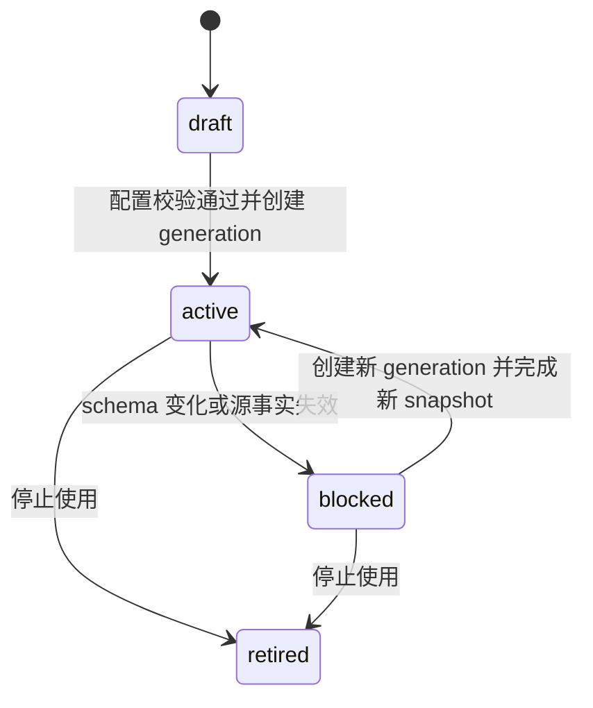
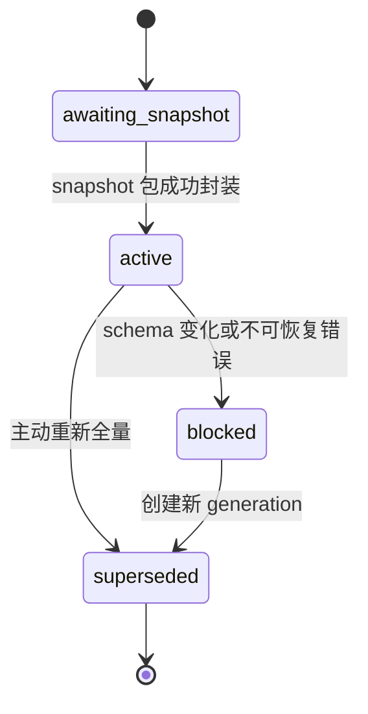
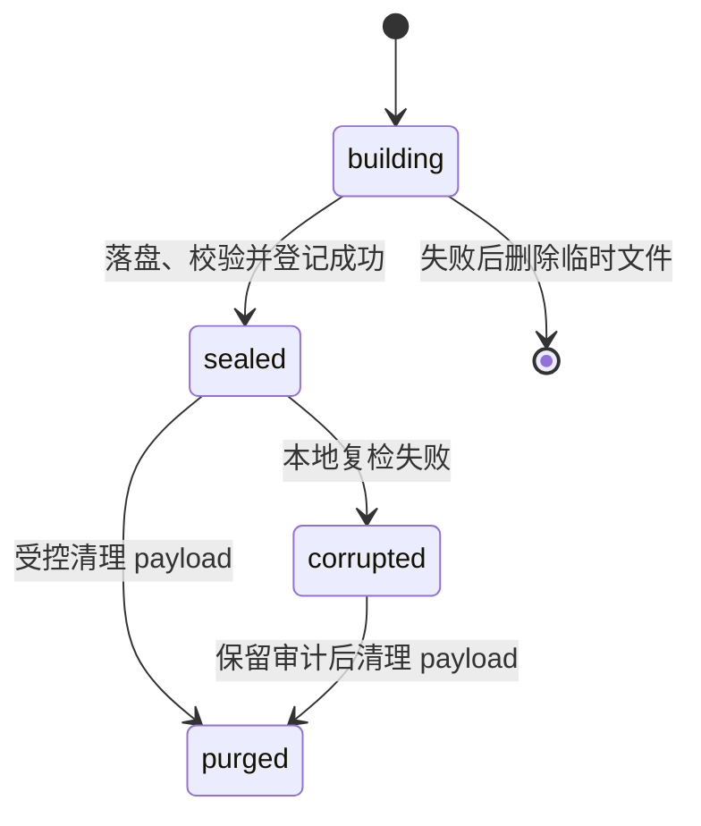
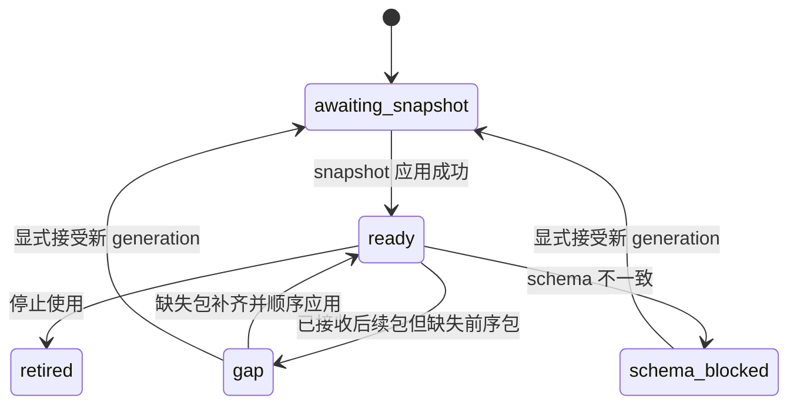

# ADDP 跨网离线表同步设计

更新时间：2026-08-21

> 状态：设计方案，尚未实现。
>
> 本文记录已确认的跨物理隔离网络表数据同步方案。当前可执行的 Transfer 任务语义和支持矩阵仍以 [Transfer 任务语义与同步模式](../../transfer/docs/transfer-任务语义与同步模式.md) 和 [Transfer 基本概念及配置说明](../../transfer/docs/transfer-基本概念及配置说明.md) 为准。

## 一、背景与已确认约束

源网络和目标网络物理隔离，两侧之间不存在在线网络通道。数据只能通过移动介质或单向网闸以离线文件包从源侧传递到目标侧。

本方案的已确认约束如下：

- 源侧不部署完整 ADDP，仅部署轻量离线导出器。
- 目标侧部署完整 ADDP，由 Transfer 承担离线包导入和目标写入。
- 数据和制品只从源侧流向目标侧，不设计目标侧应用回执。
- 不支持 `continuous`，只支持 `bounded snapshot` 和 `bounded watermark incremental`。
- 首期只支持 `table` 数据类型。
- snapshot 只支持 `replace`。
- watermark incremental 目标固定使用稳定键 `upsert`。
- watermark 只识别新增和更新，不发现物理删除。
- 允许源侧连续生成多个尚未取走或尚未导入的离线包。
- 目标侧由用户上传包；包校验通过且链连续时自动创建 execution，不逐包二次确认。

## 二、核心决策

跨网离线同步采用：

```text
源侧轻量离线导出器
  -> 单向链式离线包
  -> 目标侧 ADDP Transfer 导入任务
```

离线同步仍属于 Transfer `sync` 业务语义，不新增 `export`、`import` 或 `offline_transfer` 任务类型。源侧导出是离线制品生成动作；目标侧的每次包应用是一次标准 bounded Transfer execution。

单向通信导致两侧无法共享端到端成功事实：

- 源侧只能证明数据已完整封包并可靠落盘。
- 目标侧才能证明数据已成功应用。
- 源侧不得把已封包位置称为目标已提交位置。
- 系统不宣称通用端到端 exactly-once。

## 三、总体架构



### 3.1 源侧轻量离线导出器

源侧建议新增独立 Go 程序 `ADDP Offline Exporter`，以单二进制 CLI 为基础形态。需要定时导出时由操作系统调度器触发；只有事实证明需要常驻管理时，才增加轻量本地服务。

导出器仅包含：

- 源 PostgreSQL/MySQL 连接和只读访问。
- 表 schema 读取与指纹计算。
- 一致性 snapshot 读取。
- watermark 复合上界冻结、稳定排序和范围读取。
- 表批次编码、分块、压缩、摘要、签名和加密。
- SQLite 状态、本地包暂存和崩溃恢复。
- Feed、Generation 和 Package 的创建、查询、校验、重新复制和受控清理。

导出器不包含：

- System、Meta、Gateway 或 Console。
- ADDP 用户、Tenant、组织和角色体系。
- Infra PostgreSQL、Redis、MinIO 或 Monitor。
- 目标 Engine Provider 和目标资源树。
- 目标应用成功推断。

源数据库凭据只存在源侧的操作系统凭据存储或受控本地配置中，不得进入离线包、日志或 SQLite 明文字段。

### 3.2 目标侧 ADDP

目标侧职责如下：

- 接收并持久化离线包。
- 执行容器、签名、摘要、包链、schema 和能力校验。
- 维护 Offline Import Binding。
- 把每个可应用包投影为标准 Transfer bounded execution。
- snapshot 按 `replace` 写入，incremental 按稳定键 `upsert`。
- 维护目标侧包链与真实 `committed_position`。
- 成功后触发 Meta deep scan 并写入标准 execution 和血缘事实。

Gateway 不承载跨网数据流，Monitor 不直读离线包、目标业务库或 Transfer 私有状态。

## 四、核心领域模型

### 4.1 Offline Feed

Offline Feed 是源侧长期导出定义，固定绑定：

- 源数据库物理端点身份摘要。
- database/schema/table。
- watermark 字段。
- 非空 tie breaker。
- 稳定、不可变的业务键。
- 表字段与逻辑类型。
- schema fingerprint。
- 包协议版本、分块策略和签名密钥身份。

watermark、tie breaker、业务键或源物理端点不允许原地修改。需要变更时创建新 Feed，不保留旧配置兼容分支。

Feed 状态：



| 状态 | 语义 |
|---|---|
| `draft` | 尚未完成源连接、watermark、tie breaker 和键约束校验。 |
| `active` | 允许为当前 generation 生成下一个包。 |
| `blocked` | 当前 generation 不可继续，需要新 generation 和 snapshot。 |
| `retired` | 终态，不再导出。 |

Feed 不引入 `paused` 业务状态。CLI 未运行时天然不会导出；未来若有定时执行，调度开关属于独立调度事实。

### 4.2 Feed Generation

Generation 表示一条从 snapshot 开始的完整离线包链。schema 变化、中间包不可恢复丢失或用户主动重新全量时，创建新 generation，不修补旧链。



Generation 至少保存：

```text
generation_id
feed_id
schema_fingerprint
last_sequence
last_package_digest
sealed_position
snapshot_upper_bound
status
created_at
superseded_at
```

### 4.3 Offline Package

Package 是不可变的离线传输制品。包一旦封装，其身份、序号、内容和摘要均不得修改。



`sealed` 不表示已取走、已送达或已应用。这些可以是人工交接记录，但不参与增量位置计算。

### 4.4 Offline Import Binding

Offline Import Binding 是目标侧 Transfer 私有强类型实体，将一个源 Feed 绑定到：

- 当前 generation。
- 目标 Engine 和目标表 Locator。
- 冻结的字段映射。
- 目标稳定键。
- 当前已应用 sequence 和 package digest。
- 目标侧 committed position。
- schema fingerprint 和 apply identity。

同一 Feed 第一版只允许绑定一个目标任务。需要写入第二个目标时，创建独立 Binding，各自维护应用位置。

目标绑定状态：



`transfer.transfer_tasks.status=blocked` 当前只表示数据库 CDC schema drift，不应无声扩展为离线导入状态。`awaiting_snapshot|ready|gap|schema_blocked|retired` 应保存在新的 Transfer 私有 Binding 实体中；bounded task 和 `common.task_executions` 继续使用现有状态契约。

## 五、单向包链

每个 generation 的第一个包必须是 snapshot：

```text
Package 0
  kind = snapshot
  sequence = 0
  previous_digest = null
  end_position = snapshot_upper_bound

Package 1
  kind = incremental
  sequence = 1
  previous_digest = Package 0 digest
  start_position = Package 0 end_position
  end_position = P1

Package 2
  kind = incremental
  sequence = 2
  previous_digest = Package 1 digest
  start_position = P1
  end_position = P2
```

目标侧只允许应用满足以下全部条件的包：

```text
incoming.generation_id == binding.current_generation_id
incoming.sequence == binding.applied_sequence + 1
incoming.previous_digest == binding.applied_package_digest
incoming.start_position == binding.committed_position
incoming.schema_fingerprint == binding.schema_fingerprint
```

这些约束实现：

- 重复包幂等识别。
- 乱序包先保存、后等待，不越过缺口应用。
- 缺失包明确阻塞。
- 包内容被替换时摘要链失败。
- 不同 Feed 或 generation 的包不会串入同一条目标链。

不提供“跳过缺失包”能力。若缺失包已无法恢复，唯一路径是创建新 generation、重新生成 snapshot，并在目标侧显式切换后 `replace` 目标。

## 六、位置语义

### 6.1 源侧 sealed position

源侧使用 `sealed_position`，其含义是：

> 相应位置之前的源数据已读取、完整封包、写入稳定存储并通过摘要校验。

源侧下一次增量读取：

```text
(sealed_position, execution_upper_bound]
```

`sealed_position` 只能在以下动作完成后推进：

1. 所有 chunk 写入临时文件。
2. chunk 摘要、manifest 和整包摘要生成完成。
3. 包签名完成。
4. 包通过本地完整性校验。
5. 文件数据与目录项可靠落盘。
6. 临时文件原子重命名为最终包。
7. SQLite 在一个事务中登记 package 并推进 generation 链头。

不允许先推进位置再写离线包。

### 6.2 目标侧 committed position

目标侧继续使用 Transfer 已有 `committed_position` 语义：

> 相应位置之前的数据已被目标成功应用。

目标 upsert 成功后，Transfer 才能通过 state version 和 fencing token CAS 推进包链状态和 `committed_position`。

| 位置 | 所有者 | 事实含义 |
|---|---|---|
| `sealed_position` | 源侧导出器 | 已可靠生成离线包。 |
| `committed_position` | 目标侧 Transfer | 已成功应用到目标。 |

两者可以长期不一致，且不存在自动对账通道。

## 七、离线包协议

### 7.1 容器结构

```text
offline-package
├── manifest.json
├── schema.json
├── chunks
│   ├── 00000001.payload
│   ├── 00000002.payload
│   └── ...
└── completion.json
```

包容器负责身份、分块、顺序、压缩、摘要、签名和加密，不是新的 ADDP 数据格式。表 payload 的具体批次编码在协议详细设计阶段再在 Arrow IPC、Parquet 等选项中选定唯一路线，不在本文同时保留多个可执行编码。

### 7.2 Manifest 最小字段

```json
{
  "protocol": "addp.offline-table-package/v1",
  "feed_id": "uuid",
  "generation_id": "uuid",
  "package_id": "uuid",
  "sequence": 3,
  "kind": "incremental",
  "previous_digest": "sha256:...",
  "schema_fingerprint": "sha256:...",
  "range": {
    "start_exclusive": ["2026-08-20T10:00:00.000Z", "10001"],
    "end_inclusive": ["2026-08-20T11:00:00.000Z", "10593"]
  },
  "keys": ["id"],
  "watermark": ["updated_at"],
  "row_count": 592,
  "chunks": [],
  "created_at": "2026-08-20T11:01:00Z",
  "signer": {
    "key_id": "source-exporter-key-id"
  },
  "signature": "..."
}
```

snapshot 包固定：

```text
sequence = 0
kind = snapshot
previous_digest = null
```

incremental 包固定：

```text
sequence > 0
kind = incremental
previous_digest = 上一个包的完整摘要
start_exclusive = 上一个包的 end_inclusive
```

### 7.3 目标无关性

离线包只描述源数据集、源 schema、导出范围和数据内容，不保存：

- 目标 Engine ID 或 Locator。
- 目标表名。
- 目标字段映射。
- 目标凭据或目标网络信息。

目标位置、映射和 Provider 能力校验只存在目标 ADDP 的 Offline Import Binding 中。

## 八、源侧导出流程与崩溃恢复

### 8.1 Snapshot

1. 创建 Feed 和 Generation。
2. 在源数据库一致性快照内读取 schema 并冻结 snapshot upper bound。
3. 完整读取源表，按稳定顺序写入 sequence 0 包。
4. 包可靠落盘后，登记包链头和 `sealed_position=snapshot_upper_bound`。
5. Generation 从 `awaiting_snapshot` 进入 `active`。

### 8.2 Watermark incremental

1. 获取 Feed 单实例锁。
2. 在源数据库一致性快照内冻结复合 `execution_upper_bound`。
3. 读取 `(sealed_position, execution_upper_bound]`。
4. 按完整 `(watermark, tie_breaker...)` 稳定排序。
5. 生成下一 sequence 的 incremental 包。
6. 包可靠落盘并校验通过后，在 SQLite 事务中登记包并推进 `sealed_position`。

同一 Feed 同时只允许一个导出 execution，但允许在没有目标回执的情况下连续生成多个已封装包。

### 8.3 崩溃恢复

| 崩溃位置 | 恢复规则 |
|---|---|
| 临时包尚未完成 | 删除临时包，从原 `sealed_position` 重做。 |
| 最终包已落盘，SQLite 未登记 | 完整校验 manifest；与当前链头一致时补登记。 |
| SQLite 已登记 sealed 包 | 最终包必须存在；不存在则阻塞 generation。 |
| 相同 generation 和 sequence 文件摘要不符 | 阻塞 generation，不自动重生成同序号包。 |

源侧需要一个确定性启动对账器，只根据 SQLite 与本地包目录事实恢复，不从文件名猜测包身份。

## 九、目标侧导入流程

### 9.1 接收和校验

离线包进入 ADDP 后，必须先复制到 ADDP 管理的安全暂存区，再创建 execution。不允许从 U 盘、人工挂载目录或临时上传流直接执行。

校验顺序固定为：

1. 文件大小、文件数量和解包资源上限。
2. 容器路径与结构，拒绝路径穿越、链接和解压炸弹。
3. 协议版本。
4. 源签名身份和信任状态。
5. 整包摘要。
6. 每个 chunk 摘要。
7. Feed、Generation 和 Package 身份。
8. sequence、previous digest 和 position 连续性。
9. schema fingerprint 和字段契约。
10. 目标 Engine Provider 和 apply policy 能力。

校验不会修改包，也不会通过忽略未知字段、重命名或自动转换来兼容旧包。

目标包接收状态建议为：

```text
uploaded -> validated -> queued -> applying -> applied
     |          |                    |
     +----------+--------------------+-> rejected / apply_failed

validated -> waiting_for_gap
waiting_for_gap -> queued
```

`applying` 可由关联的 active execution 派生，不一定需要作为独立持久化字段。

### 9.2 首包与目标绑定

第一次上传 snapshot 包时：

1. 完成包身份、签名、摘要和 schema 校验。
2. 用户选择目标 Engine、目标父位置和目标表。
3. 用户确认字段映射和稳定目标键。
4. Transfer 创建 `sync` task definition 和 Offline Import Binding。
5. 生成 bounded snapshot execution。
6. 成功 `replace` 后，Binding 记录 generation、sequence 0、package digest 和 committed position。
7. 触发目标 Meta deep scan。

目标表、映射和目标键一旦完成绑定，后续 incremental 包不再逐包询问。

### 9.3 Snapshot 应用

Snapshot 只支持 `replace`：

```text
已验证 sequence 0
  -> 清理或重建目标
  -> 完整写入
  -> 提交并校验
  -> 登记包链头
  -> 推进 committed position
```

执行失败后重试从头 `replace`。只有目标 Provider 真正支持原子 staging/publish 时，才能宣称原子替换；否则需要明确告知用户失败期间目标可能暂时不可用。

### 9.4 Watermark incremental 应用

Incremental 包固定使用已绑定的稳定键 `upsert`：

```text
检查当前包链头
  -> 按稳定键幂等 upsert
  -> 登记 package apply result
  -> CAS 推进 sequence、digest 和 committed position
```

目标业务数据与 Infra PostgreSQL 中的 Transfer 状态无法形成分布式事务，因此保证为：

```text
at-least-once
  + immutable package
  + strict package chain
  + stable key upsert
  + committed position CAS/fencing
```

若目标 upsert 已成功而 Infra 状态提交失败，新 execution 重放整个包，由稳定键 upsert 吸收重复。

### 9.5 乱序包和缺口

目标已应用 sequence 4 而收到 sequence 6 时：

- 安全保存并验证 sequence 6。
- 将它标记为 `waiting_for_gap`。
- 明确展示缺少 sequence 5。
- 不提前应用 sequence 6。
- sequence 5 到达并应用成功后，自动为已验证的 sequence 6 创建独立 execution。

每个包仍对应独立 execution，不把多个包合并成一条不可审计的执行记录。

## 十、目标侧数据与状态建议

建议新增 Transfer 私有实体，具体表结构在实施设计时进一步确定。

### 10.1 `offline_import_bindings`

建议字段：

```text
id
tenant_id
task_id
feed_id
current_generation_id
target_locator
schema_fingerprint
field_mapping_snapshot
target_keys
apply_identity
applied_sequence
applied_package_digest
committed_position
state_version
status
created_at
updated_at
```

关键约束：

- `task_id` 唯一。
- 第一版 `(tenant_id, feed_id)` 唯一。
- committed position 只能通过 state version 和当前 execution fencing token CAS 推进。

### 10.2 `offline_package_imports`

建议字段：

```text
id
tenant_id
binding_id
generation_id
sequence
package_id
package_digest
previous_digest
start_position
end_position
schema_fingerprint
artifact_locator
artifact_status
execution_id
applied_at
error_code
error_summary
created_at
updated_at
```

关键约束：

- `(binding_id, generation_id, sequence)` 唯一。
- `(tenant_id, package_id)` 唯一。
- 相同 sequence 和不同 digest 必须拒绝并记录安全审计。
- 已 `applied` 的包重复上传时不创建新的数据写入 execution。
- `apply_failed` 包的重试创建新 execution，不复用已结束 execution。

artifact 的物理保存应复用 ADDP infra 存储能力，但物理对象不是包身份的第二事实源。`offline_package_imports` 是导入身份、状态和审计关联的事实。

## 十一、Schema 变化和重新全量

第一版不支持包内 schema evolution。

源侧每次导出前重新计算 schema fingerprint。若与当前 generation 不同：

1. 不生成新增量包。
2. 将当前 generation 置为 `blocked`。
3. 用户创建新 generation。
4. 新 generation 从新 snapshot 开始。

目标侧只接受与当前 Binding 冻结 schema fingerprint 一致的包。对新 generation 的切换必须由用户显式确认，然后使用新 snapshot `replace` 目标并原子更换 Binding 的当前 generation 事实。

不保留：

- 自动加列。
- 旧 schema 兼容映射。
- 缺字段默认值兜底。
- 一个 generation 内的多 schema revision。

## 十二、安全与信任

### 12.1 包签名

源侧使用独立离线导出签名密钥对 manifest 和整包摘要签名。目标侧必须在导入前信任对应源端公钥。

可选的初始信任路径：

- 部署时由管理员预先登记源端公钥。
- 首次导入时显示公钥指纹，管理员通过独立线下渠道核对后显式信任。

不允许无条件信任包内自带的公钥，否则攻击者可以同时替换数据、摘要、签名和公钥。

### 12.2 包加密

建议在部署阶段向源侧预置目标侧离线导入公钥：

- 每个包生成随机内容密钥。
- payload 使用认证加密。
- 内容密钥由目标公钥封装。
- 目标私钥不离开目标网络。
- 密钥版本只以非敏感 `key_id` 进入 manifest。

如果严格不允许任何目标信息以任何方式预置到源侧，则无法使用目标公钥加密，只能改用双方预共享密钥或组织统一离线交换公钥。该选择必须在实施前唯一化。

### 12.3 导入防护

目标侧至少需要：

- 包大小、chunk 数量、单 chunk 大小和解压比上限。
- 严格目录白名单，拒绝绝对路径、`..`、符号链接和硬链接。
- 上传、验签、解密、解包和应用的独立资源预算。
- 输入数据类型和长度的严格校验。
- 受信源公钥的创建、轮换、禁用和审计。
- 失败包隔离和受控清理，不在普通日志输出数据内容。

## 十三、异常处理决策

| 场景 | 处理 |
|---|---|
| 源侧导出临时失败 | 不推进 sealed position，从原位置重做。 |
| 已封装包在传递中丢失 | 从源侧重新复制完全相同的包。 |
| 已封装包损坏 | 摘要校验失败，拒绝导入。 |
| 重复上传未应用包 | 复用已有 artifact 记录，不创建第二个包身份。 |
| 重复上传已应用包 | 返回已应用事实，不重复写入。 |
| 相同序号不同摘要 | 拒绝并记录安全审计。 |
| 乱序包 | 保存为 waiting for gap，前序包应用后自动续执行。 |
| 中间包永久丢失 | 禁止跳过，创建新 generation 并重新 snapshot。 |
| snapshot 应用失败 | 新 execution 从头 replace。 |
| incremental 目标写入失败 | 不推进 committed position，新 execution 重放整包。 |
| 目标写入成功但 Infra CAS 失败 | 重放整包，由稳定键 upsert 吸收重复。 |
| schema fingerprint 变化 | 阻塞当前 generation，只允许新 generation + snapshot。 |
| 目标表被外部修改 | 目标事实重新校验失败，阻止包应用。 |
| 源侧包已清理且目标需要补包 | 无法恢复旧链，只允许新 generation + snapshot。 |

## 十四、包保留和清理

单向无回执时，源侧无法自动判断包已被目标应用，因此默认不按短时间窗自动删除。

建议清理规则：

- 保留最近一个完整 snapshot 及其后全部 incremental 包。
- 只有创建并完成新 generation snapshot 后，才允许清理旧 generation payload。
- 清理 payload 后保留 manifest、摘要、序号、时间和操作审计。
- 清理前显示“目标若尚未导入将只能重新 snapshot”的明确风险。
- 目标侧包 artifact 保留期由 Transfer owner 的普通运行配置管理，不放入任务 JSON 或环境变量 fallback。

## 十五、首期支持矩阵

| 维度 | 首期支持 |
|---|---|
| 源引擎 | PostgreSQL、MySQL 普通基表 |
| 目标引擎 | PostgreSQL、MySQL 原生表 |
| 数据类型 | `table` |
| 执行边界 | `bounded` |
| 首次装载 | snapshot + `replace` |
| 后续装载 | incremental + watermark + `upsert` |
| 删除 | 不支持 |
| append | 不支持 |
| schema evolution | 不支持；变化后新 generation + snapshot |
| 多表合包 | 不支持 |
| 包缺口跳过 | 不支持 |
| 同 Feed 导出并发 | 1 |
| 同 Binding 应用并发 | 1 |
| 包生成积压 | 允许多个 sealed 包 |
| 包上传顺序 | 允许乱序 |
| 包应用顺序 | 必须严格顺序 |
| 目标应用回执 | 不支持 |

矩阵之外的组合必须由源端或目标 Planner 明确拒绝，不通过字段缺省、协议降级或兼容映射放行。

## 十六、实施前文档收敛

本文属于 `docs/plan/` 下的设计输入，不是当前支持规范。开始实现前必须先按以下顺序更新正式文档：

1. 在 `docs/concepts/addp术语表.md` 增加 Offline Feed、Feed Generation、Offline Package、Offline Import Binding 和 sealed position。
2. 在 `docs/concepts/addp模块架构图.md` 补充轻量离线导出器的部署边界，明确它不是新 ADDP 业务模块。
3. 在 `transfer/docs/transfer-任务语义与同步模式.md` 扩展 bounded snapshot/watermark 的 offline package source 语义和支持矩阵。
4. 在 `transfer/docs/transfer-基本概念及配置说明.md` 定义任务配置、Binding、包校验、状态与 API。
5. 在 `transfer/docs/数据库架构.md` 定义 Transfer 私有表、唯一约束、CAS 与清理边界。
6. 若新增 API，同步 `docs/spec/addp-API设计规范.md`、Swagger 和双语注解要求。

正式文档更新并确认后才能进入代码实现，不应让本规划文档成为代码的唯一契约。

## 十七、分阶段实施建议

### 阶段 0：协议和事实契约

- 完成术语、任务语义和支持矩阵更新。
- 选定唯一表批次编码、摘要、签名、加密和容器规范。
- 定义 manifest JSON Schema 和协议一致性测试向量。
- 定义源侧 SQLite 和目标侧 Transfer 私有状态。

### 阶段 1：源侧 Snapshot Exporter

- 实现 PostgreSQL/MySQL 表 schema 和 snapshot 读取。
- 实现 Feed、Generation、Package 状态与崩溃恢复。
- 实现分块、完整性、签名和加密。
- 先通过本地生成、重复复制和损坏检测测试。

### 阶段 2：目标侧 Snapshot Import

- 实现安全 Inbox 和包校验。
- 实现 Offline Import Binding 和首次目标映射。
- 复用 Transfer planner/executor 完成 snapshot replace。
- 实现重复包、失败重试、Meta scan 和审计。

### 阶段 3：Watermark Export/Import

- 源侧复用 bounded watermark Provider 语义冻结复合上界。
- 实现链式 incremental package 和 sealed position。
- 目标侧实现包链检查、稳定键 upsert、CAS 和重放。
- 覆盖乱序、缺包、重复包、摘要冲突和 Infra 提交失败。

### 阶段 4：新 Generation 和运维收敛

- 实现 schema 变化阻塞和新 generation snapshot。
- 实现目标侧显式 generation 切换。
- 实现源侧受控包清理和目标侧 artifact 保留策略。
- 补充 Monitor 公共 execution 投影，Monitor 仍不读私有表。

## 十八、关键验证场景

实施必须至少覆盖：

1. PostgreSQL/MySQL snapshot 到 PostgreSQL/MySQL 的完整组合矩阵。
2. snapshot 中途导出失败不推进 sealed position。
3. 最终包已落盘而 SQLite 未登记的崩溃恢复。
4. 同一包重复复制、重复上传和重复应用。
5. 相同 sequence 伪造不同内容时明确拒绝。
6. chunk 缺失、乱序、损坏和解压资源超限。
7. 目标收到 sequence 2 后再收到 sequence 1，最终按顺序形成两个 execution。
8. 中间包永久丢失时不能跳过，新 generation snapshot 可恢复。
9. watermark 中同值多行通过 tie breaker 无重无漏。
10. 目标 upsert 成功但 Infra CAS 失败后重放收敛。
11. 源 schema 变化阻塞增量，不生成兼容包。
12. 包签名、公钥、摘要或密文被篡改时导入失败。
13. 包内路径穿越、链接和解压炸弹防护。
14. 外部修改目标 schema 后后续包被阻止。
15. 源侧多次生成积压包，目标侧只按链顺序应用。

## 十九、尚待实施前确认的问题

以下事项不改变本文核心架构，但必须在对应实施阶段唯一化：

- 表批次 payload 的唯一编码。
- 包容器物理格式和拆分大文件规则。
- 摘要、签名、认证加密和密钥封装算法。
- 目标导入公钥的离线预置和轮换流程。
- 单包、单 chunk、行数、解压比和临时磁盘限额。
- 源侧包保留与人工交接记录策略。
- 目标侧 artifact 保留周期和清理补偿机制。
- 目标映射是否允许 decimal 精度等显式用户调整。
- 首期是否同时开放源 PostgreSQL 和 MySQL，还是先交付一种。
- 移动介质、单向网闸对单文件大小、文件名和扫描流程的实际约束。

## 二十、不做的事

本方案明确不做：

- 不让中心 Transfer Worker 直接连接源网络。
- 不把 Gateway 当作大数据跨网隧道。
- 不在源侧复制 System、Meta 和 Transfer 控制面。
- 不伪造目标应用回执或端到端成功状态。
- 不为单向离线包新增第二个 Transfer 任务类型。
- 不支持 continuous、CDC、delete 捕获、append 或包内 schema evolution。
- 不跳过缺失包。
- 不按包文件名、目录名或用户输入猜测包身份。
- 不为旧包版本保留协议降级或兼容解析路径。
