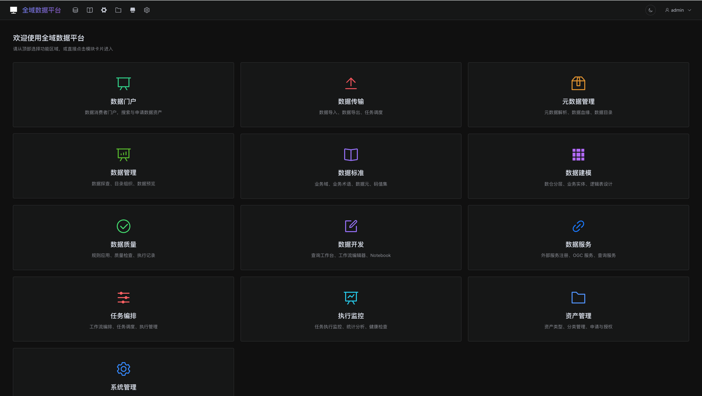
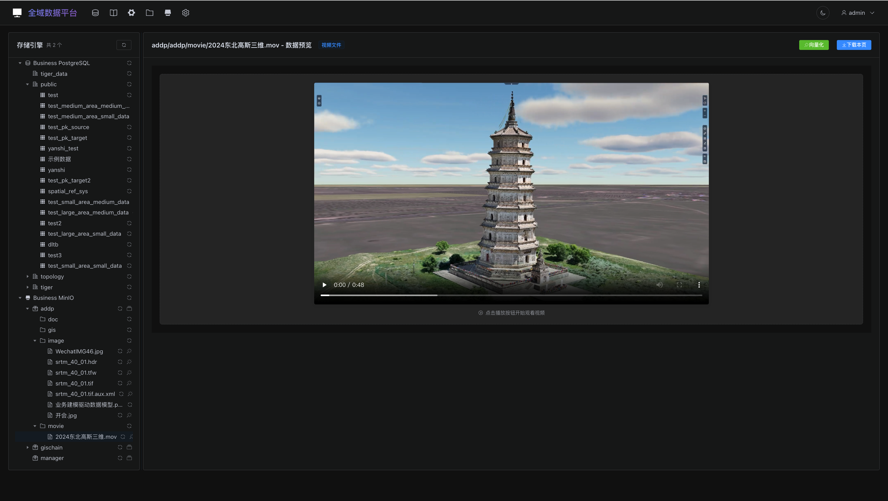
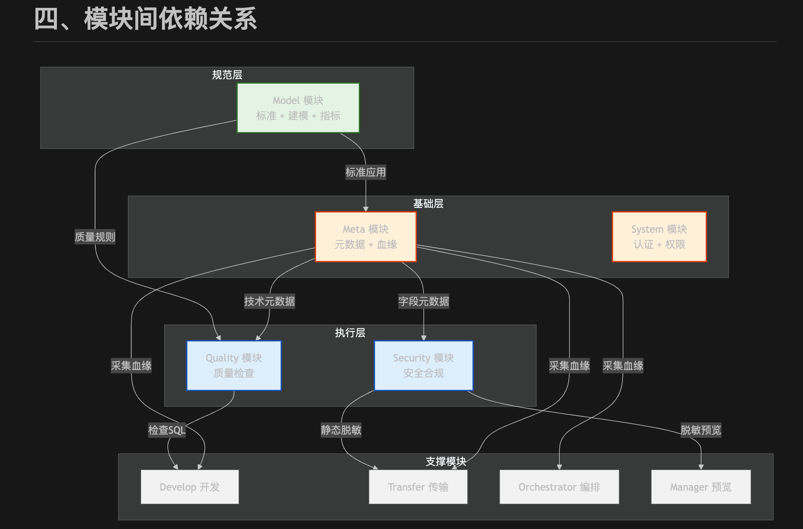
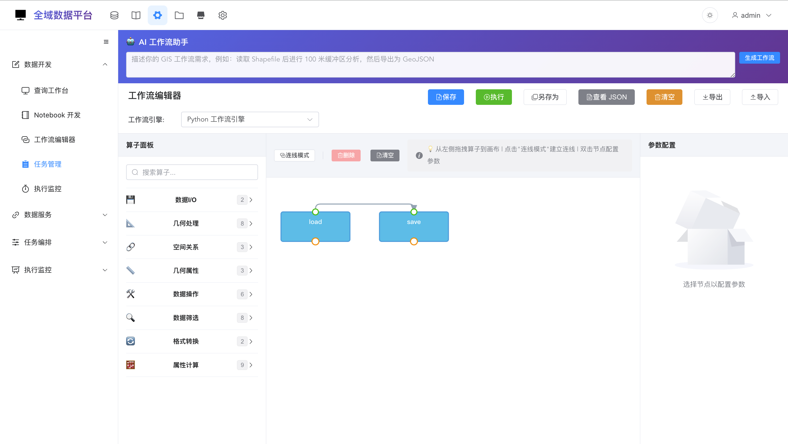
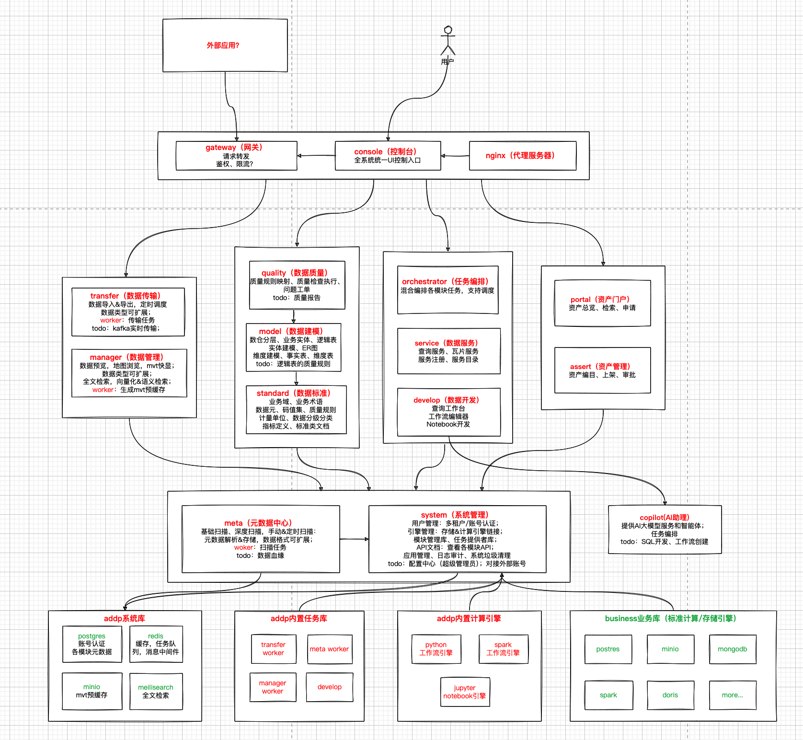

# 一行代码没写，用 AI 开发了一个大型系统

**副标题：从技术验证到全域数据平台——ADDP 开发全纪录**

---

## 缘起：一个老程序员的颈椎与焦虑

2025 年 10 月，我开了一个新项目。

本来只是想把自己之前做的一个空间数据中台里那些不如意的地方重新做一遍——技术验证，顺便体验一下 AI Coding 究竟能到什么程度。

我是那种"上了岁数的老程序员"。写代码这件事本身不是问题，问题是长时间对着屏幕、脖子低着——颈椎已经承受不住了。所以与其说是主动拥抱 AI，不如说是被身体逼着去试。

试了之后，一发不可收拾。

五个月后，一个我自己命名为 **ADDP（全域数据平台）** 的系统从零长了出来：**14 个微服务模块、116 个前端页面、11 种存储和计算引擎支持**，后端用 Go，前端用 Vue3，PostgreSQL + Redis + MinIO + Meilisearch 做底座，还有 GeoPython Workflow、Spark 分布式计算引擎和 Jupyter Notebook 集成。

整个过程，我一行代码没写。

---

## 惊艳：速度彻底颠覆预期

第一阶段的感受只有两个字：**太快了**。

过去做一个系统，光是搭脚手架、定目录结构、写第一个 CRUD、调通认证流程，就要消耗大量时间和精力。AI 把这些全部变成了秒级响应——你说需求，它给代码，你看效果，你提问题，它改代码。

更惊人的是，AI 不只是"写代码快"，它能同时处理前后端、数据库 Schema、配置文件，甚至帮你写文档。一个端到端的功能，以前可能需要一两天，现在一两个小时出雏形，半天完成。

但"惊艳"很快就结束了。

---

## 四次被"打击"——难点从未消失，只是换了形式

### 第一次：多租户权限设计

做系统权限，AI 很擅长，但前提是**你想清楚了**。

ADDP 需要三层账号：超级管理员（跨租户）、租户管理员（管本租户用户和数据）、普通用户（使用数据）。这个层级关系，以及不同角色在不同资源上的权限边界，AI 没有办法替你思考——它只会替你实现。

当我把这套逻辑想清楚，写下来，给 AI 看，十几分钟之内，多租户 RBAC 权限体系就搭好了。

**教训：AI 是实现者，不是设计者。模糊的需求只会产生模糊的代码。**

而且，每次开启新会话，如果没有足够的上下文输入，AI 对你在干什么是一片空白的。没有 CLAUDE.md（项目说明文档），没有历史代码作为参照，AI 只能随机发挥——偶尔惊喜，大概率坑你。新会话 = 新员工入职第一天，你不给 onboarding 材料，他能干什么？

### 第二次：元数据的数据结构

Meta 模块是整个系统的核心之一，负责扫描各种存储引擎里的数据并建立元数据索引。

问题出在数据层次上：PostgreSQL 里的数据是"库 → Schema → 表"三级结构，MinIO 里的数据是"Bucket → 前缀路径 → 文件"的扁平结构，文件系统又是另一套，MongoDB 还有自己的层次……每种引擎的层次语义完全不同，怎么统一表示？

AI 反复实现，反复出错，因为底层数据表结构没有想清楚。**最终的解法是抽象出两个概念：Node（数据节点，代表层次中的某一级）和 Item（数据项，代表可操作的最小单元）。** 有了这两个概念，所有引擎的层次差异都能在这套抽象下表达，AI 实现起来才一次通过。

这件事让我深刻意识到：**AI 最终发挥的水准，取决于人的水准。** 更准确地说，取决于你在 AI 编程这件事上能把自己的水准提升到什么程度——不是编码水平，而是架构设计、数据建模、概念抽象的能力。

### 第三次：算子编排与任务衔接

Develop 模块里有一个可视化的工作流编辑器，用户可以把数据处理算子拖拽组合成 DAG（有向无环图）。同时，Orchestrator 模块负责跨模块的任务编排调度。

这两者的关系让我卡了很久：算子工作流是"细粒度、单引擎内部的数据处理"，任务编排是"粗粒度、跨模块的流水线"，一个 Orchestrator 任务步骤可以调用 Develop 执行一个工作流——两者是不同层次的编排，不是同一回事，但又有调用关系。

这个关系靠 AI 自己去猜，永远猜不准。我沉下来想清楚，画了 Mermaid 图，写成文档，**之后这部分开发再没有出过大问题。**

### 第四次：数据治理模块群的整体关系

春节前，我面对的是两个模块群共五个模块：数据标准（Standard）、数据建模（Model）、数据质量（Quality），加上资产管理和资产门户。这几个模块之间的业务关系错综复杂，如果直接开干，极可能越写越乱。

这次我先停下来，用 **Mermaid** 把五个模块之间的概念关系、数据流向、依赖关系全部画清楚。Mermaid 是 Markdown 里的 UML，直接嵌在 md 文档里，AI 能读懂，人也能审阅。

图画好了，文档写好了，**春节六天，五个模块全部完成。**

---

## 方法论：AI Coding 的正确姿势

五次经历之后，我总结出来一套在大型系统里和 AI 协作的基本方法：

**第一，没有约束就没有质量。**

对于小项目，"想到哪里写哪里"（Vibe Coding，氛围编程）确实爽，AI 速度飞快，你很容易产生一种"无所不能"的幻觉。但系统稍微大一些，这种方式会让代码结构越来越乱，模块边界越来越模糊，最后人从"程序员"变成了"AI 善后工程师"——整天在修 AI 制造的混乱。

约束从哪里来？**文档。**

**第二，写好 MD 文档，是让 AI 听话的法宝。**

ADDP 整个项目的核心是一套完整的文档体系：`CLAUDE.md` 是平台级总说明，每个模块有自己的 `CLAUDE.md`，`docs/spec/` 下有 API 设计规范、开发原则、技术栈规约、端口分配……AI 每次开启新会话，这套文档就是它的"入职材料"，有了它，AI 才知道这个系统是什么、这个模块是什么、该遵循什么规范。

文档可以让 AI 来写，但**人必须来审**。AI 写文档的效率是人的十倍，但 AI 对业务语义的理解一定不如你——文档里哪里含糊、哪里矛盾、哪里遗漏，必须由人来发现和修正。

**第三，Mermaid 是法宝中的法宝。**

概念关系、数据流向、模块依赖、时序交互——这些用文字描述容易歧义，用 Mermaid 画出来，AI 理解准确，人一眼能看清楚。先画图，再写代码，这个顺序在中大型系统里几乎是必须的。

**第四，AI 的上限是你的上限。**

AI 把实现的门槛降到接近于零，但把设计的门槛反而提高了——因为现在，瓶颈就是你自己。你想清楚的，AI 能以惊人的速度实现；你没想清楚的，AI 只会把你的模糊放大成代码里的混乱。

在 AI 编程中最累的事情，是**快速把自己提升起来**，以及**把之前模糊的地方彻底想清楚**。这种脑力消耗，比写代码要大得多，也值钱得多。

---

## 系统成果：看看 ADDP 长成了什么样

五个月后，ADDP 的全貌大致如下：

**模块架构**（14 个微服务）：控制台（Console）、API 网关（Gateway）、系统管理（System）、数据管理（Manager）、元数据（Meta）、数据传输（Transfer）、任务编排（Orchestrator）、数据开发（Develop）、数据服务（Service）、执行监控（Monitor）、数据标准（Standard）、数据建模（Model）、数据质量（Quality）、AI 助手（Copilot）。

**技术栈**：后端 Go + Gin + GORM，前端 Vue3 + Vite，PostgreSQL 多 Schema 隔离，Redis 缓存与异步队列，MinIO 对象存储，Meilisearch 全文搜索，Python/Spark 计算引擎。

**功能亮点**：
- 支持 11 种存储/计算引擎（PostgreSQL、MySQL、Doris、ClickHouse、MongoDB、Spark、MinIO、S3 等）
- 元数据自动扫描与全文搜索
- 可视化工作流编辑器（DAG + 算子拖拽）
- OGC 标准地理服务发布（WFS、WMTS、OGC API Features）
- AI 辅助（自然语言转 SQL、自然语言生成工作流，支持多 LLM）
- 统一执行监控（跨模块任务状态追踪）
- 多租户隔离（数据库 Schema、对象存储 Bucket、缓存 Key 全部隔离）

---

## 费用与效率：一万块换一百万的成果

AI Coding 当然不是免费的。Claude Code 大概一天用一两百块，跑得凶的时候更多，一个月下来能到一两千。

五个月总花费，大概一万块左右。

如果这套系统交给人来做——14 个后端服务，116 个前端页面，完整的数据治理、建模、质量、服务、监控链路——以市场价估算，没有 **一百万** 是绝对做不出来的。

当然，这里面有很多取巧的地方：ADDP 还在快速开发阶段，不追求向后兼容，不做生产级的压测和优化，有大量的技术债务等着以后处理。但作为一个验证系统、原型系统，它完整、可用、逻辑自洽。

顺带一提：Claude Code 是工具，除了内置的 Claude 模型，也可以接入国产兼容的大模型，比如 GLM。费用可能低不少，效果估计也会差一些，可以根据任务类型灵活选择。

---

## 结语：程序员的价值，在哪里？

做完这五个月，我得到一个确定的结论：

**AI 把编码的价值降到接近于零，但把架构设计、概念抽象、数据建模的价值推到了新的高度。**

以前，一个有经验的程序员之所以值钱，一部分是因为能写代码、能写好代码。现在，这部分价值正在被 AI 快速侵蚀。但另一部分——**看清楚问题、想清楚结构、理顺复杂的业务关系**——AI 目前仍然做不到，这需要人来做。

对我这个老程序员来说，颈椎感谢 AI，大脑却比以前更忙了。

---

*本文由 AI（Claude Sonnet 4.6）根据作者提供的开发笔记整理撰写。*
