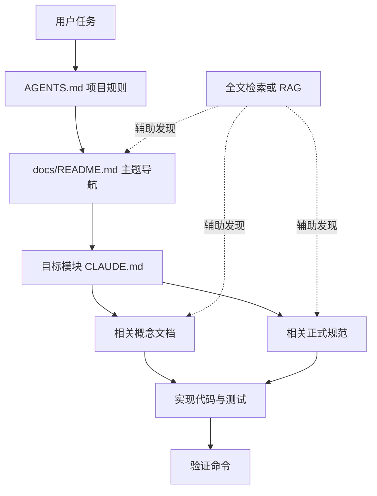
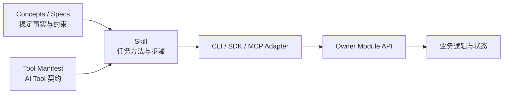

# 不是 RAG，也不是 LLM Wiki：ADDP 如何构建面向 AI 的文档体系

在使用 AI 开发大型系统时，一个很快就会遇到的问题是：如何让 AI 持续、准确地理解项目？

最直觉的答案通常有两个：

- 把所有文档放进 RAG，让模型搜索；
- 建一个 LLM Wiki，让模型自动整理、总结和回答。

这些能力都有价值，但它们没有触及最根本的问题：

> 当项目中存在概念文档、开发规范、模块说明、设计稿、实施记录和旧方案时，哪一份才是事实源？

如果这个问题没有解决，检索越强，AI 反而越容易同时找到多个相似但互相冲突的答案。

ADDP 当前采用的思路不是单纯建设一个文档搜索系统，而是建立一套面向人和 AI 的治理型 Docs-as-Code 体系。它可以概括为：

> 分层事实源 + 确定性导航 + 渐进式加载。

RAG 可以成为它的检索层，LLM Wiki 可以成为它的交互层，但二者都不替代权威文档本身。

## 一、先区分三个不同问题

文档治理、文档检索和文档交互经常被混在一起，实际上它们解决的是三个不同的问题。

| 能力 | 主要解决的问题 | 不能独立解决的问题 |
| --- | --- | --- |
| 文档治理 | 什么是事实源，谁负责维护，发生冲突时相信谁 | 如何快速找到相关内容 |
| RAG | 从大量内容中召回可能相关的片段 | 权威性、生命周期和冲突裁决 |
| LLM Wiki | 自动摘要、关联、问答和阅读体验 | 稳定契约、强约束和事实源治理 |

因此，正确的建设顺序应当是：

1. 先建立文档分类、事实源和冲突处理规则；
2. 再建立面向任务的确定性导航；
3. 最后用全文检索、RAG 或 LLM Wiki 改善发现和阅读体验。

如果顺序反过来，AI 可能很容易找到文档，却无法判断文档是否仍然有效。

## 二、ADDP 的分层事实源

ADDP 将不同性质的知识放在不同位置，而不是把所有 Markdown 当成同一种文档。

| 层级 | 回答的问题 | ADDP 中的主要位置 |
| --- | --- | --- |
| 概念层 | 平台中的对象是什么，彼此有什么关系 | `docs/concepts/` |
| 规范层 | 代码、接口和模块必须遵守什么规则 | `docs/spec/` |
| 模块层 | 某个模块负责什么，当前如何实现 | `<module>/CLAUDE.md`、`<module>/docs/` |
| 操作层 | 如何部署、启动、验证和排障 | `docs/guide/` |
| 演进层 | 尚未稳定或正在实施的方案是什么 | `docs/plan/`、`docs/next/` |
| 执行知识层 | AI 应如何完成一类可复用任务 | `skills/<name>/SKILL.md` |
| 导航层 | 面对具体任务，应该先读取哪些内容 | `AGENTS.md`、`docs/README.md` |

这种分类不是为了让目录整齐，而是为了建立权威顺序。

例如，在一个概念发生冲突时，应先回到术语表和概念文档；在 API 返回结构发生冲突时，应以 API 规范为准；模块文档负责解释局部实现，但不能重新定义平台级概念。

可以将它理解为以下关系：

```text
术语表与概念文档
  -> 平台正式规范
  -> 模块边界与实现文档
  -> 代码和测试

plan / next
  -> 描述设计和实施过程
  -> 稳定后收敛到 concepts / spec

Skill
  -> 引用正式概念和规范
  -> 不复制第二套平台事实
```

这里最重要的原则是：同一个稳定概念只能有一个事实源。其他文档可以解释、引用或提供上下文，但不能复制出多个稍有差异的版本。

## 三、不是让 AI 读完所有文档，而是先完成路由

大型仓库中的文档不可能全部放入模型上下文。即使上下文窗口足够大，全量加载也会带来噪声、注意力稀释和更高成本。

ADDP 更强调“先路由，再读取”。典型链路如下：



例如，任务涉及 API，就明确要求读取 API 设计规范和 Swagger 规范；涉及引擎体系，就读取引擎概念、插件接口和能力声明规范；进入具体模块后，再由模块的 `CLAUDE.md` 指向局部实现文档。

这不是纯语义相似度检索，而是一种由规则约束的检索，可以称为：

> Policy-guided Retrieval，规则引导的知识检索。

规则负责保证范围和权威性，搜索负责提高召回率。

## 四、为什么不能只依赖 RAG

RAG 非常适合回答“可能有哪些相关内容”，但大型软件项目还需要回答以下问题：

- 这是正式规范，还是尚未实施的设计稿？
- 这份文档描述当前主路径，还是已经删除的旧路径？
- 两个模块都提到了同一概念，哪个模块拥有它？
- 文档和代码不一致时，应该修代码还是先修规范？
- 搜索结果中的某个字段，是稳定契约还是示例数据？

向量相似度无法可靠回答这些问题。

假设仓库中同时存在以下内容：

- 一份正式接口规范；
- 一份半年前的改造方案；
- 一份实施过程记录；
- 一份仍然引用旧字段的模块说明。

它们在语义上高度相似，RAG 很可能全部召回。如果缺少文档类型、状态、权威级别和替代关系，模型只能根据文字内容自行猜测。

因此，RAG 在 ADDP 文档体系中的合理定位是：

1. 当确定性导航无法直接定位时，辅助发现候选文档；
2. 对跨模块问题进行模糊召回；
3. 在候选结果上叠加目录、状态、模块和事实源等级过滤；
4. 最终仍回到完整的权威文档，而不是只依据切片作出架构决定。

## 五、LLM Wiki 更适合作为交互层

LLM Wiki 擅长提供：

- 自动摘要；
- 文档关系展示；
- 自然语言问答；
- 从代码和文档生成阅读入口；
- 帮助新人快速建立项目全局认识。

这些能力很适合建立在 ADDP 文档体系之上，但 Wiki 页面不应成为第二套事实源。

原因是自动摘要很容易丢失软件规范中最重要的内容，例如：

- “必须”和“建议”的区别；
- “唯一主路径”和“可选方案”的区别；
- “当前已实现”和“未来计划”的区别；
- 删除旧路径和保留兼容路径的区别。

理想关系应当是：

```text
Git 中的 Markdown
  = 权威事实源

结构化文档索引
  = 文档类型、状态、模块、所有者和替代关系

全文检索 / RAG
  = 模糊发现和跨文档召回

LLM Wiki
  = 阅读、摘要、关联和对话入口

Skill
  = AI 完成任务的方法和步骤

Tool / API
  = AI 执行真实操作的正式能力
```

## 六、Docs 与 Skill 应当分开

普通文档主要描述稳定事实，Skill 则描述如何完成一类任务。

例如：

- API 规范说明响应格式、状态码和错误结构；
- `data-discovery` Skill 说明如何检索候选数据、如何处理多个结果、何时要求用户澄清；
- Tool Manifest 定义 `data.search` 的输入输出和权限；
- owner 模块 API 执行真正的数据查询。

这四者不能混为一体。



Skill 应采用渐进式加载：

1. 初始阶段只暴露名称、描述和位置；
2. 任务命中后读取完整 `SKILL.md`；
3. 执行到特定步骤时再读取对应 `references/`；
4. 大型结果只返回摘要和稳定引用，不直接塞入模型上下文。

这实际上是一种上下文工程：不是让模型拥有最多的信息，而是让它在正确的时间得到足够且权威的信息。

## 七、文档治理需要哪些元数据

仅靠目录约定可以完成第一阶段治理。随着文档数量增长，还应逐步补充机器可读的元数据，例如：

```yaml
---
title: ADDP API 设计规范
type: spec
status: active
owner: common
updated_at: 2026-07-16
authority: canonical
replaces: []
replaced_by: null
related_modules:
  - gateway
  - system
---
```

这些字段可以支持：

- 按状态过滤 RAG 结果；
- 降低设计稿相对于正式规范的排序权重；
- 检查一个概念是否存在多个事实源；
- 提醒长期未更新的文档所有者；
- 明确旧文档被哪份新文档替代；
- 自动生成主题索引和模块阅读路线。

元数据不是为了建设复杂的内容管理平台，而是让人和 AI 都能明确判断文档的身份。

## 八、适合大型 AI Coding 项目的落地顺序

如果要在其他项目中借鉴这套方法，可以从最小体系开始。

### 第一阶段：建立事实源

1. 建立术语表；
2. 区分概念、规范、模块实现、操作指南和规划文档；
3. 规定冲突时的权威顺序；
4. 要求一个稳定概念只能有一个正式定义。

### 第二阶段：建立确定性导航

1. 建立文档总入口；
2. 按任务场景列出必读文档；
3. 为每个模块建立局部入口；
4. 让入口文档只负责导航和边界，不复制规范全文。

### 第三阶段：建立渐进式 AI 上下文

1. 初始上下文只放项目级规则；
2. 命中模块后加载模块说明；
3. 命中具体主题后加载概念和规范；
4. 执行任务时按需加载 Skill 和 reference。

### 第四阶段：增加自动校验

1. 检查 Markdown 链接和失效引用；
2. 检查文档元数据；
3. 检查规范是否存在多个事实源；
4. 检查被替代文档是否仍被入口引用；
5. 对 API、Swagger、数据库结构等建立文档与实现的一致性校验。

### 第五阶段：接入 RAG 或 LLM Wiki

此时可以安全地增加语义检索和对话式阅读，但检索结果必须保留：

- 原始文档路径；
- 文档类型；
- 状态和权威级别；
- 所属模块；
- 更新时间；
- 被替代关系。

模型给出答案时应引用完整事实源，而不是把检索切片生成的摘要当成正式规范。

## 九、这套体系的本质

这套方法可以称为：

> AI-native Governed Docs-as-Code，面向 AI 的治理型代码化文档体系。

它并不追求让 LLM 记住整个项目，而是解决三个更实际的问题：

1. 面对一个任务，AI 知道应该去哪里找；
2. 找到多份文档时，AI 知道哪一份更权威；
3. 概念或规范发生变化时，项目只保留一条新的主路径。

RAG 解决“找得到”，LLM Wiki 解决“读起来方便”，而文档治理解决“相信什么”。

对于大型软件系统，第三个问题才是前两个问题能够可靠工作的前提。

## 相关文档

- [ADDP 文档总览](../README.md)
- [ADDP 开发原则](../spec/addp开发原则.md)
- [ADDP 术语表](../concepts/addp术语表.md)
- [ADDP 模块架构图](../concepts/addp模块架构图.md)
- [ADDP Skill 规范](../skills/addp-Skill规范.md)
- [ADDP 智能体能力开放体系专题](../next/ADDP智能体能力开放体系专题.md)
