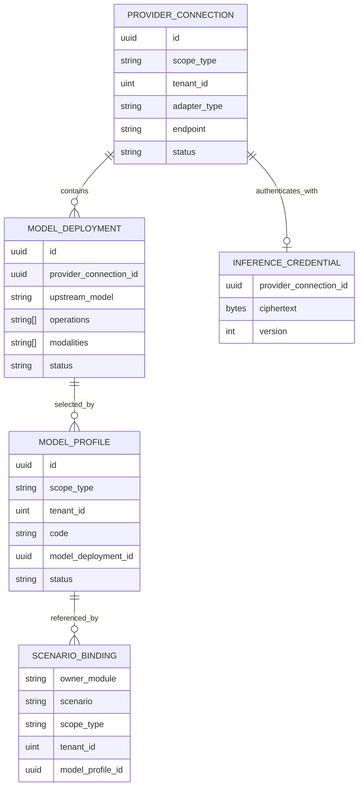

# ADDP AI 推理接口规范

本文定义 ADDP 统一 AI 推理控制面、数据面、资源范围和调用方边界。当前协议版本固定为：

```text
addp.inference/v1
```

## 一、目标与唯一技术路线

ADDP 的 Agent、Copilot、Manager 和后续业务模块只调用 Inference Runtime，不直接集成在线厂商 SDK、OpenAI-compatible endpoint 或内网模型私有协议。Inference Runtime 负责 Provider 协议适配、凭据解密、模型调用和统一错误；业务调用方负责场景语义、上下文组装和结果消费。

System 中只登记一个或少量 `engine_type=inference_runtime` 的 Engine Instance。Runtime Instance 按网络区域、安全域、GPU 集群、故障域或 SLA 拆分，不按厂商账号、上游 endpoint 或模型数量拆分。

第一版禁止：

- 把 Provider、Deployment、Profile 或 API Key 保存为 System 普通配置。
- 让 Agent、Copilot、Manager 读取厂商 API Key 或直连厂商接口。
- 同一 Model Profile 绑定多个 Deployment，或在服务端隐藏 fallback。
- 通过 `ENABLE_*_INTEGRATION` 开关决定是否走统一推理路径。
- 未配置时回退到环境变量、代码默认厂商或另一个模型。

## 二、资源模型与 owner



| 资源 | owner | 规则 |
| --- | --- | --- |
| Inference Runtime Engine Instance | System | 只保存 Runtime 端点、生命周期和 `compute.inference` 能力。 |
| Provider Connection | Inference | 一个确定在线厂商账号端点或内网推理端点；`adapter_type` 选择协议适配器。 |
| Model Deployment | Inference | Provider 下一个确定模型或部署；继承 Provider scope。 |
| Model Profile | Inference | 稳定逻辑能力 code；第一版明确绑定一个 Deployment。 |
| Scenario Binding | 调用方 owner | Agent、Copilot、Manager 分别保存自己的业务场景绑定。 |
| Provider credential | Inference | 专用加密字段，不进入普通配置、响应、日志或审计详情。 |

`adapter_type` 第一阶段允许 `openai_compatible` 和 `dashscope_multimodal`。DashScope compatible mode、OpenAI、vLLM、Ollama 的 OpenAI-compatible endpoint 通过前者接入；DashScope 多模态向量接口因使用 `input.contents` 而通过后者接入。适配器由 Provider 创建时显式选择，不根据 endpoint 或模型名称猜测协议；只有协议语义确实不同且无法由标准字段表达时才新增适配器类型。

### 2.1 Provider Template 与快速接入

Provider Template 是 Inference owner 维护的只读接入目录，用于降低 Provider、Deployment 和 Profile 的首次配置成本。模板可以预置：

- 在线厂商或本地推理运行时的稳定模板 code 和分类。
- `adapter_type`、默认 Endpoint、Endpoint 是否允许修改。
- 凭据是必需还是可选，以及模型发现方式。
- 可验证的建议模型、操作能力、输入模态和向量维度。
- 对应厂商或运行时的正式文档地址。

Provider Template 不是新的持久化运行时资源，不保存 API Key，不参与 Tenant 可见性判断，也不能作为推理请求的引用目标。快速接入必须把用户确认后的结果写入唯一正式资源路径：

```text
Provider Template
  -> Provider Connection
  -> Model Deployment
  -> Model Profile
```

默认管理界面可以把上述创建过程组织为一个向导，并把三类正式资源放入高级设置，但不得在数据库中建立一套与 Provider、Deployment、Profile 并行的“简化配置”。模板目录由 Inference API 提供，Console 只负责呈现；System 仍只登记配置入口、权限和审计。

OpenAI-compatible 模型发现统一由 Inference 服务端使用 Provider Connection 的 Endpoint 和加密凭据调用标准 `/models` 接口。浏览器不得直接访问厂商 Endpoint 或接触已保存凭据。发现结果只表示上游当前列出的模型标识，不能仅根据模型名称推断 Chat、Embedding、Rerank、Tool Calling、输入模态或向量维度；这些能力必须来自模板声明、管理员确认或实际能力探测。

本地运行时模板中的主机地址必须从 Inference Runtime 所在网络环境可达。浏览器所在机器的 `localhost` 不自动等于 Inference Runtime 的 `localhost`，快速接入必须允许管理员修正 Endpoint 并由服务端执行检测。

## 三、范围和授权

Provider Connection 的 `scope_type` 固定为 `platform` 或 `tenant`：

- Platform Provider 可以授权所有 Tenant，或通过 allowlist 只授权指定 Tenant。
- Tenant Provider 必须绑定 AuthContext 当前 `tenant_id`，只能由该 Tenant 管理和消费。
- Tenant credential 不得在 Platform Realm、其他 Tenant 或 System API 中读取。
- Tenant 控制面的 Provider、Deployment、Profile 列表与详情只投影本 Tenant 自有资源和已授权给本 Tenant 的 Platform 资源；未授权资源统一按不可见处理。
- Model Deployment 继承 Provider scope，不单独改变范围。
- Platform Model Profile 只能绑定 Platform Deployment；Tenant Model Profile 可以绑定本 Tenant Deployment，或当前 Tenant 已获授权的 Platform Deployment。

Scenario Binding 的有效解析顺序固定为：

```text
当前 Tenant 的显式场景绑定 > 同一场景的平台默认绑定 > inference_scenario_not_configured
```

“Tenant 存在任意 Provider 或模型”不会触发自动优先。调用方必须按场景显式覆盖；解析结果必须固化到任务或 execution 快照，后续绑定变化不得改写历史执行事实。

平台资源管理使用 `inference.provider.*`、`inference.deployment.*`、`inference.profile.*` Permission；Tenant 资源使用相同稳定 Permission，并由 AuthContext scope 限定。数据面只接受受信调用模块的 Service Access Token，并要求显式 Tenant Context；终端用户 Token 不直接调用内部推理数据面。

## 四、凭据

Provider credential 使用部署级 `ENCRYPTION_KEY` 进行认证加密。数据库只保存 ciphertext、nonce、算法版本、credential version、更新时间和操作者 Principal ID。

控制面规则：

- `PUT /api/v1/inference/provider-connections/{id}/credential` 是唯一设置或轮换入口。
- Provider 普通创建、更新 API 不接受 `api_key`、`credential` 或等价字段。
- Provider 响应只包含 `credential: {"configured": true|false, "version": n}`。
- 不返回明文、掩码、前后缀、hash、ciphertext 或 Secret Manager 内部引用。
- 删除 credential 使用独立 `DELETE` 操作，并递增 version。
- 审计只记录 Provider ID、旧/新 version、操作者和结果，不记录凭据值。
- 解密只发生在发起一次上游请求前的 Inference 数据面内存中，不缓存到模块配置或调用方 execution。

`ENCRYPTION_KEY` 是 Inference 启动必需的部署 Secret。缺失或格式无效时服务启动失败，不生成临时 Key，也不回退到明文。

## 五、控制面 API

公共前缀固定为 `/api/v1/inference`。列表统一使用 ADDP 标准分页响应；创建返回 `201`，更新返回 `200`，删除成功返回 `204`。

| 方法与路径 | 作用 |
| --- | --- |
| `GET/POST /provider-connections` | 列表或创建当前 Realm 可管理的 Provider。 |
| `GET/PUT/DELETE /provider-connections/{id}` | 读取、更新或删除 Provider 普通字段。 |
| `PUT/DELETE /provider-connections/{id}/credential` | 设置、轮换或删除加密凭据。 |
| `GET /provider-templates` | 查询 Inference 内置的只读模型服务接入模板。 |
| `POST /provider-connections/{id}/discover-models` | 使用该 Provider 的服务端 Endpoint 和加密凭据发现 OpenAI-compatible 模型。 |
| `GET/POST /model-deployments` | 列表或创建 Deployment。 |
| `GET/PUT/DELETE /model-deployments/{id}` | 读取、更新或删除 Deployment。 |
| `POST /model-deployments/{id}/probe` | 显式执行无副作用可达性和能力探测。 |
| `GET/POST /model-profiles` | 列表或创建 Profile。 |
| `GET/PUT /model-profiles/{id}` | 读取或更新 Profile；已创建 Profile 只允许禁用，不物理删除。 |

Provider 或 Deployment 存在 Inference 本地的下游引用时，删除必须返回 `409 resource_in_use`。Inference 不读取各业务模块的 Scenario Binding，因此第一版 Model Profile 只允许禁用，不提供删除 API；引用已禁用 Profile 的调用明确返回 `model_profile_unavailable`。后续若需要物理回收，必须先定义跨 owner cleanup 协议，不能增加反向私有表查询。

## 六、数据面 API

内部前缀固定为 `/api/v1/inference/internal`。所有请求必须包含 `schema_version="addp.inference/v1"`、`tenant_id`、`model_profile_id`，并由 Inference 验证调用方 audience、Profile scope、Provider allowlist、Deployment 状态和 operation 能力。

调用方在执行前需要判断本地结果是否仍匹配当前 Profile 时，统一调用 `POST /profiles/resolve`。请求额外声明 `operation` 和 `modality`，响应只返回 `profile_version`、`deployment_id` 和 `dimension`；不得返回 Provider、endpoint、adapter、upstream model 或 credential。该解析接口与实际推理共用同一可见性和能力校验，不形成控制面旁路。

| 方法与路径 | 请求核心字段 | 响应核心字段 |
| --- | --- | --- |
| `POST /chat` | `messages`、可选 `tools/tool_choice`、`response_schema`、`temperature/max_output_tokens` | `message`（含标准化 `tool_calls`）、`usage`、`deployment_id`、`profile_version` |
| `POST /embeddings` | `inputs[]`，每项为 text 或受控 image content | `vectors[]`、`dimension`、`usage`、`deployment_id`、`profile_version` |
| `POST /rerank` | `query`、`documents[]`、`top_n` | `results[]`、`usage`、`deployment_id`、`profile_version` |
| `POST /profiles/resolve` | `operation`、`modality` | `model_profile_id`、`profile_version`、`deployment_id`、`dimension` |

第一版 chat 使用非流式 JSON 主路径；流式能力只有在 `compute.inference.streaming=true` 且正式定义事件协议后才能开放，不能透传厂商 SSE。图片输入使用受控二进制或 owner 签发的短期内容访问材料，不接受可由 Inference 任意访问的内网 URL。

Chat Tool Calling 使用厂商无关的结构：`tools[]` 只包含稳定 `name/description/parameters` JSON Schema，`tool_choice` 只允许 `auto/none/required`；assistant 消息返回 `tool_calls[]`，每项只包含 `id/name/arguments`，Tool 结果消息使用 `role=tool + tool_call_id + content`。Inference 负责与上游协议互转，但不执行 Tool、不签发委托令牌、不理解 AgentRun，也不保存 Tool 参数或结果。

结构化输出通过 `response_schema={name,description,schema,strict}` 声明。调用方必须使用 Tool Calling 或 `response_schema` 中的一种，不得同时提交两条结构化路线；不支持所需语义的 Deployment 必须明确返回 `inference_operation_unsupported`，不能退化为纯文本后猜测 JSON。所有 Schema 必须是 JSON object，工具名和 Schema 名使用稳定 ASCII 标识符。

统一错误至少包含：

| HTTP | `error_code` | 含义 |
| --- | --- | --- |
| 400 | `inference_request_invalid` | 请求结构或参数无效。 |
| 403 | `inference_scope_forbidden` | Tenant、Provider allowlist 或 audience 不允许。 |
| 404 | `model_profile_not_found` | Profile 不存在或对当前 Tenant 不可见。 |
| 409 | `model_profile_unavailable` | Profile、Deployment 或 Provider 被禁用。 |
| 422 | `inference_operation_unsupported` | Deployment 不支持请求 operation 或 modality。 |
| 502 | `inference_upstream_failed` | 上游返回非分类失败。 |
| 503 | `inference_upstream_unavailable` | 上游暂时不可用。 |
| 504 | `inference_timeout` | 端到端 deadline 到期。 |

不得把 scope、credential、协议或模型未配置错误转换为空结果。只有明确可重试的 `503/504` 可以由调用方按执行策略重试；第一版不自动切换 Deployment。

## 七、调用方边界

- Copilot 保存 `nl2dag`、`nl2sql` 等领域 Scenario Binding，负责 prompt、领域上下文、结构化输出校验和修复 Pipeline。
- Agent 保存 `general-chat`、`reasoning` 等 Scenario Binding，负责多轮上下文、规划、Skill 和 Tool 调用。Agent 可以把 Copilot 领域能力作为高级 Tool，但普通推理不依赖 Copilot。
- Manager 保存 `semantic_search_embedding` Scenario Binding、最大文件大小、并发、检索距离和向量维度迁移约束；向量请求统一调用 Inference。
- 调用方数据库只保存 Profile/Deployment ID、解析版本和业务快照，不保存 endpoint、adapter type 或 credential。
- Inference 不理解 NL2DAG、Agent Tool 或 Manager data item，不保存业务 prompt 模板或业务 Pipeline。

## 八、配置管理入口

Inference 通过 `addp.configuration-management/v1` 向 System 发布配置管理入口。Console 加载 Inference 自己的管理页面；System 不接收 Provider 字段定义或配置值。

Provider、Deployment 和 Profile 是强类型资源，使用独立 API、表、Permission 和生命周期约束，不作为通用键值配置。只有推理模块自身的限流、超时上限等普通运行策略才可以进入 Inference owner 的普通配置表。

## 九、验证要求

实现或修改本规范必须至少验证：

1. Provider scope 与 Tenant allowlist 的正反向授权。
2. credential 创建、轮换、删除只暴露 `configured/version`，数据库不存在明文。
3. Profile 与 Deployment operation/modalities 双向校验。
4. 三种场景绑定解析结果：Tenant 显式、平台默认、未配置错误。
5. 上游错误到 ADDP 稳定错误的映射，且不存在隐藏 fallback。
6. Agent、Copilot、Manager 代码和根 `.env.example` 中不存在厂商 API Key 或直连模型 endpoint 路径。
