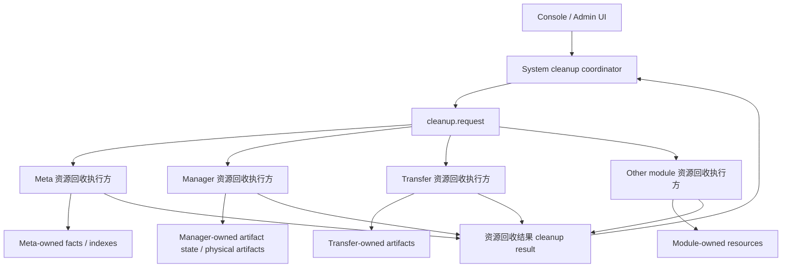

# ADDP Cleanup（资源回收）体系规范

> 状态：平台级规范。本文定义 ADDP 系统级资源回收体系的概念、职责边界、协议约束和演进顺序。历史背景和当前迁移收口见本文第十三节和第十四节。

## 一、定位

ADDP cleanup（用户侧称“资源回收”）是系统级资源回收与生命周期治理体系，不是单一模块的失效数据删除功能。

cleanup 的价值在于补齐 ADDP 从“发现、加工、消费”到“失效、回收、审计”的生命周期闭环：

- 保持事实和产物一致：engine、tenant、item 或源 facts 变化后，Meta facts、Manager 派生产物、Transfer 残留和运行时缓存不能长期漂移。
- 防止跨模块耦合：cleanup 责任跟随 owner module，避免 System 或 Meta 变成理解所有模块私有表、bucket 和 key 的硬编码中心。
- 控制资源成本：及时识别和回收对象存储、PG 派生对象、向量行、搜索索引、Redis key、临时文件等持续占用的资源。
- 提升用户体验正确性：避免用户继续看到已失效的快显、旧瓦片、旧 embedding、已删除 engine 下的 metadata 或不可执行任务。
- 支撑运维可观测：cleanup 本身可能失败、超时或部分完成，必须能被 Monitor 观察，而不是只留在模块日志里。
- 支撑安全审计和合规追溯：cleanup 必须能回答谁发起、为什么发起、基于哪次 scan、影响哪些模块、清了什么、跳过什么、失败什么。

cleanup 覆盖以下对象：

| 类型 | 示例 | 说明 |
| --- | --- | --- |
| 源事实 | `meta.meta_node`、`meta.meta_item`、Meta search index | 由事实 owner 模块清理。 |
| 派生产物状态 | `manager.vector_tile_cache`、`manager.embeddings`、`manager.vector_materialized_view` | 描述当前产物是否可用、由什么配置生成、在哪里。 |
| 物理产物 | MinIO objects、PG materialized view / index、pgvector 行、Redis key | 只能由产物 owner 模块按登记状态清理。 |
| 任务定义残留 | 强绑定已删除 engine / item / tenant 的任务定义 | 是否删除、禁用或标记缺源由 owner 模块定义并在 cleanup result（资源回收结果）中报告。 |
| 运行时缓存 | 内存缓存、Redis 缓存、临时文件 | 由创建缓存的模块清理。 |

Model LogicalTable 的正式物化目标不属于通用 cleanup 自动发现范围。单表退出使用时必须走 Model 的物化目标退役命令：精确确认当前设计目标、验证 Model ownership marker、拒绝活跃批次和 MaterializationGroup 成员后执行非级联删除。该命令不接受任意 SQL、不注册 TaskProvider，也不由租户或 Engine cleanup 事件替代。

cleanup 从监控视角具有 execution 特征，必须纳入 Monitor；从编排视角属于系统运维流程，不是用户数据处理任务，不纳入 TaskProvider，也不进入 Orchestrator 编排。

## 二、核心术语

| 术语 | 定义 |
| --- | --- |
| cleanup coordinator | 资源回收协调方。负责发起请求、记录任务元信息、发布事件、汇总结果和展示审计。当前唯一 coordinator 是 System。 |
| cleanup executor | 资源回收执行方。负责评估和回收本模块拥有的资源，并写入模块结果。Meta、Manager、Transfer 等模块均可成为 executor。 |
| owner module | 资源、状态或产物的拥有模块。cleanup 责任跟随 owner module，不跟随触发事件来源。 |
| cleanup request | 资源回收协调方发布的中性资源回收请求。只携带任务、租户、范围、动作和中性上下文，不携带模块私有表结构或存储路径。 |
| cleanup result | 资源回收执行方写回的模块级资源回收结果。包含统一状态字段和模块私有统计明细。 |
| logical cleanup | 逻辑清理。把事实、产物状态或任务定义从活跃路径移除，或标记为 `deleted`、`missing_source`、`outdated`、`disabled` 等。 |
| physical cleanup | 物理清理。删除实际存储资源，例如对象存储 key、PG 派生对象、向量行、缓存 key、临时文件。 |
| artifact state | 派生产物当前状态对象，例如瓦片缓存结果、embedding result、矢量物化视图结果。不是执行记录。 |
| physical artifact | 可删除的物理资源，例如对象存储 key、PG 派生对象、向量行、缓存 key。 |
| lifecycle event | 中性的生命周期事件，例如 engine deleted、tenant deleted、item deleted。各模块独立消费并处理 owner 范围内资源。 |

## 三、职责边界

### 1. System

System 是 cleanup coordinator，负责：

- 提供 Console / Admin UI 入口。
- 校验操作者权限和租户上下文。
- 创建资源回收 scan / execute 请求。
- 发布 `cleanup.request` 资源回收事件。
- 保存任务元信息、等待模块结果、计算总体状态。
- 展示各模块资源回收结果和审计摘要。
- 为资源回收 scan / execute 写入系统运维 execution，并进入 Monitor。
- 为资源回收创建、确认、完成和失败写入审计日志。

System 不负责：

- 判断 Meta、Manager、Transfer 等模块的待回收规则。
- 读取或写入业务模块私有表。
- 删除 MinIO 对象、Meilisearch 文档、PG 派生对象、Redis key 或模块缓存。
- 知道 MVT、embedding、preview cache 等产物的内部路径、表结构或失效策略。

### 2. common

`common` 只承载跨模块协议模型和事件常量，负责：

- 定义 cleanup request / result（资源回收请求 / 结果）的通用字段。
- 定义模块名、动作类型、结果状态等公共枚举。
- 提供可复用的协议解析或序列化 helper。

`common` 不得承载：

- 具体模块的表结构。
- bucket、prefix、Redis key、PG object name 等物理路径规则。
- MVT、embedding、preview cache 等模块私有 artifact 类型清单。
- 模块私有的清理决策逻辑。

### 3. Meta

Meta 资源回收执行方只治理 Meta-owned 资源：

- `meta.meta_node`。
- `meta.meta_item`。
- Meta search index。
- Meta 自己的扫描任务定义、扫描锁或执行残留。
- System 中不存在、已禁用，或 active 但不再声明 `storage` 能力的 Engine Instance，均不再是合法的 Meta 数据源；其历史 Meta 快照属于无效源事实，由 Meta cleanup 回收。

Meta 不得：

- 读取 Manager 私有表，例如 `manager.preview_state`、`manager.vector_tile_cache`、`manager.embeddings`。
- 推导 Manager 的 MinIO bucket、prefix 或对象路径。
- 删除 Manager preview state、MVT tiles、tile cache、embedding、preview cache。
- 清理 System audit logs 或其他 System-owned 产物。

### 4. Manager

Manager 资源回收执行方只治理 Manager-owned 派生产物和缓存：

- `manager.preview_state`。
- `manager.vector_materialized_view` 以及 Manager 创建并登记的 3857 优化目标。
- `manager.vector_tile_cache`、`manager.vector_tile_cache_tasks`、`storage_ref` 指向的瓦片对象和 manifest。
- Manager runtime tile cache。
- `manager.embeddings`、`manager.embedding_tasks` 以及向量化结果。
- Manager preview cache、缩略图、抽取缓存等后续 Manager-owned 产物。

Manager 不得：

- 删除源业务表、源表原有索引或源数据。
- 删除 Meta facts 或 Meta search index。
- 删除 System engine 配置。
- 删除自动识别的外部 3857 物化视图、外部表或外部索引。
- 通过 Meta attributes 或硬编码 MinIO prefix 反推自身产物位置。

Manager 删除瓦片对象时必须从 `manager.vector_tile_cache.storage_ref` 解析单个 PMTiles 对象位置，不得硬编码存储路径。

### 5. Transfer 和其他模块

Transfer、Develop、Service、Asset、Portal 等模块按同一原则处理：

- 只清理本模块创建、登记并拥有生命周期的资源。
- 可以消费 System 或 owner 模块发布的生命周期事件。
- 不得让其他模块代替自己解释私有表、任务定义或物理路径。

Transfer 已实现的资源回收执行方当前治理 Transfer-owned 任务定义和受管运行资源：

- `engine.deleted` 时，扫描 source / target endpoint locator 引用该 engine 的 `transfer.transfer_tasks`。
- engine 生命周期 cleanup 无论使用何种 cleanup mode，都只禁用命中的用户任务定义、清空下一次调度并恢复 idle 状态；任务定义必须保留供用户后续重绑定或显式删除。
- tenant 生命周期 `logical_cleanup` 禁用任务定义；tenant 生命周期 `physical_cleanup` 才允许删除 Transfer 任务定义本身。
- 没有明确 lifecycle context 的普通 scan 不应把全部 Transfer 任务定义视作待回收对象。
- Transfer 不拥有目标引擎中的表、文件或对象生命周期；这些资源只有在被其他 owner 模块登记为 artifact state 时，才由对应 owner executor 清理。

PostgreSQL CDC v1 capture control plane 已实现，Transfer cleanup executor 必须治理由 capture supervisor 明确登记的任务级捕获资源：

- ADDP-created Kafka Connect connector、replication slot、publication、Infra Kafka CDC topic 和 consumer group 归 Transfer owner；按 `task_id + capture_generation` 精确定位，不按 topic prefix 或数据库名称猜测。
- CDC stop 先执行同一套幂等 task-level cleanup；System cleanup 负责补偿残留，不建立第二套删除实现。
- Kafka Connect config/offset/status 等共享内部 topic、Kafka broker 数据目录和 ACL 基础配置归 Infra 部署 owner，不得由单个 Transfer task cleanup 删除。
- cleanup 不删除目标业务表、目标业务行、目标 `addp_transfer.apply_positions`、`common.task_executions` 或 System 审计日志。
- slot/publication 只允许删除资源登记中标记为 ADDP-created 且 identity 完全匹配的对象，不得按同名规则删除用户已有资源。

Service 第一阶段资源回收执行方只治理 Service-owned 服务发布定义和动态图层状态：

- `engine.deleted` 时，扫描直接绑定该 engine 的 `service.query_services`、`service.graph_query_services`，以及 `service.tile_service_layers.layer_config.source.engine_id` 指向该 engine 的动态图层。
- `tenant.deleted` 时，扫描该租户下 Service-owned query service、graph query service、tile service 和 tile layer。
- `logical_cleanup` 将命中的服务发布定义置为 `inactive` 并记录 `missing_source` 原因，动态图层置为 disabled。
- engine 生命周期 cleanup 无论使用何种 cleanup mode，都只将命中的服务发布定义置为 `inactive` 并记录 `missing_source`，动态图层置为 disabled；定义必须保留供用户后续重绑定或显式删除。
- tenant 生命周期 `physical_cleanup` 才允许删除 Service-owned 服务发布定义和动态图层状态记录。
- 没有明确 lifecycle context 的普通 scan 不应把全部 Service 发布定义视作待回收对象。
- Service cleanup 不删除外部 registered services，不删除外部服务端点，不推断或删除 MinIO 静态瓦片、缓存对象或业务引擎中的源数据。

Quality 第一阶段资源回收执行方只治理 Quality-owned 质量配置和问题状态：

- `engine.deleted` 时，扫描绑定该 engine 的 `quality.rule_applications`、`quality.check_tasks` 和 `quality.issues`。
- `tenant.deleted` 时，扫描该租户下 Quality-owned 规则应用、检查任务和问题工单。
- `logical_cleanup` 禁用规则应用；检查任务定义保留，但不再具有调度开关，目标 Engine 生命周期校验会使其退出可执行路径；命中的 open 问题工单置为 ignored。
- engine 生命周期 cleanup 无论使用何种 cleanup mode，都只禁用规则应用，保留检查任务定义供用户后续重绑定或显式删除，并将命中的 open 问题工单置为 ignored。Quality 不通过写入伪调度状态来阻止检查任务执行。
- Quality scan 和 execute 都必须以 `common.task_executions` 的 `pending|running` 记录判断活动执行，不得使用 CheckTask 最近执行摘要代替运行事实。同一次 Quality logical cleanup 必须在一个数据库事务中锁定命中的 CheckTask、确认不存在活动执行，再原子禁用规则应用并忽略 open 问题工单；任一对象更新失败或并发状态变化时全部回滚，不得留下部分清理状态。
- tenant 生命周期 `physical_cleanup` 才允许删除 Quality-owned 规则应用、检查任务和问题工单状态记录。
- Quality physical cleanup 删除问题、检查任务和规则应用必须使用单一数据库事务；任一删除失败或运行状态发生变化时全部回滚，不得留下部分删除状态。
- 没有明确 lifecycle context 的普通 scan 不应把全部 Quality 配置和问题工单视作待回收对象。
- Quality cleanup 不删除源业务表、源数据、Standard 数据元或规则定义，也不删除 `common.task_executions` 历史执行记录。

Develop 资源回收执行方评估 engine 影响，并只在租户生命周期回收中治理 Develop-owned 开发任务定义：

- `engine.deleting` 时扫描 `develop.dev_tasks` 中对目标 Engine 的运行时绑定和资源引用，统一报告为 `rebindable` 影响；不归档、不禁用、不删除任务定义。
- 算子工作流中的存储 Engine 引用以标准 ResourceLocator 为唯一事实。Engine 删除后 Develop 保留旧 Locator；用户可通过 Develop 的存储 Engine 绑定接口显式选择新 Engine，一次原子改写同一旧 Engine 的全部 Locator。改写保留 path/type，清除属于旧 Meta 快照的 `node_id/item_id`。
- System 不按 Engine 名称、连接信息或指纹自动改写 Develop 私有任务。目标 Engine 的租户、生命周期和存储能力由 Develop 在重绑定时校验；Locator 类型兼容性以目标 Engine 的 `storage.catalog_model` 为事实源，不得只按 `engine_family` 粗分类猜测。
- `tenant.deleted` 时，扫描该租户下 Develop-owned 开发任务定义。
- `logical_cleanup` 将租户删除范围内的开发任务置为 `archived`、关闭调度、清空下一次调度。
- `physical_cleanup` 仅在租户删除范围内删除 Develop-owned 开发任务定义本身；不删除 `common.task_executions` 历史执行记录。
- 没有明确 `tenant.deleted` lifecycle context 的普通 scan 不应把全部 Develop 任务定义视作待回收对象。
- 用户任务定义、Notebook 文件、Jupyter 虚拟环境、工作流输出、中间文件或源业务数据，常规删除必须由用户显式发起，不得因 engine 生命周期自动清理。

Graph 第一阶段资源回收执行方只治理 Graph-owned 图谱建模和构建状态：

- `engine.deleted` 时，扫描绑定该 engine 的 `graph.knowledge_graphs`，以及这些 graph 下的 `graph.build_tasks`、`graph.build_materials`、`graph.review_items`。
- `tenant.deleted` 时，扫描该租户下 Graph-owned 本体、实体类型、关系类型、本体版本、知识图谱实例、构建任务、构建材料和审核项。
- `logical_cleanup` 将命中的本体和知识图谱实例置为 `archived`，将未完成的构建任务置为 `cancelled`；实体类型、关系类型、本体版本、构建材料和审核项不单独改写状态，只随本体、任务和图谱离开活跃路径。
- engine 生命周期 cleanup 无论使用何种 cleanup mode，都只归档知识图谱实例并取消未完成的构建任务；图谱、本体、构建材料和审核状态必须保留供用户后续重绑定或显式删除。
- tenant 生命周期 `physical_cleanup` 才允许删除 Graph-owned PostgreSQL 状态记录，删除顺序必须先子状态后父状态。
- 没有明确 lifecycle context 的普通 scan 不应把全部 Graph 本体、图谱或构建状态视作待回收对象。
- Graph cleanup 第一阶段不删除 Neo4j database 中的真实图数据，不删除 MinIO 中的构建材料文件，不删除 `common.task_executions` 历史执行记录；这些物理产物只有在后续被明确登记为 Graph-owned artifact state 后，才进入对应 owner executor。

Asset 第一阶段资源回收执行方只治理 Asset-owned 资产目录、资产状态和授权状态：

- `tenant.deleted` 时，扫描该租户下 Asset-owned 类型定义、类型字段、目录、资产、资产组件、资产扩展字段、申请、授权和评价。
- `logical_cleanup` 将命中的资产下架并撤销仍然有效的授权；CatalogEntry 来源状态由 Catalog 独立治理。
- `physical_cleanup` 删除 Asset-owned PostgreSQL 状态记录，删除顺序必须先消费状态和子状态，再删除资产、目录和类型定义。
- 没有明确 `tenant.deleted` lifecycle context 的普通 scan 不应把全部 Asset 状态视作待回收对象。
- `engine.deleted` 第一阶段不扫描 Asset 状态；Catalog 根据来源变化将对应 CatalogEntry 标记为不可选，Asset 在下一次编辑或发布时通过精确解析拒绝失效组件。
- Asset cleanup 第一阶段不删除 Meta / Service / Standard / Develop 的源对象，不删除已发布服务端点，不删除 Meilisearch 索引文档；搜索索引删除只有在后续被明确登记为 Asset-owned artifact state 后，才进入对应 owner executor。

Model 第一阶段资源回收执行方只治理 Model-owned 建模状态：

- `tenant.deleted` 时，扫描该租户下 Model-owned 数仓分层、实体、实体属性、实体关系、逻辑表、逻辑字段、表关系、维度层级和指标实现。
- `logical_cleanup` 将命中的实体和逻辑表降为 `draft`，使其离开已审批 / 已物化语义；字段、关系、维度层级、指标实现和分层不单独改写状态。
- `physical_cleanup` 删除 Model-owned PostgreSQL 状态记录，删除顺序必须先指标实现、维度层级、关系和字段，再删除逻辑表、实体和分层。
- 没有明确 `tenant.deleted` lifecycle context 的普通 scan 不应把全部 Model 状态视作待回收对象。
- `engine.deleted` 第一阶段不扫描 Model 状态；Model 不解析 `materialization` 中的物理目标或引擎私有引用。
- Model cleanup 不删除 Standard 数据元、指标定义或业务域，不删除已物化的外部物理表；这些物理产物只有在后续被明确登记为 Model-owned artifact state 后，才进入对应 owner executor。

Standard 第一阶段资源回收执行方只治理 Standard-owned 标准治理状态和标准文档文件：

- `tenant.deleted` 时，扫描该租户下 Standard-owned 业务域、标准集、术语、数据元、码值集、单位、指标定义、标准文档及其修订和关联状态；维度层级属于 Model，安全分类分级属于 Security。
- `logical_cleanup` 将有状态的术语、数据元和指标置为 `deprecated`；标准文档文件不因逻辑清理删除。
- `physical_cleanup` 在租户删除范围内删除 Standard-owned PostgreSQL 状态记录，并删除 `standard.documents.file_key` 明确登记的 `standard` bucket 文档对象。
- 单个标准文档由用户显式删除时，可以同步删除 PG 状态和 `file_key` 指向的 MinIO 文件。
- `engine.deleted` 不扫描 Standard 状态；标准治理材料和文档不受 engine 生命周期影响。
- Standard cleanup 不删除引用它的 Model、Quality、Asset 等模块状态；跨模块引用残留由引用方 owner executor 自己治理。

Security 实施时必须同步接入资源回收执行方，只治理 Security-owned 控制面状态：

- `tenant.deleted` 时，扫描该租户下的 ProtectionEnrollment、SensitiveFinding、ResourceSecurityAssessment、ProtectionPolicy、ProtectionProjection、投影应用回执和 Security 领域审计状态。
- `logical_cleanup` 先终止纳管和投影发布，并向参与 Owner 发布显式 `release`；Owner 完成回执前不得把投影缺失解释为“未纳管”。
- `physical_cleanup` 只删除 Security-owned PostgreSQL 状态；不删除 Meta DataItem、CatalogEntry、Standard 对象、Owner 资源或源业务数据。
- `engine.deleted` 或 `item.deleted` 对已纳管目标先生成保守失效投影并阻止新的敏感发现 execution；不按名称、路径或结构相似度把旧评估自动迁移到新来源。

## 四、架构模型



## 五、请求语义

cleanup request（资源回收请求）必须保持中性。

基础字段建议包括：

| 字段 | 说明 |
| --- | --- |
| `task_id` | 本次 cleanup 任务 ID。 |
| `action` | `scan` 或 `execute`。 |
| `tenant_id` | 租户范围；全局清理使用显式全局语义，不能误用租户 0 作为兜底。 |
| `expected_modules` | 本次期望响应的 executor 模块列表。 |
| `based_on_scan` | execute 基于的 scan task ID。 |
| `cleanup_mode` | `logical_cleanup` 或 `physical_cleanup`；scan 可为空。 |
| `trigger_type` | `manual`、`scheduled` 或 `event`。 |
| `cause_event` | 自动触发时的生命周期事件摘要，例如 `engine.deleted`。 |
| `requested_by` | 发起用户。 |
| `requested_at` | 发起时间。 |
| `context` | 可选中性上下文，例如 engine / item / tenant lifecycle 目标。 |

请求中不得包含：

- Manager bucket、prefix、tile cache key。
- Meta 表名、Manager 表名或模块私有字段。
- 具体 artifact 删除 SQL。
- executor 内部策略开关。

`expected_modules` 默认行为必须明确：

- 用户或 coordinator 显式指定模块时，只等待指定模块。
- 未指定模块时，System 按 `module_runtime_instances.metadata.capabilities.cleanup_executor.enabled=true`、实例租约有效且状态为 `up` 的模块集合生成列表。
- executor 收到请求后，如自身不在 `expected_modules` 中，必须忽略并不得写入结果。
- `expected_modules` 不得硬编码在 System 或 UI；显式指定的模块也必须是已注册且启用资源回收执行方的模块。
- Engine 删除影响评估是严格模式：System 必须从全部已安装模块注册记录中选择声明支持 `engine.deleting` 的 cleanup executor，不得只选择状态为 `up` 的模块。任一参与模块为 `down`、响应超时或检查失败时，评估不完整并硬阻断删除。
- cleanup executor 必须在 `module_runtime_instances.metadata.capabilities.cleanup_executor.causes[]` 声明自己支持的 lifecycle cause；未声明 `engine.deleting` 的模块不参与 Engine 删除评估。模块是否安装、是否启用来自 `module_definitions`，不得由实例心跳改写。

### Engine 删除影响模型

Engine 删除 scan 除可回收对象外，还必须报告不会被自动删除、但会因 Engine 退出而受影响的 owner 资源。公共结果只保存稳定的跨模块分类，模块私有表、字段和判断逻辑仍留在 executor 内部。

| 分类 | 语义 | 删除处理 |
| --- | --- | --- |
| `rebindable` | 用户创建且可显式更换 Engine 的任务、服务或配置。 | 保留原绑定；未重绑定时后续执行不可用，由 owner 提供显式重绑定入口。 |
| `will_disable` | 强绑定目标 Engine、删除后必须退出活跃路径的配置。 | 禁用或标记 `missing_engine`，不得因 Engine 删除物理删除定义。 |
| `will_delete` | Meta 快照、缓存、受管派生产物等可回收 owner 状态。 | 按 owner 策略物理回收。 |
| `running` | 当前仍在使用目标 Engine 的执行。 | 硬阻断删除，必须先等待结束或由 owner 显式取消。 |
| `external_artifact` | 位于外部 Engine 内且由 ADDP owner 明确登记的产物。 | 删除失败时硬阻断；管理员可显式选择 `abandon`。 |

每个 executor 必须返回各分类数量和 `impact_digest`。Digest 由 owner 使用稳定资源 ID 和 disposition 计算，System 只比较摘要，不解释模块私有资源。模块可返回安全的 `management_path` 供 Console 跳转到 owner 页面处理依赖。

## 六、scan 与 execute

cleanup 分为两个动作，支持手动、事件驱动和定时触发：

| 动作 | 语义 | 输出 |
| --- | --- | --- |
| `scan` | 发现可回收对象、估算影响、生成风险和空间摘要。 | 资源回收结果 cleanup result，包含模块级 scan statistics。 |
| `execute` | 基于一次 scan 的结果执行资源回收。 | 资源回收结果 cleanup result，包含删除、标记、跳过、失败和释放空间摘要。 |

触发方式：

| 触发方式 | 适用场景 | 约束 |
| --- | --- | --- |
| `manual` | 具有对应 Cleanup Permission 的 Tenant 主体主动排查和治理。 | 可发起 scan；execute 必须基于已完成 scan；当前 HTTP 手动入口必须使用 `tenant` 会话模式并绑定明确 Tenant。 |
| `event` | engine deleted / disabled、tenant deleted、item deleted、source facts changed、config version changed 等生命周期事件。 | 默认只自动 scan 或低风险状态标记，不默认执行高风险 physical cleanup。 |
| `scheduled` | 周期性发现历史残留、事件漏处理或外部漂移。 | 只负责发现和审计摘要；高风险 execute 仍需显式确认或策略授权。 |

约束：

- execute 必须基于明确的 `based_on_scan`。
- execute 不应绕过 scan 重新解释另一套范围。
- `platform` 会话模式不得发起 Tenant 级手动资源回收；全局资源回收必须另行定义显式 Platform Scope、Permission 和审计语义。
- execute 请求必须携带管理员确认语义。当前 HTTP API 使用 `confirmed=true` 表示管理员已核对 scan 结果、影响范围和 cleanup mode；`physical_cleanup` 或 `risk_level=high` 的 execute 还必须提供确认文本 `CONFIRM`。
- 确认文本只用于证明显式确认，不应作为业务密钥保存；审计日志只记录是否提供了确认文本、确认时间、风险等级和影响摘要。
- executor 可以在 execute 前做幂等复查，但复查结果必须在 result 中报告。
- scan result 与 execute result 的关联必须可审计。
- scan 不得产生副作用；必要的短期诊断缓存必须由 executor 自己负责过期。
- event 触发的自动 scan 必须记录 `cause_event`，并能关联到后续 execute。
- 自动 physical cleanup 只允许用于确定性缓存、已过保留期对象或已被策略明确授权的低风险资源；其他物理删除必须由管理员确认。

## 七、清理模式

cleanup 使用平台级 `cleanup_mode`，不使用数据库语境的 `soft_delete` / `hard_delete` 作为跨模块语言。

| 模式 | 语义 | 典型处理 |
| --- | --- | --- |
| `logical_cleanup` | 逻辑清理。让对象离开活跃路径，但保留必要状态和摘要。 | Meta soft delete；Manager artifact state 标记 `deleted`、`missing_source` 或 `outdated`；任务定义禁用并记录原因。 |
| `physical_cleanup` | 物理清理。删除实际资源。 | 删除对象存储 key、PG 派生对象、向量行、Redis key、缓存文件。 |

模块映射规则：

- Meta 可以把 `logical_cleanup` 映射为 GORM soft delete 或等价状态标记。
- Manager 对有审计价值的 artifact state 优先逻辑标记，再按策略删除 physical artifact。
- 纯缓存类资源可以没有逻辑状态，但必须通过 execution / audit 保留删除摘要。
- System audit logs 不进入 physical cleanup；审计日志只能保留或归档，不由业务 cleanup 删除。
- 资源回收执行方如果不支持某种模式，必须在 cleanup result 中返回 `skipped` 和原因，不得静默忽略。

## 八、结果模型

cleanup result（资源回收结果）分为通用字段和模块私有字段。

通用字段建议包括：

| 字段 | 说明 |
| --- | --- |
| `module` | executor 模块名。 |
| `status` | `success`、`failed`、`partial_success`、`skipped` 或 `timeout`。 |
| `action` | `scan` 或 `execute`。 |
| `tenant_id` | 本次处理租户。 |
| `task_id` | 对应资源回收任务。 |
| `cleanup_mode` | `logical_cleanup` 或 `physical_cleanup`。 |
| `trigger_type` | `manual`、`scheduled` 或 `event`。 |
| `timestamp` | 完成时间。 |
| `summary` | 面向 System 汇总的标准摘要。 |
| `statistics` | 模块私有统计。 |
| `details` | 模块私有明细，可分页或采样。 |
| `errors` | 错误摘要列表。 |

System 只能依赖 `summary` 中的标准摘要字段计算全局视图，不得硬编码解析 `statistics` 的模块私有字段。

标准摘要建议包括：

| 字段 | 说明 |
| --- | --- |
| `scanned_items` | scan 阶段发现的候选项数量。 |
| `affected_records` | execute 阶段影响的状态记录数量。 |
| `deleted_physical_artifacts` | 删除的物理产物数量。 |
| `freed_bytes` | 释放空间字节数。 |
| `marked_missing_source` | 标记源缺失的产物数量。 |
| `marked_outdated` | 标记过期的产物数量。 |
| `disabled_task_definitions` | 禁用的任务定义数量。 |
| `skipped_items` | 跳过数量。 |
| `error_count` | 错误数量。 |
| `risk_level` | `low`、`medium`、`high`。 |

模块可以在 `statistics` 中报告私有字段，例如 Manager 的 `deleted_tile_cache`、`deleted_embeddings`、`skipped_external_targets`，但 System 不应把这些字段写入 coordinator 的核心逻辑。

## 九、监控与审计

cleanup 必须同时进入 Monitor 和审计体系。

### 1. Monitor

cleanup 不纳入 Orchestrator 编排，但必须写入 `common.task_executions` 以供 Monitor 展示。

推荐执行记录模型：

- System 创建父 execution：
  - `module=system`
  - `task_type=cleanup`
  - `trigger_type=manual`、`scheduled` 或 `event`
  - `source=system`
  - `execution_config` 保存 `action`、`cleanup_mode`、`expected_modules`、`based_on_scan`、`context`、`cause_event`
- 各资源回收执行方创建子 execution：
  - `module=meta`、`manager`、`transfer` 等
  - `task_type=cleanup_executor`
  - `parent_execution_id` 指向 System 父 execution
  - `metadata` 保存本模块资源回收结果摘要和私有诊断

Monitor 展示要求：

- 能查看 cleanup 父子 execution 树。
- 能按 tenant、module、action、cleanup_mode、trigger_type、status 查询。
- 能展示 scan / execute 关联、耗时、错误、释放空间、影响记录数和模块结果。
- 不提供 Orchestrator 编排入口，不提供 TaskProvider 创建 / 编辑入口。
- 不直接读取 executor 私有表，只读取 `common.task_executions` 和 owner 模块公开只读诊断 API。

### 2. 审计

cleanup 必须写入 System 审计日志。审计回答“谁、何时、为什么、基于什么确认、影响什么范围”，Monitor 回答“执行过程和运行结果”。

至少记录以下审计事件：

| 事件 | 触发时机 | 关键字段 |
| --- | --- | --- |
| `cleanup.scan.created` | scan 请求创建。 | actor、tenant、expected_modules、trigger_type、cause_event、context。 |
| `cleanup.execute.created` | execute 请求创建。 | actor、tenant、based_on_scan、cleanup_mode、expected_modules、context。 |
| `cleanup.execute.confirmed` | 管理员确认 execute。 | actor、based_on_scan、risk_level、cleanup_mode、确认时间、是否提供确认文本、影响摘要。 |
| `cleanup.completed` | cleanup 父 execution 完成。 | task_id、execution_id、status、summary。 |
| `cleanup.failed` | cleanup 父 execution 失败或部分失败。 | task_id、execution_id、failed_modules、errors。 |

手动触发的 actor 是当前用户；事件触发或定时触发的 actor 是 `system`，但必须记录 `cause_event` 或 schedule 信息。审计日志不随 cleanup physical cleanup 删除。

## 十、生命周期事件

cleanup 不等于所有生命周期事件都必须由 System 同步调度。

推荐模型：

| 事件 | 发布方 | 处理方式 |
| --- | --- | --- |
| engine deleting / disabled | System | `disabled` 只退出正常消费；删除先执行只读影响评估，用户确认后 Engine 进入 `deleting` 并执行权威复扫。用户创建的任务、服务和治理配置只允许保留、重绑定或禁用，不因 engine 生命周期物理删除；Meta 快照、缓存和明确登记的派生产物按 owner 策略回收。 |
| tenant deleted | System | 必须触发 system-owned cleanup execution，各模块清理本租户 owner 资源并写审计摘要；System 审计日志保留。 |
| item deleted | Meta 或 item owner | 相关模块标记 artifact state 为 `missing_source`，并按策略清理物理产物。 |
| source facts changed | Meta | 相关模块优先标记派生产物 `outdated`；查询和执行时做惰性复查。 |
| config version changed | 配置 owner 模块 | 相关 executor 标记或扫描受影响产物；按产物类型比较 config version。 |

事件处理原则：

- 事件只携带中性身份和必要上下文。
- 模块内部资源清理由模块自己决定。
- 需要管理员确认、风险评估或跨模块审计时，使用 cleanup request（资源回收请求）。
- 不需要用户确认的幂等缓存失效可以由模块内部直接处理，但仍应保留必要日志。
- 一般生命周期事件可以自动触发 scan；高风险 execute 不得因为普通事件发生而默认执行。用户在 Engine 删除确认中明确授权“清理并删除”时，该删除工作流可以基于本次 scan 自动执行 physical cleanup。
- `tenant deleted` 触发的 cleanup 中，`tenant_id` 是历史审计主体和资源归属范围；即使租户记录已离开活跃租户列表，Monitor、审计和 executor 仍应允许按该历史 `tenant_id` 写入 execution / result，不应把“租户已删除”解释为 cleanup 上下文非法。

### Engine 删除工作流

Engine 删除必须遵循单一的两阶段顺序：

```text
active / disabled
→ 只读影响评估 scan（Engine 仍保持原生命周期）
→ 用户确认评估结果
→ deleting（冻结新绑定和新执行，但保留连接和凭据）
→ 权威复扫并比较 impact digest
→ cleanup execute
→ cleanup 全部成功
→ 转为 deleted 墓碑、清除敏感连接信息并发布 engine.deleted
```

约束：

1. 只读预评估不改变 Engine 生命周期，也不得产生任何 cleanup 副作用；评估结果必须绑定 Tenant、Engine、参与模块集合和有效期。
2. 用户确认必须引用一次已完成且参与者完整的评估。确认后 System 原子切换 Engine 为 `deleting`，所有 owner 的新建、更新和执行入口必须重新校验目标 Engine 为 `active`。
3. `deleting` 后必须执行权威复扫。若发现新增影响、任一模块不可用或 `impact_digest` 与用户确认的评估不一致，删除暂停并要求用户查看新结果，不得自动继续。
4. scan 和 execute 的 `context.engine_id` 指向正在删除的 Engine；各 executor 必须把该 Engine 当作即将失效来源，不能因为 System 记录仍存在而跳过候选。
5. cleanup 失败时 Engine 保持 `deleting`，保留 scan / execute task ID 和错误摘要，允许管理员重试；不得先删除连接配置。
6. 外部引擎不可达且存在 owner 已登记外部产物时，管理员可显式选择 `external_artifact_policy=abandon`。Owner 模块必须把记录终止为 `abandoned_external`，保存外部 schema/object、最后错误、放弃时间和操作者审计；该记录不再进入自动 cleanup 候选。
7. `abandoned_external` 表示平台放弃后续物理删除责任，不表示外部对象已删除。外部对象由 DBA 或外部系统管理员处理。
8. System 不读取或修改 owner 私有表；放弃语义仍通过 cleanup request 的中性 context 传递，由 owner executor 落库。
9. cleanup 完成后必须保留原 Engine Instance 的永久 ID、Tenant、类型和身份键墓碑，不得物理删除或释放 ID。相同物理身份的普通注册必须返回“需要恢复”的冲突，只有用户显式恢复才能沿用原 ID 重新启用；不同物理身份才创建新的 Engine Instance。cleanup 不做 ID 映射，也不改写 owner 的既有绑定。

### Standard 被引用资源删除工作流

Standard 的 Domain、Element 和 Metric 是 Standard-owned 事实，但其引用状态属于 Model 私有事实。单个资源的用户显式删除不进入 System cleanup coordinator；它使用与两阶段 cleanup 相同的“冻结后权威复扫”原则，由 Standard 直接协调 Model 的标准引用删除屏障。DimensionHierarchy 是 Model 本地聚合，不参与跨模块删除协调。

```text
active
→ deleting
→ Model 冻结引用屏障并权威扫描
→ 有引用：Standard 恢复 active，Model 恢复 open，返回 409
→ 无引用：Standard 硬删除，Model 屏障终止为 deleted
```

Model 的新增引用事务和冻结事务必须锁定同一 `(tenant_id, resource_type, resource_id)` 屏障行。冻结前提交的引用进入权威扫描，冻结后到达的引用被屏障拒绝；不得用一次性 HTTP 查询、固定等待时间、跨 Schema 外键或 Standard 直读 Model 私有表替代该串行化边界。影响存在时只允许用户先在 Model 中解除引用，不自动级联清空 Model 状态。

## 十一、与任务体系的关系

cleanup 不纳入 TaskProvider，也不进入 Orchestrator 编排。

约束：

- cleanup 不能声明为可编排任务类型。
- cleanup 不能出现在 Orchestrator 任务选择列表。
- 资源回收执行方不应在 TaskProvider capabilities 中声明 cleanup 能力。
- cleanup 必须写入 `common.task_executions`，但只能作为系统运维执行记录，用于 Monitor 展示、审计和排障。
- 资源回收 scan / execute 分别产生 execution；execute 通过 `based_on_scan` 和 execution metadata 关联 scan。

## 十二、禁止规则

以下行为一律视为 cleanup 体系缺陷：

1. Meta 读取 Manager 私有表或删除 Manager-owned 物理产物。
2. System 读取业务模块私有表或删除业务模块物理产物。
3. `common` 写入模块私有 bucket、prefix、表结构或 artifact 类型。
4. executor 清理非本模块 owner 的资源。
5. 通过硬编码路径代替 `storage_ref`、artifact state 或 owner 模块 repository。
6. scan 阶段执行删除、标记 stale、失效缓存等副作用。
7. execute 未基于明确 scan 结果直接执行高风险删除。
8. 为兼容旧路径同时保留两套 cleanup 主路径。
9. 将 cleanup 注册为 Orchestrator 可编排任务。
10. 在物理删除失败时把 artifact state 伪装成已清理。
11. 用数据库 `soft_delete` / `hard_delete` 作为跨模块 cleanup 公共语言。
12. cleanup 不写 Monitor execution 或不写审计日志。

## 十三、运行态验收

资源回收体系完成代码改造后，至少执行一次租户级运行态验收。推荐使用 `scope=["meta"]` 做最小闭环，避免回归验证产生过多模块记录。

验收前提：

- Gateway、System、Meta、Monitor、Redis、PostgreSQL 已启动。
- 已准备具有 Cleanup Permission、绑定明确当前 Tenant 的 `tenant` 模式 User Access Token。
- 已准备一个 `platform` 模式 User Access Token，用于验证平台权限不能绕过 Tenant 上下文。

验收项：

1. `platform` 模式 Token 调用 `POST /api/v1/system/admin/cleanup/scan` 必须返回 HTTP 403，错误信息说明该入口要求明确 Tenant 上下文；`Accept-Language: zh-cn` 和 `Accept-Language: en` 都必须返回对应语言。
2. 具有 Cleanup Permission 的 `tenant` 模式 Token 以 `{"scope":["meta"]}` 调用 `POST /api/v1/system/admin/cleanup/scan` 后，`GET /api/v1/system/admin/cleanup/tasks/{task_id}` 必须最终返回 `completed` 或 `completed_with_errors`。
3. scan 结果必须包含 `task.execution_id`、`task.expected_modules=["meta"]` 和 `results.meta`。
4. System Tenant 审计端点必须能通过 `entity_type=cleanup_task&entity_id={task_id}` 查到 `cleanup.scan.created`；完成后还应查到 `cleanup.completed` 或 `cleanup.failed`。Tenant 只能从当前 AuthContext 派生，查询不接受 `tenant_id`。
5. Monitor 必须能通过 `GET /api/v1/monitor/executions/by-execution-id/{execution_id}/tree` 查到 `module=system, task_type=cleanup` 的父 execution，以及 `module=meta, task_type=cleanup_executor` 的子 execution。

示例命令骨架：

```bash
BASE=http://localhost:8000/api/v1

: "${TENANT_ACCESS_TOKEN:?需要 tenant 模式且具有 Cleanup Permission 的 Access Token}"
: "${PLATFORM_ACCESS_TOKEN:?需要 platform 模式 Access Token}"

curl -sS -w '\n%{http_code}\n' -X POST "$BASE/system/admin/cleanup/scan" \
  -H "Authorization: Bearer $PLATFORM_ACCESS_TOKEN" \
  -H 'Content-Type: application/json' \
  -H 'Accept-Language: zh-cn' \
  -d '{"scope":["meta"]}'

TASK_ID=$(curl -sS -X POST "$BASE/system/admin/cleanup/scan" \
  -H "Authorization: Bearer $TENANT_ACCESS_TOKEN" \
  -H 'Content-Type: application/json' \
  -d '{"scope":["meta"]}' | jq -r .task_id)

curl -sS "$BASE/system/admin/cleanup/tasks/$TASK_ID" \
  -H "Authorization: Bearer $TENANT_ACCESS_TOKEN" | jq .

curl -sS "$BASE/system/tenant/audit/events?entity_type=cleanup_task&entity_id=$TASK_ID&page=1&page_size=20" \
  -H "Authorization: Bearer $TENANT_ACCESS_TOKEN" | jq .

EXECUTION_ID=<task.execution_id>
curl -sS "$BASE/monitor/executions/by-execution-id/$EXECUTION_ID/tree" \
  -H "Authorization: Bearer $TENANT_ACCESS_TOKEN" | jq .
```

## 十四、迁移状态

当前迁移遵循单一路线，不保留兼容分支：

| 步骤 | 状态 |
| --- | --- |
| 固化平台级规范，更新术语表和文档入口。 | 已完成 |
| 调整 `common/events` cleanup request / result 模型，使用 `cleanup_mode`、`trigger_type`、`cause_event` 和标准 `summary`，去除模块私有统计汇总耦合。 | 已完成 |
| System cleanup 写入 `common.task_executions` 和 `system.audit_logs`，形成父 execution 和审计主链路。 | 已完成 |
| Manager 接入资源回收执行方，按 Manager repository / service 回收 Manager-owned artifact。 | 已完成主路径 |
| Standard 接入资源回收执行方，按 Standard repository / service 回收 Standard-owned 治理状态和标准文档文件。 | 已完成主路径 |
| System cleanup UI 改为模块化展示，不硬编码 Meta 或 Manager 私有统计字段。 | 已完成 |
| System cleanup UI 提供 Monitor 跳转。 | 已完成 |
| 从 Meta 移除对 Manager 表、Manager bucket 和 System bucket 的直接 cleanup 逻辑。 | 已完成 |
| 清理旧协议字段、旧 bucket prefix 假设、`soft_delete` / `hard_delete` 跨模块语义和双轨实现。 | 已完成主路径；保留文档中的禁止规则说明 |
| Manager 任务定义残留治理，例如 embedding / tile cache / vector materialized view 任务定义的禁用或归档。 | 已完成主路径 |
| Meta 扫描任务定义残留治理，例如 engine 删除后强绑定该 engine 的自动扫描任务定义禁用或删除。 | 已完成主路径 |
| Transfer 任务定义残留治理，例如 engine 删除后引用该 engine 的传输任务定义禁用或删除。 | 已完成主路径 |
| Service 服务发布定义残留治理，例如 engine 删除后引用该 engine 的查询服务、图查询服务和动态图层禁用或删除。 | 已完成主路径 |
| Quality 质量配置和问题状态残留治理，例如 engine 删除后引用该 engine 的规则应用、检查任务和问题工单禁用、忽略或删除。 | 已完成主路径 |
| Develop 开发任务定义残留治理，仅在 tenant 删除范围内归档或删除；engine 删除不清理用户创作型任务定义。 | 已完成主路径 |
| Graph 图谱建模和构建状态残留治理，例如 engine 删除后绑定该 engine 的知识图谱实例归档、未完成构建任务取消，tenant 删除后 Graph-owned PG 状态删除。 | 已完成主路径 |
| Asset 资产目录、资产和授权状态残留治理，例如 tenant 删除后资产下架、授权撤销或 Asset-owned PG 状态删除。 | 已完成主路径 |
| Model 建模状态残留治理，例如 tenant 删除后实体和逻辑表降为 draft 或 Model-owned PG 状态删除。 | 已完成主路径 |
| engine / tenant 生命周期事件触发自动资源回收 scan，并通过 `cause_event` / `context` 限定后续 executor 范围。 | 已完成主路径 |
| `expected_modules` 从模块注册或 cleanup capability 生成，并由 executor 统一按公共协议 helper 判断是否响应。 | 已完成主路径 |

## 十五、已确认决策

以下决策作为后续实现约束：

| 问题 | 决策 |
| --- | --- |
| item 删除后 artifact state 如何处理 | 有审计和诊断价值的 artifact state 默认标记 `missing_source`，从活跃查询中隐藏；纯缓存可物理删除，但必须保留 execution / audit 摘要。 |
| engine 删除前如何检查影响 | 先执行无副作用的只读影响评估；确认后进入 `deleting` 并权威复扫。参与模块缺失、运行任务、扫描失败或影响摘要变化时硬阻断删除。 |
| engine 删除后任务定义如何处理 | 用户创建的任务、服务和治理配置统一保留；可重绑定的报告为 `rebindable`，强绑定配置禁用并记录 `missing_engine`。只有 Meta 快照、缓存和明确登记的派生产物可以随 engine 生命周期物理清理。 |
| 删除后重新注册能否自动重绑定 | 不能按名称或相似连接信息猜测、映射或改写绑定。相同物理身份的普通注册返回“需要恢复”的冲突；用户显式恢复墓碑时沿用原 Engine ID，仍引用该 ID 的既有绑定在实例重新在线后自然恢复可执行。不同物理身份必须创建新的 Engine Instance，并由用户在 owner 模块显式选择后原子重绑并保留审计。 |
| tenant 删除后如何处理 cleanup | 必须通过 system-owned cleanup execution 汇总各模块结果；业务资源可清理，System 审计日志保留或归档。 |
| 源事实变化后如何处理派生产物 | 主路径是事件驱动标记 `outdated`；查询和执行时做惰性复查作为防线；不因 facts 变化直接物理删除派生产物。 |
| 配置变化如何判断产物过期 | 按产物类型保存和比较 `source_version`、`config_version`；不使用一个粗粒度全局版本覆盖所有产物。 |
| cleanup 是否进入 `common.task_executions` | 必须进入。System 创建父 execution，各 executor 创建子 execution，Monitor 展示父子树。 |
| cleanup 是否进入审计体系 | 必须进入。scan、execute、确认、完成、失败都写 System 审计日志。 |
| Standard 文档文件和 PG 状态的删除边界 | `logical_cleanup` 不删除文件；`physical_cleanup` 删除 `standard.documents.file_key` 指向的 MinIO 文件和 Standard-owned PG 状态；用户显式删除单个文档时也可同步删除 PG+文件。 |
