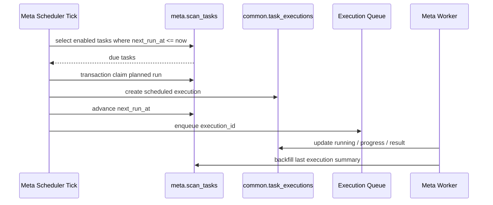

# ADDP 元数据扫描机制规范

本文定义 Meta 扫描的深度、目标、覆盖、跳过判断和跨模块触发规则。术语以 [ADDP 术语表](../concepts/addp术语表.md)、[ADDP 元数据体系图](../concepts/addp元数据体系图.md) 和 [ADDP 任务体系规范](addp任务体系规范.md) 为准。

## 本文边界

本文负责：

| 本文负责 | 不在本文定义 |
|---|---|
| `scan_depth`、`scanned_depth`、`scan_status` 的语义 | data item 识别、claims、exclusive 规则 |
| `force=true/false` 的覆盖策略 | attributes 的完整 JSON schema |
| engine / node / item 扫描目标，ScanSelector / ScanScope / `ref_groups` 边界 | FormatPlugin、info provider、content reader 接口形态 |
| ScanTask 任务定义、调度边界与 execution 关系 | 全平台所有模块任务体系的通用规范 |
| 手动 / 定时触发的默认组合 | Manager 前端 DTO 和预览 UI |
| 不强制扫描时的低成本跳过判断 | 具体格式 parser 的字段细节 |

data item 识别规则见 [ADDP 数据项探测器规范](addp数据项探测器规范.md)，attributes 写入规则见 [ADDP 元数据 attributes 规范](addp元数据attributes规范.md)，格式与数据类型能力边界见 [ADDP 数据类型与格式能力规范](addp数据类型与格式能力规范.md)。全平台任务定义、执行记录、TaskProvider、Orchestrator 和 Monitor 的通用约束见 [ADDP 任务体系规范](addp任务体系规范.md)。

## 核心维度

Meta 扫描只保留四个核心维度：

| 维度 | 字段 | 取值 | 说明 |
|---|---|---|---|
| 触发方式 | `trigger_type` | `manual` / `scheduled` | 只区分手动和定时。System 立即扫描、Manager 刷新、Meta 前端手动扫描都属于 `manual`。 |
| 请求深度 | `scan_depth` | `basic` / `deep` | 本次扫描要达到的深度。 |
| 已扫深度 | `scanned_depth` | `none` / `basic` / `deep` | 当前 node / item 已经达到的扫描深度。 |
| 是否强制 | `force` | `true` / `false` | 是否不管已有元数据和时间戳都重新扫描。 |

`source` 是扫描来源标记，不是核心扫描维度。它只记录触发模块，例如 `meta`、`manager`、`system`、`transfer`、`asset`、`orchestrator`、`develop`、`graph`，用于审计、排查和执行记录，不得进入 `trigger_type` 枚举，也不得驱动不同扫描主路径。`source` 不承载调度器、前后端通道或具体业务场景；定时调度只能由 `trigger_type=scheduled` 表达。

身份型扫描目标只抽象为三类：

1. engine
2. node
3. item

`catalog_paths` 和 `ref_groups` 是 selector/scope 输入形态，不是新的身份层。它们进入 Meta 后必须解析为 `ScanScope`，再由扫描主线决定如何枚举候选内容、构造 node / item plan 和落库。

如果使用 locator，locator 本身已经能表达目标对象，不需要额外 `target_type`。

## ScanSelector 与 ScanScope

`ScanSelector` 表示 API 层或模块调用方提交的扫描选择器。它是请求输入模型，不是扫描执行模型。

允许的 selector 形态：

| selector | 字段 | 语义 |
|---|---|---|
| engine selector | `engine_id` | 从指定引擎的显性 catalog root 开始扫描。 |
| node selector | `node_id` | 从指定 `meta_node` 范围开始扫描。 |
| item selector | `item_id` | 刷新或补齐已入库 data item。 |
| locator selector | `targets` | 使用 ResourceLocator 表达 engine / node / item 目标。 |
| catalog path selector | `catalog_paths` | 使用引擎 catalog model 下的路径坐标表达扫描范围。 |
| content refs selector | `ref_groups` | 使用一组共同参与识别的 content refs 表达本次内容边界。 |

`ScanScope` 是 Meta 内部扫描主链路消费的唯一范围模型。所有 selector 进入扫描执行前必须先由 resolver 解析为 `ScanScope`，后续 scanner、detector、processor 和 repository 不应继续各自解析请求 DTO。

`ScanScope` 至少应表达：

- `engine_id`：所属引擎。
- `mode`：engine / node / item / catalog path / refs group 等内部范围模式。
- `catalog_paths`：路径型 catalog selector 解析后的 catalog path 集合。
- `ref_groups`：内容引用边界集合。
- `source`：扫描来源标记。
- `scan_depth`：本次目标扫描深度。
- `force`：是否强制覆盖。

约束：

1. `catalog_paths` 只能表达路径型 catalog selector，不能承载 sibling refs 或 multi content 边界。
2. `ref_groups` 只表达内容引用边界，不表达资源树父 node，也不要求 Meta 枚举父目录。
3. 同一个外部事件产生的同一批内容，不能同时用父目录 `catalog_paths` 和 `ref_groups` 表达。
4. item refresh 必须由已入库 item 标准事实还原内容输入，不得退回为父目录 catalog scan。
5. `item_id` selector 解析出的 `ScanScope` 和 execution config 必须保持 item 模式，不得为了执行方便补写父级 `catalog_paths` 或 sibling `ref_groups`。

## ScanTask 与 Execution 边界

Meta 扫描必须区分任务定义和执行记录：

| 对象 | 归属 | 含义 | 目标存储 |
|---|---|---|---|
| `ScanTask` | Meta | “未来应该按什么计划扫描什么范围”的定义态。 | `meta.scan_tasks` |
| `TaskExecution` | Common | “某一次扫描实际执行了什么、进度如何、结果如何”的运行态。 | `common.task_executions` |

约束：

1. `common.task_executions` 只记录执行，不保存调度定义。
2. `ScanTask` 只记录任务定义和最近一次执行摘要，不保存每次执行历史。
3. `scan_task_runs` 这类模块私有执行历史表不再保留；执行历史统一进入 `common.task_executions`。
4. `TaskExecution.source_task_id` 指向产生本次执行的模块任务定义；在 Meta 扫描中指向 `ScanTask.id`。
5. `TaskExecution.trigger_type` 只允许 `manual` / `scheduled`。公共执行表通过迁移将历史 `schedule`、`api`、`orchestrator`、`retry` 等值收敛到这两个枚举。
6. `TaskExecution.source` 只记录触发来源模块；未能追溯的历史记录按 `module` 回填。

`ScanTask` 的目标模型应至少表达：

- `tenant_id`
- `engine_id`
- `scope`：结构化 ScanScope/selector 范围模型。
- `schedule`：标准 Cron 表达式；空值表示无定时计划。
- `enabled`
- `scan_depth`
- `force`
- `next_run_at`
- `last_run_at`
- `last_execution_id`
- `last_execution_status`
- `owner_module`：任务定义绑定的对象所属模块，例如 `system`、`meta`。
- `owner_ref`：任务定义在绑定模块内的稳定引用，例如 `engine:{engine_id}`。

`owner_module` 与 execution `source` 不是同一个概念：

- `owner_module` 表达任务绑定在哪个模块的对象上。
- `source` 表达这次 execution 是哪个模块触发的。

例如 System 注册 engine 时创建的自动扫描任务：

| 字段 | 取值 |
|---|---|
| `ScanTask.owner_module` | `system` |
| `ScanTask.owner_ref` | `engine:{engine_id}` |
| `TaskExecution.module` | `meta` |
| `TaskExecution.task_type` | `scan` |
| `TaskExecution.trigger_type` | `scheduled` |
| `TaskExecution.source` | `meta` |
| `TaskExecution.source_task_id` | `ScanTask.id` |

System 不知道 Meta，不接收、不保存、不投递 Meta 扫描策略。System 注册引擎时“默认带有 Meta 扫描配置”的产品体验由 Console 编排完成，相关 manual execution 的 `source` 应记录为 `console`：

1. Console 承载 System engine 注册体验；System 只保存 engine 身份、连接、能力、租户和生命周期等自身事实。
2. System iframe 保存 engine 后，只通过 `postMessage` 向父级 Console 提交扫描策略编排请求，不直接调用 Meta。
3. Console 拿到 `engine_id` 后调用 Meta upsert / delete 该 engine 绑定的 `ScanTask`。
4. 如果用户选择“注册后立即扫描”，Console 调用 Meta manual execution API 创建一次 `trigger_type=manual` 的 execution。
5. UI 如需展示 engine 的扫描计划，应查询 Meta 的 `ScanTask`，或由 Console 聚合 System engine 与 Meta task。

System engine 注册 / 编辑体验中，默认扫描行为应为“保存后立即触发一次基础扫描”，不默认创建定时 `ScanTask`。只有用户显式启用定时自动扫描时，Console 才维护 engine 绑定的 `ScanTask`。

当 Console 收到的扫描策略为未启用或未启用定时扫描时，必须调用 Meta 删除该 engine 绑定的 `ScanTask`；不得保留一个 disabled 绑定任务表达“已关闭”，避免任务定义状态漂移。

System 只发布通用 engine lifecycle event，不携带 Meta 扫描策略。Meta 可以监听 System engine create / update / delete 事件，用于清缓存、维护 catalog root、删除 engine 后清理 metadata 和对应 `ScanTask`，但不得从 System 回查并解释 `scan_config`。

`ScanTask.owner_module=system`、`owner_ref=engine:{engine_id}` 只表达任务绑定的外部领域对象是 System engine，不表示 System 管理 Meta。

## 定时调度保证

Meta 定时调度目标上应使用 DB-driven due task claim，不应只依赖进程内 Cron 注册。

目标流程：



调度保证：

1. Meta 重启后，必须能通过 `next_run_at <= now()` 找回应该触发的任务。
2. 多实例部署时，必须通过数据库行锁、唯一 fire key 或分布式锁避免同一个 planned run 重复创建 execution。
3. scheduled execution 应记录 `planned_run_at`，表示本次执行对应的计划触发时间。
4. 同一个 `task_id + planned_run_at` 只能创建一条有效 execution。
5. 默认只补最近一次 due run，避免 Meta 长时间停机后集中创建大量历史执行；如需补跑多个错过时间点，应另行定义补跑策略。

## 扫描去重锁

Meta 扫描执行需要短时去重锁，但锁粒度必须和扫描范围对齐，不得只按 engine 粗粒度阻塞所有入口。

约束：

1. 执行锁优先按 `item_id`、`catalog_paths`、`ref_groups` 生成，最后才退化到 engine 级。
2. 不同 scope 的执行不得复用同一把锁。
3. 执行锁必须原子获取，不得先查再写。
4. 执行锁的 owner 应使用 `execution_id`，释放时必须校验 owner。
5. execution 创建失败或事务回滚时必须立即释放锁，不得依赖 TTL 自然过期。
6. catalog namespace / branch / bucket 级短锁可复用同一 primitive，但仍应独立于 execution 锁。

## 扫描编排依据

Meta 的扫描编排必须分开回答三类问题：

| 问题 | 事实源 |
|---|---|
| 目录层级如何组织、各层叫什么、哪一层是 leaf | `CatalogModelSpec` |
| 能否列目录、描述 catalog facts、采样字段、读取内容 | 已实现的 provider 组合 |
| Meta 需要怎样执行和落库 | Meta 自己的 scan strategy |

`engine_family` 只保留粗分类意义，不能单独决定扫描流程。Meta 可以因为执行语义不同而保留多种 strategy，例如：

- branch/leaf 型：动态 schema、图等先扫描 root 下业务 branch，再扫描 leaf。
- object catalog 型：对象存储按 bucket / prefix / object 模型扫描，可做复合对象聚合。
- file catalog 型：文件系统按 root / directory / file 模型扫描，可做复合文件聚合。

这些 strategy 的差异来自 catalog model 和 provider 语义，不等于为每个具体引擎重建一套上层抽象。新增引擎时，优先复用已有 strategy；只有当 `CatalogModelSpec` 与 provider 组合都无法表达真实差异时，才新增 strategy。

object catalog 与 file catalog 可以共用 Meta 内容目录扫描主链路，但不得抹平两者的 catalog model 术语：

- object catalog：`service -> bucket -> prefix? -> object`
- file catalog：`root -> directory? -> file`

Meta 内部可以通过 object / file adapter 处理路径转换、父 node 计划、storage attributes 和 item leaf 术语差异；枚举 candidate、组织 refs group、调用 data item detector、deep enrich、content hash、extraction、index 和 persist 应收敛到同一条主链路。single / multi / whole item 不应分别拥有多套落库路径，差异应由 detector 结果和 adapter 的 parent node / path plan 表达。

## 扫描目标字段

Meta API 和扫描任务参数中，路径型扫描目标统一使用 `catalog_paths`：

```json
{
  "engine_id": 1,
  "catalog_paths": ["bucket/path", "/data"],
  "scan_depth": "deep",
  "force": false
}
```

`catalog_paths` 表达的是对应引擎 `CatalogModelSpec` 下的 catalog path，不是对象存储专属 object key，也不是文件系统物理路径。MinIO / S3 的路径遵守 `bucket -> prefix -> object`，NFS 的路径遵守 `root -> directory -> file`。新增调用方、前端表单和模块间客户端必须统一使用 `catalog_paths`。

`catalog_paths` 只表示“从这些 catalog 路径开始枚举或刷新范围”。它不表示“这些 sibling content 共同组成一个 data item”。Shapefile 等 multi content 的本次 refs 边界必须使用 `ref_groups`。

内容引用边界使用 `ref_groups`：

```json
{
  "engine_id": 1,
  "ref_groups": [
    {
      "primary": "bucket/path/roads.shp",
      "refs": [
        {"path": "bucket/path/roads.shp", "role": "main", "required": true},
        {"path": "bucket/path/roads.shx", "role": "sidecar", "required": true},
        {"path": "bucket/path/roads.dbf", "role": "sidecar", "required": true}
      ]
    }
  ],
  "scan_depth": "deep",
  "force": false,
  "trigger_type": "manual",
  "source": "transfer"
}
```

规则：

- `ref_groups[].primary` 表示该组的主 content path。
- `ref_groups[].refs[]` 表示本组可见的完整 content refs；`role` 和 `required` 只描述 ref 在组内的约束，不决定最终 data item 类型。
- `ref_groups` 进入 Meta 后必须转为 engine 对应的 content ref 或 `plugin.CatalogPath`，再进入统一 detector；不得在 Transfer、Manager 或调用方提前判断 refs 是否构成 data item。
- 对于 Transfer 写出结果，Transfer 应提交本次实际生成的 refs group，不得为了触发识别而扩大到父目录 `catalog_paths`。

## Basic / Deep 边界

### CatalogEntry / CatalogFacts 消费规则

Meta 扫描必须先通过 `CatalogProvider.ListChildren()` 获得 `CatalogEntry`，再按条目角色、扫描深度和 provider 组合决定是否进一步读取 `CatalogFacts`。

对 `meta_node`，通常只消费 `CatalogEntry`：root、schema、database、bucket、prefix、directory 等 branch 的身份、层级、展示名、`full_name`、`LeafCount` 和低成本 `Storage.Path` 足以建立资源树。node 的 `item_count`、`total_size`、`scan_status`、`scanned_depth` 来自 Meta 扫描聚合和过程状态，不是 engine 对 node 的原生 facts。第一阶段不为 node 设计 deep-only facts；如果后续要持久化 bucket region、owner、目录权限、生命周期策略等原生事实，必须先单独扩展规范，不能把它们混入 item facts。

对 `meta_item`，`CatalogEntry` 只提供路径坐标、身份和列表级摘要，不能当作完整详情事实使用。`basic` 可以使用 `CatalogEntry.Table`、`CatalogEntry.Storage`、`CatalogEntry.UpdatedAt` 等低成本摘要建立 item 身份、存储属性和跳过判断；需要字段、主键、索引、graph schema、动态 schema 采样、文件内容格式信息、容器 children 或访问索引时，必须显式通过 `CatalogFactsProvider`、`DynamicSchemaSamplingProvider`、content reader 或 format info provider 获取。

`CatalogFacts` 不是每个 entry 自动携带的隐含字段。Meta 需要详情时必须使用 `CatalogEntry.Path` 显式调用对应 provider；不得把 `CatalogEntry` 原样写入 `meta_item.attributes`，也不得从 `CatalogEntry.Table` 推断字段、主键或索引。

### Basic 扫描

`basic` 的目标是低成本建立资源目录和 data item 身份。原则上不打开 file/object 内容流。

允许写入：

- `meta_node` 树。
- `meta_item` 身份字段：`item_type`、`name`、`full_name`、`fingerprint`、`node_id`。
- `attributes.schema_version`。
- `attributes.storage` 中由 catalog 直接返回的事实，例如 bucket、path、name、size、etag、last_modified_at、content_type。
- `attributes.item` 中无需读取内容即可判断的事实，例如 `layout`、`data_type`、`format`。如果 `refs`、`file_count`、`scope_exclusive` 可由 catalog、manifest 或路径规则直接判断，也可以写入；需要打开 file/object 内容才能判断的，一律归 deep。
- 来自 `CatalogEntry` 或只读 catalog/system table 的低成本摘要，例如 table / collection 的估算 `row_count`、`size_bytes`、storage `etag` 和 `last_modified_at`。这类事实可用于列表展示、跳过判断和 basic attributes，但不得为了得到它们执行全表扫描、读取 file/object 内容或触发统计刷新。
- 轻量格式判断：扩展名、MIME、catalog 声明。若确实需要读取极小 header，必须有读取上限和明确理由。

不应写入：

- 表字段、主键、索引。
- 需要执行 `COUNT(*)`、全量扫描、统计刷新或读取内容才能得到的真实行数和统计画像。
- Shapefile / CSV / Parquet 等文件内部 schema。
- 容器 children，例如 Excel sheet、SQLite table、GeoPackage layer、ZIP entry。
- `access_index`。
- 文档正文、媒体宽高、图片 EXIF、全文摘要、向量索引引用。
- 为了获取 extent、真实 geometry 类型分布而扫描全量数据。

### Deep 扫描

`deep` 的目标是补充 Manager、Transfer、Asset、Search 等模块需要稳定消费的元数据事实。

允许写入：

- `type_info.table.fields`、`row_count`、`primary_key`。
- `capabilities.indexing.indexes`。索引是访问/查询能力事实，不写入 `type_info.table`。
- `type_info.container.children`，仅记录容器直接 children，例如 ZIP entry、Excel sheet、SQLite table、GeoPackage layer。
- `type_info.document`、`type_info.media`、`type_info.graph`。
- `format_info.<format>`。
- `capabilities.spatial`、`statistics`、`extraction`、`semantic`、`partitioning`、`indexing`。
- `access_index`，例如 CSV 稀疏行索引。

Deep 扫描可以读取内容，但仍应遵守 provider / reader 边界：

- 元数据事实通过 info provider 写入 `type_info` / `format_info` / `capabilities`。
- 数据库 table deep 扫描应通过 `CatalogFactsProvider.DescribeCatalogFacts()` 获取 `TableInfo.Fields`、`PrimaryKey` 和索引等详情；collection deep 扫描可通过 `DynamicSchemaSamplingProvider` 获取采样字段和索引；graph item 即使在 basic 下如果需要建立稳定图 item 语义，也可以读取低成本 `CatalogFacts.Graph`，但 deep 才允许请求样本。
- 内容窗口、样本、原始文本、缩略图不直接塞进 `type_info`。
- 大文件 deep 扫描应由 provider 自己控制成本和阈值，不能无边界全量读取。
- Meta deep 扫描不得继续识别并持久化容器 children 的下一层 data item。比如 ZIP 中的 Shapefile 组件应作为 ZIP 的直接 entry 写入 children；把这些 entry 临时组合成 Shapefile 预览项属于 Manager 动态预览职责，不写回 Meta。

`access_index` 纳入 deep 的默认目标。具体格式是否生成、是否因为文件过大而跳过，由对应 provider 决定；跳过不应阻断 deep 扫描完成。

Deep 扫描完成状态不写入 `attributes`。`attributes` 只表达从数据源抽取出的稳定事实，例如字段、children、文档结构、媒体信息、空间能力、正文抽取状态和索引引用；不表达“本次 deep scan 已经补齐完成”这类扫描过程状态。不得新增或继续使用 `metadata_extracted`、`deep_metadata_ready` 等 attributes 标记判断 deep 是否完成。

## Scanned Depth

`meta_node` 和 `meta_item` 使用 `scanned_depth` 字段记录已完成扫描深度。

| 字段 | 位置 | 说明 |
|---|---|---|
| `scanned_depth` | `meta_item` | 当前 item 已达到的扫描深度。 |
| `scanned_depth` | `meta_node` | 当前 node 范围已达到的扫描深度。 |

`scan_status` 继续表达过程状态，例如 `pending`、`running`、`completed`、`failed`。不要把 `basic` / `deep` 混入 `scan_status`，否则“正在扫描”和“已扫深度”两个维度会互相覆盖。

`scanned_at` 表示最近一次扫描完成时间。第一阶段不新增 `basic_scanned_at` / `deep_scanned_at`，避免状态膨胀。

`scanned_depth` 是 Manager、Asset、Search 等上层模块判断 item / node 是否已经完成 basic 或 deep 扫描的唯一标准字段。上层模块不得通过检查 `attributes` 中某个 provider 字段是否存在来推断 deep 扫描是否完成。

`scanned_depth` 更新规则：

| 本次 scan_depth | 成功后 item.scanned_depth |
|---|---|
| `basic` | `basic`，但如果原来已是 `deep`，保持 `deep` |
| `deep` | `deep` |

Basic 重新发现资源时不能把已有 deep 状态降级。

## 覆盖策略

只保留一个请求字段：

```json
{
  "force": false
}
```

语义：

- `force=true`：不管已有元数据和时间戳，重新扫描并覆盖本次深度对应的元数据。
- `force=false`：默认策略。已有且未过时就跳过；未达到目标深度或已过时就扫描。

不引入 `refresh_policy`、`if_stale`、provider version 等额外策略。解析器升级或规范调整后的重建由用户或运维通过 `force=true` 解决。

## 是否需要扫描

默认判断顺序：

1. 目标不存在：扫描。
2. `force=true`：扫描。
3. 请求 `scan_depth=deep`，但目标 `scanned_depth != deep`：扫描。
4. 请求 `scan_depth=basic`，但目标 `scanned_depth=none` 或为空：扫描。
5. 源数据时间晚于 `scanned_at`：扫描。
6. 源大小变化：扫描。
7. 其他情况跳过。

这个判断不是新的复杂状态机。实现落地时以 provider / catalog 能低成本提供的事实为准，`scanned_at` 是最近扫描完成时间，可用于展示和兜底判断，不要求所有 provider 都精确维护源端更新时间。

对象和文件：

- 优先使用 catalog 返回的 `last_modified_at` / `data_updated_at` 与 `scanned_at` 对比。
- 没有 `last_modified_at` 时，用 size 变化兜底。
- etag 可作为增强判断，但第一阶段不强依赖。

数据库：

- 如果插件能提供 table `last_modified`，用它和 `scanned_at` 对比。
- 如果不能提供 `last_modified`，用 row_count / size 等 catalog 可得事实做低成本辅助判断。
- 如果这些事实都不可得，不强制时默认跳过已有目标；用户需要重建时使用 `force=true`。

这个判断不追求数据库场景下的绝对精准，优先保持机制简单、成本可控。

## 扫描目标

扫描目标只保留 engine、node、item 三种抽象。

engine 目标表示从该存储引擎的显性结构 root 开始扫描。node 目标表示从指定 `meta_node` 范围开始扫描；当该 node 是 root node 时，语义与 engine 目标一致，扫描服务不得把 root node 的展示名当作业务路径。root node 的 ResourceLocator path 为空，但仍按普通 node 规则携带 `type` 和 `node_id`。

请求可以使用 engine_id：

```json
{
  "engine_id": 1,
  "scan_depth": "basic",
  "force": false
}
```

也可以使用 locator：

```json
{
  "targets": [
    "addp://engine/1/path/addp/shp/farmland.shp?type=object&item_id=100"
  ],
  "scan_depth": "deep",
  "force": false
}
```

也可以使用明确 ID：

```json
{
  "item_id": 100,
  "scan_depth": "deep",
  "force": true
}
```

接口层可以支持 `engine_id`、`node_id`、`item_id`、`targets`、`catalog_paths` 或 `ref_groups`，但进入扫描服务内部后必须统一解析为 `ScanScope`。

不需要 `target_type`。locator 已经包含 engine、path、type，以及互斥的 `node_id` / `item_id`。`type` 表达 catalog 术语，ID 字段负责区分 node / item。

### 已入库 item 的刷新输入

item 已入库后的 refresh 不等同于 catalog scan。它的输入必须来自已入库 data item 的标准事实，而不是只根据 `meta_item.item_type + full_name` 做路径猜测，也不得重新枚举同级资源来改变 item 边界。

刷新输入规则：

| item layout | refresh 输入 |
|---|---|
| `single` | primary content。优先使用 `attributes.storage.physical_path`，没有时使用 `meta_item.full_name`。 |
| `multi` | 完整 related refs。必须使用 `attributes.item.refs` 中的所有 content path 作为 provider 读取输入；`meta_item.full_name` 只是 primary content，不能替代 refs 集合。 |
| `whole` | whole scope 根范围。优先使用 `attributes.storage.physical_path` 或 `meta_item.full_name`。 |

同一套已入库 item 解释逻辑应服务：

- item 已入库后的 deep 属性刷新。
- Manager 对 item 的刷新。
- Transfer 或其他模块需要把 meta item 转换为内容读取计划。

node 扫描仍由 detector 从 catalog 范围重新发现 item 并落库。item refresh 只更新当前已知 item 的 attributes、字段、format info、access index 和横切能力，不负责重新裁决 item 身份。如果 item 的 layout、refs 或 full_name 本身已经错误，item refresh 不应扩大范围去“顺便修正” item 边界；应由用户从 node 层重新扫描，让 detector 重新识别 item。

对 `layout=multi` 的已知 item，item refresh 必须使用已落库的 `attributes.item.refs` 还原读取计划。即使 `storage.physical_path` 指向目录或 scope 根，也不得在 item refresh 中把它当成普通文件读取，或扩大为父目录扫描。

## 默认组合

扫描调度和扫描深度是两个维度，可以自由组合。默认组合如下：

| 场景 | trigger_type | scan_depth | force |
|---|---|---|---|
| System 新建引擎后立即扫描 | `manual` | `basic` | `false` |
| System 定时扫描 | `scheduled` | `deep` | `false` |
| Meta 前端手动扫描 | `manual` | 第一阶段固定 `deep`；API 支持用户选择 | 第一阶段固定 `false`；API 支持用户选择 |
| Meta 前端定时扫描 | `scheduled` | 用户选择，默认 `deep` | 默认 `false` |
| Manager 刷新按钮 | `manual` | `deep` | `true` |
| Manager 预览前 deep 补齐 | `manual` | `deep` | `false` |
| Transfer 完成后触发 | `manual` | `basic` 或按导入结果决定 | `false` |

`manual` 可以在执行配置中额外记录来源模块，例如 `source=system`、`source=manager`、`source=meta`、`source=transfer`，用于审计和排查。但来源不进入 trigger type 枚举，也不表达具体场景。

Transfer 完成后触发 Meta 扫描时，应按本次执行实际写出的内容提交 `ref_groups`。Transfer 不应调用 data item detector，不应判断 refs 是否组成 Shapefile、GeoPackage 等 data item，也不应为了让 Meta 重新识别而把目标扩大为父目录 `catalog_paths`。

## Manager 边界

Manager 不应判断各类格式内部需要哪些 deep 字段，否则会和 Meta、format provider 过耦合。

Manager 预览 item 前的 deep 补齐流程：

1. Manager 预览 item 前读取 item。
2. 如果 `item.scanned_depth != deep`，调用 Meta Client 对该 item 发起 `scan_depth=deep, force=false`。
3. Meta 内部判断是否需要真正扫描。
4. 扫描完成后 Manager 重新读取 item 并继续预览。

如果 `item.scanned_depth=deep`，Manager 直接预览，不检查 Shapefile、CSV、Excel 等具体 attributes。

Manager 不检查 `attributes.capabilities.extraction.metadata_extracted`，也不检查 `format_info`、`type_info`、`access_index` 中的格式专有字段来判断是否需要补齐。具体 provider 是否能抽取某类事实、是否因为格式不支持或成本限制而跳过，只由 Meta deep scan 结果表达。

Manager 刷新按钮固定：

```json
{
  "scan_depth": "deep",
  "force": true
}
```

Manager 的刷新行为必须区分 node 和 item：

| 刷新对象 | 行为要求 |
|---|---|
| node | 可异步触发 Meta deep + force 扫描；前端刷新树即可，不要求等待整个扫描完成。 |
| item | 创建单个 known item refresh execution；前端对该 execution 做局部等待，完成后重新读取 item 元数据和预览。 |

Manager 的 item refresh 不保留后端同步扫描入口。所谓“立等可用”是 UI 对同一条 execution 的前台等待体验，不是绕过 execution 的另一条刷新实现。

item 刷新只刷新 item 本身，但必须包含该 item 的所有 content。对于 Shapefile 这类 `layout=multi` 的 item，刷新时必须使用已入库 `attributes.item.refs` 的完整 refs 集合作为 provider 输入；只读取 `.shp` 主文件会导致字段或空间信息被错误覆盖或丢失。`refs` 不是 catalog scan target，Manager 也不得把它展开后自行发起目录扫描。

Manager 预览前的 deep 补齐与刷新按钮不同：补齐使用 `force=false`，只在 item 未达到 deep 或源数据过期时扫描；刷新按钮使用 `force=true`，用于用户明确要求重建当前 item 元数据。

刷新按钮的语义是强制 Meta 重新生成当前目标范围内的元数据事实。是否重建全文索引、content hash、access index 等派生事实由 Meta 和对应 provider 根据 deep scan 规则统一处理，Manager 不应绕过 Meta 直接写搜索索引或局部 attributes。

Manager 刷新目标必须是当前选中的 engine / node / item，不能默认全 engine。

| 前端选中对象 | 扫描目标 |
|---|---|
| engine root | engine |
| schema / database / bucket / prefix / root / dir | node |
| table / collection / graph / object / file | item |

对于 item 目标，Meta 内部负责从已入库 attributes 还原最小内容输入：

- single item：扫描该 item。
- multi item：使用已入库 `refs` 构造组件输入，不重新枚举父 node。
- whole item：使用 whole scope 根范围。

这个复杂度留在 Meta 内部，Manager 不关心。

## API 约束

统一请求模型：

```json
{
  "engine_id": 1,
  "node_id": 0,
  "item_id": 0,
  "targets": [],
  "catalog_paths": [],
  "ref_groups": [],
  "scan_depth": "deep",
  "force": false,
  "trigger_type": "manual",
  "source": "meta"
}
```

规则：

- `scan_depth` 只允许 `basic` / `deep`。
- `force` 默认为 `false`。
- `trigger_type` 只允许 `manual` / `scheduled`。Meta 新写入的 execution 必须遵守该枚举；公共 `task_executions.trigger_type` 也按该枚举加固。
- `source` 是来源模块标记，不参与扫描策略分支；未提供时由 Meta 根据入口填入默认模块，例如 `meta`、`manager`、`system`、`transfer`。
- `engine_id`、`node_id`、`item_id`、`targets`、`catalog_paths`、`ref_groups` 至少提供一种。
- `catalog_paths` 只表示路径型 catalog selector。
- `ref_groups` 只表示内容引用边界；同一批 Transfer 生成物不得同时用父目录 `catalog_paths` 表达。
- 不保留 `full` / `shallow`。
- 所有手动扫描请求统一通过 `POST /scan/run/manual` 创建 execution；调用方通过任务监控查询进度和结果，不保留同步扫描入口。
