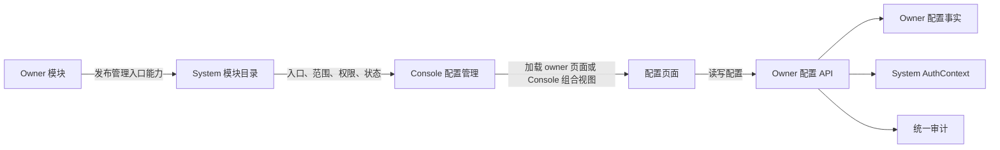

# ADDP 配置规范

## 核心决策

ADDP 的配置按事实来源和生命周期分层管理，不建立由 System 保存所有模块键值的中央配置表，也不允许同一个配置项同时存在数据库值、System 下发值和环境变量 fallback。

- Console 集中呈现配置管理入口，不保存配置值或解释业务字段。
- System 负责模块配置管理能力登记、AuthContext、Permission、统一审计及 System 自己拥有的配置，不理解其他模块的配置语义。
- 每个 owner 模块定义、校验、保存并应用自己的普通运行配置；平台级不等于 System-owned。
- 端口、数据库连接、基础设施地址和进程启动前必须可用的参数属于部署配置。
- 密钥、密码和 Token pepper 属于 Secret，不进入普通配置表和配置能力声明。
- 资源连接、任务定义和用户偏好保留各自的强类型实体，不降格为通用配置键值。

## 配置分类与事实来源

| 类别 | 典型内容 | 事实来源 | 维护者 |
| --- | --- | --- | --- |
| 部署配置 | 端口、数据库、Redis、MinIO、Kafka、模块间地址、启动开关 | 根 `.env`、容器 environment 或部署系统 | 部署运维人员 |
| Secret | 数据库密码、Service Client Secret、API Key、pepper、加密密钥 | Secret Manager 或受控环境注入 | 部署运维或安全人员 |
| 平台普通运行配置 | 模块运行策略、全局限额、重试和保留策略 | 对应 owner 模块的持久化配置 | Platform System Administrator |
| 平台安全配置 | 认证、MFA、平台 IdP 和安全策略 | System IAM | Platform Security Administrator |
| Tenant 核心治理配置 | Tenant IAM、组织和治理策略 | System | 当前 Tenant 的治理角色 |
| Tenant 模块业务配置 | 当前 Tenant 的模块策略和默认值 | 对应 owner 模块，必须绑定 `tenant_id` | 获得该模块配置 Permission 的 Tenant 角色 |
| 资源配置 | Engine、Webhook destination、Application 等 | 对应强类型资源实体 | 资源管理角色 |
| 任务与 execution 配置 | 任务定义和本次执行所需参数 | owner 任务定义及 `execution_config` 快照 | 任务维护者或执行发起者 |
| 用户偏好 | 语言、视图和个人默认选择 | 用户偏好实体 | 当前用户 |

代码默认值属于配置定义，不是可以与持久化值并行修改的第二事实源。没有显式持久化值时可以使用 owner 在配置定义中声明的默认值；一旦持久化，读取路径只能使用该值。

## 配置范围与有效值

普通运行配置必须明确声明一种范围策略：

| 范围策略 | 规则 |
| --- | --- |
| `platform_only` | 只存在平台统一值，Tenant 不得覆盖。 |
| `platform_default_with_tenant_override` | 平台提供默认值，Tenant 可以在 owner 声明的约束内覆盖。 |
| `tenant_only` | 只在当前 Tenant Context 中存在，不读取平台运行值。 |

`platform_default_with_tenant_override` 的有效值只按以下顺序解析：

```text
Tenant 显式值 > 平台显式默认值 > owner 配置定义默认值
```

解析链到此结束，不再回退到 System 内部配置 API、根 `.env` 或模块私有 `.env`。Platform Realm 与 Tenant Context 互斥；平台管理员不能通过平台配置入口修改或读取 Tenant 业务配置，Tenant 请求中的 `tenant_id` 必须来自 AuthContext，不能由客户端自报。

每个普通运行配置定义至少声明：

- 稳定 key、owner module 和配置范围；
- 数据类型、默认值、校验规则和可见说明；
- 是否敏感以及 API、日志和审计中的脱敏规则；
- 读取和修改 Permission；
- 生效方式：热更新、模块重启、任务快照或受控迁移；
- 变更后的影响评估、审计事件和必要的重建动作。

## 配置管理能力声明

各模块通过版本化的 `addp.configuration-management/v1` 契约向 System 发布配置管理入口。该声明是模块目录能力，不是配置定义或配置值，至少包含稳定 entry id、owner module、支持的 scope types、模块前端路由以及读写 Permission。一级配置管理入口按模块聚合：一个模块发布一个稳定的模块级入口；同一模块的多个配置域由该模块页面在内部使用 Tab、分组或其他二级导航组织。

约束如下：

1. 模块 Service Principal 只能发布与自身 owner 一致的入口，重复发布按稳定 entry id 幂等更新。
2. 声明不得携带配置键、默认值、当前值、Secret 或模块私有表结构。
3. System 只校验和登记通用契约，不能解释配置字段、代替 owner 校验或成为其他模块配置的 fallback。
4. Console 按当前 AuthContext、Permission 和模块状态聚合入口；具体页面可以由 owner 模块前端提供，也可以由 Console 在 `/configuration/{owner}/...` 下提供跨 owner 的组合视图，但配置 API、字段校验和配置事实始终属于 owner 模块。
   Console 一级列表只展示模块级入口，不按具体配置域拆分菜单；模块内部的二级导航由 owner 页面负责。
5. owner API 必须再次执行 Platform/Tenant Context 和 Permission 校验，不能信任 Console 是否展示了入口。
6. 模块下线时，Console 将入口显示为不可用；System 不代管该模块的配置值。



System 的 `platform.configuration.read/update` 只允许管理 System-owned 的普通平台配置，不能成为跨 owner 的万能权限。业务模块必须声明自己的平台或 Tenant 配置 Permission，并执行最终授权。

## 生效与变更规则

- `hot_reload`：保存成功后由 owner 原子发布新版本，新请求使用新值，运行中的 execution 保持原快照。
- `restart_required`：保存后记录待生效版本和原因，由平台运维按受控流程重启模块；不得伪装成已经生效。
- `execution_snapshot`：任务创建、更新或执行时固化完整有效配置，后续平台或 Tenant 默认值变化不能静默改变历史 execution。
- `migration_required`：涉及数据库结构、索引、加密材料或产物格式时，只能进入显式迁移流程，普通配置 API 必须拒绝直接修改。

配置变更必须记录 owner、scope、配置版本、操作者、结果和脱敏后的差异。Secret 只能记录是否设置、版本或引用，不能进入响应、日志、审计详情或管理能力声明。

## 根目录环境配置唯一路径

- 根目录 `.env.example` 是 ADDP 开发与部署环境变量的唯一模板。
- 实际配置统一使用根目录 `.env`；生产环境也不使用 `.env.prod` 或其他平行文件。
- 模块进程可以接收容器或启动脚本显式注入的模块配置，但不再维护独立的长期 `.env` 路径。
- 模块代码不得硬编码 `../../.env` 等相对路径，也不得加载 `.env.local` 形成覆盖层；标准启动脚本负责把根 `.env` 注入进程环境。
- `.env` 和任何 Secret 不得提交到 Git；模板中只保留开发默认值、空值或明确的占位值。
- 只有模块连接 owner 持久化存储之前就必须知道的配置才能保留在环境变量中；普通运行配置不得因为读取失败退回环境变量。

IAM 环境密钥边界：

- ADDP 只签发随机 opaque Token，不签发或解析用户 JWT，因此禁止配置 `JWT_SECRET`。
- 三员账号只能通过离线 IAM Bootstrap 建立；Bootstrap Secret、三员密码、TOTP Secret 和验证码均不得进入环境变量。
- `OAUTH_USER_CODE_PEPPER`、`IAM_MFA_ENCRYPTION_KEY` 和每个内置模块独立的 `*_SERVICE_CLIENT_SECRET` 是生产环境必需的 IAM Secret。
- `OAUTH_PREVIOUS_USER_CODE_PEPPER` 只能在受控轮换窗口临时设置，轮换完成后必须删除。
- `ENCRYPTION_KEY` 用于引擎连接信息等平台数据加密，不是 Token 签名密钥，不得与上述 IAM Secret 复用。

AI 推理密钥边界：

- 在线厂商 API Key 或内网模型服务凭据属于 Inference owner 的 Provider Connection credential，不再由 Agent、Copilot、Manager 的环境变量注入。
- Inference 使用部署级 `ENCRYPTION_KEY` 加密凭据；该 Key 仍由部署系统注入，不进入数据库或配置页面。
- 凭据设置和轮换使用专用操作，普通 Provider 更新 API 不接受 credential 字段。
- 任何读取 API 只返回 `configured` 和单调递增 `version`，不得返回明文、掩码值、末尾字符或可复用密钥引用。

### System IAM 安全策略

System IAM 安全策略是 `platform_only` 的 System-owned 平台安全配置，由 Platform Security Administrator 使用 `iam.security_policy.read/update` 维护。Platform System Administrator 不继承该职责，Tenant Context 不得读取或修改。

当前策略只包含以下普通运行字段：

| 字段 | 单位 | 约束 |
| --- | --- | --- |
| Access Token TTL | 分钟 | `1-60` |
| Delegated Access Token TTL | 分钟 | `1-2` |
| Browser Resource Access Ticket TTL | 分钟 | `1-60`，且不得大于 Access Token TTL |
| Refresh Token Family TTL | 天 | `1-365` |
| OAuth Authorization Code TTL | 分钟 | `1-5` |
| OAuth Device Code TTL | 分钟 | `5-30` |
| OAuth Device Poll Interval | 秒 | `5-60` |
| Tenant Invitation TTL | 小时 | `1-720` |
| Enrollment Ticket TTL | 分钟 | `1-30` |
| OAuth public rate limit | 次/分钟 | `1-10000` |
| OAuth authenticated-user rate limit | 次/分钟 | `1-10000` |

策略保存到 `system.iam_security_policy` 单例表，以 `version` 做乐观并发控制，并记录 `applied_version`。IAM Runtime 在启动时只读取一次当前持久化版本并把它标记为已应用；更新 API 保存新版本后必须返回 `pending_restart=true`，直到 System 受控重启后才生效。该策略不热更新，不从根 `.env`、模块私有 env 或代码外部参数回退。

策略更新必须与 `iam.security_policy.updated` 审计事件在同一事务提交。审计只记录版本和普通数值字段差异，不记录 Token、Pepper、MFA Secret、Service Client Secret 或任何其他密钥材料。

模块通过 System 获取 AuthContext、Engine Instance 和其他 System-owned 业务事实，不通过 System 获取本模块进程数据库密码、加密密钥或普通运行配置。业务数据源连接信息继续以 System `engines` 强类型资源为事实源；这不等于 System 是所有配置的事实源。

### Standard 文档文件部署配置

Standard 文档文件由 Standard owner 写入 ADDP infra MinIO 的 `standard` bucket。以下参数在服务启动前生效，属于部署级资源保护配置：

```bash
# 单个文档文件最大字节数，默认 100 MiB。
STANDARD_DOCUMENT_MAX_FILE_SIZE=104857600

# 单次 MinIO 上传、预检、下载或删除操作的超时。
STANDARD_DOCUMENT_STORAGE_TIMEOUT=30s
```

上传采用唯一对象 Key；数据库成功切换 `documents.file_key` 后，旧对象进入 `standard.document_file_cleanups` 持久化补偿队列。该队列只记录已经失效且等待物理删除的对象，不是文件引用的第二事实源。

### Manager 导入中转对象存储

Manager 的 Shapefile 导入不是由 Manager 自己解析写库。Manager 只负责接收 ZIP 包、上传到中转对象存储，然后创建并触发 Transfer `sync`：

```json
{
  "source": {
    "locator": "addp-infra://minio/manager/tenant_7/import/20260622/upload-uuid/roads.shp?type=object",
    "data_type": "table",
    "representation": "encoded",
    "format": "shapefile"
  }
}
```

Manager 上传导入文件时写入 ADDP infra MinIO 的 `manager` bucket，并通过 `addp-infra://minio/manager/...` locator 调用 Transfer。infra MinIO 不进入 System engines，上传暂存对象也不进入 Meta。
对于 Shapefile 多文件上传，source locator 指向 primary `.shp`；同 basename 的 `.dbf`、`.shx`、`.prj`、`.cpg` 等组件随同写入同一暂存目录，由 Transfer 按格式能力读取相关 refs。

相关环境变量：

```bash
MINIO_API_PORT=19000
MINIO_ROOT_USER=minioadmin
MINIO_ROOT_PASSWORD=minioadmin
```

宿主机开发时由 `MINIO_API_PORT` 组成 `localhost:<port>`；容器部署由 Compose 显式注入
`MINIO_ENDPOINT=minio:9000`。模块不得读取 `MINIO_SYSTEM_*`、`MINIO_ACCESS_KEY` 或
`MINIO_SECRET_KEY` 等平行别名。

规则：

1. Manager 负责上传暂存和后续 cleanup，Transfer 只按 locator 读取。
2. 暂存路径使用 `tenant_{tenant_id}/import/{yyyymmdd}/{upload_uuid}/...`。
3. 当前导入入口支持一个 Shapefile ZIP 包，或浏览器同时选择同一套 Shapefile 的多个组件文件；`.shp/.dbf/.shx` 必须同 basename，不能混入多套 Shapefile。

### Manager 栅格 mosaic 生成配置

栅格 mosaic 生成是离线任务，Manager 通过 GeoPython Workflow 的 `build_raster_mosaic` 算子执行 GDAL 处理。该调用不同于在线瓦片渲染，允许更长的执行预算：

```bash
# 容器版 GeoPython Workflow 的 gunicorn worker 超时。默认 7200 秒。
GEOPYTHON_WORKFLOW_GUNICORN_TIMEOUT=7200
```

栅格 mosaic 生成超时已迁移为 Manager 配置页面中“快显策略”Tab 的平台普通运行配置，作为后续 execution 的默认预算；GeoPython 容器的 `GEOPYTHON_WORKFLOW_GUNICORN_TIMEOUT` 仍由部署环境维护。

leaf COG 生成并发不通过全局环境变量固定，而是在任务 `config.cog` 中归一化为明确值。默认策略按运行机器 CPU 预算计算：逻辑 CPU 小于 8 时 `leaf_concurrency=1`，8 到 15 时为 `2`，16 到 31 时为 `4`，32 及以上时为 `6`，上限 `8`；单个 leaf COG 的 GDAL `num_threads` 默认按 `逻辑 CPU / (leaf_concurrency * 2)` 计算并限制在 `1` 到 `4`。当前 18 逻辑 CPU 开发机默认得到 `leaf_concurrency=4`、`num_threads=2`。`cog.leaf_retry_attempts` 默认 `2`，上限 `5`，用于单个 leaf COG 生成或校验的瞬时失败重试。`detached` 模式重跑时会复用目标数据集中已经存在且内容级 COG 校验通过的 leaf，因此超时或中断后的恢复通过再次执行同一任务继续完成未生成部分，而不是从头覆盖全部 leaf。

### Manager 向量化配置

Manager 向量化的模型提供能力统一来自 Inference Runtime。Manager 只保存 `manager.embedding` Scenario Binding、向量检索策略、成本限制和 execution 快照，不保存模型服务 Base URL、上游模型标识或 API Key。

| 字段 | 归属与规则 |
| --- | --- |
| Model Profile / Deployment 绑定 | Manager Scenario Binding；平台默认可被 Tenant 显式绑定覆盖。 |
| 请求 timeout | Manager 平台普通运行配置。 |
| 向量检索最大距离 | Manager 平台检索默认策略；当前不开放 Tenant 覆盖。 |
| 最大文件大小 | Manager 平台成本与资源限制；当前不开放 Tenant 覆盖。 |
| 批处理并发数 | Manager 平台运行资源策略。 |
| 向量维度 | 模型输出与 pgvector 列结构的只读约束，不是普通可编辑配置。不同维度切换必须走数据库迁移和全量重建。 |
| Provider credential | Inference 专用加密凭据；Manager API、表和 execution 均不得持有。 |

Manager 配置定义提供业务策略默认值；显式平台值和 Tenant 覆盖保存在 Manager 自己的持久化配置中，不从环境变量回退。Manager 必须先解析当前场景绑定，再调用 `addp.inference/v1`；未配置、无授权或能力不匹配时返回明确错误，不能直连其他模型服务。

任务定义和 execution 中的 `model_profile_id/profile_version/deployment_id/dimension/binding_version` 是实际使用配置的快照。场景绑定变化只影响后续创建或显式更新的任务及后续 execution，不能改写历史执行事实。

`MANAGER_EMBEDDING_SERVICE_API_KEY` 不再存在。Provider credential 只在 Inference owner 中保存和解密。

### Transfer continuous 运行观测配置

以下运行策略迁移到 Transfer owner 的平台配置中，配置页面按“持续同步策略”分组维护；保存后的版本对新建或重新启动的 continuous runtime 生效。Infra Kafka 连接、topic 保留容量和 DLQ reconciler 的采样细节仍属于部署配置。

Transfer continuous worker 自己采集业务 Kafka或内部 CDC topic 的分区 earliest/latest position，并把 lag 和 retention 恢复窗口写入统一 execution metadata。Monitor 只读取该 metadata，不直连 Kafka。PostgreSQL CDC consumer 使用 Infra Kafka 独立 `transfer` principal，读取 `INFRA_KAFKA_BOOTSTRAP_SERVERS`、`INFRA_KAFKA_TRANSFER_PASSWORD`、`INFRA_KAFKA_SECURITY_PROTOCOL` 和相同 TLS 配置；这些部署字段不进入 System Engine 或任务 JSON。

Transfer 配置页面的“连续任务策略”Tab 维护 diagnostics、retention、checkpoint 和 recovery 字段；这些字段不再通过环境变量注入。以下仍属于部署治理的 DLQ 采样配置：

```bash
# DLQ payload availability 低频核验。仅属于 Transfer 部署治理，不进入任务 JSON。
TRANSFER_DLQ_RECONCILE_INTERVAL=1m
TRANSFER_DLQ_RECONCILE_BATCH_SIZE=100
TRANSFER_DLQ_RECONCILE_TIMEOUT=10s
TRANSFER_DLQ_RECONCILE_FETCH_MAX_BYTES=10485760
```

critical 阈值必须小于 degraded 阈值；checkpoint 停滞阈值必须大于 diagnostics 采样间隔。恢复初始退避不得大于最大退避，最大连续失败次数必须为正，circuit 冷却时间和稳定运行阈值必须为正。这些阈值是 Transfer runtime 统一运维策略，不写入用户 task config，也不按任务开放第二条判定路径。

DLQ reconciler 的 interval、timeout、batch size 和 fetch bytes 必须为正；batch size 最大 1000，fetch bytes 不得超过 Kafka 客户端的 `int32` 上限。reconciler 只核验 Infra Kafka 精确 payload reference 并以 CAS 收敛 `payload_available`，不读取业务 Kafka、不提交消费位点，也不把原始 payload 写入日志或 API。

Monitor 每隔以下时间评估最新 active execution 的公共 metadata，将观测信号物化为告警事件。该配置不进入任务 JSON；Monitor 不因此读取 Transfer 私有表或业务 Kafka。

配置管理迁移后，Monitor 的告警评估、Webhook/邮件投递超时、最大尝试次数和退避策略属于 Monitor-owned `platform_only` 普通运行配置。Webhook 私网访问开关、Console 外部地址仍属于部署安全边界。

SMTP Relay 作为 Monitor-owned 平台强类型资源管理：地址、端口、TLS 模式和发件身份是普通字段，用户名和密码使用专用加密凭据字段，读取 API 只返回 `configured/version`。

Service 的健康检查与元数据刷新计划属于 Service-owned `platform_only` 普通运行配置，保存后按受控重启生效。

Manager 的在线底图供应商作为 Manager-owned 强类型资源管理。平台可提供默认资源，Tenant 可以在允许的范围内覆盖；高德、天地图浏览器 Key 属于客户端可见凭据，不将其当作服务器 Secret，但管理 API 仍只返回配置状态，运行时端点按授权返回浏览器确需的公开 Key。

以下变量没有形成实际运行路径，禁止继续暴露在配置页面：`COPILOT_ENABLE_STREAMING`、`COPILOT_MAX_TOKENS_PER_DAY`、`COPILOT_RATE_LIMIT`、`DISABLE_SSL_VERIFY`、`WORKER_COUNT`、`TASK_QUEUE_NAME`、`MAX_RETRIES`。Meta 与 Transfer 的 worker 并发和重试等待使用模块独立的部署参数，不再共享 `CONCURRENT_TASKS`、`RETRY_DELAY`。

```bash
MONITOR_ALERT_EVALUATION_INTERVAL=15s

# Webhook delivery dispatcher 轮询周期、HTTP 超时和 claim lease。
MONITOR_WEBHOOK_DISPATCH_INTERVAL=2s
MONITOR_WEBHOOK_HTTP_TIMEOUT=10s
MONITOR_WEBHOOK_LEASE_DURATION=30s

# delivery 最大尝试次数和指数退避边界。
MONITOR_WEBHOOK_MAX_ATTEMPTS=8
MONITOR_WEBHOOK_RETRY_INITIAL_BACKOFF=5s
MONITOR_WEBHOOK_RETRY_MAX_BACKOFF=5m

# 默认 false：拒绝 HTTP、环回、私网、链路本地和云 metadata 目标。
# 只在本地联调或明确受管内网部署中开启。
MONITOR_WEBHOOK_ALLOW_PRIVATE_NETWORKS=false

# Webhook payload 内告警详情链接使用的 Console 外部地址。
MONITOR_CONSOLE_BASE_URL=http://localhost:5170

# 邮件投递策略和 SMTP Relay 已迁移到 Monitor 配置管理页。
# 凭据只通过专用凭据接口写入 Monitor-owned 加密字段。
```

Webhook destination 的 HMAC secret 使用平台统一 `ENCRYPTION_KEY` 做 AES-256-GCM 加密，不新增 Monitor 私有加密密钥。dispatcher 配置属于部署策略，不进入任务定义或普通用户请求；`MONITOR_WEBHOOK_ALLOW_PRIVATE_NETWORKS` 只能由部署者设置，API 不提供绕过开关。

邮件第一版只允许 `starttls|tls`，不支持明文或机会式降级，也不根据端口猜测 TLS 模式。SMTP Relay 由平台管理员在 Monitor 配置页维护；host 为空或 Relay 未启用时邮件 dispatcher 不启动，既有 `pending` outbox 会在补齐配置并重启后继续投递。SMTP 密码只存在 Monitor-owned 加密字段，读取接口只返回 `configured/version`，不进入 System Engine、任务 JSON、租户 API 或投递审计。

### Infra Kafka、Kafka Connect 与 Capture Supervisor 配置（工作包 3B/3C 已实现）

Infra Kafka 是 ADDP 部署资源，不进入 System Engine。正式实现固定为 Redpanda v24.3.18 + Debezium Connect 3.6.0.Final；开发环境为 1 broker/1 Connect，生产参考为 3 broker/至少 2 Connect worker。平台只暴露 Kafka API 数据面，不提供 Apache Kafka/Redpanda 运行时选择。

```bash
# 仅供 ADDP 内部组件使用；不写入用户任务 JSON。
INFRA_KAFKA_BOOTSTRAP_SERVERS=localhost:19092
INFRA_KAFKA_ADMIN_USERNAME=admin
INFRA_KAFKA_ADMIN_PASSWORD=change-in-production
INFRA_KAFKA_CDC_TOPIC_PREFIX=__addp_cdc.
INFRA_KAFKA_CDC_RETENTION=168h
INFRA_KAFKA_CDC_RETENTION_BYTES=
INFRA_KAFKA_CDC_REPLICATION_FACTOR=1
INFRA_KAFKA_INTERNAL_REPLICATION_FACTOR=1
INFRA_KAFKA_SECURITY_PROTOCOL=sasl_plaintext
INFRA_KAFKA_SASL_MECHANISM=scram-sha-256
INFRA_KAFKA_TLS_CA_CERT_FILE=
INFRA_KAFKA_TLS_INSECURE_SKIP_VERIFY=false
INFRA_KAFKA_DISK_DEGRADED_PERCENT=75
INFRA_KAFKA_DISK_CRITICAL_PERCENT=85

# 生产 HA profile 的单 broker 内存与额外宿主机 listener。
REDPANDA_HA_MEMORY=1G
REDPANDA_HA_KAFKA_2_PORT=19093
REDPANDA_HA_KAFKA_3_PORT=19094

KAFKA_CONNECT_URL=http://localhost:18083
KAFKA_CONNECT_USERNAME=
KAFKA_CONNECT_PASSWORD=
KAFKA_CONNECT_TIMEOUT=15s
KAFKA_CONNECT_LOOPBACK_HOST=host.docker.internal
KAFKA_CONNECT_BOOTSTRAP_SERVERS=redpanda:29092
KAFKA_CONNECT_KAFKA_USERNAME=connect
KAFKA_CONNECT_KAFKA_SECURITY_PROTOCOL=sasl_plaintext
KAFKA_CONNECT_KAFKA_TLS_CA_CERT_FILE=
KAFKA_CONNECT_GROUP_ID=addp-connect-cluster
KAFKA_CONNECT_CONFIG_TOPIC=__addp_connect_configs
KAFKA_CONNECT_OFFSET_TOPIC=__addp_connect_offsets
KAFKA_CONNECT_STATUS_TOPIC=__addp_connect_status

TRANSFER_CAPTURE_PROVISIONING_TIMEOUT=60s
TRANSFER_CAPTURE_STATUS_POLL_INTERVAL=1s
TRANSFER_CAPTURE_MONITOR_INTERVAL=15s
TRANSFER_CONTINUOUS_RUNTIME_STOP_TIMEOUT=45s
TRANSFER_CONTINUOUS_RUNTIME_STOP_POLL_INTERVAL=250ms
TRANSFER_META_SCAN_CLAIM_TTL=2m
```

生产环境必须显式设置 `INFRA_KAFKA_CDC_RETENTION_BYTES`，并按峰值写入速率、7 天恢复窗口、副本因子和安全余量校验磁盘容量；time/bytes 任一边界先到都会删除旧 segment。开发状态脚本按 75%/85% 展示 degraded/critical 磁盘水位。生产耐久语义固定为 3 副本、producer `acks=all`、至少 2 broker 确认，由 RF=3 的 Raft majority 实现；Transfer 不读取或下发 `min.insync.replicas` topic 属性。`INFRA_KAFKA_INTERNAL_REPLICATION_FACTOR` 控制 Connect internal topics 的副本数，生产设为 3。凭据分别由 infra admin、Kafka Connect 和 Transfer consumer 使用，不复用业务 Kafka Engine 凭据。`INFRA_KAFKA_SASL_MECHANISM` 固定为部署级 `scram-sha-256`，由 Infra admin、Connect、Transfer continuous 和 DLQ 共同消费，禁止进入用户任务配置。正式单机开发 Compose 仅在本机和 Docker 网络使用 `SASL_PLAINTEXT/SCRAM-SHA-256`；生产 HA profile 必须使用 `SASL_SSL`，固定 `write.caching=false`、Connect producer `acks=all`、10 秒 scheduled rebalance delay，并使用 `19092/19093/19094` 三个本地 external listener。broker service/container/DNS 固定为 `redpanda`/`addp-redpanda`/`redpanda:29092`，一次性 `redpanda-init` 使用同一 Redpanda 镜像内置的 `rpk` 初始化 SCRAM 用户、Connect internal topics 和 ACL；不得恢复 `kafka` broker service、Apache Kafka CLI 镜像或第二套初始化容器。拓扑参数与 Redpanda 原生健康观测只存在于部署/认证层。`KAFKA_CONNECT_LOOPBACK_HOST` 只用于 Connect 容器访问登记为 localhost/loopback 的开发业务库，不改写远程数据库主机。capture supervisor 已负责显式创建单分区 CDC topic、托管 connector、登记 generation/resource、监控状态和幂等 stop/cleanup。`TRANSFER_META_SCAN_CLAIM_TTL` 统一用于 continuous 首次目标扫描和 additive migration 后扫描的持久化 claim 租期；只用于进程崩溃后的过期接管，不是扫描结果超时，也不进入任务配置。该值必须大于 Meta client 固定的 60 秒 HTTP 超时，默认 2 分钟，为调用完成和 token fencing 留出余量。

Business MySQL 作为本地 CDC 测试源时使用独立配置文件 `business/.env`：

```bash
MYSQL_ROOT_PASSWORD=change-in-production
MYSQL_DATABASE=business
MYSQL_PORT=3306
MYSQL_CDC_USER=addp_cdc
MYSQL_CDC_PASSWORD=change-in-production
```

`MYSQL_CDC_USER` 只允许字母、数字和下划线，`MYSQL_CDC_PASSWORD` 不得为空且不得与 root 密码复用。`business/scripts/start.sh -mysql` 在 MySQL ready 后每次执行专用账号初始化，因此已有 volume 也会更新密码并把权限收敛到 Debezium 所需集合；不要把 root 凭据登记为 System MySQL Engine。Business Compose 显式固定非零 server id、binlog、ROW format 和 FULL row image。

Business Kafka/Redpanda 是用户业务消息流，与 Infra Kafka 完全隔离。开发环境通过 `business/scripts/start.sh -redpanda` 启动独立 Redpanda 集群，再把只读账号作为 `engine_type=kafka` 的 System Engine 凭据；不得把 Infra Kafka 的 endpoint、principal 或内部 topic 注册为业务 Engine。

```bash
BUSINESS_KAFKA_PORT=29092
BUSINESS_KAFKA_ADMIN_USERNAME=admin
BUSINESS_KAFKA_ADMIN_PASSWORD=change-in-production
BUSINESS_KAFKA_READER_USERNAME=addp_transfer
BUSINESS_KAFKA_READER_PASSWORD=change-in-production
```

本地 Business Redpanda 固定使用 `SASL_PLAINTEXT/SCRAM-SHA-256`，关闭自动创建 topic。启动脚本幂等创建或轮换 reader 密码，并只授予 topic read/describe、consumer group read/describe 和 cluster describe；业务生产者使用独立 principal，不复用 ADDP reader 凭据。生产环境应升级为 `SASL_SSL`，并按业务流量配置多 broker、副本、retention 和磁盘告警。

### Manager 快显与动态 MVT 配置

Manager 快显中的动态 MVT 是交互式预览能力，单瓦片查询必须受响应时间预算保护。以下配置同时影响能力接口返回的 `realtime_tile.timeout_budget_ms`、动态 MVT 查询的实际超时控制，以及超时响应头中的诊断信息。

Manager 配置页面的“快显策略”Tab 维护 FlatGeobuf 行数上限、动态 MVT 超时预算、重试等待时间和栅格 mosaic 生成超时；这些字段不再通过环境变量注入。

MVT 进程内 LRU 的容量和条目 TTL 是按部署机器内存预算确定的进程级实现参数，使用代码默认值（8192 条目、5 分钟），不作为平台或租户业务配置，也不从未登记的环境变量读取。

## 环境变量参考

### 根目录 `.env`

根目录 `.env` 文件从唯一模板 `.env.example` 生成。不得另建 `.env.prod`、模块级 `.env` 或其他平行配置路径。

生产环境通过 `bash scripts/prod/setup-env.sh` 从同一模板初始化 `.env` 并生成独立 Secret；已有 `.env` 时脚本不得静默替换持久化数据依赖的密钥。

关键配置如下：

```bash
# Base64 编码的独立 32 字节 User Code HMAC pepper；生产环境必须显式设置。
OAUTH_USER_CODE_PEPPER=
# 仅在一次受控轮换窗口内设置；窗口结束后删除，不能保留无限历史链。
# OAUTH_PREVIOUS_USER_CODE_PEPPER=
# Base64 编码的独立 32 字节 MFA Credential 加密密钥；不得与 ENCRYPTION_KEY 复用。
IAM_MFA_ENCRYPTION_KEY=
# Base64 编码的 32 字节平台数据加密密钥；不是 Token 签名密钥。
ENCRYPTION_KEY=
# 浏览器、CLI 和外部客户端可访问的 Gateway 公共 API 根地址；OAuth 响应不得使用模块间 SYSTEM_URL。
PUBLIC_API_URL=http://localhost:8000
CONSOLE_URL=http://localhost:5170
# Develop 自身的模块间可达地址；Notebook Runtime 使用它回调会话限定的只读能力接口。
DEVELOP_URL=http://localhost:8185
# Develop 查询 execution 保存的最大预览行数；实际读取多一行用于判断 truncated。
QUERY_RESULT_LIMIT=500
# System 用此控制面地址注册唯一内置 DuckDB Federated Query Runtime；容器环境使用 duckdb-engine:8104。
DUCKDB_RUNTIME_URL=http://localhost:8104
# DuckDB Runtime 请求期只加载此目录中的扩展，扩展由开发启动或镜像构建阶段预先准备。
DUCKDB_EXTENSION_DIRECTORY=.cache/duckdb/extensions
# 容器 Runtime 访问登记为 loopback 的业务 Engine 时使用；根 Compose 固定为 host.docker.internal，本地二进制留空。
DUCKDB_SOURCE_LOOPBACK_HOST=

# 内置模块各自独立的 Confidential OAuth Client Secret，长度 32-72 字节且不得复用。
# System 启动时仅保存 BCrypt Hash；各模块只读取自己的 Secret。
ASSET_SERVICE_CLIENT_SECRET=
DEVELOP_SERVICE_CLIENT_SECRET=
DUCKDB_SERVICE_CLIENT_SECRET=
GATEWAY_SERVICE_CLIENT_SECRET=
GRAPH_SERVICE_CLIENT_SECRET=
INFERENCE_SERVICE_CLIENT_SECRET=
MANAGER_SERVICE_CLIENT_SECRET=
META_SERVICE_CLIENT_SECRET=
MODEL_SERVICE_CLIENT_SECRET=
MONITOR_SERVICE_CLIENT_SECRET=
ORCHESTRATOR_SERVICE_CLIENT_SECRET=
PORTAL_SERVICE_CLIENT_SECRET=
QUALITY_SERVICE_CLIENT_SECRET=
# Quality 整次检查的执行预算，使用 Go duration 格式；触发时冻结到 execution 配置。
QUALITY_CHECK_TIMEOUT=30m
# Quality 单进程并行执行槽位数；必须为正整数，跨实例仍通过数据库 lease 协调。
QUALITY_WORKER_CONCURRENCY=4
SERVICE_SERVICE_CLIENT_SECRET=
STANDARD_SERVICE_CLIENT_SECRET=
TRANSFER_SERVICE_CLIENT_SECRET=

# System 只信任这些反向代理提供的客户端 IP 转发头；逗号分隔 IP 或 CIDR。
# 容器/生产环境必须显式加入实际 Gateway/Nginx 网段，禁止配置 0.0.0.0/0 或 ::/0。
TRUSTED_PROXIES=127.0.0.1,::1

# 开发环境各前端通过 credentials 调用 System 登录和静默刷新。
# 必须覆盖 Console 和所有独立模块前端端口。
ALLOWED_ORIGINS=http://localhost:5170,http://localhost:5173,http://localhost:5174,http://localhost:5175,http://localhost:5176,http://localhost:5177,http://localhost:5178,http://localhost:5179,http://localhost:5180,http://localhost:5181,http://localhost:5182,http://localhost:5183,http://localhost:5184,http://localhost:5185,http://localhost:5186,http://localhost:5187

# PostgreSQL - ADDP 系统数据库
POSTGRES_PASSWORD=addp_password
POSTGRES_USER=addp
POSTGRES_DB=addp

# Redis
REDIS_PASSWORD=addp_redis

# Infra MinIO - 基础设施级对象存储
# 用于系统文件、模块缓存、审计日志归档等，不等于业务对象存储引擎。
MINIO_ROOT_USER=minioadmin
MINIO_ROOT_PASSWORD=minioadmin
MINIO_API_PORT=19000
MINIO_BUCKET=system

# Oracle Free - Business 普通表与 Oracle Spatial 测试源（业务容器内使用 business-oracle:1521）
# 常规镜像保留 Oracle Spatial；-slim 镜像会卸载 Spatial/Locator，不得使用。
ORACLE_IMAGE=gvenzl/oracle-free:23
ORACLE_SYS_PASSWORD=oracle_sys_password
ORACLE_APP_USER=business
ORACLE_APP_PASSWORD=business_oracle_password
ORACLE_SERVICE_NAME=FREEPDB1
ORACLE_PORT=15210

# MinIO - 业务数据 (部署在 business/docker-compose.yml)
# 注意：Business 引擎连接信息由 ADDP 容器内服务使用，生产 Docker 部署请使用 business 网络服务名，不要写 localhost。
BUSINESS_PG_HOST=business-postgres
BUSINESS_PG_PORT=5432
BUSINESS_PG_USER=business
BUSINESS_PG_PASSWORD=business_password
BUSINESS_PG_DB=business
BUSINESS_MINIO_ENDPOINT=business-minio:9000
BUSINESS_MINIO_ACCESS_KEY=minioadmin
BUSINESS_MINIO_SECRET_KEY=minioadmin

```

### 端口分配

详见 [addp端口分配.md](addp端口分配.md)。

**推荐访问**:
- **生产环境**: http://localhost:80 (通过 Nginx 访问 Console 控制台)
- **开发环境**: http://localhost:5170 (Console 独立访问) 或各模块独立端口

**业务库设置**:

```bash
cd business
cp .env.example .env
docker-compose up -d
```

#### IAM 首次初始化

目标 IAM 不创建默认 `SuperAdmin`、默认租户或弱密码账号，也不接受通过环境变量开启公开注册。平台系统管理员、安全管理员和审计管理员只能通过一次性离线 Bootstrap 建立；Bootstrap 完成后永久关闭，后续平台高权限身份变更统一走双人审批。

Bootstrap 使用离线 `iam-bootstrap prepare/apply` 两阶段命令；已完成 Bootstrap 后三员整体凭据丢失时，使用离线 `iam-recovery prepare/apply` 恢复。Secret 和三员密码只通过 TTY 输入，具体步骤见 `docs/guide/addp IAM三员初始化操作指南.md`。


**数据持久化**:

**ADDP 系统** (docker-compose.infra.yml):

- PostgreSQL: `postgres_data` 卷 (ADDP 系统元数据)
- Redis: `redis_data` 卷 (缓存和队列)
- MinIO System: `minio_data` 卷 (系统文件)
- Meilisearch: `meilisearch_data` 卷 (搜索索引)

**业务库** (business/docker-compose.yml):

- PostgreSQL: `business_postgres_data` 卷 (用户业务数据)
- MinIO Business: `business_minio_data` 卷 (用户文件)

## API 端点摘要

**公开认证与邀请入会**:

- `POST /api/v1/system/login` - 本地账号登录
- `POST /api/v1/system/auth/mfa-verifications` - MFA 验证
- `POST /api/v1/system/tenant/invitations/registrations` - 持有有效邀请的新用户注册

System 不提供公开 `/register`。平台 IAM 管理使用 `/platform/*`，Tenant IAM 管理使用 `/tenant/*`，当前用户自服务使用 `/users/me`，OAuth 2.0 使用 `/oauth/*`。完整端点与权限元数据以 System Swagger 为准。

**另请参阅**: 本文即为当前配置分层、管理能力与环境变量规范入口。
## 模块拥有的运行策略

配置管理页面只承载模块自己拥有、可以在运行时安全生效的策略。System 只保存模块注册的入口声明，不保存业务配置键和值。

当前模块级入口下的运行策略：

| 模块级入口 | 所有者 | 内部配置域 | 平台级字段 | 租户级字段 |
| --- | --- | --- | --- | --- |
| `develop.configuration` | Develop | `query_policy` | 最大查询超时、结果预览上限 | 默认查询超时 |
| `manager.configuration` | Manager | `embedding`、`quick_view_policy` | 向量化策略、FlatGeobuf 行数上限、动态 MVT 超时预算、重试等待时间 | 向量化模型绑定及租户覆盖 |
| `copilot.configuration` | Copilot | `inference_bindings`、`matching_policy` | 匹配阈值、候选数量上限 | 推理场景绑定、匹配阈值、候选数量上限 |

模块数据库保存配置事实并使用版本号进行并发更新；密钥类字段必须使用专用加密凭据，不通过普通键值配置返回。
