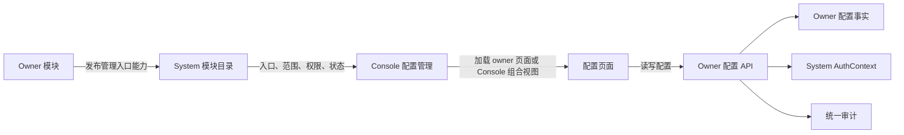

# ADDP 配置规范

## 核心决策

ADDP 的配置按事实来源和生命周期分层管理，不建立由 System 保存所有模块键值的中央配置表，也不允许同一个配置项同时存在数据库值、System 下发值和环境变量 fallback。

- Console 集中呈现配置管理入口，不保存配置值或解释业务字段。
- System 负责模块配置管理能力登记、AuthContext、Permission、统一审计及 System 自己拥有的配置，不理解其他模块的配置语义。
- 每个 owner 模块定义、校验、保存并应用自己的普通运行配置；平台级不等于 System-owned。
- 端口、数据库连接、基础设施地址和进程启动前必须可用的参数属于部署配置。
- 本地开发启动时可将根 `.env` 中的基础设施宿主机端口作为首选值，解析出本次实际端口并注入同一次启动的进程环境。实际映射以 ADDP Compose 容器为准，不另建可编辑的配置事实源，也不覆写根 `.env`。
- 模块加载根 `.env` 时只补齐进程环境中缺失的值；启动脚本或容器显式注入的部署值优先，避免运行时端口被 `.env` 中的首选值覆盖。
- 密钥、密码和 Token pepper 属于 Secret，不进入普通配置表和配置能力声明。
- 资源连接、任务定义和用户偏好保留各自的强类型实体，不降格为通用配置键值。

## 配置分类与事实来源

### 平台观测配置边界（2026-10-04 已确认目标，待实施）

指标、集中日志和追踪的部署选择、中心设施端点及进程启动输入属于部署配置，专用凭据属于 Secret。Monitor 拥有监测目标、阈值、采样/查询策略及其他普通运行配置；System 只维护节点和已有模块/实例/引擎身份，不代存观测策略。

未选择的能力不要求其专用 Secret，不创建远端发送；已选择但配置不完整与运行中不可用分别报告。可选观测配置不加入业务模块或 Monitor 整体 Ready 条件，不以环境变量覆盖已持久化的 Monitor 策略，不新增另一条存储或采集 fallback。现有日志启动入口仍准备和校验标准组合配置，按需裁剪尚未实现。目标部署/状态契约及验收要求见 [平台运行监控与可观测性设计](../next/ADDP平台运行监控与可观测性设计.md)。

### 当前部署配置说明

共享 Meilisearch 固定使用 `1.54.3` 的多架构镜像摘要与独立命名卷 `meilisearch_data_v1543`。旧版本的 `meilisearch_data` 卷只作为历史回滚材料保留，不再作为当前 Compose 挂载路径；升级必须从已核验 dump 导入空的新卷，不能让新二进制打开旧卷。镜像与卷绑定均由基础设施 Compose 唯一定义，不新增运行时配置或双轨服务。

HDFS 首版固定 Simple 开发实验模式。引擎连接的 `webhdfs_endpoint`、`rpc_uri`、`root_path`、`authentication`、`user` 由插件 `ConnectionSpec` 唯一定义；首版 RPC 必须为具体 `hdfs://host:port`，不支持 HA nameservice。Spark 应用部署以 `HADOOP_USER_NAME` 固定 Hadoop 用户，不能按资源切换共享会话的身份；读取前验证当前 Java UGI 用户与引擎 `user` 一致。Business 的 `HDFS_SHARED_HOST` 和四个监听端口归 `business/.env`，不进入平台普通配置，也不保存到工作流任务。Simple 的用户名声明不构成安全认证。

PointCloud、Document 的 HTTP 监听地址由部署入口通过 `WORKFLOW_BIND_HOST` 注入，默认 `0.0.0.0`，用于普通 bridge/Compose 容器内监听。Hosted Online 原生 Linux 使用宿主网络时，标准开发入口固定注入 `127.0.0.1`，并以 `PORT` 指定实际开发端口；`RUNTIME_HOST` 与 `RUNTIME_PUBLIC_PORT` 仍只负责自注册地址，不用于控制监听。该配置随进程启动生效，不保存到业务配置或根 `.env`。

GeoPython 原生开发入口固定 HTTP 监听回环与实际 `PORT`，不注入容器的 loopback 地址改写；GDAL/PROJ 路径从原生安装派生，Runtime 专属 `ODBCSYSINI` 存在于 `.dev-state/geopython-odbc`，不会修改系统 ODBC 配置。产品 Compose 使用服务名，Hosted 栅格产品 Runtime 独立使用宿主网络与回环源地址。

Spark Workflow 原生开发启动固定注入 `WORKFLOW_BIND_HOST=127.0.0.1` 与实际 `PORT`，Java 11 只注入 Spark 子进程。`SPARK_WORKFLOW_SHARED_HOST` 声明 Driver/Executor 共用的地址：macOS 默认为 `host.docker.internal`，需在本机 `/etc/hosts` 配置 `127.0.0.1 host.docker.internal`，容器继续使用 Docker 内置解析；Hosted Linux 为 `127.0.0.1`，普通 Linux 使用路由接口地址。远程部署按实际拓扑显式配置。开发启动不构建镜像，不依赖 Docker Desktop host networking；生产 Compose 按自身网络部署。


| 类别 | 典型内容 | 事实来源 | 维护者 |
| --- | --- | --- | --- |
| 部署配置 | 端口、数据库、Redis、MinIO、Kafka、模块间地址、启动开关 | ADDP 根 `.env`、本地 Business `business/.env`、容器 environment 或部署系统，按部署单元归属 | 部署运维人员 |
| Secret | 数据库密码、Service Client Secret、API Key、pepper、加密密钥 | Secret Manager 或受控环境注入 | 部署运维或安全人员 |
| 平台普通运行配置 | 模块运行策略、全局限额、重试和保留策略 | 对应 owner 模块的持久化配置 | Platform System Administrator |
| 平台安全配置 | 认证、MFA、平台 IdP 和安全策略 | System IAM | Platform Security Administrator |
| Tenant 核心治理配置 | Tenant IAM、组织和治理策略 | System | 当前 Tenant 的治理角色 |
| Tenant 模块业务配置 | 当前 Tenant 的模块策略和默认值 | 对应 owner 模块，必须绑定 `tenant_id` | 获得该模块配置 Permission 的 Tenant 角色 |
| 资源配置 | Engine、Webhook destination、Application 等 | 对应强类型资源实体 | 资源管理角色 |
| 任务与 execution 配置 | 任务定义和本次执行所需参数 | owner 任务定义及 `execution_config` 快照 | 任务维护者或执行发起者 |
| 用户偏好 | 语言、视图和个人默认选择 | 用户偏好实体 | 当前用户 |

代码默认值属于配置定义，不是可以与持久化值并行修改的第二事实源。没有显式持久化值时可以使用 owner 在配置定义中声明的默认值；一旦持久化，读取路径只能使用该值。

## 配置范围与有效值

普通运行配置必须明确声明一种范围策略：

| 范围策略 | 规则 |
| --- | --- |
| `platform_only` | 只存在平台统一值，Tenant 不得覆盖。 |
| `platform_default_with_tenant_override` | 平台提供默认值，Tenant 可以在 owner 声明的约束内覆盖。 |
| `tenant_only` | 只在当前 Tenant Context 中存在，不读取平台运行值。 |

`platform_default_with_tenant_override` 的有效值只按以下顺序解析：

```text
Tenant 显式值 > 平台显式默认值 > owner 配置定义默认值
```

解析链到此结束，不再回退到 System 内部配置 API、根 `.env` 或模块私有 `.env`。Platform Realm 与 Tenant Context 互斥；平台管理员不能通过平台配置入口修改或读取 Tenant 业务配置，Tenant 请求中的 `tenant_id` 必须来自 AuthContext，不能由客户端自报。

每个普通运行配置定义至少声明：

- 稳定 key、owner module 和配置范围；
- 数据类型、默认值、校验规则和可见说明；
- 是否敏感以及 API、日志和审计中的脱敏规则；
- 读取和修改 Permission；
- 生效方式：热更新、模块重启、任务快照或受控迁移；
- 变更后的影响评估、审计事件和必要的重建动作。

### 租户可见性与修改权限

配置的可见性与修改权限分别定义，`platform_only` 表示 Tenant 不得覆盖，并不表示一律向 Tenant 隐藏。对于实际约束租户使用、非敏感且 owner 明确允许租户查看的配置，owner 应在当前 Tenant 的配置读取接口中返回平台统一约束；仍校验该模块的读取 Permission，不授予平台管理权限，也不允许读取其他 Tenant 的配置。

租户页面将“本租户配置”与“平台统一约束（只读）”分组呈现。可覆盖字段标注已保存配置是否继承平台默认；平台约束以清晰的只读数值展示，说明“如需调整，请联系平台管理员”。共享容量必须说明共享范围，不能呈现为本租户独享配额。保存仅提交本租户可修改字段及其版本，后端继续拒绝租户改写平台约束。加载失败时不得把前端初始值呈现为当前平台约束。

Secret、内部连接信息及明确限制 Tenant 读取的安全策略不在此范围；不得因为某配置间接影响租户就自动公开。此规则不改变各 owner 的事实归属，不新增中央配置表或审批流程。

## 配置管理能力声明

各模块通过版本化的 `addp.configuration-management/v1` 契约向 System 发布配置管理入口。该声明是模块目录能力，不是配置定义或配置值，至少包含稳定 entry id、owner module、支持的 scope types、模块前端路由以及读写 Permission。一级配置管理入口按模块聚合：一个模块发布一个稳定的模块级入口；同一模块的多个配置域由该模块页面在内部使用 Tab、分组或其他二级导航组织。

约束如下：

1. 模块 Service Principal 只能发布与自身 owner 一致的入口，重复发布按稳定 entry id 幂等更新。入口引用的读写 Permission 必须在 System Permission 目录中存在、处于 `active` 且其 `owner_module` 等于入口 owner；Permission Key 的首段是资源命名空间，不能代替 `owner_module` 判断归属。
2. 声明不得携带配置键、默认值、当前值、Secret 或模块私有表结构。
3. System 只校验和登记通用契约，不能解释配置字段、代替 owner 校验或成为其他模块配置的 fallback。
4. Console 按当前 AuthContext、Permission 和模块状态聚合入口；具体页面可以由 owner 模块前端提供，也可以由 Console 在 `/configuration/{owner}/...` 下提供跨 owner 的组合视图，但配置 API、字段校验和配置事实始终属于 owner 模块。
   Console 一级列表只展示模块级入口，不按具体配置域拆分菜单；模块内部的二级导航由 owner 页面负责。
5. owner API 必须再次执行 Platform/Tenant Context 和 Permission 校验，不能信任 Console 是否展示了入口。
6. 模块下线时，Console 将入口显示为不可用；System 不代管该模块的配置值。


```mermaid
flowchart LR
    Owner["Owner 模块"] -->|"发布管理入口能力"| Registry["System 模块目录"]
    Registry -->|"入口、范围、权限、状态"| Console["Console 配置管理"]
    Console -->|"加载 owner 页面或 Console 组合视图"| OwnerUI["配置页面"]
    OwnerUI -->|"读写配置"| OwnerAPI["Owner 配置 API"]
    OwnerAPI --> OwnerStore["Owner 配置事实"]
    OwnerAPI --> Auth["System AuthContext"]
    OwnerAPI --> Audit["统一审计"]
```

System 的 `platform.configuration.read/update` 只允许管理 System-owned 的普通平台配置，不能成为跨 owner 的万能权限。业务模块必须声明自己的平台或 Tenant 配置 Permission，并执行最终授权。

## 生效与变更规则

- `hot_reload`：保存成功后由 owner 原子发布新版本，新请求使用新值，运行中的 execution 保持原快照。
- `restart_required`：保存后记录待生效版本和原因，由平台运维按受控流程重启模块；不得伪装成已经生效。
- `execution_snapshot`：任务创建、更新或执行时固化完整有效配置，后续平台或 Tenant 默认值变化不能静默改变历史 execution。
- `migration_required`：涉及数据库结构、索引、加密材料或产物格式时，只能进入显式迁移流程，普通配置 API 必须拒绝直接修改。

配置变更必须记录 owner、scope、配置版本、操作者、结果和脱敏后的差异。Secret 只能记录是否设置、版本或引用，不能进入响应、日志、审计详情或管理能力声明。

### Develop 查询策略

Develop 配置统一由 `develop.query_policy` 持久化。平台管理员维护默认查询超时、最大超时、预览行数、单 Backend 总并发（默认 20）和单 Engine Instance 并发（默认 5）；Tenant 只能覆盖默认超时，不能改写平台上限。两个并发数必须为正整数，单引擎上限不得大于总并发。

Develop 租户配置页只读展示当前最大查询超时、结果预览上限、总查询并发和单引擎查询并发；后两者均为每个 Backend 内跨租户、跨来源共享的上限，不是租户独享配额。默认超时标注继承平台默认或本租户已设置，保存提示只说明租户默认超时作用于新建执行，不暗示租户能够调整并发。读取与保存继续使用现有查询策略接口；页面展示、来源标注、只读权限、刷新和保存字段白名单由 `make test-console-frontend` 的浏览器测试覆盖，现有 Platform CI 调用同一入口。

并发采用 `hot_reload`：每次调度从平台策略读取一对完整上限，默认每秒检查一次；本进程保存后唤醒调度器，其他实例在下一轮读取生效。调高增加可领取数量；调低不取消已运行查询，活动数低于新上限后再领取。按 execution 冻结的 Runtime `engine_id` 分组，不按租户或 source 分裂。同一实例内所有来源共享限额；部署多个 Backend 时各实例独立应用上限。Monitor 心跳报告最新应用容量与真实活动数，缩容期间允许活动数暂时高于容量。

超时、结果预览采用 `execution_snapshot`：创建 execution 时解析平台策略及租户默认超时，固化有效 `timeout` 和 `query_result_limit`；查询授权预算、实际执行及结果裁剪都消费该快照。配置读取失败必须返回错误，不回退环境变量。并发不是 execution 快照，pending 查询按领取时策略调度。缺少必需快照的 execution 明确失败，不保留旧运行路径。

这些普通运行配置不再提供环境变量入口。租约、心跳和领取轮询仍属于进程部署参数。此变更由 Develop Go T1、PostgreSQL T2、Console 配置浏览器测试和现有平台门禁覆盖。

## 根目录环境配置唯一路径

- 根目录 `.env.example` 是 ADDP 基础设施和模块进程环境变量的唯一模板；独立 Business 容器使用 `business/.env.example`。
- ADDP 基础设施和模块进程实际配置统一使用根目录 `.env`；生产环境也不使用 `.env.prod` 或其他平行文件。
- 本地 Business 引擎容器由 `business/.env` 独立配置；根 `.env` 不保存 Business PostgreSQL、Business MinIO 的账号和密码。辅助脚本从 `business/.env` 读取这些凭据，容器实际映射端口以 Business Compose 为准；Engine Instance 连接信息由 System 管理。
- 模块进程可以接收容器或启动脚本显式注入的模块配置，但不再维护独立的长期 `.env` 路径。
- 模块代码不得硬编码 `../../.env` 等相对路径，也不得加载 `.env.local` 形成覆盖层；标准启动脚本负责把根 `.env` 注入进程环境。
- `.env` 和任何 Secret 不得提交到 Git；模板中只保留开发默认值、空值或明确的占位值。
- 只有模块连接 owner 持久化存储之前就必须知道的配置才能保留在环境变量中；普通运行配置不得因为读取失败退回环境变量。

`SYSTEM_URL`、`GATEWAY_URL`、`MANAGER_URL`、`STANDARD_URL` 和 `MODEL_URL` 是部署级模块地址，不是 System 下发配置。本地开发模板使用显式回环地址，容器与生产编排必须覆盖为该部署内的实际地址。T4 专用 Runner 的仓库外环境文件必须显式提供参与套件的地址；进程乱序套件至少需要前三项，且通用预检拒绝非回环目标。专用 Runner 不得把仓库根 `.env` 作为第二条配置路径。

Catalog 当前使用 `CATALOG_SOURCE_SYNC_INTERVAL`、`CATALOG_PROJECTION_INTERVAL` 和 `CATALOG_RESPONSIBILITY_RECONCILIATION_INTERVAL` 控制进程内后台调度周期，默认分别为 `30s`、`2s` 和 `5m`。责任对账周期只决定 Catalog 何时批量复核 System 主体引用，不改变责任关系或治理任务的事实语义；System 暂时不可达时对账延后，不影响 Catalog Ready。这些变量必须由部署环境在进程启动前确定，不由 System 下发，也不能在运行中形成另一套动态值。

IAM 环境密钥边界：

- ADDP 只签发随机 opaque Token，不签发或解析用户 JWT，因此禁止配置 `JWT_SECRET`。
- 三员账号只能通过离线 IAM Bootstrap 建立；Bootstrap Secret、三员密码、TOTP Secret 和验证码均不得进入环境变量。
- `OAUTH_USER_CODE_PEPPER`、`IAM_MFA_ENCRYPTION_KEY` 和各业务模块独立的 `*_SERVICE_CLIENT_SECRET` 是生产环境必需的 IAM Secret。`SYSTEM_SERVICE_CLIENT_SECRET` 是明确的可选项：仅用于 System 以独立 `addp-system` Tenant Service 身份反查 Catalog 的持久办理依据；未配置不阻断 System Ready 或历史核清，但新受理返回 `503 fulfillment_capability_unavailable`。不借用其他 Secret，不改变目标批准要求，不推导 Catalog 已退出。
- 全新生产配置生成独立 System Secret；已有配置只校验，缺失时不静默增加或轮换。非空值同样必须为独立的 32–72 字节 Secret。移除配置时，启动 Provisioner 将该 OAuth Client 停用并撤销其旧会话；重新配置走同一凭据路线。Catalog URL 来自 `CATALOG_URL`，不作为 System Ready 探测前置。
- `OAUTH_PREVIOUS_USER_CODE_PEPPER` 只能在受控轮换窗口临时设置，轮换完成后必须删除。
- `ENCRYPTION_KEY` 用于引擎连接信息等平台数据加密，不是 Token 签名密钥，不得与上述 IAM Secret 复用。

AI 推理密钥边界：

- 在线厂商 API Key 或内网模型服务凭据属于 Inference owner 的 Provider Connection credential，不再由 Agent、Copilot、Manager 的环境变量注入。
- Inference 使用部署级 `ENCRYPTION_KEY` 加密凭据；该 Key 仍由部署系统注入，不进入数据库或配置页面。
- 凭据设置和轮换使用专用操作，普通 Provider 更新 API 不接受 credential 字段。
- 任何读取 API 只返回 `configured` 和单调递增 `version`，不得返回明文、掩码值、末尾字符或可复用密钥引用。

### System IAM 安全策略

System IAM 安全策略是 `platform_only` 的 System-owned 平台安全配置，由 Platform Security Administrator 使用 `iam.security_policy.read/update` 维护。Platform System Administrator 不继承该职责，Tenant Context 不得读取或修改。

当前策略只包含以下普通运行字段：

| 字段 | 单位 | 约束 |
| --- | --- | --- |
| Access Token TTL | 分钟 | `1-60` |
| Delegated Access Token TTL | 分钟 | `1-2` |
| Browser Resource Access Ticket TTL | 分钟 | `1-60`，且不得大于 Access Token TTL |
| Refresh Token Family TTL | 天 | `1-365` |
| OAuth Authorization Code TTL | 分钟 | `1-5` |
| OAuth Device Code TTL | 分钟 | `5-30` |
| OAuth Device Poll Interval | 秒 | `5-60` |
| Tenant Invitation TTL | 小时 | `1-720` |
| OAuth public rate limit | 次/分钟 | `1-10000` |
| OAuth authenticated-user rate limit | 次/分钟 | `1-10000` |

策略保存到 `system.iam_security_policy` 单例表，以 `version` 做乐观并发控制，并记录 `applied_version`。IAM Runtime 在启动时只读取一次当前持久化版本并把它标记为已应用；更新 API 保存新版本后必须返回 `pending_restart=true`，直到 System 受控重启后才生效。该策略不热更新，不从根 `.env`、模块私有 env 或代码外部参数回退。

策略更新必须与 `iam.security_policy.updated` 审计事件在同一事务提交。审计只记录版本和普通数值字段差异，不记录 Token、Pepper、MFA Secret、Service Client Secret 或任何其他密钥材料。

模块通过 System 获取 AuthContext、Engine Instance 和其他 System-owned 业务事实，不通过 System 获取本模块进程数据库密码、加密密钥或普通运行配置。业务数据源连接信息继续以 System `engines` 强类型资源为事实源；这不等于 System 是所有配置的事实源。

### Ontology FalkorDB 部署配置

Ontology Backend 使用 `ONTOLOGY_BACKEND_PORT=8195`、`SYSTEM_URL` 和既有独立 `ONTOLOGY_SERVICE_CLIENT_SECRET`。`INFRA_FALKORDB_ADDRESS` 在宿主开发默认为 `127.0.0.1:16479`，容器部署显式覆盖为 `falkordb:6379`；密码只读取 `INFRA_FALKORDB_PASSWORD`。这些配置在启动前生效，不接受用户 API 修改。

FalkorDB 是 Ontology 私有 Infra，不进入 System Engine 注册，也不复用 Infra Redis。根 `.env` 的 `INFRA_FALKORDB_PASSWORD` 是独立 Secret，必须非空；生产初始化生成随机值，禁止使用模板开发密码或复用 Redis 密码。宿主开发连接首选 `127.0.0.1:16479`，端口冲突时由 Infra 启动入口解析实际端口并注入 `INFRA_FALKORDB_ADDRESS`；容器通过 `falkordb:6379` 连接。不开放 Browser。

`scripts/infra/falkordb.yml` 是正式 Compose 与 disposable T2 共用的服务定义，随现有 Infra 打包路径发布，固定镜像 digest、非零查询预算、线程/查询内存/队列上限和容器资源限制。`/data` 使用独立 `falkordb_data` 卷，采用 RDB 快照；PG 仍是恢复权威，RDB 不能替代发布摘要校验与重建。此单机配置只用于本地开发/受控同机网络，未声明生产 TLS、HA 或灾备认证。

### Standard 文档文件部署配置

Standard 文档文件由 Standard owner 写入 ADDP infra MinIO 的 `standard` bucket。以下参数在服务启动前生效，属于部署级资源保护配置：

```bash
# 单个文档文件最大字节数，默认 100 MiB。
STANDARD_DOCUMENT_MAX_FILE_SIZE=104857600

# 单次 MinIO 上传、预检、下载或删除操作的超时。
STANDARD_DOCUMENT_STORAGE_TIMEOUT=30s
```

上传采用唯一对象 Key；数据库成功切换 `documents.file_key` 后，旧对象进入 `standard.document_file_cleanups` 持久化补偿队列。该队列只记录已经失效且等待物理删除的对象，不是文件引用的第二事实源。

### Manager 导入中转对象存储

Manager 的 Shapefile 导入不是由 Manager 自己解析写库。Manager 只负责接收 ZIP 包、上传到中转对象存储，然后创建并触发 Transfer `sync`：

```json
{
  "source": {
    "locator": "addp-infra://minio/manager/tenant_7/import/20260622/upload-uuid/roads.shp?type=object",
    "data_type": "table",
    "representation": "encoded",
    "format": "shapefile"
  }
}
```

Manager 上传导入文件时写入 ADDP infra MinIO 的 `manager` bucket，并通过 `addp-infra://minio/manager/...` locator 调用 Transfer。infra MinIO 不进入 System engines，上传暂存对象也不进入 Meta。
对于 Shapefile 多文件上传，source locator 指向 primary `.shp`；同 basename 的 `.dbf`、`.shx`、`.prj`、`.cpg` 等组件随同写入同一暂存目录，由 Transfer 按格式能力读取相关 refs。

相关环境变量：

```bash
MINIO_API_PORT=19000
MINIO_ROOT_USER=minioadmin
MINIO_ROOT_PASSWORD=minioadmin
```

宿主机开发时由 `MINIO_API_PORT` 组成 `localhost:<port>`；容器部署由 Compose 显式注入
`MINIO_ENDPOINT=minio:9000`。模块不得读取 `MINIO_SYSTEM_*`、`MINIO_ACCESS_KEY` 或
`MINIO_SECRET_KEY` 等平行别名。

规则：

1. Manager 负责上传暂存和后续 cleanup，Transfer 只按 locator 读取。
2. 暂存路径使用 `tenant_{tenant_id}/import/{yyyymmdd}/{upload_uuid}/...`。
3. 当前导入入口支持一个 Shapefile ZIP 包，或浏览器同时选择同一套 Shapefile 的多个组件文件；`.shp/.dbf/.shx` 必须同 basename，不能混入多套 Shapefile。

### Manager 栅格 mosaic 生成配置

栅格 mosaic 生成是离线任务，Manager 通过 GeoPython Workflow 的 `build_raster_mosaic` 算子执行 GDAL 处理。该调用不同于在线瓦片渲染，允许更长的执行预算：

```bash
# 容器版 GeoPython Workflow 的 gunicorn worker 超时。默认 7200 秒。
GEOPYTHON_WORKFLOW_GUNICORN_TIMEOUT=7200
```

栅格 mosaic 生成超时已迁移为 Manager 配置页面中“快显策略”Tab 的平台普通运行配置，作为后续 execution 的默认预算；GeoPython 容器的 `GEOPYTHON_WORKFLOW_GUNICORN_TIMEOUT` 仍由部署环境维护。

leaf COG 生成并发不通过全局环境变量固定，而是在任务 `config.cog` 中归一化为明确值。默认策略按运行机器 CPU 预算计算：逻辑 CPU 小于 8 时 `leaf_concurrency=1`，8 到 15 时为 `2`，16 到 31 时为 `4`，32 及以上时为 `6`，上限 `8`；单个 leaf COG 的 GDAL `num_threads` 默认按 `逻辑 CPU / (leaf_concurrency * 2)` 计算并限制在 `1` 到 `4`。当前 18 逻辑 CPU 开发机默认得到 `leaf_concurrency=4`、`num_threads=2`。`cog.leaf_retry_attempts` 默认 `2`，上限 `5`，用于单个 leaf COG 生成或校验的瞬时失败重试。`detached` 模式重跑时会复用目标数据集中已经存在且内容级 COG 校验通过的 leaf，因此超时或中断后的恢复通过再次执行同一任务继续完成未生成部分，而不是从头覆盖全部 leaf。

### Manager 有界执行监督器配置

Manager 的快显派生、业务派生、PPTX 静态预览、向量化和数据剖析 execution 统一由 Manager Backend 内嵌有界执行监督器领取，执行 API 只创建 `pending` execution。以下配置属于 Backend 运行容量与租约治理，不进入任务定义，也不在配置页面中维护：

```bash
MANAGER_EXECUTION_CONCURRENCY=4
MANAGER_EXECUTION_LEASE_DURATION=2m
MANAGER_EXECUTION_HEARTBEAT_INTERVAL=30s
MANAGER_EXECUTION_CLAIM_INTERVAL=1s
MANAGER_EXECUTION_IDLE_MAX_INTERVAL=5s
```

并发数和四个时间项必须为正，心跳周期必须短于租约，空闲最大间隔不得小于基础领取间隔。协调器在全部 Manager bounded task type 中统一领取，空队列时指数退避；本进程新建 pending execution 会立即唤醒领取，唤醒丢失或其他 Manager 实例入队时最迟在空闲最大间隔后发现。Manager Backend 进程失联且租约过期时，该 execution、任务摘要和构建中的结果会原子收敛为失败；当前所有 task type 都不会自动重放，用户显式重试时创建新的 execution。

### Manager 向量化配置

Manager 向量化的模型提供能力统一来自 Inference Runtime。Manager 只保存 `manager.embedding` Scenario Binding、向量检索策略、成本限制和 execution 快照，不保存模型服务 Base URL、上游模型标识或 API Key。

| 字段 | 归属与规则 |
| --- | --- |
| Model Profile / Deployment 绑定 | Manager Scenario Binding；平台默认可被 Tenant 显式绑定覆盖。 |
| 请求 timeout | Manager 平台普通运行配置。 |
| 向量检索最大距离 | Manager 平台检索默认策略；当前不开放 Tenant 覆盖。 |
| 最大文件大小 | Manager 平台成本与资源限制；当前不开放 Tenant 覆盖。 |
| 批处理并发数 | Manager 平台运行资源策略。 |
| 向量维度 | 模型输出与 pgvector 列结构的只读约束，不是普通可编辑配置。不同维度切换必须走数据库迁移和全量重建。 |
| Provider credential | Inference 专用加密凭据；Manager API、表和 execution 均不得持有。 |

Manager 配置定义提供业务策略默认值；显式平台值和 Tenant 覆盖保存在 Manager 自己的持久化配置中，不从环境变量回退。Manager 必须先解析当前场景绑定，再调用 `addp.inference/v1`；未配置、无授权或能力不匹配时返回明确错误，不能直连其他模型服务。

任务定义和 execution 中的 `model_profile_id/profile_version/deployment_id/dimension/binding_version` 是实际使用配置的快照。场景绑定变化只影响后续创建或显式更新的任务及后续 execution，不能改写历史执行事实。

`MANAGER_EMBEDDING_SERVICE_API_KEY` 不再存在。Provider credential 只在 Inference owner 中保存和解密。

### Transfer continuous 运行观测配置

以下运行策略迁移到 Transfer owner 的平台配置中，配置页面按“持续同步策略”分组维护；保存后的版本对新建或重新启动的 continuous runtime 生效。Infra Kafka 连接、topic 保留容量和 DLQ reconciler 的采样细节仍属于部署配置。

Transfer continuous worker 自己采集业务 Kafka或内部 CDC topic 的分区 earliest/latest position，并把 lag 和 retention 恢复窗口写入统一 execution metadata。Monitor 只读取该 metadata，不直连 Kafka。PostgreSQL CDC consumer 使用 Infra Kafka 独立 `transfer` principal，读取 `INFRA_KAFKA_BOOTSTRAP_SERVERS`、`INFRA_KAFKA_TRANSFER_PASSWORD`、`INFRA_KAFKA_SECURITY_PROTOCOL` 和相同 TLS 配置；这些部署字段不进入 System Engine 或任务 JSON。

Transfer 配置页面的“连续任务策略”Tab 维护 diagnostics、retention、checkpoint 和 recovery 字段；这些字段不再通过环境变量注入。以下仍属于部署治理的 DLQ 采样配置：

```bash
# DLQ payload availability 低频核验。仅属于 Transfer 部署治理，不进入任务 JSON。
TRANSFER_DLQ_RECONCILE_INTERVAL=1m
TRANSFER_DLQ_RECONCILE_BATCH_SIZE=100
TRANSFER_DLQ_RECONCILE_TIMEOUT=10s
TRANSFER_DLQ_RECONCILE_FETCH_MAX_BYTES=10485760
```

critical 阈值必须小于 degraded 阈值；checkpoint 停滞阈值必须大于 diagnostics 采样间隔。恢复初始退避不得大于最大退避，最大连续失败次数必须为正，circuit 冷却时间和稳定运行阈值必须为正。这些阈值是 Transfer runtime 统一运维策略，不写入用户 task config，也不按任务开放第二条判定路径。

DLQ reconciler 的 interval、timeout、batch size 和 fetch bytes 必须为正；batch size 最大 1000，fetch bytes 不得超过 Kafka 客户端的 `int32` 上限。reconciler 只核验 Infra Kafka 精确 payload reference 并以 CAS 收敛 `payload_available`，不读取业务 Kafka、不提交消费位点，也不把原始 payload 写入日志或 API。

Monitor 每隔以下时间评估最新 active execution 的公共 metadata，将观测信号物化为告警事件。该配置不进入任务 JSON；Monitor 不因此读取 Transfer 私有表或业务 Kafka。

配置管理迁移后，Monitor 的告警评估、Webhook/邮件投递超时、最大尝试次数和退避策略属于 Monitor-owned `platform_only` 普通运行配置。Webhook 私网访问开关、Console 外部地址仍属于部署安全边界。

SMTP Relay 作为 Monitor-owned 平台强类型资源管理：地址、端口、TLS 模式和发件身份是普通字段，用户名和密码使用专用加密凭据字段，读取 API 只返回 `configured/version`。

Service 的健康检查与元数据刷新计划属于 Service-owned `platform_only` 普通运行配置，保存后按受控重启生效。

Manager 的在线底图供应商作为 Manager-owned 强类型资源管理。平台可提供默认资源，Tenant 可以在允许的范围内覆盖；高德、天地图浏览器 Key 属于客户端可见凭据，不将其当作服务器 Secret，但管理 API 仍只返回配置状态，运行时端点按授权返回浏览器确需的公开 Key。

以下变量没有形成实际运行路径，禁止继续暴露在配置页面：`COPILOT_ENABLE_STREAMING`、`COPILOT_MAX_TOKENS_PER_DAY`、`COPILOT_RATE_LIMIT`、`DISABLE_SSL_VERIFY`、`WORKER_COUNT`、`TASK_QUEUE_NAME`、`MAX_RETRIES`。Meta 与 Transfer 的 worker 并发和重试等待使用模块独立的部署参数，不再共享 `CONCURRENT_TASKS`、`RETRY_DELAY`。

```bash
MONITOR_ALERT_EVALUATION_INTERVAL=15s

# Webhook delivery dispatcher 轮询周期、HTTP 超时和 claim lease。
MONITOR_WEBHOOK_DISPATCH_INTERVAL=2s
MONITOR_WEBHOOK_HTTP_TIMEOUT=10s
MONITOR_WEBHOOK_LEASE_DURATION=30s

# delivery 最大尝试次数和指数退避边界。
MONITOR_WEBHOOK_MAX_ATTEMPTS=8
MONITOR_WEBHOOK_RETRY_INITIAL_BACKOFF=5s
MONITOR_WEBHOOK_RETRY_MAX_BACKOFF=5m

# 默认 false：拒绝 HTTP、环回、私网、链路本地和云 metadata 目标。
# 只在本地联调或明确受管内网部署中开启。
MONITOR_WEBHOOK_ALLOW_PRIVATE_NETWORKS=false

# 本地开发的 Monitor 链接由 scripts/dev/ports.sh 注入 Console 实际端口；容器部署从 ADDP_PUBLIC_ORIGIN 注入统一入口。

# 邮件投递策略和 SMTP Relay 已迁移到 Monitor 配置管理页。
# 凭据只通过专用凭据接口写入 Monitor-owned 加密字段。
```

Webhook destination 的 HMAC secret 使用平台统一 `ENCRYPTION_KEY` 做 AES-256-GCM 加密，不新增 Monitor 私有加密密钥。dispatcher 配置属于部署策略，不进入任务定义或普通用户请求；`MONITOR_WEBHOOK_ALLOW_PRIVATE_NETWORKS` 只能由部署者设置，API 不提供绕过开关。

邮件第一版只允许 `starttls|tls`，不支持明文或机会式降级，也不根据端口猜测 TLS 模式。SMTP Relay 由平台管理员在 Monitor 配置页维护；host 为空或 Relay 未启用时邮件 dispatcher 不启动，既有 `pending` outbox 会在补齐配置并重启后继续投递。SMTP 密码只存在 Monitor-owned 加密字段，读取接口只返回 `configured/version`，不进入 System Engine、任务 JSON、租户 API 或投递审计。

### Infra Kafka、Kafka Connect 与 Capture Supervisor 配置（工作包 3B/3C 已实现）

Infra Kafka 是 ADDP 部署资源，不进入 System Engine。正式实现固定为 Redpanda v24.3.18 + Debezium Connect 3.6.0.Final；开发环境为 1 broker/1 Connect，生产参考为 3 broker/至少 2 Connect worker。平台只暴露 Kafka API 数据面，不提供 Apache Kafka/Redpanda 运行时选择。

```bash
# 仅供 ADDP 内部组件使用；不写入用户任务 JSON。
INFRA_KAFKA_BOOTSTRAP_SERVERS=localhost:19092
INFRA_KAFKA_ADMIN_USERNAME=admin
INFRA_KAFKA_ADMIN_PASSWORD=change-in-production
INFRA_KAFKA_CDC_TOPIC_PREFIX=__addp_cdc.
INFRA_KAFKA_CDC_RETENTION=168h
INFRA_KAFKA_CDC_RETENTION_BYTES=
INFRA_KAFKA_CDC_REPLICATION_FACTOR=1
INFRA_KAFKA_INTERNAL_REPLICATION_FACTOR=1
INFRA_KAFKA_SECURITY_PROTOCOL=sasl_plaintext
INFRA_KAFKA_SASL_MECHANISM=scram-sha-256
INFRA_KAFKA_TLS_CA_CERT_FILE=
INFRA_KAFKA_TLS_INSECURE_SKIP_VERIFY=false
INFRA_KAFKA_DISK_DEGRADED_PERCENT=75
INFRA_KAFKA_DISK_CRITICAL_PERCENT=85

# 生产 HA profile 的单 broker 内存与额外宿主机 listener。
REDPANDA_HA_MEMORY=1G
REDPANDA_HA_KAFKA_2_PORT=19093
REDPANDA_HA_KAFKA_3_PORT=19094

KAFKA_CONNECT_URL=http://localhost:18083
KAFKA_CONNECT_USERNAME=
KAFKA_CONNECT_PASSWORD=
KAFKA_CONNECT_TIMEOUT=15s
KAFKA_CONNECT_LOOPBACK_HOST=host.docker.internal
KAFKA_CONNECT_BOOTSTRAP_SERVERS=redpanda:29092
KAFKA_CONNECT_KAFKA_USERNAME=connect
KAFKA_CONNECT_KAFKA_SECURITY_PROTOCOL=sasl_plaintext
KAFKA_CONNECT_KAFKA_TLS_CA_CERT_FILE=
KAFKA_CONNECT_GROUP_ID=addp-connect-cluster
KAFKA_CONNECT_CONFIG_TOPIC=__addp_connect_configs
KAFKA_CONNECT_OFFSET_TOPIC=__addp_connect_offsets
KAFKA_CONNECT_STATUS_TOPIC=__addp_connect_status

TRANSFER_CAPTURE_PROVISIONING_TIMEOUT=60s
TRANSFER_CAPTURE_STATUS_POLL_INTERVAL=1s
TRANSFER_CAPTURE_MONITOR_INTERVAL=15s
TRANSFER_CONTINUOUS_RUNTIME_STOP_TIMEOUT=45s
TRANSFER_CONTINUOUS_RUNTIME_STOP_POLL_INTERVAL=250ms
TRANSFER_META_SCAN_CLAIM_TTL=2m
```

生产环境必须显式设置 `INFRA_KAFKA_CDC_RETENTION_BYTES`，并按峰值写入速率、7 天恢复窗口、副本因子和安全余量校验磁盘容量；time/bytes 任一边界先到都会删除旧 segment。开发状态脚本按 75%/85% 展示 degraded/critical 磁盘水位。生产耐久语义固定为 3 副本、producer `acks=all`、至少 2 broker 确认，由 RF=3 的 Raft majority 实现；Transfer 不读取或下发 `min.insync.replicas` topic 属性。`INFRA_KAFKA_INTERNAL_REPLICATION_FACTOR` 控制 Connect internal topics 的副本数，生产设为 3。凭据分别由 infra admin、Kafka Connect 和 Transfer consumer 使用，不复用业务 Kafka Engine 凭据。`INFRA_KAFKA_SASL_MECHANISM` 固定为部署级 `scram-sha-256`，由 Infra admin、Connect、Transfer continuous 和 DLQ 共同消费，禁止进入用户任务配置。正式单机开发 Compose 仅在本机和 Docker 网络使用 `SASL_PLAINTEXT/SCRAM-SHA-256`；生产 HA profile 必须使用 `SASL_SSL`，固定 `write.caching=false`、Connect producer `acks=all`、10 秒 scheduled rebalance delay，并使用 `19092/19093/19094` 三个本地 external listener。broker service/container/DNS 固定为 `redpanda`/`addp-redpanda`/`redpanda:29092`，一次性 `redpanda-init` 使用同一 Redpanda 镜像内置的 `rpk` 初始化 SCRAM 用户、Connect internal topics 和 ACL；不得恢复 `kafka` broker service、Apache Kafka CLI 镜像或第二套初始化容器。拓扑参数与 Redpanda 原生健康观测只存在于部署/认证层。`KAFKA_CONNECT_LOOPBACK_HOST` 只用于 Connect 容器访问登记为 localhost/loopback 的开发业务库，不改写远程数据库主机。capture supervisor 已负责显式创建单分区 CDC topic、托管 connector、登记 generation/resource、监控状态和幂等 stop/cleanup。`TRANSFER_META_SCAN_CLAIM_TTL` 统一用于 continuous 首次目标扫描和 additive migration 后扫描的持久化 claim 租期；只用于进程崩溃后的过期接管，不是扫描结果超时，也不进入任务配置。该值必须大于 Meta client 固定的 60 秒 HTTP 超时，默认 2 分钟，为调用完成和 token fencing 留出余量。

Business MySQL 作为本地 CDC 测试源时使用独立配置文件 `business/.env`：

本地 `business/scripts/start.sh` 将 `POSTGRES_PORT`、`MYSQL_PORT`、`MINIO_API_PORT`、`MINIO_CONSOLE_PORT` 视为首次启动首选值；首次冲突自动选择空闲宿主机端口，成功后固定在 `business/.business-state/ports.env`。已登记的 Engine Instance 不随重启改写物理端点。宿主机开发进程登记实际发布端口；同一 Compose 网络内的进程登记 `business-*` 服务名和固定容器端口。

```bash
MYSQL_ROOT_PASSWORD=change-in-production
MYSQL_DATABASE=business
MYSQL_PORT=3306
MYSQL_CDC_USER=addp_cdc
MYSQL_CDC_PASSWORD=change-in-production
```

`MYSQL_CDC_USER` 只允许字母、数字和下划线，`MYSQL_CDC_PASSWORD` 不得为空且不得与 root 密码复用。`business/scripts/start.sh -mysql` 在 MySQL ready 后每次执行专用账号初始化，因此已有 volume 也会更新密码并把权限收敛到 Debezium 所需集合；不要把 root 凭据登记为 System MySQL Engine。Business Compose 显式固定非零 server id、binlog、ROW format 和 FULL row image。

Business OceanBase CE 使用独立配置，固定可重现的 `oceanbase/oceanbase-ce:4.4.2-lts` 镜像，不使用 `latest`：

```bash
OCEANBASE_IMAGE=oceanbase/oceanbase-ce:4.4.2-lts
OCEANBASE_MODE=mini
OCEANBASE_TENANT_NAME=test
OCEANBASE_PASSWORD=change-in-production
OCEANBASE_DATABASE=business
OCEANBASE_PORT=2881
```

本地容器是单机测试形态，不表达生产集群拓扑。System 注册时使用 `engine_type=oceanbase`、容器网络地址 `business-oceanbase:2881`、账号 `root@test` 和配置的 database/password；不得改登记为 MySQL Engine。

OceanBase 的容器内网 IP 属于其持久化单节点集群身份。Business 启动时从 OBD 配置读取已部署地址，在显式网段的 `business_business-network` 上恢复该地址；网段保存在忽略版本控制的 `business/.business-state/network.env`。标准停止与重启保留网络，地址冲突或网段无法恢复时拒绝启动，不以新 IP 初始化旧数据。宿主机连接仍使用回环地址和 `OCEANBASE_PORT`，不登记笔记本的局域网 IP。

Business TiDB 固定使用 PingCAP 官方 8.5.8 `pd`、`tikv`、`tidb` 三组件镜像及 OCI digest，Compose 不提供镜像覆盖入口；同一镜像契约同时用于 Linux x86_64 GitHub Hosted 与 macOS Docker Desktop。TiKV 容器固定声明 `nofile` soft/hard limit 为 `1000000`，满足官方对进程文件描述符上限的要求，Business 与 disposable T2 不得分叉配置。启动不读取 License 文件、不执行激活，也不得替换为 Enterprise 或第三方重打包镜像。

```bash
TIDB_DATABASE=business
TIDB_USER=root
TIDB_PASSWORD=
TIDB_PORT=4000
```

`business/scripts/start.sh -tidb` 启动三组件并幂等初始化普通关系样例。System 注册时使用独立 `engine_type=tidb` 和配置的 database/user/password；ADDP 服务以宿主机进程运行时连接 `localhost:${TIDB_PORT:-4000}`，以 Business Compose 同网络容器运行时连接 `business-tidb:4000`。不得登记为 MySQL Engine，也不得据 MySQL 协议兼容性声明 CDC、空间或分区变化应用能力。

Business openGauss 固定使用 openGauss 6.0.6 LTS 官方 Docker tar，不接受第三方镜像或可变 tag。当前 `business/scripts/start.sh -opengauss` 只允许在具备 NUMA 的 Linux x86_64 主机选择并校验官方 x86_64 介质，加载为 `opengauss:6.0.6`；首次下载约 1.4 GB，后续复用本地镜像和缓存。官方 6.0.6 Docker 构建包含 MOT，而 Docker Desktop for macOS 不提供它需要的 NUMA 拓扑，因此 macOS 本地巡检不启动 openGauss，实库门禁由 GitHub Actions Linux x86_64 Job 承担。`scripts/lib/opengauss-official-media.sh` 仍维护 aarch64 官方介质事实，供后续具备 NUMA 的 Linux ARM64 专项认证使用，未认证前不得作为 Business 默认路径。

Business KingbaseES 不进入通用 `.env` 或 `scripts/start.sh -all`。`business/docker-compose.yml` 只声明独立 `kingbase` profile；`business/scripts/start.sh -kingbase` 必须独立调用，并由 `business/scripts/kingbase.sh` 只从当前 shell 读取 `KINGBASE_DATABASE`、`KINGBASE_USER`、`KINGBASE_PASSWORD`、`KINGBASE_PORT`、`ADDP_KINGBASE_LICENSE_FILE` 和 `ADDP_KINGBASE_LICENSE_SHA256`，按 Compose create、License 注入、Compose start 的唯一顺序管理容器。License 必须是仓库外绝对路径，密码和 License 不得写入仓库。官方介质按宿主 CPU 在同一 build 的 x86_64 与 ARM64 tar 中选择并校验固定 SHA-256，加载后统一使用 `addp/kingbase:v009r001c010b0004` 本地引用；macOS ARM64 只承担本地功能评估，正式 T5/T2/T4 仍固定 owner-managed Linux x86_64。容器归属 Docker Desktop 的 `business` Compose 分组，只绑定 `127.0.0.1:${KINGBASE_PORT:-5436}`，不使用数据卷；System 必须以 `engine_type=kingbase` 和 PG 模式连接信息登记。

KingbaseES T5、T2 与 T4 workflow 的 `addp-kingbase` GitHub Environment 只配置 Repository Variable `ADDP_KINGBASE_GATE_ENV_FILE`，值为专用 Runner 上仓库外 owner-only 文件的绝对路径。该文件权限必须拒绝 group/other，至少包含 `ADDP_KINGBASE_LICENSE_FILE`、`ADDP_KINGBASE_LICENSE_SHA256` 与 T2 使用的 `ADDP_TEST_KINGBASE_PASSWORD`；License 路径同样必须位于仓库外。不得把 License 内容、License 路径、数据库密码或环境文件内容保存到 GitHub Repository Secret、checkout、日志或 Artifact。

Business 达梦 DM8 ARM64 不进入通用 `.env` 或 `scripts/start.sh -all`。`business/scripts/start.sh -dameng` 必须独立调用，仅从当前 shell 接受可选 `DAMENG_PORT` 和仓库外临时介质缓存目录 `ADDP_DAMENG_MEDIA_CACHE`；数据库测试账号与初始化密码固定在 disposable 本地镜像路线中，不得用于生产。脚本只接受 Docker Server `linux/arm64`，校验官方 ZIP 与内层 ISO SHA-256 后构建 `addp/dameng:dm8-20260708-arm64`，并用无卷 `business-dameng` 暴露 `127.0.0.1:${DAMENG_PORT:-5236}`。System 使用插件 ConnectionSpec 保存 `engine_type=dameng` 的 `host`、`port`、`user`、`password`；官方驱动仅由专用脚本从同版本镜像提取并校验后注入 Linux ARM64 Docker 执行进程，不进入 checkout、Module cache 或 Artifact。

```bash
OPENGAUSS_PASSWORD=change-in-production
OPENGAUSS_DATABASE=business
OPENGAUSS_PORT=5435
```

本地容器使用 PG 兼容 database，固定账号 `gaussdb`。System 注册时使用 `engine_type=opengauss`、容器网络地址 `business-opengauss:5432` 和配置的 database/password；不得登记为 PostgreSQL Engine。Business 环境只表达非空间表能力，不声明 PostGIS、CDC 或生产集群拓扑。

Business Kafka/Redpanda 是用户业务消息流，与 Infra Kafka 完全隔离。开发环境通过 `business/scripts/start.sh -redpanda` 启动独立 Redpanda 集群，再把只读账号作为 `engine_type=kafka` 的 System Engine 凭据；不得把 Infra Kafka 的 endpoint、principal 或内部 topic 注册为业务 Engine。

```bash
BUSINESS_KAFKA_PORT=29092
BUSINESS_KAFKA_ADMIN_USERNAME=admin
BUSINESS_KAFKA_ADMIN_PASSWORD=change-in-production
BUSINESS_KAFKA_READER_USERNAME=addp_transfer
BUSINESS_KAFKA_READER_PASSWORD=change-in-production
```

本地 Business Redpanda 固定使用 `SASL_PLAINTEXT/SCRAM-SHA-256`，关闭自动创建 topic。启动脚本幂等创建或轮换 reader 密码，并只授予 topic read/describe、consumer group read/describe 和 cluster describe；业务生产者使用独立 principal，不复用 ADDP reader 凭据。生产环境应升级为 `SASL_SSL`，并按业务流量配置多 broker、副本、retention 和磁盘告警。

### Manager 快显与动态 MVT 配置

Manager 快显中的动态 MVT 是交互式预览能力，单瓦片查询必须受响应时间预算保护。以下配置同时影响能力接口返回的 `realtime_tile.timeout_budget_ms`、动态 MVT 查询的实际超时控制，以及超时响应头中的诊断信息。

Manager 配置页面的“快显策略”Tab 维护 FlatGeobuf 行数上限、动态 MVT 超时预算、重试等待时间和栅格 mosaic 生成超时；这些字段不再通过环境变量注入。

MVT 进程内 LRU 的容量和条目 TTL 是按部署机器内存预算确定的进程级实现参数，使用代码默认值（8192 条目、5 分钟），不作为平台或租户业务配置，也不从未登记的环境变量读取。

## 环境变量参考

### 根目录 `.env`

根目录 `.env` 文件从唯一模板 `.env.example` 生成。不得另建 `.env.prod`、模块级 `.env` 或其他平行配置路径。

生产环境通过 `bash scripts/prod/setup-env.sh` 从同一模板初始化 `.env` 并生成独立 Secret；已有 `.env` 时脚本不得静默替换持久化数据依赖的密钥。

关键配置如下：

```bash
# Base64 编码的独立 32 字节 User Code HMAC pepper；生产环境必须显式设置。
OAUTH_USER_CODE_PEPPER=
# 仅在一次受控轮换窗口内设置；窗口结束后删除，不能保留无限历史链。
# OAUTH_PREVIOUS_USER_CODE_PEPPER=
# Base64 编码的独立 32 字节 MFA Credential 加密密钥；不得与 ENCRYPTION_KEY 复用。
IAM_MFA_ENCRYPTION_KEY=
# Base64 编码的 32 字节平台数据加密密钥；不是 Token 签名密钥。
ENCRYPTION_KEY=
# 容器部署统一入口端口；应用模块不向宿主机发布各自端口。
NGINX_PORT=80
# 浏览器、CLI、OAuth 响应和 Monitor 告警链接使用的公开 origin。
# 留空时从 NGINX_PORT 得到 http://localhost:<port>；域名、HTTPS 或上级反向代理需显式配置。
ADDP_PUBLIC_ORIGIN=
# Develop 自身的模块间可达地址；Notebook Runtime 使用它回调会话限定的只读能力接口。
DEVELOP_URL=http://localhost:8185
# DuckDB Runtime 请求期只加载此目录中的扩展，扩展由开发启动或镜像构建阶段预先准备。
DUCKDB_EXTENSION_DIRECTORY=.cache/duckdb/extensions
# 容器 Runtime 访问登记为 loopback 的业务 Engine 时使用；根 Compose 固定为 host.docker.internal，本地二进制留空。
DUCKDB_SOURCE_LOOPBACK_HOST=
# PointCloud Workflow 容器访问登记为 loopback 的对象存储时，仅替换主机名并保留原端口。
# 本地 Docker runtime 使用 host.docker.internal；空值表示不改写。
POINTCLOUD_OBJECT_STORE_LOOPBACK_HOST=host.docker.internal

# 内置模块各自独立的 Confidential OAuth Client Secret，长度 32-72 字节且不得复用。
# System 启动时仅保存 BCrypt Hash；各模块只读取自己的 Secret。
ASSET_SERVICE_CLIENT_SECRET=
DEVELOP_SERVICE_CLIENT_SECRET=
DUCKDB_SERVICE_CLIENT_SECRET=
GATEWAY_SERVICE_CLIENT_SECRET=
GRAPH_SERVICE_CLIENT_SECRET=
INFERENCE_SERVICE_CLIENT_SECRET=
MANAGER_SERVICE_CLIENT_SECRET=
# Manager Backend 内嵌有界执行监督器的容量、租约、心跳和领取轮询。
MANAGER_EXECUTION_CONCURRENCY=4
MANAGER_EXECUTION_LEASE_DURATION=2m
MANAGER_EXECUTION_HEARTBEAT_INTERVAL=30s
MANAGER_EXECUTION_CLAIM_INTERVAL=1s
MANAGER_EXECUTION_IDLE_MAX_INTERVAL=5s
META_SERVICE_CLIENT_SECRET=
MODEL_SERVICE_CLIENT_SECRET=
ONTOLOGY_SERVICE_CLIENT_SECRET=
MONITOR_SERVICE_CLIENT_SECRET=
LOG_OBSERVER_SERVICE_CLIENT_SECRET=
ORCHESTRATOR_SERVICE_CLIENT_SECRET=
PORTAL_SERVICE_CLIENT_SECRET=
QUALITY_SERVICE_CLIENT_SECRET=
# Quality 整次检查的执行预算，使用 Go duration 格式；触发时冻结到 execution 配置。
QUALITY_CHECK_TIMEOUT=30m
# Quality 单进程并行执行槽位数；必须为正整数，跨实例仍通过数据库 lease 协调。
QUALITY_WORKER_CONCURRENCY=4
# Quality 有界 execution 的租约和领取轮询；poll 必须小于 lease。
QUALITY_WORKER_LEASE_DURATION=30m
QUALITY_WORKER_POLL_INTERVAL=500ms
# Meta 扫描有界 execution 的租约、心跳和领取轮询。
META_WORKER_CONCURRENCY=10
META_BOUNDED_LEASE_DURATION=2m
META_BOUNDED_HEARTBEAT_INTERVAL=30s
META_BOUNDED_CLAIM_INTERVAL=1s
# Transfer bounded execution 的租约、心跳和领取轮询。
TRANSFER_BOUNDED_WORKER_CONCURRENCY=10
TRANSFER_BOUNDED_LEASE_DURATION=2m
TRANSFER_BOUNDED_HEARTBEAT_INTERVAL=30s
TRANSFER_BOUNDED_CLAIM_INTERVAL=1s
# Develop Query Supervisor 的部署参数；并发、超时及预览策略由配置管理维护。
DEVELOP_QUERY_LEASE_SECONDS=120
DEVELOP_QUERY_HEARTBEAT_SECONDS=30
DEVELOP_QUERY_CLAIM_INTERVAL_SECONDS=1
SERVICE_SERVICE_CLIENT_SECRET=
STANDARD_SERVICE_CLIENT_SECRET=
TRANSFER_SERVICE_CLIENT_SECRET=

# System 只信任这些反向代理提供的客户端 IP 转发头；逗号分隔 IP 或 CIDR。
# 容器/生产环境必须显式加入实际 Gateway/Nginx 网段，禁止配置 0.0.0.0/0 或 ::/0。
TRUSTED_PROXIES=127.0.0.1,::1

# 开发环境各前端通过 credentials 调用 System 登录和静默刷新。
# 必须覆盖 Console 和所有独立模块前端端口。
ALLOWED_ORIGINS=http://localhost:5170,http://localhost:5173,http://localhost:5174,http://localhost:5175,http://localhost:5176,http://localhost:5177,http://localhost:5178,http://localhost:5179,http://localhost:5180,http://localhost:5181,http://localhost:5182,http://localhost:5183,http://localhost:5184,http://localhost:5185,http://localhost:5186,http://localhost:5187

# PostgreSQL - ADDP 系统数据库
POSTGRES_PASSWORD=addp_password
POSTGRES_USER=addp
POSTGRES_DB=addp

# Redis
REDIS_PASSWORD=addp_redis

# Infra MinIO - 基础设施级对象存储
# 用于系统文件、模块缓存、审计日志归档等，不等于业务对象存储引擎。
MINIO_ROOT_USER=minioadmin
MINIO_ROOT_PASSWORD=minioadmin
MINIO_API_PORT=19000
MINIO_BUCKET=system

# 本地 Business PostgreSQL 和 MinIO 的部署凭据配置在 business/.env。
# 注册为 Engine Instance 后，连接信息由 System 管理。

```

### 端口分配

详见 [addp端口分配.md](addp端口分配.md)。

**推荐访问**:
- **容器部署**: `ADDP_PUBLIC_ORIGIN`，未设置时为 `http://localhost:<NGINX_PORT>`（默认 `http://localhost:80`）
- **开发环境**: http://localhost:5170 (Console 独立访问) 或各模块独立端口

**业务库设置**:

```bash
cd business
cp .env.example .env
docker-compose up -d
```

#### IAM 首次初始化

目标 IAM 不创建默认 `SuperAdmin`、默认租户或弱密码账号，也不接受通过环境变量开启公开注册。平台系统管理员、安全管理员和审计管理员只能通过一次性离线 Bootstrap 建立；Bootstrap 完成后永久关闭，后续平台高权限身份变更统一走双人审批。

Bootstrap 使用离线 `iam-bootstrap prepare/apply` 两阶段命令；已完成 Bootstrap 后三员整体凭据丢失时，使用离线 `iam-recovery prepare/apply` 恢复。Secret 和三员密码只通过 TTY 输入，具体步骤见 `docs/guide/addp IAM三员初始化操作指南.md`。


**数据持久化**:

**ADDP 系统** (docker-compose.infra.yml):

- PostgreSQL: `postgres_data` 卷 (ADDP 系统元数据)
- Redis: `redis_data` 卷（缓存、事件和分布式锁；bounded execution 由 PostgreSQL 持久化）
- MinIO System: `minio_data` 卷 (系统文件)
- Meilisearch: `meilisearch_data` 卷 (搜索索引)

**业务库** (business/docker-compose.yml):

- PostgreSQL: `business_postgres_data` 卷 (用户业务数据)
- MinIO Business: `business_minio_data` 卷 (用户文件)

## API 端点摘要

**公开认证与邀请入会**:

- `POST /api/v1/system/login` - 本地账号登录
- `POST /api/v1/system/auth/mfa-verifications` - MFA 验证
- `POST /api/v1/system/tenant/invitations/registrations` - 持有有效邀请的新用户注册

System 不提供公开 `/register`。平台 IAM 管理使用 `/platform/*`，Tenant IAM 管理使用 `/tenant/*`，当前用户自服务使用 `/users/me`，OAuth 2.0 使用 `/oauth/*`。完整端点与权限元数据以 System Swagger 为准。

**另请参阅**: 本文即为当前配置分层、管理能力与环境变量规范入口。
## 模块拥有的运行策略

配置管理页面只承载模块自己拥有、可以在运行时安全生效的策略。System 只保存模块注册的入口声明，不保存业务配置键和值。

当前模块级入口下的运行策略：

| 模块级入口 | 所有者 | 内部配置域 | 平台级字段 | 租户级字段 |
| --- | --- | --- | --- | --- |
| `develop.configuration` | Develop | `query_policy` | 最大查询超时、结果预览上限 | 默认查询超时 |
| `manager.configuration` | Manager | `embedding`、`quick_view_policy` | 向量化策略、FlatGeobuf 行数上限、动态 MVT 超时预算、重试等待时间 | 向量化模型绑定及租户覆盖 |
| `copilot.configuration` | Copilot | `inference_bindings`、`matching_policy` | 匹配阈值、候选数量上限 | 推理场景绑定、匹配阈值、候选数量上限 |

模块数据库保存配置事实并使用版本号进行并发更新；密钥类字段必须使用专用加密凭据，不通过普通键值配置返回。

### 模块运行节点标识

`ADDP_HOST_NODE_ID` 是可选的稳定节点 UUID，由 Platform User 通过 System 节点台账 API 创建后配置。单节点 Compose 将它传入各模块；多节点编排必须为每个进程注入所属节点 ID，Docker Desktop 的 Linux VM 使用独立虚拟节点。Go/Python 共享登记只接受显式 UUID，不从名称/IP/容器主机名计算或自动创建；非法环境值仅输出 `host_node_id_invalid` 安全诊断并省略声明，不中断登记或业务 Ready。未配置表示未关联。

System 从已验证服务身份取得登记 Client ID，以节点当前 `allowed_module_bindings` 校验 Client/模块对。节点未知、禁用或不允许该来源时，登记和心跳仍正常，关联投影为 rejected；节点声明第一次登记即固定，同 instance_id 恢复不能补填或改挂，迁移或首次新增声明需新进程实例。配置修改在下次进程启动生效，部署前应先创建节点并明确允许对应 Client/模块。当前节点基础 API 不执行 SSH、修改防火墙或采集主机指标；Monitor 采集接口仍属后续范围。

`ADDP_HOST_NODE_IPS` 是逗号分隔的宿主节点 IP 列表，由部署明确指定，不从服务 URL、DNS、容器主机名或客户端连接推断。只接受不带端口、网段或 zone 的 IPv4/IPv6 字面地址；登记时规范化并去重，IPv4 映射 IPv6 统一为 IPv4。未配置登记为空数组，非法配置不能静默丢弃。它仅用于观测，不改变 `SERVICE_HOST` 或 Gateway 转发地址。地址变化后通过正常重新登记更新，已有离线记录保留原值。

System 的模块登记请求与实例响应统一使用 `host_node_ips: string[]`。平台实例查询新增 `node_ip`，按规范化后的 IP 在集合中精确匹配，并与其他条件取交集；非法 IP 返回 400。页面在运行节点中显示该集合，提供独立的宿主节点 IP 查询框，沿用文本防抖查询和 URL 状态恢复。

`ADDP_HOST_NODE_NAME` 是可选的部署参数，用于向 System 登记进程所在宿主节点。多节点部署必须由编排为每个进程注入实际所属节点名；单节点 Compose 从根环境配置传入。容器内的自动 `runtime_hostname` 仅表示运行环境，不能替代宿主节点名。本地开发未配置时，仍能通过自动采集的运行环境主机名定位本机；宿主节点字段保持空值。该参数不影响服务端点、路由、Ready 或健康租约。

本地开发需要按宿主节点查询模块实例时，在根 `.env` 显式填写 `ADDP_HOST_NODE_NAME=<本机节点名>`，由标准启动、重启脚本导出给 Backend、Worker、Gateway 和 Python 模块。macOS 可先用 `scutil --get LocalHostName` 核对本机名称；不要将通用的 `localhost` 用作区分不同机器的节点标识。配置在进程下次启动时生效，已有离线记录保留原登记信息。

## 模块服务运行日志配置

`ADDP_OBSERVABILITY_LOGS_ENABLED` 是集中日志部署选择，缺省 `true`，只接受 `true/false`。`false` 时标准 Infra 入口不创建 Loki、Alloy、查询代理、观察器与日志存储初始化容器；已部署组件在核实工作区归属后停止，数据卷保留。日志独立凭据不参与核心启动校验，System 停用日志观察器 Client 并撤销其授权，Monitor 暂停新观测及链路评估；既有告警与投递历史保留，关闭不产生恢复事件；新的检测生命周期清零连续异常/恢复样本数，重新取得足够的新样本后才能判定恢复。部署值无效时仅该能力不可用。部署选择随组件和 System/Monitor 生命周期生效，不承诺热更新。

本地进程输出接收器与独立清理器继续工作，容量、时长和目录权限约束保持有效。核心 Infra 先启动并验证，再预检和启动所选日志组件；日志失败返回非零整体结果，开发与生产入口按核心服务实际状态继续启动业务并保留部分失败报告。Compose 解析会校验未选 Profile 的端口，核心操作将不参与运行的日志端口设为无分配占位值，日志阶段再单独解析实际映射。System 正文查询在关闭时返回既有 `503` 未接入响应，不读取宿主文件；Monitor 观测上报在关闭时返回 `409`，部署配置无效时返回 `503`。

`ADDP_PROCESS_INSTANCE_ID` 由标准启动入口生成，不写入 .env；`ADDP_RUNTIME_LOG_ROOT` 指向节点受控日志根目录。日志按实例分段，应用统一 JSON 输出。`ADDP_RUNTIME_LOG_SEGMENT_BYTES`、`ADDP_RUNTIME_LOG_INSTANCE_BYTES`、`ADDP_RUNTIME_LOG_NODE_BYTES` 和 `ADDP_RUNTIME_LOG_SOURCE_HOURS` 分别控制段、实例、节点限额与最长源保留期；额度优先于时长。技术探针 `runtime-probe` 的已关闭源段按最后写入时间保留最多一小时（不超过源保留配置），持续探针接收器按小时轮转；业务源仍使用配置时长。`LOKI_URL` 是 System 服务端受控查询地址，空值表示未接入；`LOKI_RETENTION_HOURS` 默认 168，须与 Loki Compactor 配置一致。日志存储和源文件不是零丢失归档，不以 positions 证明远端收妥。完整方案见 [运行日志设计](../next/ADDP模块服务运行日志设计.md)。

### 平台日志链路观测与通知

日志凭据初始化统一使用 `scripts/utils/observability-env.sh`。启用集中日志时，开发启动将缺失的日志秘密写入根 `.env`；Online 启动必须提供仓库外绝对路径 `ADDP_ONLINE_ENV_FILE`，且该文件不能位于 Artifact 目录。Hosted 在已准入的 owner-only 秘密目录内创建 `runtime.env`，在 Infra 启动前生成并导出凭据，退出时销毁；不生成根 `.env`，不放宽个人环境数据卷删除保护。已配置的秘密不轮换，无新增配置时不改写文件。

`ADDP_RUNTIME_LOG_OWNER` 是日志观察器与清理器的数值 `UID:GID`。标准宿主启动使用调用用户身份并提前创建 `logs` 和源目录；直接容器部署未覆盖时使用 `0:0`，覆盖值须与受控源目录所有者一致。root 业务容器中的独立日志接收器使用源目录所有者身份写入，业务进程身份保持原样；目录 `0700`、文件 `0600` 不放宽，也不自动修改既有目录所有权。

Infra `runtime-log-observer` 与应用接收器共享显式 `ADDP_HOST_NODE_NAME`；Monitor 使用相同节点配置绑定观测来源。缺少节点身份或独立 `LOG_OBSERVER_SERVICE_CLIENT_SECRET` 时观测器拒绝启动，不从载荷自由接入节点。开发 `infra/up.sh` 只生成缺失的凭据，并在没有节点配置时持久化当前宿主机名称；生产部署必须明确设置节点身份和凭据。System 使用这份 Secret 启用 `addp-log-observer` 的独立 Platform 服务账号。

`LOG_OBSERVER_SYSTEM_URL` / `LOG_OBSERVER_MONITOR_URL` 是 Infra 到控制面的受控地址，默认 `http://host.docker.internal:8180` / `http://host.docker.internal:8100`；使用非默认端口或容器部署时必须按实际地址设置。观测器每 30 秒采样，探针最多 20 秒，上报最多尝试两次，不上传日志正文。监测阈值通过 Monitor 平台规则 API 统一管理。

通知目标由平台管理员在 System 模块管理的“日志链路 → 通知管理”配置，Webhook 签名凭据与目标字段分开写入、加密保存；企业微信 `wecom` 目标的完整机器人地址仅通过凭据接口写入，key 使用现有 ENCRYPTION_KEY 加密，普通目标和投递读取不回显 key。邮件复用 Monitor-owned SMTP Relay。未配置目标或 SMTP 时明确显示未配置状态，不计为已通知。通知采用事务 outbox 和至少一次投递，通用 Webhook 接收方可按投递 ID 去重；企业微信群消息保留投递 ID，但可能重复或乱序，不提供接收方自动去重保证。失败达到尝试上限后保留最终失败记录。


## 栅格引擎资源策略（2026-10-05 已确认）

System 的引擎实例管理拥有每个 GeoPython Runtime 的强类型栅格资源策略和 Tenant 使用额度，Console 的 System 模块“栅格资源配置”页面（`/system/engine-raster-policies`）呈现。当前仅管理 active、共享、内置的 GeoPython 引擎实例。它是 System-owned 的引擎资源治理，不代存 Manager 或 Develop 的业务策略，Runtime 不新增数据库、权限管理或控制面。平台策略默认总运行 2 项、总等待 2 项、GDAL 块缓存 256 MiB；平台管理员可修改。平台同时管理 Tenant 默认运行/等待额度（均默认 2），Tenant 管理员只能在平台总上限内修改本租户额度或恢复继承，不得修改全局容量、缓存或其他 Tenant。执行同时受进程共享上限与当前 Tenant 额度约束，不承诺独享资源。

策略使用独立正整数版本和精确配置 Permission，保存与审计同事务。平台 PUT 必须完整提交版本和五个预算字段；Tenant PUT 必须提交版本、运行及等待额度，后两项为 null 时恢复继承。缺失字段、额外字段和平台预算的 null 均拒绝。新注册实例或首次租户读取会在 System 事务内物化定义默认记录；Runtime 不另存默认值。配置值只由 System 的持久化事实与已声明定义默认值解析，不从环境变量或任务参数回退。并发/等待策略由 Runtime 周期读取后热更新，缩容保留已有工作；运行额度小于当前活动数时暂停领取，等待数超过新上限时拒绝新入队。缓存仅在新 Runtime 进程第一次应用策略时固定，后续变更展示待重启；已保存版本、实际应用的准入版本和实际缓存预算分开展示。

资源建议根据 Runtime 上报的有效 CPU 和内存约束生成，包含容器 cgroup 与 CPU affinity，未知字段明确为空。建议基于有效 CPU（并发取向下取整、至少 1、至多 2）及内存约束（至少 512 MiB 才生成建议，缓存为限额的 1/32、至多 256 MiB），属于明确展示的启发式。建议由管理员显式采用，不自动修改配置，不依据瞬时空闲内存保证安全并发，不把 GDAL 块缓存当作总 RSS 上限。当前范围仅为 GeoPython 栅格调用，不扩展其他引擎资源治理。


## 指标中心部署选择

`ADDP_OBSERVABILITY_METRICS_ENABLED` 缺省 `false`，只接受 `true/false`，不根据端口探测或证书是否存在推断部署意图。中心采用 `observability-metrics` Profile，与 `observability-logs` 独立；共享生命周期准备只由 `scripts/utils/observability-env.sh` 组织。选择、证书和启动配置随下一次标准 Infra 生命周期生效，不承诺热更新。缺失或故障只影响指标设施，不加入业务 Ready。

`PROMETHEUS_PORT` 首选 `19090`，宿主固定回环发布，开发实际映射由标准入口解析；`ADDP_METRICS_TLS_DIR` 是外部部署证书目录，不是用户可修改的 Monitor 普通配置。启用需要独立 CA、服务器和健康客户端证书；未启用不校验这些专用输入、不创建证书目录。具体文件、用途与容器可读要求见 [Infra 指标中心](../../scripts/infra/README.md#可选指标中心)。运行状态分别报告 Disabled、Unconfigured、Not deployed、Unavailable 或中心 Ready；当前自身采集与业务资源覆盖分别解释。

节点发现的控制面 origin 由 `PROMETHEUS_SYSTEM_URL/PROMETHEUS_MONITOR_URL` 显式部署，固定 HTTPS 和 API 路径；`ADDP_METRICS_DEPLOYMENT_DIR` 提供独立控制面 CA、来源 CA、采集客户端证书与 Prometheus OAuth Secret 文件。Secret 值精确匹配 System 的独立服务凭据，生成配置只引用文件路径。30 秒 HTTP SD 刷新、15 秒采样及限额由同一版本化模板维护，生成产物不能成为第二份可编辑配置。未选择指标不校验这些输入；已选择但输入缺失只使该可选能力启动失败。节点 exporter 和来源防护入口独立部署，不因选择中心而自动安装或取得宿主权限。
