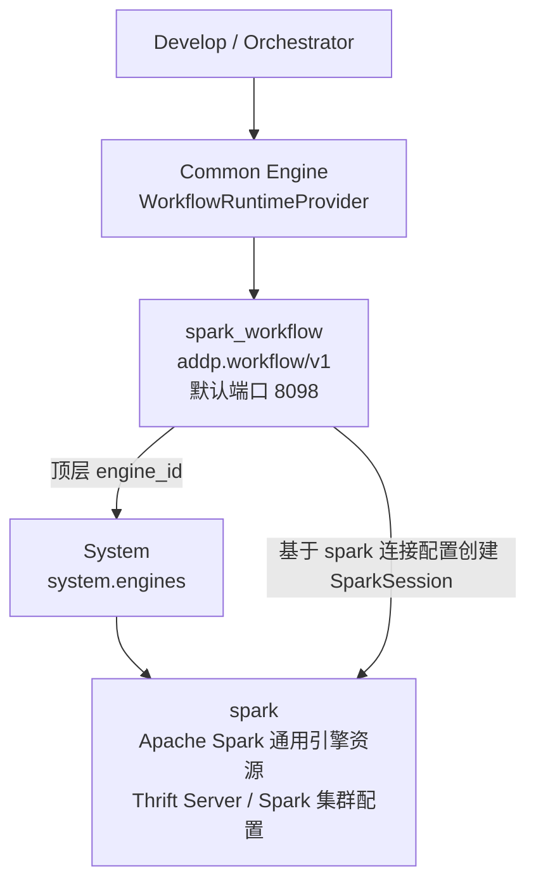

# Spark Workflow 与 Spark 通用引擎关系说明

本文档说明 ADDP 中 `spark_workflow` 扩展引擎和 `spark` 通用引擎资源之间的边界。当前单一路线是：Spark Workflow 作为工作流运行时扩展引擎存在，执行时必须绑定一个已注册的 Spark 通用引擎资源。

## 核心结论

- `spark` 是通用引擎资源，对应 Apache Spark Thrift Server / Spark 集群连接配置，可被 SQL 工作台、资源树和其他通用能力消费。
- `spark_workflow` 是工作流运行时扩展引擎，对外实现 `addp.workflow/v1` HTTP 协议，由 Common Engine 的 `WorkflowRuntimeProvider` 调用。
- `spark_workflow` 自身不代表某个 Spark 集群。每次执行工作流时，请求体顶层 `engine_id` 必须指向一个真实的 `spark` 引擎实例。
- `engine_id` 是执行期运行时资源绑定，不写入 `spark_workflow` 的 capabilities，也不由业务模块直接拼接 Spark Workflow 私有 URL。
- Spark Workflow 执行空工作流或非法 `workflow_def.tasks` 时必须在本地校验失败，不应先连接 Spark 资源。

## 架构关系



## 两类引擎的职责

| 引擎 | `engine_type` | 来源 | Provider | 默认端口 | 职责 |
| --- | --- | --- | --- | --- | --- |
| Apache Spark 通用引擎 | `spark` | `general` | `QueryRuntimeProvider` / catalog 相关 provider | `10000` | 表达真实 Spark 资源，提供 SQL、目录、连接配置和运行时资源身份 |
| Spark Workflow | `spark_workflow` | `extension` | `WorkflowRuntimeProvider` | `8098` | 提供工作流算子发现和 DAG 执行入口 |

## 标准执行请求

Spark Workflow 的执行请求必须包含标准工作流定义和顶层 `engine_id`。这里的 `engine_id` 只绑定 Spark 通用引擎资源；表、文件和对象存储数据源由 Develop 在执行前从 `locator` 或 `target_parent_locator + target_name` 派生为 `connection_info`、`schema/table` 或 `path` 后传入运行时：

```json
{
  "engine_id": 34,
  "workflow_def": {
    "tasks": [
      {
        "id": "load_poi",
        "operator": "load",
        "params": {
          "source_type": "table",
          "connection_info": {
            "engine_type": "postgresql",
            "host": "postgres",
            "port": 5432,
            "database": "addp",
            "user": "addp",
            "password": "secret"
          },
          "schema": "public",
          "table": "poi"
        },
        "depends_on": []
      }
    ]
  },
  "input_data": {}
}
```

这里的 `engine_id=34` 指向 `system.engines` 中的 `spark` 通用引擎实例，而不是 `spark_workflow` 自身的实例 ID。
用户和 AI 侧公开算子参数不填写 `connection_info`、`schema`、`table` 或 `path`，应使用 `locator` 或 `target_parent_locator + target_name`，由 Develop 边界统一派生数据源连接和运行时路径。对象存储在运行时路径中转换为 Spark 可读的 `s3a://bucket/key`。

## 与 Spark SQL 的关系

同一个 Spark 通用资源可被两种路径消费：

- 查询工作台：选择 `spark` 引擎，按 SQL 运行查询和 Sedona 函数。
- 工作流编辑器：选择 `spark_workflow` 运行时，并在执行配置中绑定实际 `spark` 引擎资源。

两者不互相替代。SQL 工作台适合手写查询；Spark Workflow 适合通过统一算子 DAG 编排分布式计算。
