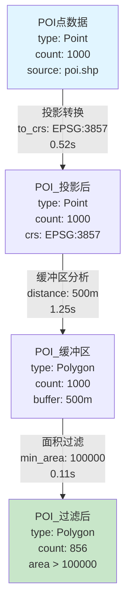
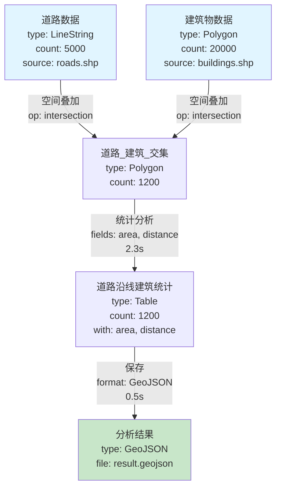
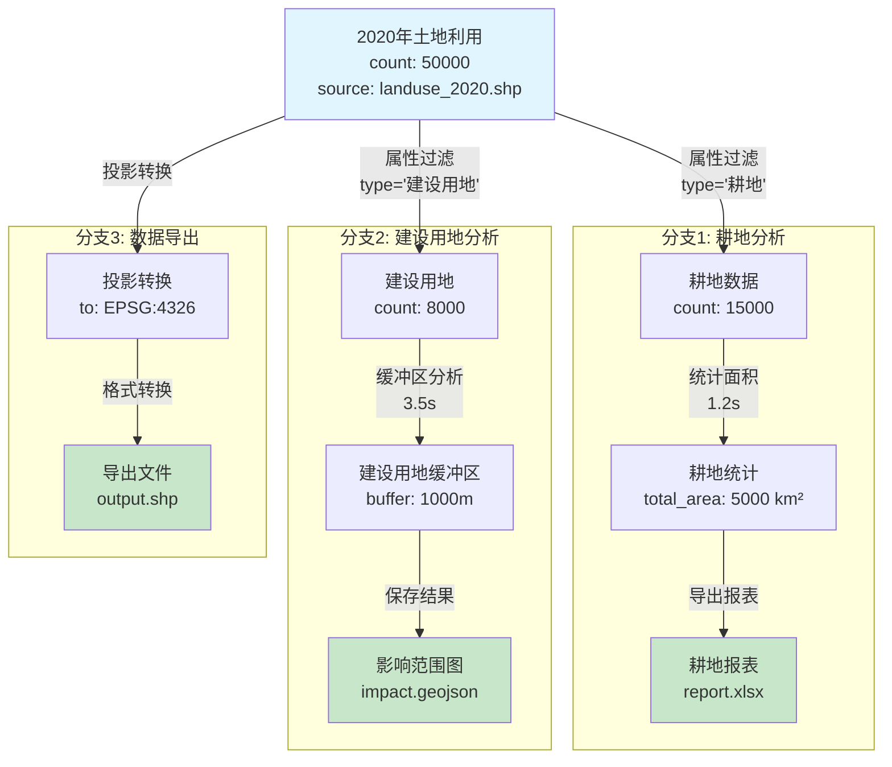
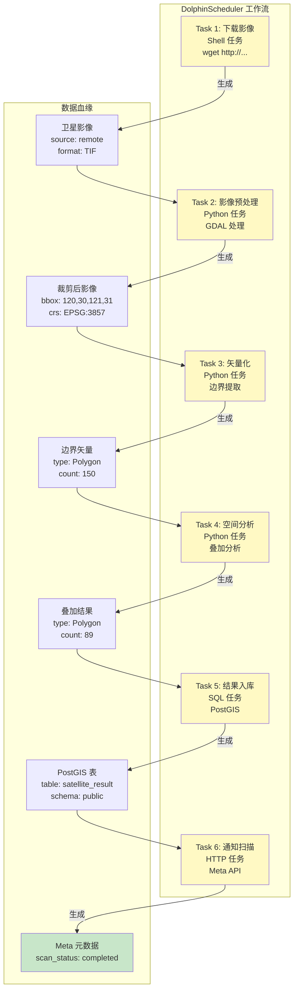

# GIS 空间计算血缘追踪可视化示例

## 示例 1: 简单线性血缘

### 场景: POI 缓冲区分析

```
输入: POI 点数据 (1000 条)
  ↓ 投影转换 (EPSG:4326 → EPSG:3857)
POI_投影后 (1000 条)
  ↓ 500米缓冲区
POI_缓冲区 (1000 条)
  ↓ 面积过滤 (>100000 m²)
POI_过滤后 (856 条)
  ↓ 保存
结果.geojson
```

### Mermaid 流程图



## 示例 2: 多输入血缘

### 场景: 道路与建筑物叠加分析

```
输入1: 道路数据 (5000 条线)
输入2: 建筑物数据 (20000 个多边形)
  ↓ 空间叠加 (intersection)
道路_建筑_交集 (1200 条)
  ↓ 统计分析
道路沿线建筑统计表
  ↓ 保存
分析结果.geojson
```

### Mermaid 流程图



## 示例 3: 复杂分支血缘

### 场景: 土地利用变化分析

```
输入: 2020年土地利用数据
  ├─ 分支1: 提取耕地 → 统计面积 → 耕地报表
  ├─ 分支2: 提取建设用地 → 缓冲区分析 → 建设用地影响范围
  └─ 分支3: 全部数据 → 投影转换 → 导出 Shapefile
```

### Mermaid 流程图



## 示例 4: 完整的 DolphinScheduler 工作流血缘

### 场景: 每日卫星影像处理流程

```
任务1: 下载影像
  ↓
任务2: 影像预处理 (裁剪、投影)
  ↓
任务3: 矢量化 (提取边界)
  ↓
任务4: 空间分析 (与已有数据叠加)
  ↓
任务5: 结果入库 (PostGIS)
  ↓
任务6: 通知 Meta 模块扫描
```

### Mermaid 流程图（带 DolphinScheduler 任务）



## 示例 5: 实际 JSON 血缘文件

### 文件: `poi_buffer_analysis.lineage.json`

```json
{
  "graph_id": "lineage-2024-01-15-001",
  "pipeline_name": "POI缓冲区分析",
  "assets": {
    "asset-001": {
      "asset_id": "asset-001",
      "name": "POI点数据",
      "type": "file",
      "location": "/data/input/poi.shp",
      "schema_info": {
        "columns": ["id", "name", "type", "geometry"],
        "dtypes": {
          "id": "int64",
          "name": "object",
          "type": "object",
          "geometry": "geometry"
        },
        "crs": "EPSG:4326",
        "geometry_type": ["Point"]
      },
      "statistics": {
        "record_count": 1000,
        "bounds": [120.0, 30.0, 121.0, 31.0]
      },
      "created_at": "2024-01-15T10:00:00Z",
      "metadata": {
        "source_system": "GPS采集",
        "data_date": "2024-01-01"
      }
    },
    "asset-002": {
      "asset_id": "asset-002",
      "name": "POI_投影后",
      "type": "memory",
      "location": "memory://step_1",
      "schema_info": {
        "columns": ["id", "name", "type", "geometry"],
        "crs": "EPSG:3857",
        "geometry_type": ["Point"]
      },
      "statistics": {
        "record_count": 1000,
        "bounds": [13358338.9, 3503549.8, 13469594.4, 3621463.4]
      },
      "created_at": "2024-01-15T10:00:01Z",
      "metadata": {}
    },
    "asset-003": {
      "asset_id": "asset-003",
      "name": "POI_缓冲区",
      "type": "memory",
      "location": "memory://step_2",
      "schema_info": {
        "columns": ["id", "name", "type", "geometry"],
        "crs": "EPSG:3857",
        "geometry_type": ["Polygon"]
      },
      "statistics": {
        "record_count": 1000,
        "bounds": [13357838.9, 3503049.8, 13470094.4, 3621963.4],
        "total_area": 785398163.4
      },
      "created_at": "2024-01-15T10:00:02Z",
      "metadata": {}
    },
    "asset-004": {
      "asset_id": "asset-004",
      "name": "POI_过滤后",
      "type": "file",
      "location": "/data/output/poi_buffer_result.geojson",
      "schema_info": {
        "columns": ["id", "name", "type", "geometry"],
        "crs": "EPSG:3857",
        "geometry_type": ["Polygon"]
      },
      "statistics": {
        "record_count": 856,
        "bounds": [13357838.9, 3503049.8, 13470094.4, 3621963.4],
        "total_area": 750123456.7
      },
      "created_at": "2024-01-15T10:00:03Z",
      "metadata": {
        "output_format": "geojson",
        "file_size_mb": 5.23
      }
    }
  },
  "executions": {
    "exec-001": {
      "execution_id": "exec-001",
      "operator_name": "投影转换",
      "operator_type": "reproject",
      "parameters": {
        "from_crs": "EPSG:4326",
        "to_crs": "EPSG:3857"
      },
      "input_assets": ["asset-001"],
      "output_assets": ["asset-002"],
      "started_at": "2024-01-15T10:00:00.500Z",
      "finished_at": "2024-01-15T10:00:01.023Z",
      "elapsed_seconds": 0.523,
      "status": "success",
      "error_message": null,
      "metadata": {
        "cpu_percent": 45.2,
        "memory_mb": 128.5
      }
    },
    "exec-002": {
      "execution_id": "exec-002",
      "operator_name": "缓冲区分析",
      "operator_type": "buffer",
      "parameters": {
        "distance": 500,
        "unit": "meters"
      },
      "input_assets": ["asset-002"],
      "output_assets": ["asset-003"],
      "started_at": "2024-01-15T10:00:01.050Z",
      "finished_at": "2024-01-15T10:00:02.295Z",
      "elapsed_seconds": 1.245,
      "status": "success",
      "error_message": null,
      "metadata": {
        "cpu_percent": 78.3,
        "memory_mb": 256.8
      }
    },
    "exec-003": {
      "execution_id": "exec-003",
      "operator_name": "面积过滤",
      "operator_type": "filter",
      "parameters": {
        "min_area": 100000,
        "unit": "square_meters"
      },
      "input_assets": ["asset-003"],
      "output_assets": ["asset-004"],
      "started_at": "2024-01-15T10:00:02.320Z",
      "finished_at": "2024-01-15T10:00:02.432Z",
      "elapsed_seconds": 0.112,
      "status": "success",
      "error_message": null,
      "metadata": {
        "filtered_count": 144,
        "filter_ratio": 0.144
      }
    }
  },
  "root_assets": ["asset-001"],
  "leaf_assets": ["asset-004"],
  "created_at": "2024-01-15T10:00:00Z",
  "metadata": {
    "total_elapsed_seconds": 1.880,
    "pipeline_version": "1.0.0",
    "execution_environment": "DolphinScheduler",
    "workflow_id": "workflow-123",
    "workflow_instance_id": "instance-456"
  }
}
```

## 血缘查询示例代码

### Python 查询示例

```python
from lineage_tracker import LineageGraph

# 加载血缘图
graph = LineageGraph.load("poi_buffer_analysis.lineage.json")

# 1. 查看概览
print(f"流水线: {graph.pipeline_name}")
print(f"数据资产数: {len(graph.assets)}")
print(f"算子执行数: {len(graph.executions)}")
print(f"源数据: {graph.root_assets}")
print(f"最终结果: {graph.leaf_assets}")

# 2. 追溯源头
final_asset_id = graph.leaf_assets[0]
source_chain = graph.trace_to_source(final_asset_id)
print(f"\n数据血缘链:")
for asset_id in reversed(source_chain):
    asset = graph.assets[asset_id]
    print(f"  → {asset.name} ({asset.statistics['record_count']} 条)")

# 3. 统计分析
print(f"\n每步数据量变化:")
for exec_id, execution in graph.executions.items():
    input_asset = graph.assets[execution.input_assets[0]]
    output_asset = graph.assets[execution.output_assets[0]]

    input_count = input_asset.statistics['record_count']
    output_count = output_asset.statistics['record_count']

    print(f"{execution.operator_name}:")
    print(f"  {input_count} → {output_count} (保留 {output_count/input_count:.1%})")

# 4. 性能分析
total_time = sum(ex.elapsed_seconds for ex in graph.executions.values())
print(f"\n总执行时间: {total_time:.3f}s")
for ex in graph.executions.values():
    percent = ex.elapsed_seconds / total_time * 100
    print(f"  {ex.operator_name}: {ex.elapsed_seconds:.3f}s ({percent:.1f}%)")
```

### 输出示例

```
流水线: POI缓冲区分析
数据资产数: 4
算子执行数: 3
源数据: ['asset-001']
最终结果: ['asset-004']

数据血缘链:
  → POI点数据 (1000 条)
  → POI_投影后 (1000 条)
  → POI_缓冲区 (1000 条)
  → POI_过滤后 (856 条)

每步数据量变化:
投影转换:
  1000 → 1000 (保留 100.0%)
缓冲区分析:
  1000 → 1000 (保留 100.0%)
面积过滤:
  1000 → 856 (保留 85.6%)

总执行时间: 1.880s
  投影转换: 0.523s (27.8%)
  缓冲区分析: 1.245s (66.2%)
  面积过滤: 0.112s (6.0%)
```

## 总结

这些示例展示了：

1. ✅ **简单线性血缘** - 单输入单输出
2. ✅ **多输入血缘** - 空间叠加等场景
3. ✅ **分支血缘** - 一个数据源产生多个结果
4. ✅ **工作流级血缘** - DolphinScheduler 任务链
5. ✅ **完整 JSON 格式** - 实际存储格式
6. ✅ **查询和分析** - 血缘追溯和统计

通过这些可视化示例，可以清晰地理解 GIS 空间计算的数据血缘追踪机制。
