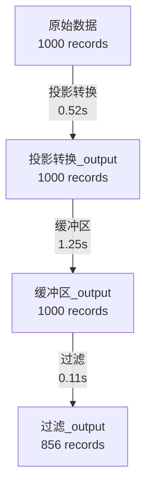

# GIS 空间计算的数据血缘追踪

## 为什么需要血缘追踪？

### 核心问题

在 GIS 空间计算中，经常会遇到以下问题：

```
问题 1: 这个数据是怎么来的？
某个分析结果 result.geojson 是基于哪些原始数据生成的？
经过了哪些算子处理？参数是什么？

问题 2: 这个数据影响了哪些下游？
如果修改了某个源数据，会影响哪些分析结果？
需要重新运行哪些工作流？

问题 3: 数据质量如何保证？
每一步处理的统计信息是什么？
是否有数据丢失或异常？

问题 4: 如何复现结果？
某个分析结果能否准确复现？
历史版本的数据如何追溯？
```

### 血缘追踪的价值

✅ **可追溯性**: 任何数据都能追溯到源头
✅ **影响分析**: 快速评估数据变更的影响范围
✅ **质量保证**: 记录每一步的统计信息和参数
✅ **复现能力**: 完整记录处理流程，便于复现
✅ **合规审计**: 满足数据治理要求

## 血缘追踪的核心概念

### 1. 数据资产 (DataAsset)

```python
DataAsset {
    asset_id: "uuid-1234"              # 唯一标识
    name: "POI数据"                    # 数据名称
    type: "file"                       # 类型（file/database/api/memory）
    location: "/data/poi.shp"          # 存储位置
    schema_info: {                     # Schema 信息
        "columns": ["id", "name", "geometry"],
        "crs": "EPSG:4326",
        "geometry_type": ["Point"]
    },
    statistics: {                      # 统计信息
        "record_count": 1000,
        "bounds": [120.0, 30.0, 121.0, 31.0],
        "total_area": 5000000
    },
    created_at: "2024-01-15T10:00:00",
    metadata: {}
}
```

### 2. 算子执行 (OperatorExecution)

```python
OperatorExecution {
    execution_id: "exec-5678"          # 执行唯一标识
    operator_name: "缓冲区分析"        # 算子名称
    operator_type: "buffer"            # 算子类型
    parameters: {                      # 执行参数
        "distance": 500
    },
    input_assets: ["uuid-1234"]        # 输入资产列表
    output_assets: ["uuid-5678"]       # 输出资产列表
    started_at: "2024-01-15T10:00:00",
    finished_at: "2024-01-15T10:00:05",
    elapsed_seconds: 5.23,
    status: "success",
    error_message: null
}
```

### 3. 血缘图 (LineageGraph)

```python
LineageGraph {
    graph_id: "graph-9012"
    pipeline_name: "POI缓冲区分析"
    assets: {                          # 所有数据资产
        "uuid-1234": DataAsset(...),
        "uuid-5678": DataAsset(...),
        ...
    },
    executions: {                      # 所有算子执行
        "exec-5678": OperatorExecution(...),
        ...
    },
    root_assets: ["uuid-1234"],        # 根节点（源数据）
    leaf_assets: ["uuid-9999"],        # 叶节点（最终结果）
}
```

## 血缘追踪的实现方式

### 方式 1: 自动追踪（推荐）

集成到空间算子流水线，自动记录：

```python
from lineage_tracker import SpatialPipelineWithLineage

# 创建支持血缘追踪的流水线
pipeline = SpatialPipelineWithLineage(
    "土地利用分析",
    enable_lineage=True  # 启用血缘追踪
)

# 添加算子（自动记录输入输出）
pipeline.add_step(reproject, "投影转换", "reproject", to_crs="EPSG:3857")
pipeline.add_step(buffer, "缓冲区", "buffer", distance=500)
pipeline.add_step(filter_area, "过滤", "filter", min_area=1000)

# 执行（自动追踪）
result = pipeline.execute(input_gdf, input_name="原始数据")

# 保存结果和血缘图
pipeline.save_result(
    result,
    "output/result.geojson",
    lineage_path="output/result.lineage.json"
)
```

**自动生成的血缘图**:
```json
{
  "graph_id": "graph-123",
  "pipeline_name": "土地利用分析",
  "assets": {
    "asset-1": {
      "name": "原始数据",
      "type": "memory",
      "statistics": {"record_count": 1000}
    },
    "asset-2": {
      "name": "投影转换_output",
      "type": "memory",
      "statistics": {"record_count": 1000}
    },
    "asset-3": {
      "name": "缓冲区_output",
      "type": "memory",
      "statistics": {"record_count": 1000}
    },
    "asset-4": {
      "name": "过滤_output",
      "type": "memory",
      "statistics": {"record_count": 856}
    }
  },
  "executions": {
    "exec-1": {
      "operator_name": "投影转换",
      "parameters": {"to_crs": "EPSG:3857"},
      "input_assets": ["asset-1"],
      "output_assets": ["asset-2"],
      "elapsed_seconds": 0.523
    },
    "exec-2": {
      "operator_name": "缓冲区",
      "parameters": {"distance": 500},
      "input_assets": ["asset-2"],
      "output_assets": ["asset-3"],
      "elapsed_seconds": 1.245
    },
    "exec-3": {
      "operator_name": "过滤",
      "parameters": {"min_area": 1000},
      "input_assets": ["asset-3"],
      "output_assets": ["asset-4"],
      "elapsed_seconds": 0.112
    }
  },
  "root_assets": ["asset-1"],
  "leaf_assets": ["asset-4"]
}
```

### 方式 2: 手动追踪

对于复杂场景，手动控制追踪粒度：

```python
from lineage_tracker import LineageTracker, DataAsset

# 创建追踪器
tracker = LineageTracker("复杂空间分析")

# 1. 注册输入数据资产
gdf1 = gpd.read_file("data/roads.shp")
asset1 = DataAsset.from_geodataframe(gdf1, "道路数据", "data/roads.shp")
asset1_id = tracker.register_asset(asset1)

gdf2 = gpd.read_file("data/buildings.shp")
asset2 = DataAsset.from_geodataframe(gdf2, "建筑数据", "data/buildings.shp")
asset2_id = tracker.register_asset(asset2)

# 2. 记录算子执行
tracker.start_execution("空间叠加", "intersect", {"how": "intersection"})
tracker.add_input(asset1_id)
tracker.add_input(asset2_id)

# 执行算子
result = gpd.overlay(gdf1, gdf2, how='intersection')

# 注册输出资产
output_asset = DataAsset.from_geodataframe(result, "叠加结果", "memory://output")
output_id = tracker.register_asset(output_asset)
tracker.add_output(output_id)
tracker.finish_execution(success=True)

# 3. 保存血缘图
tracker.save_lineage("output/complex_lineage.json")
```

## 血缘查询

### 正向追踪（追溯源头）

```python
from lineage_tracker import LineageGraph

# 加载血缘图
graph = LineageGraph.load("output/result.lineage.json")

# 查询某个数据的上游
final_asset_id = graph.leaf_assets[0]
upstream = graph.get_upstream(final_asset_id)
print(f"直接上游: {upstream}")

# 递归追溯到源头
sources = graph.trace_to_source(final_asset_id)
print(f"所有上游链: {sources}")

# 输出示例:
# 直接上游: ['asset-3']
# 所有上游链: ['asset-4', 'asset-3', 'asset-2', 'asset-1']
```

### 反向追踪（影响分析）

```python
# 查询某个源数据影响了哪些结果
source_asset_id = graph.root_assets[0]
downstream = graph.get_downstream(source_asset_id)
print(f"直接下游: {downstream}")

# 递归追踪到所有叶节点
affected = graph.trace_to_leaf(source_asset_id)
print(f"所有下游链: {affected}")

# 输出示例:
# 直接下游: ['asset-2']
# 所有下游链: ['asset-1', 'asset-2', 'asset-3', 'asset-4']
```

## 可视化血缘图

### Mermaid 流程图

```python
# 导出为 Mermaid 格式
mermaid_code = graph.export_mermaid()
print(mermaid_code)
```

**输出**:


### 图形渲染


## 与 ADDP Meta 模块集成

### 架构集成

```
┌─────────────────────────────────────────┐
│        空间算子流水线                    │
│  ┌──────────────────────────┐           │
│  │ SpatialPipeline          │           │
│  │   + LineageTracker       │           │
│  └──────────┬───────────────┘           │
│             │ 生成血缘图                │
│             ↓                            │
│  ┌──────────────────────────┐           │
│  │  lineage.json            │           │
│  └──────────┬───────────────┘           │
└─────────────┼───────────────────────────┘
              │ HTTP POST
              ↓
┌─────────────────────────────────────────┐
│      ADDP Meta 模块                     │
│  ┌──────────────────────────┐           │
│  │  POST /api/lineage       │           │
│  └──────────┬───────────────┘           │
│             ↓                            │
│  ┌──────────────────────────┐           │
│  │  PostgreSQL metadata 库  │           │
│  │  表: meta_lineage        │           │
│  │  ┌───────────────────┐   │           │
│  │  │ lineage_id        │   │           │
│  │  │ pipeline_name     │   │           │
│  │  │ graph_data (JSON) │   │           │
│  │  │ created_at        │   │           │
│  │  └───────────────────┘   │           │
│  └──────────────────────────┘           │
│                                          │
│  查询接口:                               │
│  - GET /api/lineage/:id                 │
│  - GET /api/lineage/upstream/:asset_id  │
│  - GET /api/lineage/downstream/:asset_id│
│  - GET /api/lineage/search?name=xxx     │
└─────────────────────────────────────────┘
```

### 上传血缘到 Meta 模块

```python
# 方式 1: 使用 tracker 内置方法
tracker.export_to_meta_module("http://localhost:8082")

# 方式 2: 手动上传
import requests

lineage_data = tracker.graph.to_dict()
response = requests.post(
    "http://localhost:8082/api/lineage",
    json={
        "lineage_graph": lineage_data,
        "source": "dolphinscheduler_job_123",
        "timestamp": datetime.now().isoformat()
    }
)
```

### Meta 模块存储结构

```sql
-- PostgreSQL metadata 库中的血缘表
CREATE TABLE meta_lineage (
    lineage_id UUID PRIMARY KEY,
    pipeline_name VARCHAR(255),
    pipeline_type VARCHAR(50),  -- 'spatial_analysis', 'etl', 'ml_training'

    -- 关联的资源（来自 system.resources）
    source_resource_ids UUID[],
    target_resource_ids UUID[],

    -- 血缘图 JSON（完整数据）
    graph_data JSONB,

    -- 统计信息
    total_assets INTEGER,
    total_executions INTEGER,
    total_elapsed_seconds NUMERIC(10, 3),

    -- 元数据
    created_at TIMESTAMP DEFAULT NOW(),
    created_by VARCHAR(100),
    dolphin_workflow_id INTEGER,  -- 关联 DolphinScheduler 工作流 ID

    -- 索引
    CONSTRAINT fk_lineage_workflow
        FOREIGN KEY (dolphin_workflow_id)
        REFERENCES workflow_definitions(id)
);

-- GIN 索引用于 JSON 查询
CREATE INDEX idx_lineage_graph_data ON meta_lineage USING GIN (graph_data);
CREATE INDEX idx_lineage_pipeline_name ON meta_lineage (pipeline_name);
CREATE INDEX idx_lineage_created_at ON meta_lineage (created_at DESC);
```

## DolphinScheduler 集成

### Shell 任务配置

```bash
# DolphinScheduler Shell 任务
python3 spatial_analysis.py \
  --input /data/input/${date}.shp \
  --output /data/output/result_${date}.geojson \
  --lineage /data/lineage/lineage_${date}.json \
  --enable-lineage true

# 上传血缘到 Meta 模块
curl -X POST http://localhost:8082/api/lineage \
  -H "Content-Type: application/json" \
  -d @/data/lineage/lineage_${date}.json
```

### Python 任务配置

```python
# DolphinScheduler Python 任务
import geopandas as gpd
from lineage_tracker import SpatialPipelineWithLineage

# 从参数获取
input_path = "${input_path}"
output_path = "${output_path}"
workflow_id = "${workflow_instance_id}"

# 构建流水线
pipeline = SpatialPipelineWithLineage(
    f"DolphinJob-{workflow_id}",
    enable_lineage=True
)

# 执行
gdf = gpd.read_file(input_path)
result = pipeline.execute(gdf)

# 保存结果和血缘
lineage_path = output_path.replace('.geojson', '.lineage.json')
pipeline.save_result(result, output_path, lineage_path)

# 上传血缘到 Meta 模块
pipeline.tracker.export_to_meta_module("http://localhost:8082")

print(f"✓ 处理完成，血缘已上传")
```

## 血缘追踪的最佳实践

### ✅ 推荐做法

1. **自动追踪为主**
   - 集成到流水线框架，减少手动编码
   - 统一血缘格式和规范

2. **关键节点记录**
   - 源数据（从哪里来）
   - 中间步骤（如何处理）
   - 最终结果（到哪里去）

3. **统计信息记录**
   - 每一步的记录数变化
   - 几何类型变化
   - 空间范围变化

4. **元数据完整性**
   - 执行参数（可复现）
   - 执行时间（性能分析）
   - 错误信息（故障排查）

5. **与数据治理集成**
   - 上传到 Meta 模块
   - 关联到数据目录
   - 支持血缘查询

### ❌ 避免做法

1. **过度追踪**
   - 不要追踪每个函数调用
   - 只追踪有意义的算子级别

2. **血缘丢失**
   - 不要跳过关键步骤
   - 确保链路完整

3. **性能影响**
   - 血缘记录应该轻量级
   - 异步上传到 Meta 模块

4. **格式不统一**
   - 使用标准化的血缘格式
   - 便于跨系统集成

## 血缘查询示例

### 场景 1: 数据溯源

```python
# 问题: 某个 GeoJSON 文件是怎么生成的？
result_asset_id = "asset-final-123"
graph = LineageGraph.load("lineage.json")

# 追溯到源头
sources = graph.trace_to_source(result_asset_id)
for asset_id in sources:
    asset = graph.assets[asset_id]
    print(f"- {asset.name} ({asset.type.value}): {asset.location}")

# 输出:
# - 过滤_output (memory): memory://step_3
# - 缓冲区_output (memory): memory://step_2
# - 投影转换_output (memory): memory://step_1
# - 原始数据 (file): /data/input/roads.shp
```

### 场景 2: 影响分析

```python
# 问题: 如果修改了源数据，哪些结果需要重新生成？
source_asset_id = "asset-source-456"

# 查找所有下游
affected = graph.trace_to_leaf(source_asset_id)
print(f"受影响的数据资产: {len(affected)}")

# 查找需要重新执行的算子
for asset_id in affected:
    executions = [
        ex for ex in graph.executions.values()
        if asset_id in ex.input_assets
    ]
    for ex in executions:
        print(f"需要重新执行: {ex.operator_name}")
```

### 场景 3: 质量检查

```python
# 问题: 每一步数据量变化是否合理？
for exec_id, execution in graph.executions.items():
    input_asset = graph.assets[execution.input_assets[0]]
    output_asset = graph.assets[execution.output_assets[0]]

    input_count = input_asset.statistics['record_count']
    output_count = output_asset.statistics['record_count']
    ratio = output_count / input_count

    print(f"{execution.operator_name}:")
    print(f"  输入: {input_count} → 输出: {output_count}")
    print(f"  保留率: {ratio:.2%}")

    # 告警: 数据丢失过多
    if ratio < 0.5:
        print(f"  ⚠️  警告: 数据丢失超过 50%！")
```

## 总结

### 血缘追踪的三层架构

```
应用层:
  - 空间算子流水线（自动追踪）
  - DolphinScheduler 工作流（调度执行）

存储层:
  - 文件系统（lineage.json）
  - Meta 模块（PostgreSQL）

查询层:
  - Meta 模块 API（血缘查询）
  - 可视化界面（血缘图展示）
```

### 核心价值

✅ **数据可追溯** - 任何结果都能追溯到源头
✅ **变更影响分析** - 快速评估数据变更影响
✅ **质量保证** - 每一步都有统计验证
✅ **复现能力** - 完整记录处理流程
✅ **合规审计** - 满足数据治理要求

### 适用场景

✅ **批量空间分析** - 多步骤 GIS 处理流程
✅ **数据 ETL** - 数据清洗、转换、加载
✅ **定时任务** - DolphinScheduler 调度的工作流
✅ **数据产品** - 需要质量追溯的数据产品
✅ **企业数据治理** - 数据血缘管理需求
