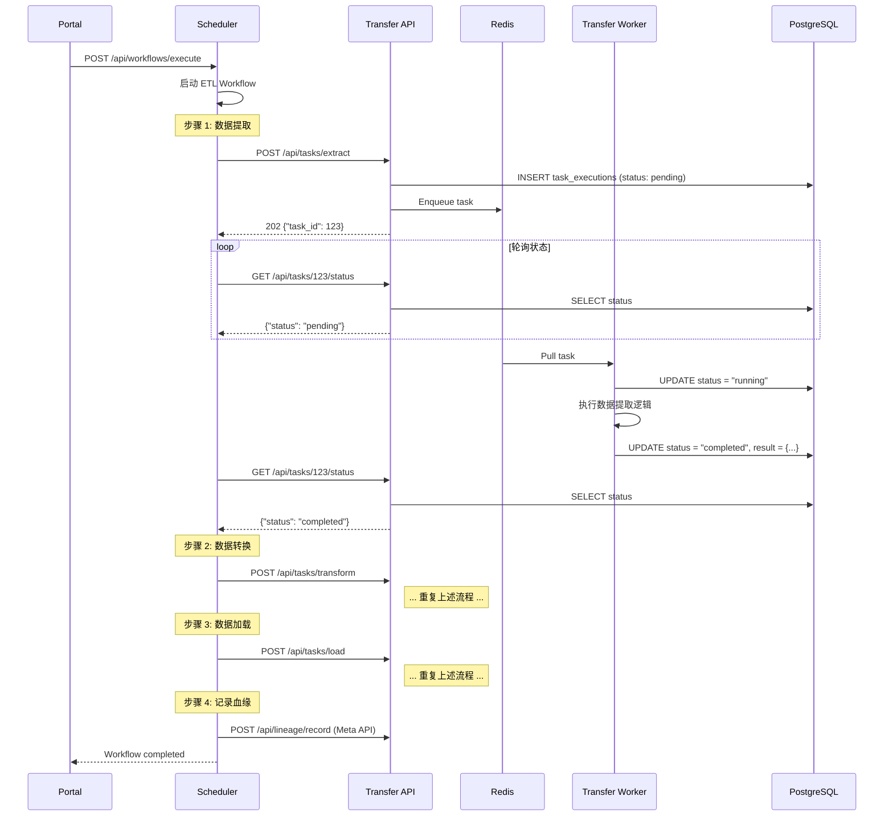

# Scheduler 与各模块依赖关系详解

**版本**: v1.0
**日期**: 2025-01-20
**相关文档**: [SCHEDULER_ARCHITECTURE.md](SCHEDULER_ARCHITECTURE.md)

---

## 目录

- [1. 核心依赖关系图](#1-核心依赖关系图)
- [2. 详细依赖关系表](#2-详细依赖关系表)
- [3. Scheduler 与 Worker 的关系](#3-scheduler-与-worker-的关系)
- [4. 完整依赖关系详解](#4-完整依赖关系详解)
- [5. 数据流和控制流](#5-数据流和控制流)
- [6. 依赖关系总结](#6-依赖关系总结)

---

## 1. 核心依赖关系图

### 1.1 完整架构依赖关系

```
┌─────────────────────────────────────────────────────────────────┐
│                     用户请求入口                                │
│  Portal (5170) / Gateway (8000) / 各模块 API                    │
└────────────┬────────────────────────────────────────────────────┘
             │
             ↓
┌─────────────────────────────────────────────────────────────────┐
│                  Scheduler (调度编排层)                         │
│  - 不依赖任何业务模块的代码                                     │
│  - 只通过 HTTP API 与各模块通信                                 │
│  - 职责：工作流编排、状态管理、重试补偿                        │
│  - 底层实现：Temporal (可替换)                                  │
└────┬────────────┬────────────┬────────────┬────────────────────┘
     │            │            │            │
     │ HTTP       │ HTTP       │ HTTP       │ HTTP
     │            │            │            │
     ↓            ↓            ↓            ↓
┌─────────┐  ┌─────────┐  ┌─────────┐  ┌─────────┐
│ System  │  │Transfer │  │  Meta   │  │ Manager │
│  API    │  │  API    │  │  API    │  │  API    │
│ (8080)  │  │ (8083)  │  │ (8082)  │  │ (8081)  │
└────┬────┘  └────┬────┘  └────┬────┘  └────┬────┘
     │            │            │            │
     │ Enqueue    │ Enqueue    │ Enqueue    │ Enqueue
     │            │            │            │
     ↓            ↓            ↓            ↓
┌─────────┐  ┌─────────┐  ┌─────────┐  ┌─────────┐
│ (未来)  │  │Transfer │  │  Meta   │  │ Manager │
│ System  │  │ Worker  │  │ Worker  │  │ Worker  │
│ Worker  │  │ (Asynq) │  │ (Asynq) │  │ (Asynq) │
└─────────┘  └─────────┘  └─────────┘  └─────────┘
     │            │            │            │
     └────────────┴────────────┴────────────┘
                    ↓
            PostgreSQL + Redis + MinIO
```

### 1.2 依赖方向说明

**单向依赖链**：
```
Scheduler (编排层)
  ↓ HTTP 运行时依赖
System API, Transfer API, Meta API, Manager API (接口层)
  ↓ Asynq 入队
Redis (队列层)
  ↓ 消费任务
Transfer Worker, Meta Worker, Manager Worker (执行层)
  ↓ 数据持久化
PostgreSQL, MinIO (存储层)
```

**关键特征**：
- ✅ **单向依赖**：依赖方向清晰，无循环依赖
- ✅ **零代码耦合**：Scheduler 不 import 任何业务模块代码
- ✅ **Worker 独立**：Worker 不知道 Scheduler 的存在

---

## 2. 详细依赖关系表

### 2.1 Scheduler → 各模块（单向 HTTP 依赖）

| 依赖关系 | 依赖类型 | 依赖方式 | 接口示例 | 说明 |
|----------|---------|---------|----------|------|
| **Scheduler → System** | HTTP API | 运行时 | `GET /api/resources/{id}` | 获取资源配置、验证用户权限 |
| **Scheduler → Transfer** | HTTP API | 运行时 | `POST /api/tasks/extract` | 触发数据提取、转换、加载任务 |
| **Scheduler → Meta** | HTTP API | 运行时 | `POST /api/scan/database` | 触发元数据扫描、记录血缘关系 |
| **Scheduler → Manager** | HTTP API | 运行时 | `POST /api/files/process` | 触发文件处理任务（未来） |

**配置化依赖**（通过环境变量）：

```bash
# scheduler/.env
SYSTEM_API_URL=http://system:8080
TRANSFER_API_URL=http://transfer:8083
META_API_URL=http://meta:8082
MANAGER_API_URL=http://manager:8081
```

**代码示例**（Scheduler 调用 Transfer API）：

```go
// scheduler/activities/http.go
func (a *Activities) CallTransferAPI(ctx context.Context, req HTTPRequest) error {
    // 从配置读取 Transfer API 地址
    url := fmt.Sprintf("%s%s", a.config.TransferAPIURL, req.Path)

    // 纯 HTTP 调用，无代码依赖
    resp, err := http.Post(url, "application/json", bytes.NewBuffer(req.Body))
    return err
}
```

---

### 2.2 各模块 → Scheduler（可选依赖）

| 依赖关系 | 依赖类型 | 场景 | 说明 |
|----------|---------|------|------|
| **Transfer → Scheduler** | HTTP API (可选) | 主动触发工作流 | Transfer 完成任务后触发下游工作流 |
| **Meta → Scheduler** | HTTP API (可选) | 主动触发工作流 | Meta 扫描完成后触发血缘计算工作流 |
| **Portal → Scheduler** | HTTP API | 用户操作 | 用户在界面点击"执行工作流" |

**场景示例 1**：Transfer 主动触发工作流

```go
// transfer/backend/internal/service/task_service.go
func (s *TaskService) OnTaskCompleted(taskID int) error {
    // 任务完成后，触发 Scheduler 工作流
    resp, err := http.Post("http://scheduler:8090/api/workflows/execute", ...)
    return err
}
```

**场景示例 2**：Portal 触发工作流

```javascript
// portal/frontend/src/api/scheduler.js
export function executeWorkflow(workflowType, input) {
  return axios.post('http://scheduler:8090/api/workflows/execute', {
    workflow_type: workflowType,
    input: input
  })
}
```

---

### 2.3 Scheduler ↔ Temporal Server（内部技术依赖）

| 关系 | 依赖类型 | 说明 |
|------|---------|------|
| **Scheduler Worker → Temporal Server** | gRPC (7233) | Worker 连接 Temporal 注册工作流和 Activity |
| **Temporal Server → PostgreSQL** | SQL (5432) | 存储工作流状态、历史记录、事件日志 |

**重要说明**：
- ⚠️ Temporal 是 Scheduler 的**内部实现细节**
- ⚠️ 对外只暴露 Scheduler 名称和 API
- ⚠️ 将来可以替换为其他编排引擎（Cadence、自研等）

```go
// scheduler/cmd/worker/main.go
func main() {
    // 连接到 Temporal Server（内部实现）
    temporalClient, err := client.Dial(client.Options{
        HostPort: "temporal-server:7233", // 内部地址
    })

    // 对外提供 Scheduler API（统一入口）
    http.HandleFunc("/api/workflows/execute", handleExecute)
    http.ListenAndServe(":8090", nil)
}
```

---

## 3. Scheduler 与 Worker 的关系

### 3.1 架构层次对比

```
┌──────────────────────────────────────────────────────────────┐
│  第 1 层：编排层 (Orchestration Layer)                       │
│                                                              │
│  Scheduler Worker                                            │
│  ├── 职责：定义工作流逻辑（步骤顺序、分支、循环）           │
│  ├── 实现：调用 HTTP Activity                               │
│  ├── 技术：基于 Temporal SDK                                │
│  └── 不执行具体业务逻辑                                     │
└──────────────────────────────────────────────────────────────┘
                         ↓ HTTP Request
┌──────────────────────────────────────────────────────────────┐
│  第 2 层：接口层 (API Layer)                                 │
│                                                              │
│  各模块 API Server (Transfer/Meta/Manager)                   │
│  ├── 职责：接收请求、创建任务记录、入队                     │
│  ├── 实现：Gin HTTP Server + Asynq Client                   │
│  └── 立即返回 task_id (202 Accepted)                        │
└──────────────────────────────────────────────────────────────┘
                         ↓ Enqueue Task (Redis)
┌──────────────────────────────────────────────────────────────┐
│  第 3 层：队列层 (Queue Layer)                               │
│                                                              │
│  Redis (Asynq Backend)                                      │
│  ├── transfer:critical / transfer:default / transfer:low    │
│  ├── meta:critical / meta:default / meta:low                │
│  └── manager:critical / manager:default / manager:low       │
└──────────────────────────────────────────────────────────────┘
                         ↓ Consume Task
┌──────────────────────────────────────────────────────────────┐
│  第 4 层：执行层 (Execution Layer)                           │
│                                                              │
│  各模块 Worker (Transfer Worker/Meta Worker/Manager Worker) │
│  ├── 职责：执行具体业务逻辑                                 │
│  ├── 实现：Asynq Server + 业务处理器                        │
│  ├── 技术：连接数据库、处理数据、调用外部服务               │
│  └── 更新任务状态到 PostgreSQL                              │
└──────────────────────────────────────────────────────────────┘
```

### 3.2 关键区别

| 特性 | Scheduler Worker | 业务 Worker (Transfer/Meta/Manager) |
|------|-----------------|-------------------------------------|
| **职责** | 工作流编排 | 具体任务执行 |
| **技术栈** | Temporal SDK | Asynq + GORM |
| **代码位置** | `scheduler/` | `transfer/backend/cmd/worker/` |
| **通信方式** | 发送 HTTP 请求 | 消费 Redis 队列 |
| **执行逻辑** | 调用 HTTP Activity | 连接数据库、处理数据 |
| **状态管理** | Temporal 内部（持久化） | PostgreSQL (task_executions 表) |
| **部署方式** | 独立服务（1 个实例） | 每个模块 1 个 Worker 进程 |
| **可替换性** | 高（可换 Cadence、自研） | 中（需保持队列接口） |

### 3.3 交互模式

```
Scheduler Worker                Transfer API              Transfer Worker
      |                             |                           |
      |--- POST /api/tasks/extract ->|                          |
      |                             |                           |
      |                             |--- Enqueue to Redis ----->|
      |                             |                           |
      |<-- 202 task_id: 123 --------|                           |
      |                             |                           |
      |                             |                           |<-- Pull Task
      |                             |                           |
      |                             |                           |    Execute
      |                             |                           |    Business
      |                             |                           |    Logic
      |--- GET /tasks/123/status -->|                           |
      |<-- status: "running" -------|                           |
      |                             |                           |
      | (等待 5 秒)                  |                           |
      |                             |                           |
      |--- GET /tasks/123/status -->|                           |
      |<-- status: "running" -------|                           |
      |                             |                           |
      |                             |                           |    Update
      |                             |                           |    Status
      |                             |                           |    to DB
      |                             |                           |
      |--- GET /tasks/123/status -->|                           |
      |<-- status: "completed" -----|                           |
      |                             |                           |
      |--- Continue Next Step ------>|                          |
```

**关键点**：
- ✅ **异步解耦**：Scheduler 发起任务后立即得到 task_id
- ✅ **状态轮询**：Scheduler 定期查询状态，直到完成
- ✅ **Worker 独立**：Worker 不知道任务由谁触发

---

## 4. 完整依赖关系详解

### 4.1 代码依赖（编译时）

#### Scheduler 模块（完全独立）

```
┌─────────────────────────────────────────────────────────────┐
│  Scheduler (独立 Go Module)                                 │
│  go.mod: github.com/addp/scheduler                          │
│                                                             │
│  依赖（外部库）：                                            │
│  ├── go.temporal.io/sdk@latest        (Temporal SDK)       │
│  ├── github.com/gin-gonic/gin         (HTTP Server)        │
│  └── 标准库 (net/http, encoding/json, time)                │
│                                                             │
│  不依赖（ADDP 业务模块）：                                   │
│  ├── ❌ github.com/addp/transfer/backend                   │
│  ├── ❌ github.com/addp/meta/backend                       │
│  ├── ❌ github.com/addp/manager/backend                    │
│  └── ❌ github.com/addp/common                             │
└─────────────────────────────────────────────────────────────┘
```

#### Transfer 模块（不依赖 Scheduler）

```
┌─────────────────────────────────────────────────────────────┐
│  Transfer Module                                            │
│  go.mod: github.com/addp/transfer/backend                   │
│                                                             │
│  依赖：                                                      │
│  ├── github.com/hibiken/asynq         (Asynq)              │
│  ├── github.com/addp/common           (共享代码)           │
│  ├── gorm.io/gorm                     (ORM)                │
│  ├── github.com/gin-gonic/gin         (HTTP Server)        │
│  └── 标准库                                                 │
│                                                             │
│  不依赖：                                                    │
│  ├── ❌ github.com/addp/scheduler                          │
│  └── ❌ go.temporal.io/sdk                                 │
└─────────────────────────────────────────────────────────────┘
```

#### Meta 模块（同 Transfer）

```
┌─────────────────────────────────────────────────────────────┐
│  Meta Module                                                │
│  go.mod: github.com/addp/meta/backend                       │
│                                                             │
│  依赖：Asynq + GORM + Common + Gin                          │
│  不依赖：Scheduler、Temporal                                │
└─────────────────────────────────────────────────────────────┘
```

**架构优势**：
- ✅ **零循环依赖**：依赖关系单向
- ✅ **模块独立编译**：每个模块可单独构建
- ✅ **易于测试**：可以独立测试每个模块

---

### 4.2 运行时依赖（服务通信）

#### Scheduler 的运行时配置

```go
// scheduler/config/config.go
type Config struct {
    // Scheduler 自身配置
    Port             int    `env:"PORT" default:"8090"`
    TemporalHostPort string `env:"TEMPORAL_HOST_PORT" default:"temporal-server:7233"`
    WorkerTaskQueue  string `env:"WORKER_TASK_QUEUE" default:"addp-scheduler"`

    // 各模块 API 地址（运行时依赖）
    SystemAPIURL   string `env:"SYSTEM_API_URL" default:"http://system:8080"`
    TransferAPIURL string `env:"TRANSFER_API_URL" default:"http://transfer:8083"`
    MetaAPIURL     string `env:"META_API_URL" default:"http://meta:8082"`
    ManagerAPIURL  string `env:"MANAGER_API_URL" default:"http://manager:8081"`
}
```

**环境变量配置**（Docker Compose）：

```yaml
scheduler:
  environment:
    - PORT=8090
    - TEMPORAL_HOST_PORT=temporal-server:7233
    - SYSTEM_API_URL=http://system:8080
    - TRANSFER_API_URL=http://transfer:8083
    - META_API_URL=http://meta:8082
    - MANAGER_API_URL=http://manager:8081
```

**特点**：
- ✅ **配置化依赖**：所有 API 地址通过环境变量配置
- ✅ **易于替换**：可以指向 mock 服务进行测试
- ✅ **环境隔离**：开发/测试/生产环境独立配置

---

#### 各模块 Worker 的运行时配置

```go
// transfer/backend/cmd/worker/main.go
type WorkerConfig struct {
    // Asynq 配置
    RedisAddr       string `env:"REDIS_ADDR" default:"redis:6379"`
    RedisPassword   string `env:"REDIS_PASSWORD"`
    Concurrency     int    `env:"ASYNQ_CONCURRENCY" default:"10"`

    // 数据库配置
    PostgresHost    string `env:"POSTGRES_HOST" default:"postgres"`
    PostgresPort    int    `env:"POSTGRES_PORT" default:"5432"`
    PostgresDB      string `env:"POSTGRES_DB" default:"addp"`

    // 不需要 Scheduler 配置
    // Transfer Worker 不知道 Scheduler 的存在
}
```

**特点**：
- ✅ **Worker 独立**：只依赖 Redis 和 PostgreSQL
- ✅ **无需感知 Scheduler**：Worker 只消费队列
- ✅ **解耦性强**：Scheduler 可以随时启停，不影响 Worker

---

### 4.3 网络依赖（Docker 网络拓扑）

```
Docker Network: addp-network (bridge)

┌──────────────────────────────────────────────────────────┐
│  Scheduler (scheduler:8090)                              │
│  出站连接：                                               │
│  ├── temporal-server:7233 (gRPC) - 连接 Temporal        │
│  ├── system:8080 (HTTP)          - 调用 System API      │
│  ├── transfer:8083 (HTTP)        - 调用 Transfer API    │
│  ├── meta:8082 (HTTP)            - 调用 Meta API        │
│  └── manager:8081 (HTTP)         - 调用 Manager API     │
└──────────────────────────────────────────────────────────┘

┌──────────────────────────────────────────────────────────┐
│  Transfer API (transfer:8083)                            │
│  入站连接：                                               │
│  ├── scheduler:* (HTTP)          - 接收 Scheduler 请求  │
│  └── portal:* (HTTP)             - 接收用户请求         │
│  出站连接：                                               │
│  └── redis:6379 (Asynq)          - 入队任务             │
└──────────────────────────────────────────────────────────┘

┌──────────────────────────────────────────────────────────┐
│  Transfer Worker (transfer-worker)                       │
│  出站连接：                                               │
│  ├── redis:6379 (Asynq)          - 消费任务队列         │
│  ├── postgres:5432 (SQL)         - 读写数据库           │
│  └── minio:9000 (S3)             - 读写对象存储         │
└──────────────────────────────────────────────────────────┘

┌──────────────────────────────────────────────────────────┐
│  Meta Worker (meta-worker)                               │
│  出站连接：                                               │
│  ├── redis:6379 (Asynq)          - 消费任务队列         │
│  └── postgres:5432 (SQL)         - 读写元数据           │
└──────────────────────────────────────────────────────────┘

┌──────────────────────────────────────────────────────────┐
│  Temporal Server (temporal-server:7233)                  │
│  入站连接：                                               │
│  └── scheduler:* (gRPC)          - Scheduler Worker 连接│
│  出站连接：                                               │
│  └── postgres:5432 (SQL)         - 存储工作流状态       │
└──────────────────────────────────────────────────────────┘

┌──────────────────────────────────────────────────────────┐
│  基础设施 (postgres:5432, redis:6379, minio:9000)       │
│  入站连接：所有服务                                       │
└──────────────────────────────────────────────────────────┘
```

**防火墙规则建议**（生产环境）：

```yaml
允许入站：
  - scheduler:8090 ← portal:*, gateway:*
  - transfer:8083 ← scheduler:*, portal:*
  - meta:8082 ← scheduler:*, portal:*

允许出站：
  - scheduler → system:8080, transfer:8083, meta:8082, manager:8081
  - transfer-worker → redis:6379, postgres:5432, minio:9000
  - meta-worker → redis:6379, postgres:5432

拒绝：
  - transfer-worker -/→ scheduler:8090 (Worker 不应直接访问 Scheduler)
  - meta-worker -/→ scheduler:8090 (同上)
```

---

## 5. 数据流和控制流

### 5.1 完整流程示例：ETL 工作流

```
步骤 1: 用户触发
  Portal → POST /api/workflows/execute (Scheduler API)
    ↓
步骤 2: Scheduler 启动工作流
  Scheduler API → 调用 Temporal StartWorkflow
  创建 workflow_id: "etl-20240120-001"
    ↓
步骤 3: 工作流执行 - 数据提取
  Scheduler Workflow → HTTP POST /api/tasks/extract (Transfer API)
  Body: {"source_resource_id": 1, "query": "SELECT ..."}
    ↓
步骤 4: Transfer API 处理
  Transfer API → 创建 TaskExecution 记录 (id: 123, status: "pending")
  Transfer API → Enqueue 到 Redis (transfer:default)
  Transfer API → 返回 {"task_id": 123, "status": "pending"}
    ↓
步骤 5: Scheduler 轮询状态
  Scheduler Workflow → HTTP GET /api/tasks/123/status (每 5 秒)
  Response: {"status": "pending"} → 继续等待
    ↓
步骤 6: Transfer Worker 执行
  Transfer Worker → 从 Redis 拉取任务
  Transfer Worker → 更新状态为 "running"
  Transfer Worker → 连接数据库、执行 SQL、提取数据
  Transfer Worker → 存储结果到 TaskExecution.result
  Transfer Worker → 更新状态为 "completed"
    ↓
步骤 7: Scheduler 检测完成
  Scheduler Workflow → HTTP GET /api/tasks/123/status
  Response: {"status": "completed"} → 继续下一步
    ↓
步骤 8: 工作流执行 - 数据转换
  Scheduler Workflow → HTTP POST /api/tasks/transform (Transfer API)
  Body: {"extract_task_id": 123, "rules": [...]}
  ... 重复步骤 4-7 ...
    ↓
步骤 9: 工作流执行 - 数据加载
  Scheduler Workflow → HTTP POST /api/tasks/load (Transfer API)
  Body: {"transform_task_id": 456, "target_resource_id": 2}
  ... 重复步骤 4-7 ...
    ↓
步骤 10: 工作流执行 - 记录血缘
  Scheduler Workflow → HTTP POST /api/lineage/record (Meta API)
  Body: {
    "source_resource_id": 1,
    "target_resource_id": 2,
    "workflow_id": "etl-20240120-001"
  }
  Meta API → 存储血缘记录到 metadata schema
    ↓
步骤 11: 工作流完成
  Scheduler Workflow → 返回成功状态
  Temporal → 标记 workflow 状态为 "completed"
  Portal → 显示成功通知
```

### 5.2 时序图（Mermaid 格式）



---

## 6. 依赖关系总结

### 6.1 依赖矩阵

|  | Scheduler | System | Transfer | Meta | Manager | Redis | PostgreSQL |
|---|-----------|--------|----------|------|---------|-------|------------|
| **Scheduler** | - | HTTP (运行时) | HTTP (运行时) | HTTP (运行时) | HTTP (运行时) | ❌ | ❌ |
| **System API** | ❌ | - | ❌ | ❌ | ❌ | Asynq | SQL |
| **Transfer API** | ❌ (可选) | ❌ | - | ❌ | ❌ | Asynq | SQL |
| **Meta API** | ❌ (可选) | ❌ | ❌ | - | ❌ | Asynq | SQL |
| **Transfer Worker** | ❌ | ❌ | ❌ | ❌ | ❌ | Asynq | SQL |
| **Meta Worker** | ❌ | ❌ | ❌ | ❌ | ❌ | Asynq | SQL |

**图例**：
- `-` : 自身
- `HTTP (运行时)` : 运行时 HTTP 依赖（配置化）
- `Asynq` : Asynq 队列依赖
- `SQL` : 数据库依赖
- `❌` : 无依赖

---

### 6.2 核心设计原则

#### 1. 单向依赖链

```
Scheduler (顶层)
  ↓
API Layer (接口层)
  ↓
Queue Layer (队列层)
  ↓
Worker Layer (执行层)
  ↓
Storage Layer (存储层)
```

- ✅ **无循环依赖**
- ✅ **依赖方向清晰**
- ✅ **易于理解和维护**

#### 2. 零代码耦合

```go
// Scheduler 代码中没有这些 import：
// ❌ import "github.com/addp/transfer/backend"
// ❌ import "github.com/addp/meta/backend"

// 只有标准 HTTP 调用：
resp, err := http.Post(transferAPIURL + "/api/tasks/extract", ...)
```

- ✅ **编译时独立**
- ✅ **运行时解耦**
- ✅ **易于替换实现**

#### 3. 配置化依赖

```bash
# 所有依赖通过环境变量配置
TRANSFER_API_URL=http://transfer:8083
META_API_URL=http://meta:8082

# 易于切换环境
TRANSFER_API_URL=http://transfer-test:8083  # 测试环境
TRANSFER_API_URL=http://mock-transfer:8083  # Mock 环境
```

- ✅ **易于测试**（可 mock）
- ✅ **易于部署**（多环境）
- ✅ **易于调试**（可切换目标）

#### 4. Worker 独立性

```
Worker 特征：
  ├── 只消费 Redis 队列
  ├── 不知道 Scheduler 存在
  ├── 不知道任务由谁触发
  └── 只关心执行逻辑
```

- ✅ **高内聚低耦合**
- ✅ **易于扩展**（增加 Worker 副本）
- ✅ **易于测试**（直接测试 Handler）

---

### 6.3 架构优势总结

| 优势 | 说明 | 示例 |
|------|------|------|
| **解耦性** | 模块间零代码依赖 | Scheduler 不 import 业务模块 |
| **可测试性** | 每层可独立测试 | Mock HTTP 响应测试 Scheduler |
| **可替换性** | 底层技术可替换 | Temporal → Cadence, Asynq → RabbitMQ |
| **可扩展性** | 新增模块无需修改现有代码 | 新增 Manager Worker，Scheduler 无需改动 |
| **可维护性** | 职责清晰，易于定位问题 | 任务失败只需查 Worker 日志 |
| **可观测性** | 统一监控所有任务 | HTTP API 查询状态 |

---

## 7. 部署依赖顺序

### 7.1 启动顺序

```
1️⃣  基础设施层
    ├── PostgreSQL (5432)
    ├── Redis (6379)
    └── MinIO (9000)

2️⃣  Temporal 层
    └── Temporal Server (7233) - 依赖 PostgreSQL

3️⃣  核心服务层
    ├── System API (8080) - 依赖 PostgreSQL
    ├── Transfer API (8083) - 依赖 Redis, PostgreSQL
    ├── Meta API (8082) - 依赖 Redis, PostgreSQL
    └── Manager API (8081) - 依赖 Redis, PostgreSQL

4️⃣  Worker 层
    ├── Transfer Worker - 依赖 Redis, PostgreSQL
    ├── Meta Worker - 依赖 Redis, PostgreSQL
    └── Manager Worker - 依赖 Redis, PostgreSQL

5️⃣  编排层
    └── Scheduler - 依赖 Temporal Server + 所有 API

6️⃣  前端层
    ├── Gateway (8000) - 依赖所有 API
    └── Portal (5170) - 依赖 Gateway
```

### 7.2 Docker Compose 依赖配置

```yaml
services:
  # 第 1 层：基础设施
  postgres:
    image: postgres:15

  redis:
    image: redis:7

  # 第 2 层：Temporal
  temporal-server:
    image: temporalio/auto-setup:latest
    depends_on:
      - postgres

  # 第 3 层：API 服务
  system:
    depends_on:
      - postgres

  transfer:
    depends_on:
      - postgres
      - redis

  meta:
    depends_on:
      - postgres
      - redis

  # 第 4 层：Worker
  transfer-worker:
    depends_on:
      - redis
      - postgres
      - transfer  # 确保 API 先启动（共享 DB）

  meta-worker:
    depends_on:
      - redis
      - postgres
      - meta

  # 第 5 层：Scheduler
  scheduler:
    depends_on:
      - temporal-server
      - system
      - transfer
      - meta

  # 第 6 层：前端
  gateway:
    depends_on:
      - scheduler
      - system
      - transfer
      - meta

  portal:
    depends_on:
      - gateway
```

---

## 8. 常见问题 (FAQ)

### Q1: Scheduler 能否直接调用 Worker？

**A**: ❌ **不能，也不应该**。

- Scheduler 只调用 API，不直接调用 Worker
- Worker 通过队列消费任务，保持解耦
- 如果需要同步执行，应该在 API 层实现（不经过队列）

### Q2: Worker 能否主动触发 Scheduler 工作流？

**A**: ✅ **可以，但需要通过 HTTP API**。

```go
// Transfer Worker 完成任务后触发 Scheduler
func (w *Worker) OnTaskCompleted(taskID int) {
    http.Post("http://scheduler:8090/api/workflows/execute", ...)
}
```

### Q3: 如何测试 Scheduler 工作流？

**A**: **Mock HTTP 响应**。

```go
func TestETLWorkflow(t *testing.T) {
    // 启动 Mock HTTP Server
    mockServer := httptest.NewServer(http.HandlerFunc(func(w http.ResponseWriter, r *http.Request) {
        json.NewEncoder(w).Encode(map[string]interface{}{
            "task_id": 123,
            "status":  "completed",
        })
    }))
    defer mockServer.Close()

    // 配置 Scheduler 指向 Mock Server
    config.TransferAPIURL = mockServer.URL

    // 测试工作流
    // ...
}
```

### Q4: Scheduler 宕机会影响 Worker 吗？

**A**: ❌ **不会**。

- Worker 只依赖 Redis 和 PostgreSQL
- Scheduler 宕机后，Worker 继续处理队列中的任务
- Scheduler 恢复后，可以继续编排新的工作流

### Q5: 如何替换 Temporal？

**A**: **只需修改 Scheduler 内部实现**。

1. 保持 Scheduler API 不变（`POST /api/workflows/execute`）
2. 替换 `scheduler/internal/` 实现（改用 Cadence、自研等）
3. 各模块无需修改

---

## 9. 参考资料

- **主架构文档**: [SCHEDULER_ARCHITECTURE.md](SCHEDULER_ARCHITECTURE.md)
- **Temporal 官方文档**: https://docs.temporal.io/
- **Asynq 文档**: https://github.com/hibiken/asynq
- **ADDP 平台架构**: `/Users/pampa/code/addp/CLAUDE.md`

---

**最后更新**: 2025-01-20
**版本**: v1.0
**状态**: ✅ 完成
