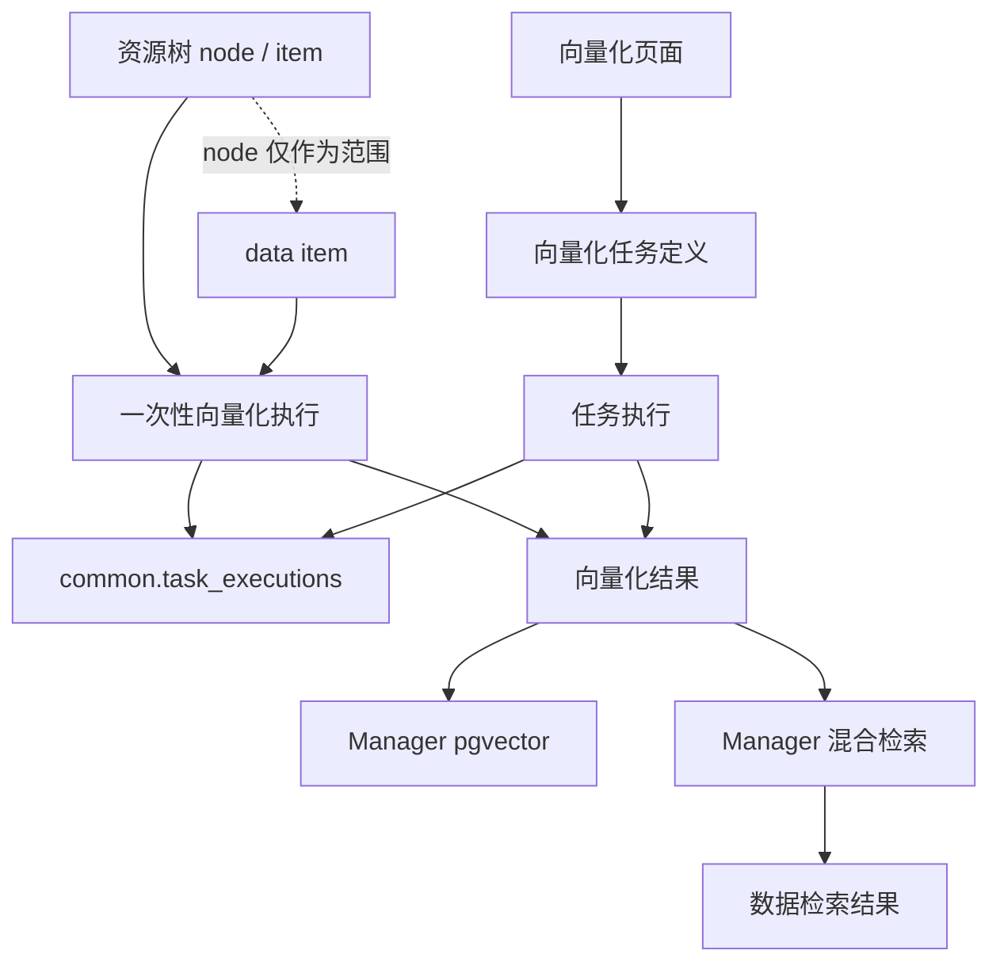

# Manager 向量化概念说明

> 本文说明 Manager 向量化的价值、对象边界、任务边界和结果边界。字段、API、状态枚举、执行配置、UI 和验证要求见 [向量化能力说明](向量化能力说明.md)。

## 核心结论

向量化是 Manager 面向数据检索提供的派生能力：它把可支持的数据项生成向量表示，写入 Manager 的向量结果存储，使数据检索可以在关键词、全文检索之外支持基于向量的语义检索。

一句话概括：

**data item 是向量化对象，node 是批量选择范围；资源树向量化是一次性操作，独立页面创建的向量化配置才是任务；向量化结果按 item 指纹去重，必须可查看、可重建、可清理。**

## 价值边界

向量化的目标不是“生成向量”本身，而是让用户能在数据检索中找到语义相关的数据项。

典型价值包括：

- 用户用自然语言检索相关文档、文本、图片等数据项。
- Manager 在混合检索中融合全文检索和向量检索结果。
- 用户可以查看哪些数据项已经向量化，哪些过期、失败或不支持。
- 后续可以在明确概念和输入契约后扩展图片查图片等检索方式。

向量化不是 Meta scan 的默认阶段。向量化失败不应影响 data item 的发现、基础元数据、预览、下载和资源树展示。

## 对象边界

### data item 是向量化对象

向量化只面向 data item。每条向量化结果都必须能回到一个明确的数据项。

短期主线支持对象包括：

- 文档类 item。
- 文本类 item。
- 图片类 item。
- 其他模型明确支持且成本可控的 item。

是否可向量化由 data type、format、content type、文件大小、模型能力和 Manager 策略共同决定，不应只依赖文件扩展名。

### node 只是批量入口

node 不生成自己的向量。资源树中的目录、bucket、prefix、schema 等 node 点击“向量化”时，只表示：

1. 以该 node 作为范围选择器。
2. 枚举范围内符合条件的 data item。
3. 对每个 item 逐个执行向量化判断和处理。

因此不存在“node 向量化结果”。向量化结果仍然属于 item。

## 任务与执行边界

向量化需要区分一次性执行、任务定义和结果状态。

| 对象 | 含义 | 存储 | 是否进入 Orchestrator 任务库 |
| --- | --- | --- | --- |
| 一次性向量化执行 | 用户从资源树 item 或 node 触发的一次操作 | `common.task_executions` | 否 |
| 向量化任务定义 | 用户在独立页面创建的可重复执行、可调度、可编排配置 | `manager.embedding_tasks` | 是 |
| 向量化结果 | 当前 item 是否已有可用向量、由什么模型生成、是否过期或失败 | `manager.embeddings` | 否 |

资源树上的 item 和 node 向量化都是一次性操作，不写入 `manager.embedding_tasks`。它们应写入 `common.task_executions`，用于 Monitor 追踪和审计。

只有用户显式在独立页面创建的向量化配置，才是向量化任务定义，才可以通过 TaskProvider 暴露给 Orchestrator。

## 重复执行语义

向量化执行应保持幂等，避免无谓成本。

执行时对每个 item 做判断：

| item 当前状态 | 执行动作 |
| --- | --- |
| 已向量化、未过期、模型和维度匹配 | 跳过 |
| 未向量化 | 生成向量 |
| 已过期 | 覆盖重建 |
| 上次失败 | 重试并在成功后覆盖 |
| 不支持 | 跳过并记录原因 |
| 源数据缺失 | 标记源缺失或交给 cleanup 策略处理 |

当前阶段不支持多模型、多维向量或多模态结果并存。系统只有一个启用中的向量模型配置和一个启用中的向量维度；同一个 item 指纹只保留一条当前向量化结果。结果表记录 `item_fingerprint`、模型和维度，用于去重、追溯、校验和模型切换后的过期判断。

## 模型配置归属

当前启用的向量模型是平台级、Manager-owned 的普通运行配置：

- Manager 定义配置结构、默认值、校验规则、持久化事实和生效逻辑。
- Platform System Administrator 在 Platform Realm 中通过 Manager 配置页面维护。
- Console 只聚合 Manager 发布的配置管理入口；System 只登记入口能力、提供 AuthContext、Permission 和统一审计，不保存或解释模型字段。
- 当前不允许 Tenant 选择或覆盖向量模型，也不建立 text/image/video 三套模型配置。
- 向量服务 API Key 属于部署 Secret，不进入 Manager 普通配置表、配置响应或审计详情。
- 模型输出维度同时约束 pgvector 列结构，因此是只读结构事实，不是可热更新的普通配置。

同维度切换模型时，既有 `ready` 结果因模型不匹配而统一视为 `outdated`，必须显式重新向量化后才能参与检索。不同维度切换必须先完成数据库结构迁移和全量重建方案，普通配置 API 必须拒绝直接修改。

任务定义和 execution 必须保存实际使用的模型与维度快照。平台模型变化不能静默改写已有任务定义或历史 execution；已有任务若与当前启用模型不一致，必须先显式更新任务配置才能再次执行。

## 存储与检索边界

短期向量内容和向量化结果状态归 Manager 管理：

- 向量内容存储在 Manager 的 PostgreSQL / pgvector 表中。
- Meilisearch 继续承担全文检索、属性检索和排序辅助，不作为向量结果事实源。
- Manager 搜索服务负责融合 Meilisearch 命中和 pgvector 命中。
- 搜索只应消费当前有效的向量化结果。

英文 API、表名和 TaskProvider `task_type` 统一使用 `embedding`；`vectorization` 只作为“向量化”的英文概念解释，不作为长期接口路径。

如果未来语义检索成为全平台统一能力，可再进入 Search / Index 专题讨论 owner 迁移，不在 Manager 当前实现中提前拆分。

## UI 边界

资源树上统一使用“向量化”作为用户可见名称。

item 展示规则：

- 未向量化：显示“向量化”操作。
- 已向量化且有效：显示“已向量化”提示，不显示向量化按钮。
- 过期或失败：可以显示重新向量化操作。

node 展示规则：

- node 不做复杂整体状态判断。
- node 可以提供“向量化”操作。
- 执行时逐个 item 判断，已有效的结果跳过。

Manager 提供独立“向量化”页面，并区分两个视图：

| 视图 | 对象 | 作用 |
| --- | --- | --- |
| 向量化结果 | `manager.embeddings` | 查看已经向量化的 item、状态、模型、时间、错误原因和操作入口 |
| 向量化任务 | `manager.embedding_tasks` | 创建、编辑、执行、调度可复用的向量化任务定义 |

向量化结果视图回答“现在有哪些 item 已经向量化”。向量化任务视图回答“以后按什么范围和策略反复执行向量化”。

## 总览关系

## 设计约束

1. 用户界面统一使用“向量化”，不引入“语义索引”作为一级概念。
2. item 是唯一向量化对象；node 只作为批量选择范围。
3. 资源树 item / node 向量化是一次性 execution，不创建任务定义。
4. 独立页面创建的向量化配置才是任务定义，并可被 Orchestrator 发现。
5. 向量化结果必须有独立视图，不能只展示最近一次执行状态。
6. 重复执行应按 item 状态跳过、重建或记录失败，不做无谓重复生成。
7. 当前阶段不支持多模型、多维和多模态结果并存；向量化结果以 `tenant_id + item_fingerprint` 去重，模型或维度变化时旧结果应视为过期。
8. 向量内容和结果状态归 Manager，不写入 Meta attributes，也不写入 Meilisearch 作为事实源。
9. 用户界面叫“向量化”，英文 API 和任务类型叫 `embedding`，避免 `embedding` / `vectorization` 双轨。
10. 当前启用模型属于 `platform_only` 的 Manager 配置；Tenant 不覆盖，System 不保存配置值，Console 不解释配置字段。
