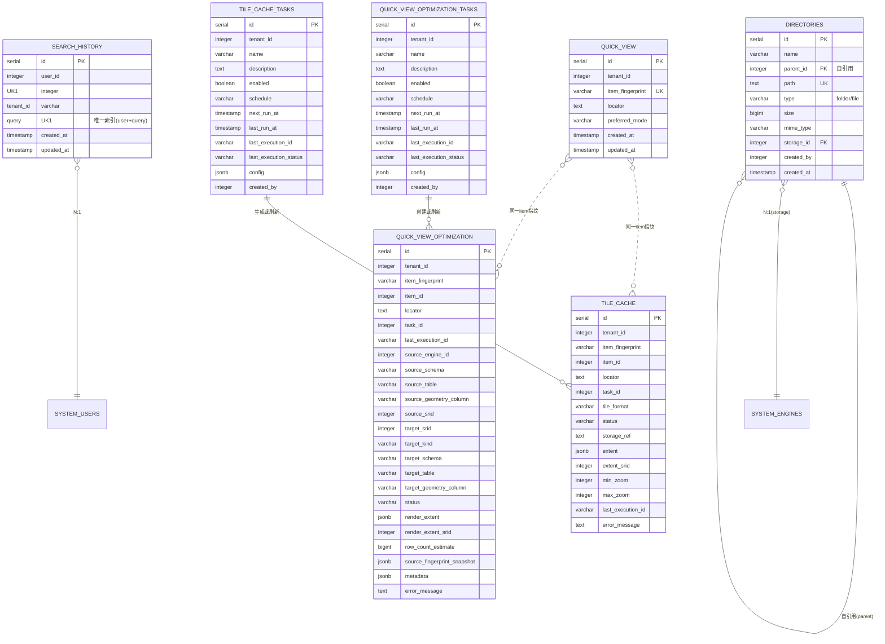

# Manager 模块数据库架构

## 一、模块概览

Manager 模块使用 PostgreSQL 的 `manager` schema，负责数据预览、检索、空间快显和瓦片缓存相关状态。

### 核心职责

- **目录管理**：文件系统风格的目录树结构
- **搜索历史**：记录用户的数据检索历史（全文 + 向量），提供快速访问
- **快显服务**：记录空间 item 的预览模式偏好；快显能力由查询时动态合成
- **快显性能优化结果**：记录 Manager 创建并拥有生命周期的 3857 快显优化目标
- **快显性能优化任务**：记录可执行、可编排的 3857 快显优化目标构建或刷新配置
- **瓦片缓存结果**：记录瓦片缓存的存储引用、格式、范围、层级和状态
- **瓦片缓存任务**：记录可执行、可调度、可编排的瓦片缓存生成配置

---

## 二、数据库表清单

| 表名 | 用途 | 行数估算 |
|------|------|---------|
| `directories` | 目录结构（文件/文件夹） | 10000-100000 |
| `search_history` | 搜索历史 | 1000-10000 |
| `quick_view` | 快显偏好 | 100-1000 |
| `quick_view_optimization` | 快显性能优化结果状态 | 100-10000 |
| `quick_view_optimization_tasks` | 快显性能优化任务定义 | 100-1000 |
| `tile_cache` | 瓦片缓存结果状态 | 100-10000 |
| `tile_cache_tasks` | 瓦片缓存生成任务定义 | 100-1000 |

---

## 三、表关系图

### 3.1 ER图（Mermaid）



### 3.2 关系说明

**核心关系**：
- `directories.parent_id` → `directories.id` (自引用，树形结构)
  - 根目录：`parent_id = NULL`
  - 子目录：`parent_id` 指向父目录
  
- `directories.storage_id` → `system.engines.id` (N:1)
  - 关联到对象存储引擎（MinIO/S3）
  
- `search_history.user_id` → `system.users.id` (N:1)
  - 每个用户有多条搜索历史
  
- `quick_view.item_fingerprint` ↔ `tile_cache.item_fingerprint` (逻辑关联)
  - `quick_view` 只保存用户偏好，不保存推荐结果；默认快显结果由状态查询时从 `tile_cache` 动态选择

- `quick_view.item_fingerprint` ↔ `quick_view_optimization.item_fingerprint` (逻辑关联)
  - `quick_view_optimization` 只登记 Manager 创建并拥有生命周期的快显优化目标
  - 自动识别的外部 3857 物化视图不写入该表，不出现在结果列表中，也不由 Manager cleanup 删除

- `quick_view_optimization.task_id` → `quick_view_optimization_tasks.id` (软引用)
  - 指向产生或最近刷新该优化结果的快显性能优化任务

- `tile_cache.task_id` → `tile_cache_tasks.id` (软引用)
  - 指向产生或最近刷新该产物的瓦片缓存任务

**独立表**：
- `search_history` 和空间快显相关表之间没有直接关系
- `directories` 和其他表之间没有直接关系

**租户隔离**：
- 所有表都有 `tenant_id` 或通过关联表继承租户隔离

---

## 四、数据流向

### 4.1 目录结构同步流程

```
用户上传文件（MinIO）
  ↓
1. 文件存储到 MinIO
   ↓
2. 创建 directories 记录
   ├─ name: 文件名
   ├─ path: 完整路径
   ├─ parent_id: 父目录 ID
   ├─ storage_id: MinIO 引擎 ID
   └─ mime_type: 自动识别
   ↓
3. 前端刷新目录树
   ├─ 调用 /api/data-explorer/tree
   └─ 显示新文件
```

### 4.2 搜索历史记录流程

```
用户搜索
  ↓
1. 前端调用 /api/search
   ├─ query: "城市数据"
   └─ limit: 10
   ↓
2. 后端执行混合检索（全文 + 向量）
   ├─ 查询 Meilisearch
   └─ 返回结果
   ↓
3. 自动记录搜索历史
   ├─ INSERT ON CONFLICT (user_id, query)
   └─ DO UPDATE SET updated_at = NOW()
   ↓
4. 返回搜索结果给前端
```

### 4.3 快显与瓦片缓存生成流程

```
用户打开 spatial item
  ↓
1. Manager 判断快显能力
   ├─ 根据空间元数据、小数据量直出能力和 ready tile_cache 动态合成 can_use_quick_view
   └─ 根据空间元数据、引擎能力和配置条件动态合成 can_generate_tile_cache
   ↓
2. 若 can_use_quick_view=true
   └─ 预览页展示“切换快显”；render_source=realtime_tile 时可根据 performance_mode 和瓦片响应头展示“执行快显优化”或“生成瓦片缓存”
   ↓
3. 若 can_use_quick_view=false 且 can_generate_tile_cache=true
   └─ 预览页展示“生成瓦片缓存”；存在慢路径或超时建议时优先展示“执行快显优化”
   ↓
4. 用户按引导创建 manager.quick_view_optimization_tasks 或 manager.tile_cache_tasks
   └─ 快显性能优化任务保存目标、几何和属性策略；瓦片缓存任务保存 target / tile / storage / options
   ↓
5. 执行 quick_view_optimization 或 tile_cache_generation
   ├─ 写入 common.task_executions
   ├─ quick_view_optimization 创建或刷新 manager.quick_view_optimization 和 3857 快显性能优化目标
   └─ tile_cache_generation 按 tenant_id + item_fingerprint + tile_format 创建或刷新 tile_cache，并写入瓦片对象和 manifest
   ↓
6. 更新状态
   ├─ quick_view_optimization.status 或 tile_cache.status=ready/failed/cancelled
   └─ 对应任务表 last_execution_id / last_execution_status
```

---

## 五、关键设计决策

### 5.1 目录树自引用设计

**设计选择**：使用 `parent_id` 自引用实现树形结构

**优点**：
- 简单直观，易于理解
- 支持无限层级嵌套
- 查询父子关系高效

**缺点**：
- 递归查询稍复杂（使用 PostgreSQL CTE）

**替代方案**：
- Materialized Path（存储完整路径）
- Nested Set（左右值模型）

**为什么选择自引用**：
- 目录结构变化频繁（文件上传/删除）
- 查询场景以"列出子节点"为主
- PostgreSQL 的 CTE 性能足够好

### 5.2 搜索历史去重机制

**设计选择**：唯一索引 `(user_id, query)` + `ON CONFLICT` 去重

**好处**：
- 数据库层面保证唯一性
- 同一搜索只保留最新时间
- 节省存储空间

**实现**：
```sql
INSERT INTO manager.search_history (user_id, tenant_id, query)
VALUES (1, 1, '城市数据')
ON CONFLICT (user_id, query)
DO UPDATE SET updated_at = NOW();
```

### 5.3 瓦片缓存当前结果与存储引用

**设计选择**：第一阶段同一 `item_fingerprint + tile_format` 只保留一份当前瓦片缓存结果，瓦片缓存结果通过 `storage_ref` 定位存储位置。

**用途**：
- `storage_ref` 指向当前瓦片缓存或 manifest，不要求上层硬编码 bucket、prefix 或对象路径；对象前缀按 `item_fingerprint` 组织
- 生成配置属于 `tile_cache_tasks.config` 和 execution `execution_config` / `metadata`，不作为瓦片缓存结果身份分叉

**好处**：
- 同一数据项不会产生多层 hash 目录和多份难以理解的缓存结果
- 结果页只表达当前可用结果，降低用户理解成本
- 降低 Manager 上层逻辑对对象存储路径规则的耦合

### 5.4 快显停止条件设计

**设计选择**：基于性能指标自动停止（时间 + 大小）

**问题**：高层级瓦片数量爆炸（如 zoom 18 有数百万瓦片）

**解决方案**：
- 监控每层的平均生成时间
- 监控每层的平均瓦片大小
- 超过阈值自动停止（实际层级可能 < MaxZoom）

**好处**：
- 避免过度缓存
- 节省存储和计算资源
- 自适应不同数据特性

---

## 六、性能优化

### 6.1 索引策略

**directories 表**：
- `idx_directories_path`（path）- 路径查找
- `idx_directories_parent`（parent_id）- 父子查询

**search_history 表**：
- `idx_search_history_user_query`（user_id, query）- 唯一索引
- `idx_search_history_tenant`（tenant_id）- 租户查询

**quick_view 表**：
- `idx_quick_view_tenant_fingerprint`（tenant_id, item_fingerprint）- 空间 item 偏好唯一身份

**quick_view_optimization 表**：
- `idx_qvo_tenant_item_fingerprint`（tenant_id, item_fingerprint）- 查询某 item 的快显性能优化结果
- `idx_qvo_tenant_item`（tenant_id, item_id）- 按当前 Meta item 行引用辅助回查
- `idx_qvo_current_target_unique`（tenant_id, item_fingerprint, source_geometry_column, target_srid）- 当前优化目标唯一
- `idx_qvo_status`（status）- 状态过滤
- `idx_qvo_task`（task_id）- 查询某任务产生的优化结果
- `idx_qvo_execution`（last_execution_id）- execution 回溯

**quick_view_optimization_tasks 表**：
- `idx_qvo_tasks_tenant`（tenant_id）- 租户任务查询
- `idx_qvo_tasks_schedule`（next_run_at, schedule）- 任务体系字段索引；第一阶段 `supports_schedule=false`，不启动 Manager 自身定时调度
- `idx_qvo_tasks_last_execution`（last_execution_id）- 最近执行回溯

**tile_cache 表**：
- `idx_tile_cache_tenant_item_fingerprint`（tenant_id, item_fingerprint）- 查询某 item 的瓦片缓存结果
- `idx_tile_cache_tenant_fingerprint_format_unique`（tenant_id, item_fingerprint, tile_format）- 当前结果唯一
- `idx_tile_cache_tenant_item`（tenant_id, item_id）- 按当前 Meta item 行引用辅助回查
- `idx_tile_cache_status`（status）- 状态过滤
- `idx_tile_cache_execution`（last_execution_id）- execution 回溯

**tile_cache_tasks 表**：
- `idx_tile_cache_tasks_tenant`（tenant_id）- 租户任务查询
- `idx_tile_cache_tasks_schedule`（enabled, next_run_at）- 调度扫描
- `idx_tile_cache_tasks_last_execution`（last_execution_id）- 最近执行回溯

### 6.2 查询优化

**场景 1：获取目录树**（高频）
```sql
-- 使用递归 CTE 查询子树
WITH RECURSIVE tree AS (
  SELECT * FROM manager.directories WHERE id = 1
  UNION ALL
  SELECT d.* FROM manager.directories d
  INNER JOIN tree t ON d.parent_id = t.id
)
SELECT * FROM tree;
```

**场景 2：查询搜索历史**（高频）
```sql
-- 使用索引查询用户历史
SELECT * FROM manager.search_history
WHERE user_id = 1
ORDER BY updated_at DESC
LIMIT 20;
```

### 6.3 缓存策略

**目录树缓存**：
- Redis 缓存目录树结构（TTL: 5分钟）
- 文件上传后清空缓存

**快显与瓦片对象缓存**：
- 快显能力由 `/quick-view/capability?locator=...` 动态合成，不缓存公共接口结果。
- 瓦片缓存任务完成后写入 `manager.tile_cache` 结果状态；统一 MVT 入口按 ready 结果的 `storage_ref` 读取瓦片对象。

---

## 七、数据一致性保证

### 7.1 级联删除

**目录树级联删除**：
```sql
ALTER TABLE manager.directories
ADD CONSTRAINT fk_directories_parent
FOREIGN KEY (parent_id) REFERENCES manager.directories(id)
ON DELETE CASCADE;
```

**删除文件夹**：
- 自动删除所有子文件夹和文件
- 同时删除 MinIO 中的实际文件

### 7.2 事务处理

**文件上传事务**：
```go
tx := db.Begin()

// 1. 创建目录记录
directory := &Directory{...}
tx.Create(directory)

// 2. 上传文件到 MinIO
err := minioClient.PutObject(...)
if err != nil {
    tx.Rollback()
    return err
}

tx.Commit()
```

---

## 八、扩展性设计

### 8.1 多租户隔离

**策略**：
- 所有表都有 `tenant_id` 字段
- 查询时自动过滤租户

**实现**：
```go
// 中间件自动注入租户 ID
db.Where("tenant_id = ?", tenantID).Find(&directories)
```

### 8.2 存储引擎扩展

**支持的存储类型**：
- MinIO（已实现）
- S3（兼容 MinIO API）
- 本地文件系统（规划中）

**扩展方式**：
- 新增 engine_type: 'local_fs'
- 实现对应的存储适配器

---

## 九、相关文档

- [directories表](tables/directories表.md) - 目录结构表
- [search_history表](tables/search_history表.md) - 搜索历史表
- [quick_view表](tables/quick_view表.md) - 快显偏好表
- [快显概念总览](快显概念总览.md) - 快显、快显性能优化和瓦片缓存概念边界
- [快显规范与技术路线](快显规范与技术路线.md) - 快显性能优化任务、结果和外部 3857 目标边界
- [tile_cache表](tables/tile_cache表.md) - 瓦片缓存结果状态表
- [tile_cache_tasks表](tables/tile_cache_tasks表.md) - 瓦片缓存生成任务定义表
- [Manager 模块说明](../CLAUDE.md) - 模块整体架构
