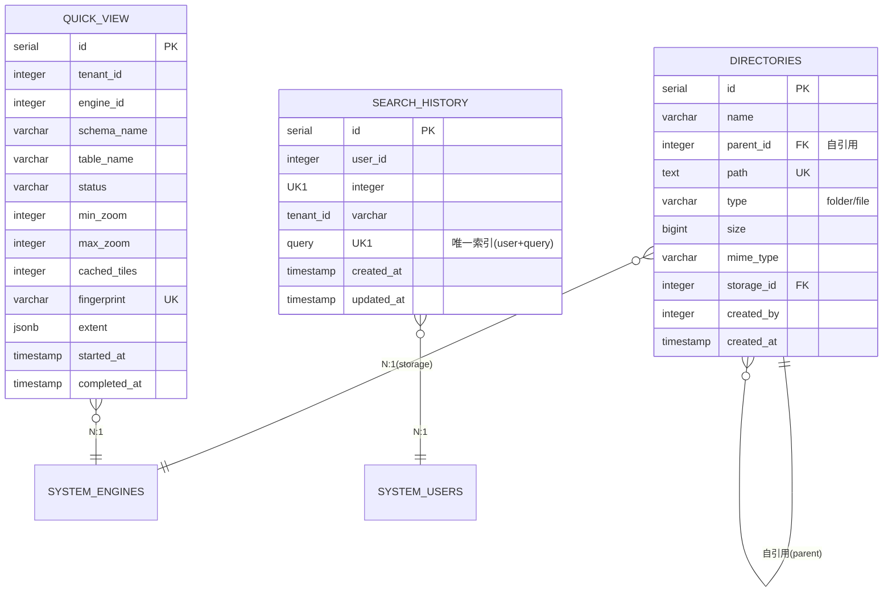

# Manager 模块数据库架构

## 一、模块概览

Manager 模块使用 PostgreSQL 的 `manager` schema，负责数据资产的组织、搜索和快速渲染功能。

### 核心职责

- **目录管理**：文件系统风格的目录树结构
- **搜索历史**：记录用户的数据检索历史（全文 + 向量），提供快速访问
- **快显服务**：空间数据瓦片预缓存，实现秒级地图渲染

---

## 二、数据库表清单

| 表名 | 用途 | 行数估算 |
|------|------|---------|
| `directories` | 目录结构（文件/文件夹） | 10000-100000 |
| `search_history` | 搜索历史 | 1000-10000 |
| `quick_view` | 快显任务 | 100-1000 |

---

## 三、表关系图

### 3.1 ER图（Mermaid）



### 3.2 关系说明

**核心关系**：
- `directories.parent_id` → `directories.id` (自引用，树形结构)
  - 根目录：`parent_id = NULL`
  - 子目录：`parent_id` 指向父目录
  
- `directories.storage_id` → `system.engines.id` (N:1)
  - 关联到对象存储引擎（MinIO/S3）
  
- `search_history.user_id` → `system.users.id` (N:1)
  - 每个用户有多条搜索历史
  
- `quick_view.engine_id` → `system.engines.id` (N:1)
  - 关联到数据库引擎（PostgreSQL等）

**独立表**：
- `search_history` 和 `quick_view` 之间没有直接关系
- `directories` 和其他表之间没有直接关系

**租户隔离**：
- 所有表都有 `tenant_id` 或通过关联表继承租户隔离

---

## 四、数据流向

### 4.1 目录结构同步流程

```
用户上传文件（MinIO）
  ↓
1. 文件存储到 MinIO
   ↓
2. 创建 directories 记录
   ├─ name: 文件名
   ├─ path: 完整路径
   ├─ parent_id: 父目录 ID
   ├─ storage_id: MinIO 引擎 ID
   └─ mime_type: 自动识别
   ↓
3. 前端刷新目录树
   ├─ 调用 /api/data-explorer/tree
   └─ 显示新文件
```

### 4.2 搜索历史记录流程

```
用户搜索
  ↓
1. 前端调用 /api/search
   ├─ query: "城市数据"
   └─ limit: 10
   ↓
2. 后端执行混合检索（全文 + 向量）
   ├─ 查询 Meilisearch
   └─ 返回结果
   ↓
3. 自动记录搜索历史
   ├─ INSERT ON CONFLICT (user_id, query)
   └─ DO UPDATE SET updated_at = NOW()
   ↓
4. 返回搜索结果给前端
```

### 4.3 快显预缓存流程

```
用户触发快显
  ↓
1. POST /api/engines/1/spatial/public/cities/pre-cache
   ↓
2. 创建 quick_view 记录 (status='none')
   ↓
3. 计算空间范围和 MinZoom/MaxZoom
   ├─ SELECT ST_Extent(geom) FROM cities
   ├─ 计算最佳 MinZoom
   └─ UPDATE quick_view SET extent, min_zoom, status='generating'
   ↓
4. 后台任务：逐层生成瓦片
   ├─ 从 MinZoom 到 MaxZoom
   ├─ 每层生成所有覆盖范围的瓦片
   ├─ 保存到 MinIO: mvt-cache/{fingerprint}/{z}/{x}/{y}.mvt
   └─ 更新 cached_tiles, last_zoom_avg_time_ms
   ↓
5. 检查停止条件
   ├─ 生成时间过长？
   ├─ 瓦片过大？
   └─ 满足则停止
   ↓
6. 更新 quick_view 记录
   ├─ status='ready'
   ├─ completed_at: 完成时间
   └─ actual_max_zoom: 实际层级
```

---

## 五、关键设计决策

### 5.1 目录树自引用设计

**设计选择**：使用 `parent_id` 自引用实现树形结构

**优点**：
- 简单直观，易于理解
- 支持无限层级嵌套
- 查询父子关系高效

**缺点**：
- 递归查询稍复杂（使用 PostgreSQL CTE）

**替代方案**：
- Materialized Path（存储完整路径）
- Nested Set（左右值模型）

**为什么选择自引用**：
- 目录结构变化频繁（文件上传/删除）
- 查询场景以"列出子节点"为主
- PostgreSQL 的 CTE 性能足够好

### 5.2 搜索历史去重机制

**设计选择**：唯一索引 `(user_id, query)` + `ON CONFLICT` 去重

**好处**：
- 数据库层面保证唯一性
- 同一搜索只保留最新时间
- 节省存储空间

**实现**：
```sql
INSERT INTO manager.search_history (user_id, tenant_id, query)
VALUES (1, 1, '城市数据')
ON CONFLICT (user_id, query)
DO UPDATE SET updated_at = NOW();
```

### 5.3 快显 Fingerprint 设计

**设计选择**：使用 MD5(engine:schema:table) 作为唯一标识

**用途**：
- MinIO 缓存路径：`mvt-cache/{fingerprint}/{z}/{x}/{y}.mvt`
- 避免路径冲突
- 表结构变化时自动失效

**好处**：
- 路径简洁（64 字符 vs 完整表名）
- 跨引擎唯一
- 支持缓存失效策略

### 5.4 快显停止条件设计

**设计选择**：基于性能指标自动停止（时间 + 大小）

**问题**：高层级瓦片数量爆炸（如 zoom 18 有数百万瓦片）

**解决方案**：
- 监控每层的平均生成时间
- 监控每层的平均瓦片大小
- 超过阈值自动停止（实际层级可能 < MaxZoom）

**好处**：
- 避免过度缓存
- 节省存储和计算资源
- 自适应不同数据特性

---

## 六、性能优化

### 6.1 索引策略

**directories 表**：
- `idx_directories_path`（path）- 路径查找
- `idx_directories_parent`（parent_id）- 父子查询

**search_history 表**：
- `idx_search_history_user_query`（user_id, query）- 唯一索引
- `idx_search_history_tenant`（tenant_id）- 租户查询

**quick_view 表**：
- `idx_quick_view_tenant_resource`（tenant_id, engine_id）- 租户资源查询
- `idx_quick_view_status`（status）- 状态过滤
- `idx_quick_view_fingerprint`（fingerprint）- 指纹查询

### 6.2 查询优化

**场景 1：获取目录树**（高频）
```sql
-- 使用递归 CTE 查询子树
WITH RECURSIVE tree AS (
  SELECT * FROM manager.directories WHERE id = 1
  UNION ALL
  SELECT d.* FROM manager.directories d
  INNER JOIN tree t ON d.parent_id = t.id
)
SELECT * FROM tree;
```

**场景 2：查询搜索历史**（高频）
```sql
-- 使用索引查询用户历史
SELECT * FROM manager.search_history
WHERE user_id = 1
ORDER BY updated_at DESC
LIMIT 20;
```

### 6.3 缓存策略

**目录树缓存**：
- Redis 缓存目录树结构（TTL: 5分钟）
- 文件上传后清空缓存

**快显状态缓存**：
- Redis 缓存 tile-config（TTL: 1小时）
- 快显完成后清空缓存

---

## 七、数据一致性保证

### 7.1 级联删除

**目录树级联删除**：
```sql
ALTER TABLE manager.directories
ADD CONSTRAINT fk_directories_parent
FOREIGN KEY (parent_id) REFERENCES manager.directories(id)
ON DELETE CASCADE;
```

**删除文件夹**：
- 自动删除所有子文件夹和文件
- 同时删除 MinIO 中的实际文件

### 7.2 事务处理

**文件上传事务**：
```go
tx := db.Begin()

// 1. 创建目录记录
directory := &Directory{...}
tx.Create(directory)

// 2. 上传文件到 MinIO
err := minioClient.PutObject(...)
if err != nil {
    tx.Rollback()
    return err
}

tx.Commit()
```

---

## 八、扩展性设计

### 8.1 多租户隔离

**策略**：
- 所有表都有 `tenant_id` 字段
- 查询时自动过滤租户

**实现**：
```go
// 中间件自动注入租户 ID
db.Where("tenant_id = ?", tenantID).Find(&directories)
```

### 8.2 存储引擎扩展

**支持的存储类型**：
- MinIO（已实现）
- S3（兼容 MinIO API）
- 本地文件系统（规划中）

**扩展方式**：
- 新增 engine_type: 'local_fs'
- 实现对应的存储适配器

---

## 九、相关文档

- [directories表](tables/directories表.md) - 目录结构表
- [search_history表](tables/search_history表.md) - 搜索历史表
- [quick_view表](tables/quick_view表.md) - 快显任务表
- [Manager 模块说明](../CLAUDE.md) - 模块整体架构
