# Manager 模块数据库架构

## 一、模块概览

Manager 模块使用 PostgreSQL 的 `manager` schema，负责检索历史、数据剖析、向量化、空间快显和瓦片缓存相关状态。资源树、node 和 item 事实归 Meta 管理，Manager 通过 ResourceLocator 与 Meta facts 做只读探查和预览。

### 核心职责

- **搜索历史**：记录用户的数据检索历史（全文 + 向量），提供快速访问
- **数据剖析结果**：记录表格型 data item 当前成功的采样剖析摘要和字段指标；执行历史仍归 `common.task_executions`
- **向量化结果**：记录 data item 当前可检索向量状态和 pgvector 内容
- **向量化任务**：记录可执行、可调度、可编排的向量化任务定义
- **快显服务**：记录 item 的预览模式偏好和轻量交互状态；快显能力由查询时动态合成
- **矢量物化视图结果**：记录 Manager 创建并拥有生命周期的 3857 矢量物化视图目标
- **矢量物化视图任务**：记录可执行、可编排的 3857 矢量物化视图目标构建或刷新配置
- **栅格快显 COG生成结果**：记录 Manager 创建并拥有生命周期的 infra MinIO COG 生成结果
- **栅格快显 COG生成任务**：记录可执行、可编排的 raster COG 生成配置
- **点云 COPC 快显结果**：记录 Manager 创建并拥有生命周期的 infra MinIO COPC artifact
- **点云 COPC 快显任务**：记录可执行、可编排的 LAS / LAZ / E57 / PCD / XYZ 转 COPC 快显配置
- **CAD 栅格预览结果**：记录 Manager 创建并拥有生命周期的二维 DWG manifest、thumbnail 和 WebP 瓦片 artifact
- **CAD 栅格预览任务**：记录可执行、可编排的 DWG 直接渲染配置
- **瓦片缓存结果**：记录瓦片缓存的存储引用、格式、范围、层级和状态
- **瓦片缓存任务**：记录可执行、可编排的瓦片缓存生成配置；当前不支持任务自身定时调度
- **导出会话**：记录用户发起的数据库 item 导出会话、Transfer sync execution 和 infra 暂存产物 manifest

---

## 二、数据库表清单

| 表名 | 用途 | 行数估算 |
|------|------|---------|
| `search_history` | 搜索历史 | 1000-10000 |
| `export_sessions` | Manager 导出会话和 infra 暂存产物 manifest | 1000-10000 |
| `data_profiles` | 表格数据当前成功剖析结果和源依赖 | 1000-100000 |
| `data_profile_fields` | 当前剖析结果的字段指标、分布和观察 | 10000-1000000 |
| `embeddings` | 向量化结果状态和向量内容 | 10000-1000000 |
| `embedding_tasks` | 向量化任务定义 | 100-1000 |
| `preview_state` | 预览模式偏好和预览交互状态 | 100-1000 |
| `vector_materialized_view` | 矢量物化视图结果状态 | 100-10000 |
| `vector_materialized_view_tasks` | 矢量物化视图任务定义 | 100-1000 |
| `raster_cog` | 栅格快显 COG生成结果 | 100-10000 |
| `raster_cog_tasks` | 栅格快显 COG生成任务定义 | 100-1000 |
| `model_3d_glb` | 三维模型 GLB 快显结果 | 100-10000 |
| `model_3d_glb_tasks` | 三维模型 GLB 快显任务定义 | 100-1000 |
| `model3d_tiles` | 分块三维模型瓦片结果，包含 3D Tiles / S3M | 100-10000 |
| `model3d_tiles_tasks` | 分块三维模型瓦片任务定义 | 100-1000 |
| `gaussian_splat_ksplat` | 3DGS - KSplat 快显结果 | 100-10000 |
| `gaussian_splat_ksplat_tasks` | 3DGS - KSplat 快显任务定义 | 100-1000 |
| `point_cloud_copc` | 点云 COPC 快显结果 | 100-10000 |
| `point_cloud_copc_tasks` | 点云 COPC 快显任务定义 | 100-1000 |
| `cad_previews` | CAD 栅格瓦片预览结果 | 100-10000 |
| `cad_preview_tasks` | CAD 栅格瓦片预览任务定义 | 100-1000 |
| `vector_tile_cache` | 瓦片缓存结果状态 | 100-10000 |
| `vector_tile_cache_tasks` | 瓦片缓存生成任务定义 | 100-1000 |

### Schema 收敛方式

Manager 当前启动路径不自动执行 `manager/backend/migrations` 目录下的 SQL 文件。该目录包含历史 clean-break 脚本，其中部分脚本会删除并重建旧表；在没有 `manager.schema_migrations` 记录和幂等审计前，不能把整个目录直接接入模块启动流程。

当前 Manager schema 的运行时事实源是：

1. `common/repository.InitDatabase` 执行基础连接和 GORM `AutoMigrate`。
2. `manager/backend/internal/repository/database.go` 中的 `ensure*Schema` 函数执行 Manager 私有表的 clean-break schema guard、字段补齐、索引收敛和必要的数据规范化。
3. `manager/backend/migrations/*.sql` 作为部署审计、人工迁移和数据库变更说明使用；新增 SQL 必须和对应 `ensure*Schema` 运行时 guard 保持一致。

---

## 三、表关系图

### 3.1 ER图（Mermaid）

```mermaid
erDiagram
    SEARCH_HISTORY }o--|| SYSTEM_USERS : "N:1"
    EXPORT_SESSIONS ||..|| TASK_EXECUTIONS : "关联 Transfer execution"
    DATA_PROFILES ||--o{ DATA_PROFILE_FIELDS : "包含字段结果"
    DATA_PROFILES ||..|| TASK_EXECUTIONS : "最近成功 execution"
    EMBEDDING_TASKS ||..o{ EMBEDDINGS : "执行后更新结果"
    PREVIEW_STATE }o..o{ TILE_CACHE : "同一item指纹"
    PREVIEW_STATE }o..o{ VECTOR_MATERIALIZED_VIEW : "同一item指纹"
    PREVIEW_STATE }o..o{ RASTER_COG : "同一item指纹"
    PREVIEW_STATE }o..o{ MODEL_3D_GLB : "同一item指纹"
    PREVIEW_STATE }o..o{ GAUSSIAN_SPLAT_KSPLAT : "同一item指纹"
    PREVIEW_STATE }o..o{ POINT_CLOUD_COPC : "同一item指纹"
    PREVIEW_STATE }o..o{ CAD_PREVIEWS : "同一item指纹"
    VECTOR_MATERIALIZED_VIEW_TASKS ||--o{ VECTOR_MATERIALIZED_VIEW : "创建或刷新"
    RASTER_COG_TASKS ||--o{ RASTER_COG : "生成"
    MODEL_3D_GLB_TASKS ||--o{ MODEL_3D_GLB : "生成"
    GAUSSIAN_SPLAT_KSPLAT_TASKS ||--o{ GAUSSIAN_SPLAT_KSPLAT : "生成"
    POINT_CLOUD_COPC_TASKS ||--o{ POINT_CLOUD_COPC : "生成"
    CAD_PREVIEW_TASKS ||--o{ CAD_PREVIEWS : "生成"
    TILE_CACHE_TASKS ||--o{ TILE_CACHE : "生成或刷新"

    SEARCH_HISTORY {
        serial id PK
        integer user_id UK1
        integer tenant_id
        varchar query UK1 "唯一索引(user+query)"
        timestamp created_at
        timestamp updated_at
    }

    EXPORT_SESSIONS {
        serial id PK
        integer tenant_id
        integer user_id
        text source_item_locator
        varchar format
        varchar file_name
        text target_parent_locator
        text target_locator
        jsonb artifact_manifest
        integer transfer_task_id
        varchar transfer_execution_id
        varchar status
        text error_message
        timestamp created_at
        timestamp updated_at
    }

    DATA_PROFILES {
        bigserial id PK
        bigint tenant_id UK1
        varchar item_fingerprint UK1
        bigint item_id
        bigint engine_id
        text locator
        varchar source_version
        jsonb dependency_snapshot
        varchar profile_mode UK1
        varchar profile_config_hash UK1
        jsonb data_scope
        varchar schema_version
        varchar sample_method
        bigint sample_size
        bigint rows_scanned
        bigint row_count
        boolean row_count_exact
        integer field_count
        boolean truncated
        boolean partial
        jsonb observations
        varchar last_execution_id
        timestamp profiled_at
    }

    DATA_PROFILE_FIELDS {
        bigserial id PK
        bigint profile_id FK
        integer position
        varchar name
        varchar type
        varchar status
        jsonb profile
    }

    EMBEDDINGS {
        serial id PK
        integer tenant_id
        varchar item_fingerprint UK
        integer item_id
        integer engine_id
        text locator
        varchar source_version
        vector embedding
        varchar model
        integer dimension
        varchar status
        varchar status_reason
        text error_message
        varchar last_execution_id
        timestamp vectorized_at
    }

    EMBEDDING_TASKS {
        serial id PK
        integer tenant_id
        varchar name
        text description
        boolean enabled
        varchar schedule
        timestamp next_run_at
        timestamp last_run_at
        varchar last_execution_id
        varchar last_execution_status
        jsonb config
        integer created_by
    }

    PREVIEW_STATE {
        serial id PK
        integer tenant_id
        varchar item_fingerprint UK
        text locator
        varchar preferred_mode
        jsonb view_state
        timestamp created_at
        timestamp updated_at
    }

    VECTOR_MATERIALIZED_VIEW {
        serial id PK
        integer tenant_id
        varchar item_fingerprint
        integer item_id
        text locator
        integer task_id
        varchar last_execution_id
        integer source_engine_id
        varchar source_schema
        varchar source_table
        varchar source_geometry_column
        integer source_srid
        integer target_srid
        varchar target_kind
        varchar target_schema
        varchar target_table
        varchar target_geometry_column
        varchar status
        jsonb render_extent
        integer render_extent_srid
        bigint row_count_estimate
        jsonb source_fingerprint_snapshot
        jsonb metadata
        text error_message
    }

    VECTOR_MATERIALIZED_VIEW_TASKS {
        serial id PK
        integer tenant_id
        varchar name
        text description
        boolean enabled
        varchar schedule
        timestamp next_run_at
        timestamp last_run_at
        varchar last_execution_id
        varchar last_execution_status
        jsonb config
        integer created_by
    }

    RASTER_COG {
        serial id PK
        integer tenant_id
        varchar item_fingerprint
        integer item_id
        text locator
        integer source_engine_id
        integer task_id
        varchar last_execution_id
        varchar source_profile
        varchar target_kind
        text storage_ref
        integer width
        integer height
        integer band_count
        integer source_srid
        text source_crs
        jsonb extent
        integer extent_srid
        varchar status
        jsonb metadata
        text error_message
    }

    RASTER_COG_TASKS {
        serial id PK
        integer tenant_id
        varchar name
        text description
        boolean enabled
        varchar schedule
        timestamp next_run_at
        timestamp last_run_at
        varchar last_execution_id
        varchar last_execution_status
        jsonb config
        integer created_by
    }

    MODEL_3D_GLB {
        serial id PK
        integer tenant_id
        varchar item_fingerprint
        integer item_id
        text locator
        integer task_id
        varchar last_execution_id
        integer source_engine_id
        varchar source_format
        bigint source_size_bytes
        text storage_ref
        varchar file_name
        bigint size_bytes
        text content_url
        varchar status
        jsonb metadata
        text error_message
    }

    MODEL_3D_GLB_TASKS {
        serial id PK
        integer tenant_id
        varchar name
        text description
        boolean enabled
        varchar schedule
        timestamp next_run_at
        timestamp last_run_at
        varchar last_execution_id
        varchar last_execution_status
        jsonb config
        integer created_by
    }

    GAUSSIAN_SPLAT_KSPLAT {
        serial id PK
        integer tenant_id
        varchar item_fingerprint
        integer item_id
        text locator
        integer task_id
        varchar last_execution_id
        integer source_engine_id
        varchar source_format
        bigint source_size_bytes
        text storage_ref
        varchar file_name
        bigint size_bytes
        text content_url
        varchar status
        jsonb metadata
        text error_message
    }

    GAUSSIAN_SPLAT_KSPLAT_TASKS {
        serial id PK
        integer tenant_id
        varchar name
        text description
        boolean enabled
        varchar schedule
        timestamp next_run_at
        timestamp last_run_at
        varchar last_execution_id
        varchar last_execution_status
        jsonb config
        integer created_by
    }

    POINT_CLOUD_COPC {
        serial id PK
        integer tenant_id
        varchar item_fingerprint
        integer item_id
        text locator
        integer task_id
        varchar last_execution_id
        integer source_engine_id
        varchar source_format
        bigint source_size_bytes
        text storage_ref
        varchar file_name
        bigint size_bytes
        text content_url
        varchar status
        jsonb metadata
        text error_message
    }

    POINT_CLOUD_COPC_TASKS {
        serial id PK
        integer tenant_id
        varchar name
        text description
        boolean enabled
        varchar schedule
        timestamp next_run_at
        timestamp last_run_at
        varchar last_execution_id
        varchar last_execution_status
        jsonb config
        integer created_by
    }

    TILE_CACHE {
        serial id PK
        integer tenant_id
        varchar item_fingerprint
        integer item_id
        text locator
        integer task_id
        varchar tile_format
        varchar status
        text storage_ref
        jsonb extent
        integer extent_srid
        integer min_zoom
        integer max_zoom
        varchar last_execution_id
        text error_message
    }

    TILE_CACHE_TASKS {
        serial id PK
        integer tenant_id
        varchar name
        text description
        boolean enabled
        varchar schedule
        timestamp next_run_at
        timestamp last_run_at
        varchar last_execution_id
        varchar last_execution_status
        jsonb config
        integer created_by
    }
```



### 3.2 关系说明

**核心关系**：
- `search_history.user_id` → `system.users.id` (N:1)
  - 每个用户有多条搜索历史

- `embeddings.item_fingerprint` ↔ Meta item 指纹 (逻辑关联)
  - `manager.embeddings` 只表达 data item 当前向量化结果状态
  - `item_id` 是当前 Meta item 行引用，用于回查和资源树定位，不作为去重身份
  - `status=ready` 且 model / dimension 匹配时才可被混合检索消费

- `embedding_tasks` → `common.task_executions` (任务执行关系)
  - 持久化向量化任务定义进入 `manager.embedding_tasks`
  - 每次执行写入 `common.task_executions`
  - 资源树 item / node 一次性向量化只写 execution，不写任务定义

- `preview_state.item_fingerprint` ↔ `vector_tile_cache.item_fingerprint` (逻辑关联)
  - `preview_state` 只保存用户偏好和预览交互状态，不保存推荐结果；默认快显结果由状态查询时从 `vector_tile_cache` 动态选择

- `preview_state.item_fingerprint` ↔ `vector_materialized_view.item_fingerprint` (逻辑关联)
  - `vector_materialized_view` 只登记 Manager 创建并拥有生命周期的矢量物化视图目标
  - 自动识别的外部 3857 物化视图不写入该表，不出现在结果列表中，也不由 Manager cleanup 删除
  - 后续如支持人工登记外部 3857 目标，应使用独立 artifact state，不复用 `vector_materialized_view` 表

- `vector_materialized_view.task_id` → `vector_materialized_view_tasks.id` (软引用)
  - 指向产生或最近刷新该矢量物化视图结果的任务

- `vector_tile_cache.task_id` → `vector_tile_cache_tasks.id` (软引用)
  - 指向产生或最近刷新该产物的瓦片缓存任务

- `model_3d_glb.task_id` → `model_3d_glb_tasks.id` (软引用)
  - 指向产生或最近刷新该 GLB 快显 artifact 的任务

- `gaussian_splat_ksplat.task_id` → `gaussian_splat_ksplat_tasks.id` (软引用)
  - 指向产生或最近刷新该 KSplat 快显 artifact 的任务

- `point_cloud_copc.task_id` → `point_cloud_copc_tasks.id` (软引用)
  - 指向产生或最近刷新该 COPC 快显 artifact 的任务
  - 源 `format=copc` item 直接基础预览，不创建任务也不写入本表

**独立表**：
- `search_history`、向量化结果和空间快显相关表之间没有直接关系

- `export_sessions` 是 Manager 用户导出会话表，不是 Manager 任务定义表：
  - source 是数据库 item 的 ResourceLocator。
  - target 是 `addp-infra://minio/manager/...` 暂存对象或 prefix。
  - `transfer_task_id` / `transfer_execution_id` 只关联 Manager 调用 Transfer 创建的 `sync` 任务和 execution。
  - `artifact_manifest` 记录 Manager 下载时需要消费的导出产物 refs；Shapefile 等 multi refs 导出由 Transfer 产出相关对象，Manager 根据 manifest 打包 zip 返回给用户。
  - 导出产物位于 infra MinIO 的 `manager` bucket，不进入业务资源树，不写 Meta item，不触发 Meta scan。

**租户隔离**：
- 所有表都有 `tenant_id` 或通过关联表继承租户隔离

---

## 四、数据流向

### 4.1 资源树与预览事实消费流程

```
用户打开数据探查页面
  ↓
1. Manager 从 System 读取用户可访问引擎
   ↓
2. Manager 从 Meta 读取 node / item facts
   ├─ node / item 归 Meta 管理
   ├─ Manager 不创建 manager.directories
   └─ 前端使用 ResourceLocator 作为树节点和预览定位入口
   ↓
3. 用户选择数据项后调用 /api/v1/manager/preview
   ├─ PreviewResolver 按 locator 回查 Meta facts
   └─ PreviewProvider 生成前端预览材料
```

### 4.2 搜索历史记录流程

```
用户搜索
  ↓
1. 前端调用 /api/v1/manager/search
   ├─ query: "城市数据"
   └─ limit: 10
   ↓
2. 后端执行混合检索（全文 + 向量）
   ├─ 查询 Meilisearch
   └─ 返回结果
   ↓
3. 自动记录搜索历史
   ├─ INSERT ON CONFLICT (user_id, query)
   └─ DO UPDATE SET updated_at = NOW()
   ↓
4. 返回搜索结果给前端
```

### 4.3 向量化结果生成与检索流程

```text
用户触发资源树 item/node 向量化，或执行 embedding 任务
  ↓
1. 创建 common.task_executions
   ├─ ad-hoc execution 不写 source_task_id
   └─ 持久化任务 execution 写 source_task_id=manager.embedding_tasks.id
   ↓
2. 枚举 data item 并逐个判断
   ├─ ready 且 source_version/model/dimension 匹配：跳过
   ├─ unsupported / missing_source：写入对应 artifact state
   └─ 缺失、失败或过期：重新读取内容生成向量
   ↓
3. upsert manager.embeddings
   ├─ tenant_id + item_fingerprint 唯一
   ├─ 保存 pgvector、model、dimension、status
   └─ 记录 last_execution_id 和 vectorized_at
   ↓
4. 混合检索
   ├─ Meilisearch 提供全文/属性检索
   ├─ manager.embeddings 提供 ready 向量命中
   └─ 搜索结果带 locator 回到资源树或预览
```

### 4.4 快显与瓦片缓存生成流程

```
用户打开 spatial item
  ↓
1. Manager 判断快显能力
   ├─ 根据空间元数据、小数据量直出能力和 ready vector_tile_cache 动态合成 can_use_quick_view
   └─ 根据空间元数据、引擎能力和配置条件动态合成 can_generate_vector_tile_cache
   ↓
2. 若 can_use_quick_view=true
   └─ 预览页展示“切换快显”；render_source=realtime_tile 时可根据 performance_mode 和瓦片响应头展示“执行矢量物化视图”或“生成瓦片缓存”
   ↓
3. 若 can_use_quick_view=false 且 can_generate_vector_tile_cache=true
   └─ 预览页展示“生成瓦片缓存”；存在慢路径或超时建议时优先展示“执行矢量物化视图”
   ↓
4. 用户按引导创建 manager.vector_materialized_view_tasks 或 manager.vector_tile_cache_tasks
   └─ 矢量物化视图任务保存目标、几何和属性策略；瓦片缓存任务保存 target / tile / storage / options
   ↓
5. 执行 vector_materialized_view_generation 或 vector_tile_cache_generation
   ├─ 写入 common.task_executions
   ├─ vector_materialized_view_generation 创建或刷新 manager.vector_materialized_view 和 3857 矢量物化视图目标
   └─ vector_tile_cache_generation 按 tenant_id + item_fingerprint + profile_hash 创建或刷新 vector_tile_cache，并写入单个 PMTiles 对象
   ↓
6. 更新状态
   ├─ vector_materialized_view.status 或 vector_tile_cache.status=ready/failed/cancelled
   └─ 对应任务表 last_execution_id / last_execution_status
```

### 4.5 数据库 item 导出流程

```text
用户在数据库 table item 上点击导出
  ↓
1. Manager 创建 export_sessions
   ├─ source_item_locator 指向数据库 table item
   ├─ target_parent_locator / target_locator 指向 infra MinIO manager bucket
   └─ status=pending
  ↓
2. Manager 通过 Transfer client 创建并触发 sync
   ├─ Transfer task_type 固定为 sync
   ├─ target policy 使用 overwrite
   └─ auto_scan_metadata=false
  ↓
3. Manager 轮询 Transfer execution
   ├─ running：更新 export_sessions.status
   ├─ success：读取导出对象或 manifest，写入 artifact_manifest，status=success
   └─ failed：写入 error_message，status=failed
  ↓
4. 前端调用 /api/v1/manager/exports/{id}/file
   ├─ single artifact：Manager 从 infra MinIO 流式返回文件
   └─ multi refs artifact：Manager 根据 artifact_manifest 流式打包 zip 返回
```

导出过程中的 infra 暂存上传 / 下载是 Manager 内部实现细节，用户只看到一次导出动作和最终文件下载。该链路不得复用存储型 item 的 `downloads/file`，也不得把导出暂存对象登记为业务库 item。

---

### 4.6 表格数据剖析流程

```text
用户打开“剖析”或提交结构化条件
  -> Manager 解析 ResourceLocator 和当前 child/ref 选择
  -> 校验并规范化 data_scope，计算 profile_config_hash
  -> 查询该数据范围的当前成功结果及同目标 active execution
  -> 无结果且无 active execution 时创建 data_profiling execution
  -> 条件范围由支持的 Provider 在源端参数化过滤，全范围按系统化页面读取
  -> bounded reservoir 收敛样本并计算 data.profile/v2 指标
  -> 事务替换 data_profiles + data_profile_fields
  -> common.task_executions 标记 success
```

刷新失败只更新 execution，不修改当前成功结果。源版本变化时结果标记 stale，不自动删除或重跑。全范围与各条件范围按 `profile_config_hash` 并存。

## 五、关键设计决策

### 5.1 搜索历史去重机制

**设计选择**：唯一索引 `(user_id, query)` + `ON CONFLICT` 去重

**好处**：
- 数据库层面保证唯一性
- 同一搜索只保留最新时间
- 节省存储空间

**实现**：
```sql
INSERT INTO manager.search_history (user_id, tenant_id, query)
VALUES (1, 1, '城市数据')
ON CONFLICT (user_id, query)
DO UPDATE SET updated_at = NOW();
```

### 5.2 瓦片缓存当前结果与存储引用

**设计选择**：当前同一 `item_fingerprint + profile_hash` 只保留一份当前瓦片缓存结果，瓦片缓存结果通过 `storage_ref` 定位单个 PMTiles 对象。

**用途**：
- `storage_ref` 指向当前瓦片缓存或 manifest，不要求上层硬编码 bucket、prefix 或对象路径；对象前缀按 `item_fingerprint` 组织
- 生成配置属于 `vector_tile_cache_tasks.config` 和 execution `execution_config` / `metadata`，不作为瓦片缓存结果身份分叉

**好处**：
- 同一数据项不会产生多层 hash 目录和多份难以理解的缓存结果
- 结果页只表达当前可用结果，降低用户理解成本
- 降低 Manager 上层逻辑对对象存储路径规则的耦合

### 5.3 快显层级边界与保护

**设计选择**：用层级推荐、瓦片体积保护和动态 MVT 超时诊断共同决定用户引导，而不是把 `max_zoom` 理解为数据可查看的最高层级。

**职责边界**：
- 低层级和大范围浏览优先由瓦片缓存承担。
- 高层级局部浏览优先由动态 MVT 或后续按需回填承担。
- `min_zoom` 面向全幅显示，`max_zoom` 表达缓存与动态 MVT 的责任边界。
- 放大到动态 MVT 高层级通常是更精细的局部浏览，不应因为超过瓦片缓存层级而误提示“加载较慢”。

**运行时保护**：
- 动态 MVT 使用单瓦片响应时间预算、超时保护、体积保护和并发保护。
- 无可索引 3857 目标且动态 MVT 超时时，引导执行矢量物化视图。
- 有可索引 3857 目标但低层级重瓦片仍超时时，引导生成瓦片缓存。
- 已生成瓦片缓存的请求只有在 cached tile 超出缓存范围时才表达缓存范围提示。

**好处**：
- 避免把所有层级都预生成成缓存。
- 避免高层级动态浏览被错误提示为慢路径。
- 将性能准备、瓦片缓存和运行时降级放入同一条用户闭环。

---

## 六、性能优化

### 6.1 索引策略

**search_history 表**：
- `idx_search_history_user_query`（user_id, query）- 唯一索引
- `idx_search_history_tenant`（tenant_id）- 租户查询

**embeddings 表**：
- `uk_embeddings_tenant_item_fingerprint`（tenant_id, item_fingerprint）- 当前向量化结果唯一身份
- `idx_embeddings_item_id`（item_id）- 按当前 Meta item 行引用回查
- `idx_embeddings_engine`（engine_id）- 按引擎过滤和清理
- `idx_embeddings_status`（status）- 结果状态过滤
- `idx_embeddings_ready_query`（tenant_id, status, model, dimension, engine_id）- 混合检索 ready 向量候选过滤

**embedding_tasks 表**：
- `idx_embedding_tasks_tenant_id`（tenant_id）- 租户任务查询
- `idx_embedding_tasks_next_run_at`（next_run_at）- 调度扫描
- `idx_embedding_tasks_deleted_at`（deleted_at）- 软删除过滤

**preview_state 表**：
- `idx_preview_state_tenant_fingerprint`（tenant_id, item_fingerprint）- item 预览偏好和交互状态唯一身份

**vector_materialized_view 表**：
- `idx_vector_materialized_view_tenant_item_fingerprint`（tenant_id, item_fingerprint）- 查询某 item 的矢量物化视图结果
- `idx_vector_materialized_view_tenant_item`（tenant_id, item_id）- 按当前 Meta item 行引用辅助回查
- `idx_vector_materialized_view_current_unique`（tenant_id, item_fingerprint, source_geometry_column, target_srid）- 当前矢量物化视图目标唯一
- `idx_vector_materialized_view_status`（status）- 状态过滤
- `idx_vector_materialized_view_task`（task_id）- 查询某任务产生的优化结果
- `idx_vector_materialized_view_execution`（last_execution_id）- execution 回溯

**vector_materialized_view_tasks 表**：
- `idx_vector_materialized_view_tasks_tenant`（tenant_id）- 租户任务查询
- `idx_vector_materialized_view_tasks_schedule`（enabled, next_run_at）- 任务体系字段索引；当前 `supports_schedule=false`，不启动 Manager 自身定时调度
- `idx_vector_materialized_view_tasks_last_execution`（last_execution_id）- 最近执行回溯

**raster_cog 表**：
- `idx_raster_cog_tenant_item_fingerprint`（tenant_id, item_fingerprint）- 查询某 item 的栅格快显 COG 生成结果
- `idx_raster_cog_current_unique`（tenant_id, item_fingerprint）- 当前非 deleted 结果唯一
- `idx_raster_cog_task`（task_id）- 查询某任务产生的 COG 结果
- `idx_raster_cog_execution`（last_execution_id）- execution 回溯
- `idx_raster_cog_status`（status）- 状态过滤

**raster_cog_tasks 表**：
- `idx_raster_cog_tasks_tenant`（tenant_id）- 租户任务查询
- `idx_raster_cog_tasks_last_execution`（last_execution_id）- 最近执行回溯
- `idx_raster_cog_tasks_deleted_at`（deleted_at）- 软删除过滤

**vector_tile_cache 表**：
- `idx_vector_tile_cache_tenant_item_fingerprint`（tenant_id, item_fingerprint）- 查询某 item 的瓦片缓存结果
- `idx_vector_tile_cache_tenant_fingerprint_profile_unique`（tenant_id, item_fingerprint, profile_hash）- 当前结果唯一
- `idx_vector_tile_cache_tenant_item`（tenant_id, item_id）- 按当前 Meta item 行引用辅助回查
- `idx_vector_tile_cache_status`（status）- 状态过滤
- `idx_vector_tile_cache_execution`（last_execution_id）- execution 回溯

**vector_tile_cache_tasks 表**：
- `idx_vector_tile_cache_tasks_tenant`（tenant_id）- 租户任务查询
- `idx_vector_tile_cache_tasks_last_execution`（last_execution_id）- 最近执行回溯

**export_sessions 表**：
- `idx_export_sessions_tenant_status_created`（tenant_id, status, created_at）- 租户内按状态查询和 cleanup。
- `transfer_task_id` / `transfer_execution_id` 建索引，用于 Transfer task / execution 回溯。

### 6.2 查询优化

**场景 1：查询搜索历史**（高频）
```sql
-- 使用索引查询用户历史
SELECT * FROM manager.search_history
WHERE user_id = 1
ORDER BY updated_at DESC
LIMIT 20;
```

**场景 2：混合检索向量候选过滤**
```sql
SELECT id, item_fingerprint, locator, embedding
FROM manager.embeddings
WHERE tenant_id = 1
  AND status = 'ready'
  AND model = 'qwen3-vl-embedding'
  AND dimension = 2560;
```

### 6.3 缓存策略

**资源树缓存**：
- 资源树事实来源为 Meta，不在 `manager` schema 维护目录树表。
- Manager 前端可以按 locator 做短期 UI 缓存；后端如需缓存，应以 Meta facts 和 ResourceLocator 为边界，不创建 `manager.directories`。

**快显与瓦片对象缓存**：
- 快显能力由 `/quick-view/capability?locator=...` 动态合成，不缓存公共接口结果。
- 瓦片缓存任务完成后写入 `manager.vector_tile_cache` 结果状态；统一 MVT 入口按 ready 结果的 `storage_ref` 读取瓦片对象。
- COG 生成任务完成后写入 `manager.raster_cog` 生成结果；栅格快显入口按 ready 结果的 content URL 读取 Manager 受控 COG 内容，前端不直接解析 `storage_ref`。

---

## 七、数据一致性保证

### 7.1 源事实与派生产物分离

Meta node / item、源文件和源表不是 Manager schema 的级联删除对象。Manager 只维护自身 artifact state 和任务定义。

Manager 删除自身结果时，只删除对应 owner 的派生产物：

1. 删除向量化结果只删除 `manager.embeddings` 中的结果和 pgvector 内容，不删除源 item。
2. 删除矢量物化视图结果只删除 Manager 创建并登记的 3857 目标，不删除源表或外部只读目标。
3. 删除瓦片缓存结果只删除 Manager 管理的瓦片对象和 `manager.vector_tile_cache` 结果，不删除矢量物化视图目标。
4. 删除栅格快显 COG 生成结果只删除 `storage_ref` 指向的 Manager infra MinIO COG 对象和 `manager.raster_cog` 结果，不删除源 TIFF/GeoTIFF item。
5. 清理过期导出会话只删除 `manager.export_sessions` 和 infra MinIO 中 Manager 拥有的暂存对象，不删除源数据库 item、Transfer execution 记录或 Meta item。

跨模块 cleanup 边界见 [ADDP Cleanup 体系规范](../../docs/spec/addp-cleanup体系规范.md)，cleanup 责任和迁移收口以该规范为准。

---

## 八、扩展性设计

### 8.1 多租户隔离

**策略**：
- 所有表都有 `tenant_id` 字段
- 查询时自动过滤租户

**实现要求**：
- 查询 Manager 自身表时必须带租户过滤。
- 从 Meta / System 读取源 facts 时必须复用对应模块的租户和权限校验。

### 8.2 数据引擎扩展依赖边界

Manager 不定义数据引擎类型，也不保存引擎连接配置。新增或调整数据引擎时，应先在 System、引擎插件接口和 Meta facts 中完成能力声明与事实采集，Manager 只消费这些事实来完成资源树探查、预览、快显和派生产物状态管理。

**实现要求**：
- 连接配置、认证和租户授权归 System 管理。
- node / item facts 归 Meta 管理。
- Manager provider 只接收 ResourceLocator 和已解析 facts，不新增 `manager` schema 表来镜像目录树或引擎配置。
- 新增可预览格式或空间快显能力时，应先更新 Manager 预览/快显规范，再实现 provider 能力。

---

## 九、相关文档

- [search_history表](tables/search_history表.md) - 搜索历史表
- [向量化概念说明](向量化概念说明.md) - 向量化价值、对象边界、任务边界和结果边界
- [向量化能力说明](向量化能力说明.md) - 向量化结果、任务、执行、检索和 UI 行为说明
- [embeddings表](tables/embeddings表.md) - 向量化结果状态和向量内容
- [embedding_tasks表](tables/embedding_tasks表.md) - 向量化任务定义表
- [data_profiles表](tables/data_profiles表.md) - 当前成功数据剖析结果表
- [data_profile_fields表](tables/data_profile_fields表.md) - 字段剖析指标和分布表
- [preview_state表](tables/preview_state表.md) - 预览状态表
- [vector_materialized_view表](tables/vector_materialized_view表.md) - 矢量物化视图结果状态表
- [vector_materialized_view_tasks表](tables/vector_materialized_view_tasks表.md) - 矢量物化视图任务定义表
- [model_3d_glb表](tables/model_3d_glb表.md) - 三维模型 GLB 快显结果表
- [model_3d_glb_tasks表](tables/model_3d_glb_tasks表.md) - 三维模型 GLB 快显任务定义表
- [model3d_tiles表](tables/model3d_tiles表.md) - 分块三维模型瓦片结果表
- [model3d_tiles_tasks表](tables/model3d_tiles_tasks表.md) - 分块三维模型瓦片任务定义表
- [gaussian_splat_ksplat表](tables/gaussian_splat_ksplat表.md) - 3DGS - KSplat 快显结果表
- [gaussian_splat_ksplat_tasks表](tables/gaussian_splat_ksplat_tasks表.md) - 3DGS - KSplat 快显任务定义表
- [快显概念说明](快显概念说明.md) - 快显、矢量物化视图和瓦片缓存概念边界
- [快显实现规范](快显实现规范.md) - 矢量物化视图任务、结果、外部 3857 目标、失效规则和验证记录
- [raster_cog表](tables/raster_cog表.md) - 栅格快显 COG 生成结果表
- [raster_cog_tasks表](tables/raster_cog_tasks表.md) - 栅格快显 COG 生成任务定义表
- [cad_previews表](tables/cad_previews表.md) - CAD 栅格瓦片预览结果表
- [cad_preview_tasks表](tables/cad_preview_tasks表.md) - CAD 栅格瓦片预览任务定义表
- [vector_tile_cache表](tables/vector_tile_cache表.md) - 瓦片缓存结果状态表
- [vector_tile_cache_tasks表](tables/vector_tile_cache_tasks表.md) - 瓦片缓存生成任务定义表
- [Manager 模块说明](../CLAUDE.md) - 模块整体架构
