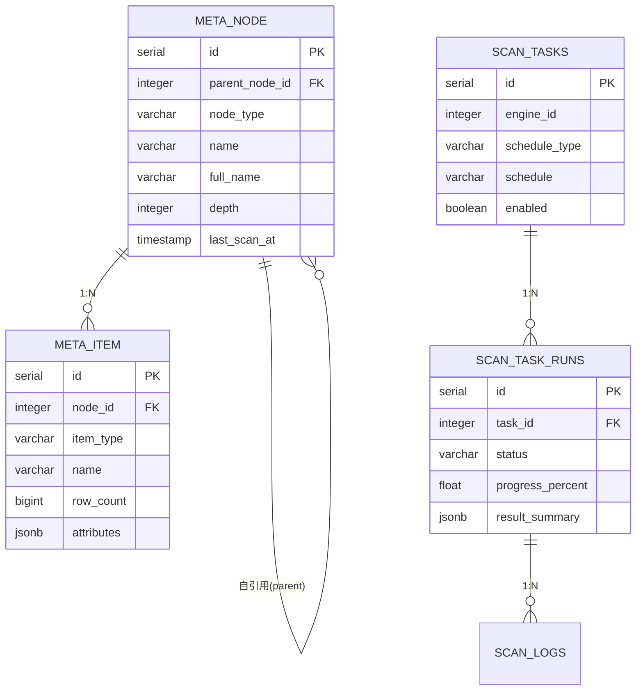

# Meta 模块数据库架构

## 一、模块概览

Meta 模块使用 PostgreSQL 的 `metadata` schema，负责元数据的采集、存储、查询和变更追踪。

### 核心职责

- **元数据采集**：自动扫描数据源，提取表结构、文件属性等元数据
- **层级组织**：以树形结构组织元数据（engine → schema → table/file）
- **定时调度**：支持定时扫描任务，保持元数据最新
- **变更追踪**：记录元数据变化历史，支持审计

---

## 二、数据库表清单

| 表名 | 用途 | 行数估算 |
|------|------|---------|
| `meta_node` | 元数据层级节点 | 1000-10000 |
| `meta_item` | 数据项（表/文件） | 10000-100000 |
| `scan_tasks` | 扫描任务配置 | 10-100 |
| `scan_task_runs` | 任务运行记录 | 1000-10000 |
| `scan_logs` | 扫描日志 | 10000-100000 |

---

## 三、表关系图

### 3.1 ER图（Mermaid）



### 3.2 关系说明

**核心关系**：
- `meta_node.parent_node_id` → `meta_node.id` (自引用，树形结构)
- `meta_node.id` ← `meta_item.node_id` (1:N)
- `scan_tasks.id` ← `scan_task_runs.task_id` (1:N)
- `scan_task_runs.id` ← `scan_logs.task_run_id` (1:N)

---

## 四、数据流向

### 4.1 元数据扫描流程

```
1. 创建扫描任务
   ↓
2. scan_tasks 表插入记录
   ├─ schedule: Cron 表达式
   └─ parameters: 扫描参数
   ↓
3. 定时触发扫描
   ↓
4. scan_task_runs 表插入记录
   ├─ status: 'pending' → 'running'
   └─ started_at: 开始时间
   ↓
5. 扫描器连接数据源
   ├─ 扫描 schemas/buckets
   ├─ 扫描 tables/files
   └─ 提取元数据
   ↓
6. 更新 meta_node 和 meta_item
   ├─ 新增节点和数据项
   ├─ 更新已有记录
   └─ 使用软删除标记已删除的节点
   ↓
7. scan_task_runs 更新完成
   ├─ status: 'completed'
   ├─ result_summary: 统计信息
   └─ completed_at: 完成时间
```

---

## 五、关键设计决策

### 5.1 树形结构设计

**层级结构**：
- Level 1: engine（数据源）
- Level 2: schema/bucket（库/桶）
- Level 3: table/file（表/文件）

**自引用设计**：使用 `parent_node_id` 实现树形结构，支持无限层级。

### 5.2 软删除机制

Meta 模块使用 GORM 的软删除机制（`deleted_at` 字段）追踪元数据变化：
- 节点和数据项删除时不物理删除，而是标记 `deleted_at`
- 重新扫描时会恢复软删除的记录
- 支持历史数据追溯和误删恢复

### 5.3 扫描任务调度

**Cron 表达式调度**：
- 支持复杂的定时规则
- 可配置扫描深度和范围

---

## 六、相关文档

- [meta_node表](tables/meta_node表.md) - 元数据节点表
- [meta_item表](tables/meta_item表.md) - 数据项表
- [scan_tasks表](tables/scan_tasks表.md) - 扫描任务表
- [scan_task_runs表](tables/scan_task_runs表.md) - 任务运行记录表
- [scan_logs表](tables/scan_logs表.md) - 扫描日志表
- [Meta 模块说明](../CLAUDE.md) - 模块整体架构
