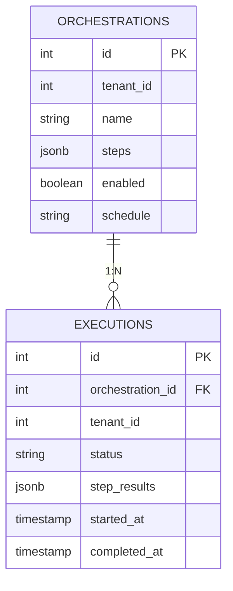

# Orchestrator 数据库架构

## 一、模块概览

Orchestrator 模块使用 PostgreSQL 的 `orchestrator` schema，负责工作流编排和任务调度。采用简洁的两表设计，通过 JSONB 字段实现灵活的 DAG 编排，支持动态引擎发现和定时调度。

### 核心特性

- **DAG 编排**：支持有向无环图的任务依赖关系
- **动态引擎调用**：通过 System 的能力注册中心动态发现执行引擎
- **定时调度**：基于 Cron 表达式的自动执行
- **异步执行**：Go 协程 + 轮询实现非阻塞式执行
- **向后兼容**：同时支持新的动态模式和旧的硬编码模块模式

---

## 二、数据库表清单

| 表名 | 用途 | 典型行数 | 增长速率 |
|------|------|---------|---------|
| `orchestrations` | 编排定义 | 10-100 | 低（手动创建） |
| `executions` | 执行实例 | 1000-10000+ | 高（每次执行创建一条） |

**说明**：
- `orchestrations` 为配置表，增长缓慢
- `executions` 为日志表，随执行频率快速增长，建议定期清理

---

## 三、表关系图

### 3.1 ER 图（Mermaid）



### 3.2 关系说明

#### 核心关系

- `orchestrations.id` ← `executions.orchestration_id` (1:N)
  - 一个编排可以有多次执行记录
  - 通过 GORM `foreignKey:OrchestrationID` 关联

#### 外部引用（逻辑外键）

- `orchestrations.tenant_id` → `system.tenants.id`
- `executions.tenant_id` → `system.tenants.id`
- `orchestrations.steps[].engine_identifier` → `system.engines.unique_identifier` (动态引用)

**说明**：为了保持灵活性，这些关系不使用数据库外键约束，而是通过应用层逻辑保证一致性。

---

## 四、数据流向

### 4.1 创建编排流程

```
用户 → POST /api/orchestrations
  ↓
验证 steps 结构（依赖关系、循环检测）
  ↓
保存到 orchestrations 表
  ↓
if enabled=true && schedule 有值:
  ↓
  Scheduler.Schedule(编排ID, Cron表达式)
  ↓
  注册定时任务
```

### 4.2 执行流程

```
触发源（手动 or 定时） → 创建 executions 记录 (status=pending)
  ↓
返回 execution_id
  ↓
Go 协程异步执行:
  ↓
  更新 status=running, started_at
  ↓
  读取 orchestrations.steps → 构建 DAG → 拓扑排序
  ↓
  for each step:
    ↓
    if 新架构: EngineRegistry.GetEngine(engine_identifier)
    if 旧架构: ModuleClient.Call(module, endpoint)
    ↓
    执行步骤 → 轮询状态
    ↓
    更新 executions.step_results (JSONB)
    ↓
    if 失败: break
  ↓
  更新 status=completed/failed, completed_at
```

### 4.3 数据依赖

```
System 模块
  ↓ (提供引擎配置)
EngineRegistry (内存缓存，5分钟TTL)
  ↓
Executor (执行引擎)
  ↓
TaskClient (HTTP 调用)
  ↓
Meta/Transfer/Manager 模块 (任务执行)
```

---

## 五、关键设计决策

### 5.1 JSONB 字段使用

#### orchestrations.steps

**设计理由**：
- DAG 结构灵活多变，不适合固定表结构
- 支持任意数量的步骤和复杂依赖关系
- JSONB 类型支持索引和查询

**优点**：
- 灵活性：无需修改表结构即可支持新的步骤类型
- 完整性：步骤定义和编排定义原子性存储
- 性能：JSONB 支持 GIN 索引，查询效率高

**缺点**：
- 无法使用外键约束验证 `engine_identifier` 的有效性
- 需要应用层验证步骤结构

#### executions.step_results

**设计理由**：
- 步骤结果格式不固定，不同引擎返回不同的数据结构
- 需要保留完整的执行审计信息

**优点**：
- 灵活存储任意结构的结果
- 支持实时更新单个步骤的结果
- 便于后续分析和报表

---

### 5.2 租户隔离

**隔离策略**：
- 所有查询自动添加 `WHERE tenant_id = <当前租户ID>` 条件
- 通过中间件 `SystemAuthMiddleware` 注入租户上下文
- SuperAdmin 不能查看其他租户的编排（编排是租户私有资源）

**实现方式**：
```go
// 中间件注入 tenant_id
c.Set("tenant_id", claims.TenantID)

// Repository 自动过滤
db.Where("tenant_id = ?", tenantID).Find(&orchestrations)
```

---

### 5.3 软删除策略

**删除行为**：
- `orchestrations` 表支持软删除（`deleted_at` 字段）
- `executions` 表不支持软删除（执行记录永久保留）

**软删除理由**：
- 防止误删编排定义
- 保留已删除编排的执行历史
- 支持恢复误删的编排

**查询影响**：
- GORM 自动过滤 `deleted_at IS NOT NULL` 的记录
- 使用 `db.Unscoped()` 可查询已删除记录

---

### 5.4 异步执行模式

**设计理由**：
- 工作流执行可能耗时很长（几分钟到几小时）
- 避免 HTTP 请求超时
- 提高系统吞吐量

**实现方式**：
```go
// Handler 层：立即返回
func (h *Handler) Execute(c *gin.Context) {
    execution := createExecution(orchestrationID)
    go h.executor.ExecuteAsync(execution.ID) // 异步执行
    c.JSON(202, gin.H{"execution_id": execution.ID})
}

// Executor 层：协程执行
func (e *Executor) ExecuteAsync(executionID uint) {
    go e.executeSync(context.Background(), executionID)
}
```

---

### 5.5 动态引擎发现

**新架构 vs 旧架构**：

| 特性 | 旧架构（硬编码） | 新架构（动态） |
|------|----------------|---------------|
| 引擎定义 | `module` + `endpoint` | `engine_identifier` |
| 引擎管理 | 代码硬编码 | System 能力注册中心 |
| 新增引擎 | 修改代码 | 注册到 System |
| 灵活性 | 低 | 高 |
| 向后兼容 | - | 支持旧模式 |

**迁移路径**：
1. 新编排使用 `engine_identifier`
2. 旧编排继续使用 `module` + `endpoint`
3. 系统同时支持两种模式
4. 逐步迁移旧编排到新模式

---

## 六、性能优化

### 6.1 索引策略

#### orchestrations 表

```sql
CREATE INDEX idx_orchestrations_tenant ON orchestrator.orchestrations(tenant_id);
CREATE INDEX idx_orchestrations_deleted ON orchestrator.orchestrations(deleted_at);
CREATE INDEX idx_orchestrations_enabled ON orchestrator.orchestrations(enabled) WHERE deleted_at IS NULL;
```

**说明**：
- `tenant_id`：租户隔离查询
- `deleted_at`：软删除查询（GORM 自动添加）
- `enabled`：定时调度器启动时加载启用的编排

#### executions 表

```sql
CREATE INDEX idx_executions_orchestration ON orchestrator.executions(orchestration_id);
CREATE INDEX idx_executions_tenant ON orchestrator.executions(tenant_id);
CREATE INDEX idx_executions_status ON orchestrator.executions(status);
CREATE INDEX idx_executions_created ON orchestrator.executions(created_at DESC);
```

**说明**：
- `orchestration_id`：查询编排的执行记录
- `tenant_id`：租户隔离
- `status`：按状态筛选（如查询运行中的任务）
- `created_at`：按时间排序和分页

---

### 6.2 JSONB 查询优化

**GIN 索引**（如需要）：

```sql
-- 如果需要按步骤内容查询
CREATE INDEX idx_orchestrations_steps ON orchestrator.orchestrations USING GIN (steps);
CREATE INDEX idx_executions_results ON orchestrator.executions USING GIN (step_results);
```

**查询示例**：

```sql
-- 查询包含特定引擎的编排
SELECT * FROM orchestrator.orchestrations
WHERE steps @> '[{"engine_identifier": "meta.scanner.default"}]';

-- 查询步骤失败的执行
SELECT * FROM orchestrator.executions
WHERE step_results @> '{"step1": {"status": "failed"}}';
```

---

### 6.3 分页优化

**推荐方式**：

```sql
-- 使用 offset 分页
SELECT * FROM orchestrator.executions
WHERE tenant_id = 1
ORDER BY created_at DESC
LIMIT 20 OFFSET 0;

-- 或使用 cursor 分页（更高效）
SELECT * FROM orchestrator.executions
WHERE tenant_id = 1 AND id < last_id
ORDER BY id DESC
LIMIT 20;
```

---

### 6.4 数据清理策略

**executions 表定期清理**：

```sql
-- 删除 30 天前的执行记录
DELETE FROM orchestrator.executions
WHERE created_at < NOW() - INTERVAL '30 days';

-- 或仅保留最近 1000 条记录
DELETE FROM orchestrator.executions
WHERE id NOT IN (
    SELECT id FROM orchestrator.executions
    ORDER BY created_at DESC
    LIMIT 1000
);
```

**建议**：
- 使用定时任务（Cron）执行清理
- 分批删除避免锁表
- 保留重要执行记录（如失败的执行）

---

## 七、缓存策略

### 7.1 EngineRegistry 缓存

**实现**：

```go
type EngineRegistry struct {
    engines      map[string]*Engine
    mu           sync.RWMutex
    cacheTTL     time.Duration  // 5 分钟
    lastRefresh  time.Time
}

func (r *EngineRegistry) GetEngine(identifier string) (*Engine, error) {
    r.mu.RLock()
    defer r.mu.RUnlock()

    if time.Since(r.lastRefresh) > r.cacheTTL {
        r.RefreshCache() // 缓存过期，刷新
    }

    return r.engines[identifier], nil
}
```

**缓存更新时机**：
- 首次启动时加载
- 缓存过期时刷新（TTL: 5 分钟）
- 手动刷新（如 System 引擎配置变更后）

---

## 八、监控指标

### 8.1 关键指标

| 指标 | SQL 查询 | 说明 |
|------|---------|------|
| 活跃编排数 | `SELECT COUNT(*) FROM orchestrations WHERE enabled=true AND deleted_at IS NULL` | 定时调度的编排数量 |
| 运行中任务 | `SELECT COUNT(*) FROM executions WHERE status='running'` | 当前正在执行的任务 |
| 执行成功率 | `SELECT COUNT(*) FILTER (WHERE status='completed') / COUNT(*) FROM executions WHERE created_at > NOW() - INTERVAL '1 day'` | 最近 24 小时的成功率 |
| 平均执行时长 | `SELECT AVG(EXTRACT(EPOCH FROM (completed_at - started_at))) FROM executions WHERE status='completed' AND created_at > NOW() - INTERVAL '1 day'` | 最近 24 小时的平均耗时（秒） |

---

## 九、迁移和版本管理

### 9.1 表结构变更

ADDP 当前处于开发阶段，可自由修改表结构：

```go
// cmd/server/main.go
db.AutoMigrate(&models.Orchestration{}, &models.Execution{})
```

**变更策略**：
- 新增字段：直接添加到 struct，AutoMigrate 自动创建
- 修改字段：删除旧字段，添加新字段（数据丢失可接受）
- 删除字段：从 struct 中移除即可

---

## 十、相关文档

- [orchestrations 表](tables/orchestrations表.md) - 编排定义表的详细说明
- [executions 表](tables/executions表.md) - 执行实例表的详细说明
- [Orchestrator 模块说明](../CLAUDE.md) - 模块整体架构和服务层设计
- [System 模块 - engines 表](../../system/docs/tables/engines表.md) - 引擎注册和能力声明
