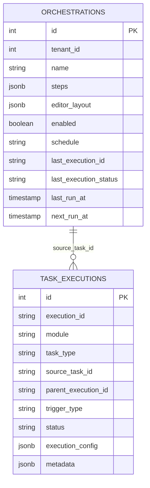

# Orchestrator 数据库架构

## 一、模块定位

Orchestrator 模块负责跨模块任务编排、DAG 执行和定时调度。它只编排各模块通过 TaskProvider 暴露的任务定义，不直接调用计算引擎。

计算引擎由 System 注册，由 Develop 消费。工作流算子应先在 Develop 中编排为 `workflow` 任务，再由 Orchestrator 通过 `provider + task_type + task_id` 引用。

## 二、核心表

| 表名 | 用途 | 说明 |
| --- | --- | --- |
| `orchestrator.orchestrations` | 编排定义 | 保存跨模块任务 DAG、调度配置和最近执行摘要 |
| `common.task_executions` | 统一执行记录 | 保存 Orchestrator 自身 execution 以及下游子步骤 execution |

Orchestrator 不再维护独立 `executions` 表作为主路径；执行记录统一写入 `common.task_executions`。

## 三、关系图



## 四、Steps 结构

`orchestrations.steps` 是 JSONB 数组。每个 Step 只支持任务引用模式：

```json
{
  "id": "scan",
  "name": "扫描元数据",
  "provider": "meta",
  "task_type": "scan",
  "task_id": 1,
  "parameters": {},
  "depends_on": [],
  "timeout": 600
}
```

字段说明：

| 字段 | 必填 | 说明 |
| --- | --- | --- |
| `id` | 是 | 编排内唯一步骤 ID |
| `name` | 是 | 步骤显示名称 |
| `provider` | 是 | TaskProvider 模块名 |
| `task_type` | 是 | provider 声明的任务类型 |
| `task_id` | 是 | owner 模块内任务定义 ID |
| `parameters` | 否 | 本次执行参数覆盖或模板解析结果 |
| `depends_on` | 是 | 依赖步骤 ID 列表 |
| `timeout` | 否 | 步骤超时时间，单位秒 |

## 五、执行流程

`orchestrations.editor_layout` 保存编辑器节点坐标和视口，结构与共享 DAG 编辑器一致；它不属于 `steps`，Executor 不得读取该字段。

```text
手动或定时触发
  ↓
创建 common.task_executions
  module=orchestrator
  task_type=orchestration
  source_task_id=orchestration.id
  trigger_type=manual|scheduled
  ↓
Executor 读取 orchestration.steps
  ↓
构建 DAG 并拓扑排序
  ↓
逐个 Step 调用 TaskProvider execute endpoint
  source=orchestrator
  parent_execution_id=父编排 execution_id
  trigger_type=manual|scheduled
  parameters=模板解析后的参数
  ↓
轮询 TaskProvider execution 状态
  ↓
写入步骤结果并完成父 execution
```

## 六、设计约束

- Orchestrator 不拥有业务任务定义。
- Orchestrator Step 必须使用 `provider + task_type + task_id` 引用已有任务。
- Orchestrator 不直接调用工作流计算引擎。
- 工作流计算引擎算子由 Develop 编排为 `workflow` 任务后再进入 Orchestrator。
- 下游执行必须写 `parent_execution_id`，用于 Monitor 聚合父子执行关系。
- 执行成功状态统一使用 `success`。
- 创建和更新编排时必须校验 Step：任务引用字段必填、依赖步骤存在、DAG 无环。

## 七、索引建议

```sql
CREATE INDEX IF NOT EXISTS idx_orchestrations_tenant
ON orchestrator.orchestrations(tenant_id);

CREATE INDEX IF NOT EXISTS idx_orchestrations_deleted
ON orchestrator.orchestrations(deleted_at);

CREATE INDEX IF NOT EXISTS idx_orchestrations_enabled
ON orchestrator.orchestrations(enabled)
WHERE deleted_at IS NULL;
```

## 八、相关文档

- [任务体系规范](../../docs/spec/addp任务体系规范.md)
- [orchestrations 表](tables/orchestrations表.md)
- [参数化模板说明](参数化模板说明.md)
