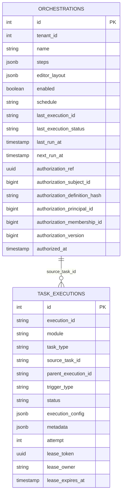
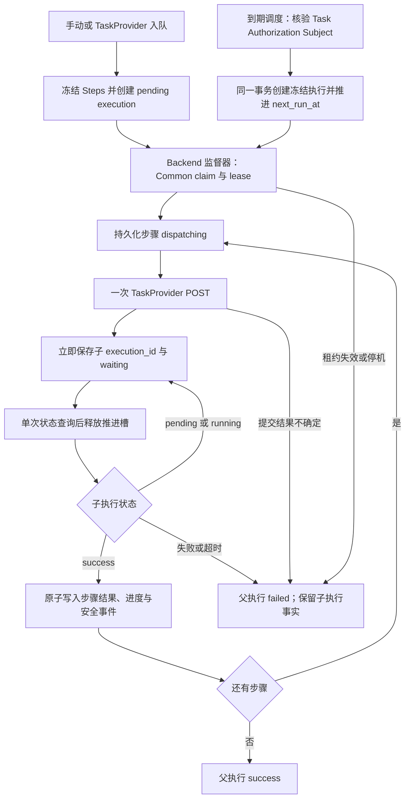

# Orchestrator 数据库架构

## 一、模块定位

Orchestrator 模块负责跨模块任务编排、DAG 执行和定时调度。它只编排各模块通过 TaskProvider 暴露的任务定义，不直接调用计算引擎。

计算引擎由 System 注册，由 Develop 消费。工作流算子应先在 Develop 中编排为 `workflow` 任务，再由 Orchestrator 通过 `provider + task_type + task_id` 引用。

## 二、核心表

| 表名 | 用途 | 说明 |
| --- | --- | --- |
| `orchestrator.orchestrations` | 编排定义 | 保存跨模块任务 DAG、调度配置和最近执行摘要 |
| `common.task_executions` | 统一执行记录 | 保存 Orchestrator 自身 execution 以及下游子步骤 execution |

Orchestrator 不再维护独立 `executions` 表作为主路径；执行记录统一写入 `common.task_executions`。

## 三、关系图


```mermaid
erDiagram
    ORCHESTRATIONS ||--o{ TASK_EXECUTIONS : "source_task_id"
    ORCHESTRATIONS {
        int id PK
        int tenant_id
        string name
        jsonb steps
        jsonb editor_layout
        boolean enabled
        string schedule
        string last_execution_id
        string last_execution_status
        timestamp last_run_at
        timestamp next_run_at
        uuid authorization_ref
        bigint authorization_subject_id
        string authorization_definition_hash
        bigint authorization_principal_id
        bigint authorization_membership_id
        bigint authorization_version
        timestamp authorized_at
    }
    TASK_EXECUTIONS {
        int id PK
        string execution_id
        string module
        string task_type
        string source_task_id
        string parent_execution_id
        string trigger_type
        string status
        jsonb execution_config
        jsonb metadata
        int attempt
        uuid lease_token
        string lease_owner
        timestamp lease_expires_at
    }
```

## 四、Steps 结构

`orchestrations.steps` 是 JSONB 数组。每个 Step 只支持任务引用模式：

```json
{
  "id": "scan",
  "name": "扫描元数据",
  "provider": "meta",
  "task_type": "scan",
  "task_id": 1,
  "parameters": {},
  "depends_on": [],
  "timeout": 600
}
```

字段说明：

| 字段 | 必填 | 说明 |
| --- | --- | --- |
| `id` | 是 | 编排内唯一步骤 ID |
| `name` | 是 | 步骤显示名称 |
| `provider` | 是 | TaskProvider 模块名 |
| `task_type` | 是 | provider 声明的任务类型 |
| `task_id` | 是 | owner 模块内任务定义 ID |
| `parameters` | 否 | 本次执行参数覆盖或模板解析结果 |
| `depends_on` | 是 | 依赖步骤 ID 列表 |
| `timeout` | 否 | 步骤超时时间，单位秒 |

## 五、执行流程

`orchestrations.editor_layout` 保存编辑器节点坐标和视口，结构与共享 DAG 编辑器一致；它不属于 `steps`，Executor 不得读取该字段。


```mermaid
flowchart TD
    A[手动或 TaskProvider 入队] --> C[冻结 Steps 并创建 pending execution]
    B[到期调度：核验 Task Authorization Subject] --> D[同一事务创建冻结执行并推进 next_run_at]
    C --> E[Backend 监督器：Common claim 与 lease]
    D --> E
    E --> F[持久化步骤 dispatching]
    F --> G[一次 TaskProvider POST]
    G --> H[立即保存子 execution_id 与 waiting]
    H --> I[单次状态查询后释放推进槽]
    I --> J{子执行状态}
    J -->|pending 或 running| H
    J -->|success| K[原子写入步骤结果、进度与安全事件]
    K --> L{还有步骤}
    L -->|是| F
    L -->|否| M[父执行 success]
    J -->|失败或超时| N[父执行 failed；保留子执行事实]
    G -->|提交结果不确定| N
    E -->|租约失效或停机| N
```

执行私有 `execution_config` 固化 `schema_version=orchestrator.execution/v1` 和本次完整 Steps（任务 ID 以十进制文本保持精度）；推进时不读取可变编排定义。`metadata.step_results` 保存步骤状态、`phase=dispatching|waiting|terminal`、时间、稳定错误码以及已有 `result.execution_id`。成功步骤数 / 冻结步骤总数决定进度，失败保留实际进度。

过程证据复用 `common.execution_events`，只保存闭合事件种类、脱敏步骤身份和安全计数，保留 30 天；Monitor 诊断接口投影有限步骤和阶段，不返回执行配置、参数或完整下游结果。事件步骤身份查询不受页面的 200 步展示预算影响；包含敏感内容或超过预算的身份在事件投影中省略，不改变业务步骤 ID。

租约保护父记录写入和本地推进，不能撤回已经发出的下游请求。提交结果不明、失联和停机不自动重放；超时只停止父编排等待，不能声称下游已取消。等待不占整条流程执行槽，嵌套编排使用同一监督器推进子执行。

Backend 通过模块启动 schema 锁执行一次性迁移（revision 1）：缺少可信快照的旧 pending 和缺少租约的旧 running 收敛为 failed，保留步骤与子执行引用；SQL 迁移统一由外层事务管理。部署前停止新触发并尽量排空旧运行，System 先完成 Common revision 2。未完成的有效租约父编排在优雅停机时失败；无法写入时由租约过期恢复收敛。平台服务进程日志和操作审计保持原有职责。

验证使用 `make test-module MODULE=orchestrator`（自动发现 T0、Go T1、PostgreSQL T2、前端 T1/T3）和 `make test-orchestrator-postgres`。Hosted PostgreSQL Job 复用后一入口，验证并发领取、旧租约 fencing、调度事务及迁移回滚。`orchestrator-execution` 手动 Hosted T4 经正式 IAM/Gateway/Meta/Monitor 验证真实嵌套 DAG、数据源故障阻断与诊断权限，入口和范围见平台测试规范；首次真实运行前不计为通过。后端进程重启、提交响应丢失和续租故障仍需补充专用 T4，受控 HTTP 与数据库测试不能替代该验收。

PostgreSQL T2 还使用两个独立测试进程先后运行正式监督器：分别在下游已接受但尚未返回身份的 `dispatching` 阶段、已持久化子执行身份的 `waiting` 阶段强制终止原运行者。新运行者须在租约过期后将父执行收敛为唯一失败终态，保留原步骤、实际进度和已知子执行引用，不重发 POST；旧租约不得再写入。Provider 仍是受控 HTTP 夹具，所以该证据只覆盖进程与 PostgreSQL 的故障边界，不替代真实跨模块 T4。测试只终止自身启动的子进程，并在全部退出路径清理当次定义、执行与事件。

## 六、设计约束

- Orchestrator 不拥有业务任务定义。
- Orchestrator Step 必须使用 `provider + task_type + task_id` 引用已有任务。
- Orchestrator 不直接调用工作流计算引擎。
- 编排定义必须保存 Task Authorization Subject；创建或更新定义时由当前 Tenant User AuthContext 原子刷新，不能接收客户端自报主体。
- 手动父 execution 使用当前 User 的 Principal、Membership 和授权版本；定时父 execution 使用并重新校验任务授权主体。任一主体事实失效时必须拒绝执行，不能回退到 Orchestrator Service Principal 的数据权限。
- 下游 TaskProvider 请求使用 `addp-orchestrator` Tenant Service Access Token；子 execution 继承父 execution 的主体来源事实，任何链路不得保存或转发 User Token。
- 工作流计算引擎算子由 Develop 编排为 `workflow` 任务后再进入 Orchestrator。
- 下游执行必须写 `parent_execution_id`，用于 Monitor 聚合父子执行关系。
- 执行成功状态统一使用 `success`。
- 创建和更新编排时必须校验 Step：任务引用字段必填、依赖步骤存在、DAG 无环。

## 七、索引建议

```sql
CREATE INDEX IF NOT EXISTS idx_orchestrations_tenant
ON orchestrator.orchestrations(tenant_id);

CREATE INDEX IF NOT EXISTS idx_orchestrations_deleted
ON orchestrator.orchestrations(deleted_at);

CREATE INDEX IF NOT EXISTS idx_orchestrations_enabled
ON orchestrator.orchestrations(enabled)
WHERE deleted_at IS NULL;
```

## 八、相关文档

- [任务体系规范](../../docs/spec/addp任务体系规范.md)
- [orchestrations 表](tables/orchestrations表.md)
- [参数化模板说明](参数化模板说明.md)
