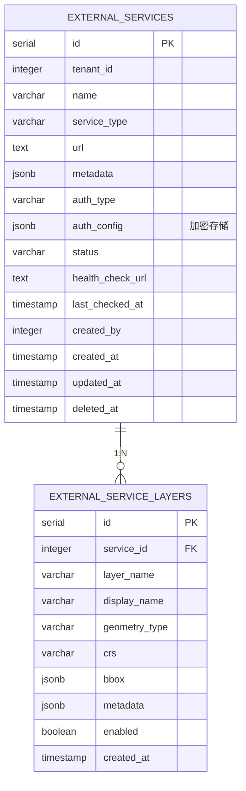

# Service 模块数据库架构

## 一、模块概览

Service 模块使用 PostgreSQL 的 `service` schema，负责外部数据服务的注册、管理和代理功能。

### 核心职责

- **服务注册管理**：管理第三方数据服务（OGC WMS/WFS、REST API 等）
- **元数据解析**：自动解析服务能力文档（GetCapabilities）
- **健康检查**：定期检查服务可用性，维护服务状态
- **服务代理**：提供统一的服务访问入口，自动处理认证

---

## 二、数据库表清单

| 表名 | 用途 | 行数估算 |
|------|------|---------|
| `external_services` | 外部服务注册 | 100-1000 |
| `external_service_layers` | 外部服务图层/要素类 | 1000-10000 |

---

## 三、表关系图

### 3.1 ER图（Mermaid）



### 3.2 关系说明

**核心关系**：
- `external_services.id` ← `external_service_layers.service_id` (1:N)
  - 一个服务可以包含多个图层/要素类
  - 典型场景：WMS 服务包含 10-100 个图层

**外键约束**：
- `external_service_layers.service_id` → `external_services.id` (ON DELETE CASCADE)
  - 删除服务时，所有关联图层自动删除
  - 保证数据一致性

**租户隔离**：
- `external_services` 表有 `tenant_id` 字段
- `external_service_layers` 表**没有** `tenant_id`，通过 `service_id` 间接隔离

---

## 四、数据流向

### 4.1 服务注册与元数据解析流程

```
1. 用户提交服务注册请求
   ↓
2. external_services 表插入记录
   ├─ name: 服务名称
   ├─ service_type: 'wms' | 'wfs' | 'rest'
   ├─ url: 服务 URL
   ├─ auth_config: 认证配置（加密存储）
   └─ status: 'active'
   ↓
3. 自动解析服务能力
   ├─ 调用 GetCapabilities（WMS/WFS）
   ├─ 或调用 API 文档端点（REST API）
   └─ 解析服务元数据
   ↓
4. 更新 external_services.metadata
   ├─ 服务版本、标题、摘要
   └─ 支持的格式、坐标系统
   ↓
5. 解析图层列表
   ↓
6. external_service_layers 表批量插入记录
   ├─ layer_name: 图层标识符
   ├─ geometry_type: 几何类型
   ├─ crs: 默认坐标系统
   ├─ bbox: 地理边界框
   └─ metadata: 图层元数据
   ↓
7. 返回完整服务对象（含图层列表）
```

### 4.2 服务健康检查流程

```
定时任务（每小时）
   ↓
1. 查询所有 status='active' 的服务
   ↓
2. 并发检查健康端点
   ├─ 请求 health_check_url
   ├─ 或默认服务 URL
   └─ 设置 5 秒超时
   ↓
3. 根据响应更新状态
   ├─ 200-299 → status='active'
   ├─ 400-599 → status='error'
   └─ 超时 → status='inactive'
   ↓
4. 更新 external_services 记录
   ├─ status: 新状态
   └─ last_checked_at: 当前时间
```

### 4.3 服务代理与认证流程

```
前端请求
   ↓
1. GET /api/service/proxy/:id/*path
   ↓
2. 查询 external_services 表
   ├─ 获取服务 URL
   ├─ 获取 auth_type 和 auth_config
   └─ 解密认证信息
   ↓
3. 构造代理请求
   ├─ 目标 URL: service.url + path
   ├─ 添加认证信息：
   │  ├─ Basic: Authorization: Basic <base64>
   │  ├─ Bearer: Authorization: Bearer <token>
   │  └─ API Key: 自定义 header
   └─ 转发原始查询参数
   ↓
4. 发送请求到外部服务
   ↓
5. 返回响应给前端
```

---

## 五、关键设计决策

### 5.1 JSONB 字段使用

**external_services.metadata**（服务元数据）：
- **存储内容**：GetCapabilities 解析结果
- **好处**：
  - 灵活存储不同类型服务的元数据
  - 避免为每种服务类型创建单独的表
  - 支持复杂嵌套结构（如 WMS 的多级图层）

**external_services.auth_config**（认证配置）：
- **存储内容**：加密后的认证信息
- **加密方式**：AES-256-GCM
- **好处**：
  - 灵活支持多种认证方式
  - 敏感信息加密存储，符合安全规范

**external_service_layers.bbox**（边界框）：
- **存储内容**：地理范围 [minX, minY, maxX, maxY]
- **好处**：
  - 支持不同坐标系统的边界框
  - 前端可直接使用，无需解析

### 5.2 租户隔离策略

**两级隔离**：
- **服务级**：external_services 表有 `tenant_id` 字段
- **图层级**：external_service_layers 通过 `service_id` 间接隔离

**实现**：
```go
// 查询租户的服务
db.Where("tenant_id = ?", tenantID).Find(&services)

// 查询服务的图层（自动继承租户隔离）
db.Where("service_id IN ?", serviceIDs).Find(&layers)
```

### 5.3 软删除策略

**external_services 表**：
- 使用 `deleted_at` 字段实现软删除
- 保留历史记录，支持恢复

**external_service_layers 表**：
- **不使用软删除**
- 原因：图层记录从属于服务，服务删除时图层也应删除
- 通过 `enabled` 字段实现临时禁用

### 5.4 级联删除策略

**外键约束**：
```sql
ALTER TABLE service.external_service_layers
ADD CONSTRAINT fk_external_service_layers_service
FOREIGN KEY (service_id) REFERENCES service.external_services(id)
ON DELETE CASCADE;
```

**好处**：
- 删除服务时自动清理图层记录
- 保证数据一致性，避免孤儿记录

**注意事项**：
- 删除服务前应提示用户（包含图层数量）
- 建议先软删除（deleted_at），确认后再物理删除

### 5.5 服务类型扩展性

**service_type 枚举值**：
- 当前支持：'wms', 'wfs', 'wmts', 'ogc_api', 'data_api', 'rest'
- **扩展方式**：直接添加新的枚举值，无需修改表结构

**元数据兼容性**：
- 不同服务类型的 metadata 结构不同
- 使用 JSONB 灵活存储，支持未来扩展

---

## 六、性能优化

### 6.1 索引策略

**external_services 表**：
- `idx_external_service_tenant`（tenant_id）- 租户级查询
- `idx_external_service_type`（service_type）- 按类型过滤
- `idx_external_services_deleted`（deleted_at）- 软删除查询

**external_service_layers 表**：
- `idx_external_service_layer_service`（service_id）- 按服务查询图层

### 6.2 查询优化

**场景 1：查询服务列表（含图层数量）**（高频）
```sql
-- 使用子查询统计图层数量
SELECT
  es.*,
  (SELECT COUNT(*) FROM service.external_service_layers
   WHERE service_id = es.id AND enabled = true) AS layers_count
FROM service.external_services es
WHERE tenant_id = 1 AND deleted_at IS NULL;
```

**场景 2：查询服务详情（含所有图层）**（中频）
```go
// 使用 GORM Preload 优化
db.Preload("Layers").
   Where("id = ?", serviceID).
   First(&service)
```

### 6.3 健康检查优化

**并发检查**：
- 使用 goroutine pool 并发检查多个服务
- 避免单线程串行检查导致耗时过长

**超时控制**：
- 每个服务检查超时 5 秒
- 防止某个服务卡死影响其他服务

**实现**：
```go
// 并发检查（最多 10 个并发）
sem := make(chan struct{}, 10)
for _, svc := range services {
    sem <- struct{}{}
    go func(s *ExternalService) {
        defer func() { <-sem }()
        CheckServiceHealth(s)
    }(svc)
}
```

---

## 七、数据一致性保证

### 7.1 事务处理

**服务创建与图层解析**：
```go
// 开启事务
tx := db.Begin()

// 1. 创建服务记录
service := &ExternalService{...}
tx.Create(service)

// 2. 解析并插入图层
layers := ParseLayers(service)
for _, layer := range layers {
    layer.ServiceID = service.ID
    tx.Create(layer)
}

// 3. 提交事务
tx.Commit()
```

### 7.2 认证信息加解密

**加密时机**：
- 创建服务时加密 auth_config
- 更新认证信息时重新加密

**解密时机**：
- 服务代理请求时解密
- 健康检查时解密（如需认证）

**密钥管理**：
- 加密密钥从环境变量 `ENCRYPTION_KEY` 读取
- **重要**：不同环境使用不同密钥，生产环境密钥严格保密

---

## 八、安全机制

### 8.1 认证信息加密

**AES-256-GCM 加密**：
- 密码、token、API key 加密存储
- 加密密钥存储在环境变量中，不提交代码仓库

### 8.2 服务代理安全

**防 SSRF 攻击**：
- 只能代理已注册的服务（白名单机制）
- URL 验证：不允许内网地址（127.0.0.1、192.168.x.x 等）

**认证信息隔离**：
- 前端无需知道服务的认证信息
- 代理层自动添加认证头

### 8.3 租户隔离

**数据隔离**：
- 所有查询自动过滤 tenant_id
- 用户只能访问自己租户的服务

**权限验证**：
- 创建/修改服务前验证租户权限
- SuperAdmin 可跨租户管理

---

## 九、扩展性设计

### 9.1 新增服务类型

**步骤**：
1. 在 `service_type` 枚举中添加新值
2. 实现对应的元数据解析器（Metadata Parser）
3. 更新服务代理逻辑（如需特殊处理）

**示例**（添加 GeoPackage 服务支持）：
```go
// 1. 添加枚举值
const ServiceTypeGeoPackage = "geopackage"

// 2. 实现解析器
func ParseGeoPackageMetadata(url string) (*JSONB, error) {
    // 下载 gpkg 文件，解析图层列表
    ...
}

// 3. 注册解析器
RegisterMetadataParser(ServiceTypeGeoPackage, ParseGeoPackageMetadata)
```

### 9.2 新增认证方式

**步骤**：
1. 在 `auth_type` 枚举中添加新值
2. 实现对应的认证处理器（Auth Handler）
3. 更新服务代理逻辑

**示例**（添加 OAuth2 支持）：
```go
// 1. 添加枚举值
const AuthTypeOAuth2 = "oauth2"

// 2. 实现认证处理器
func ApplyOAuth2Auth(req *http.Request, authConfig JSONB) {
    token := GetOAuth2Token(authConfig)
    req.Header.Set("Authorization", "Bearer "+token)
}

// 3. 注册处理器
RegisterAuthHandler(AuthTypeOAuth2, ApplyOAuth2Auth)
```

---

## 十、相关文档

- [external_services表](tables/external_services表.md) - 外部服务表
- [external_service_layers表](tables/external_service_layers表.md) - 外部服务图层表
- [Service 模块说明](../CLAUDE.md) - 模块整体架构
