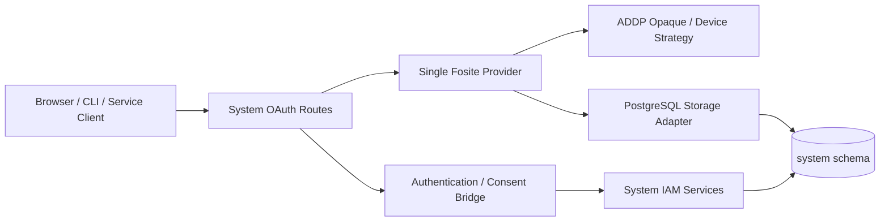

# System OAuth 与 Fosite 实现说明

更新日期：2026-08-01

状态：System 模块正式实现文档。本文记录已接受的协议引擎决策和当前 OAuth 2.0 唯一实现路径。

## 一、架构决策

ADDP 采用 System 内嵌的受控 Fosite 派生版本作为唯一 OAuth 2.0 协议引擎。

- System 继续是唯一 IAM 逻辑权威和唯一 ADDP Auth Server；
- Fosite 只负责标准协议状态机、校验、错误语义和 Handler；
- Principal、账号、MFA、Tenant Context、Role、Permission、owner 资源授权、审计和页面由 ADDP 负责；
- OAuth Access Token 始终为随机 opaque Token，业务模块不接受 ID Token 或外部 IdP Token；
- 不保留自研 OAuth 状态机，不按 grant、Client 或配置分流到第二套实现。

受控依赖固定在 `system/backend/go.mod`，通过 `replace` 指向 ADDP 维护、带来源和补丁清单的不可变版本。升级必须重新执行上游测试、ADDP Storage 测试、PostgreSQL 协议测试和 CLI 产品门禁。

## 二、当前协议能力

唯一 Provider 当前组合：

- Authorization Code；
- PKCE，且只允许 `S256`；
- Client Credentials；
- Refresh Token；
- Token Revocation；
- RFC 8628 Device Authorization；
- RFC 8628 Device Token。

当前不组合 OpenID Connect Handler，不允许 `openid` Scope，不发布 Discovery 或 JWKS，也不对外声明 OIDC 能力。OIDC 启用条件见 `docs/next/addp-IAM OIDC启用设计.md`。

## 三、组件边界



Router 只负责 HTTP 绑定、限流、安全 Header、错误输出和审计适配。Client、redirect URI、Scope、PKCE、grant、Code、Device 和 Refresh 状态由 Fosite Provider 校验。

Authentication/Consent Bridge 把已认证 User、唯一当前 Context、认证强度和授权决定写入 Fosite Session。它不能绕过 Fosite 创建协议状态。

## 四、Session

`IAMSession` 保存重建协议请求所需的稳定事实：Principal、Context、Client、audience、Scope、认证方法、AAL、认证时间和授权版本。

Session 不成为第二 IAM 事实源。Token 签发和 AuthContext 解析仍需回查 Principal、Membership、Role Assignment 和授权版本。

OIDC Claims 和 Headers 的结构能力可以存在于 Fosite Session 实现中，但在未注册 OpenID Handler 时不得产生 ID Token 或对外协议能力。

## 五、Storage Adapter

同一个 PostgreSQL Adapter 实现当前 Provider 组合需要的全部接口。主要映射：

| 协议事实 | PostgreSQL 表 |
| --- | --- |
| OAuth Client | `system.oauth_clients` |
| 浏览器授权交互 | `system.oauth_authorization_requests` |
| PKCE Session | `system.oauth_pkce_sessions` |
| Authorization Code | `system.oauth_authorization_codes` |
| Device Code / User Code / 轮询状态 | `system.oauth_device_authorizations` |
| Token Family | `system.refresh_token_families` |
| Access Token | `system.access_tokens` |
| Refresh Token | `system.refresh_tokens` |

所有 Code 和 Token 入库前立即 Hash。Requester、Client、Scope、audience 和 Context 必须可以从关系数据无损重建，不把整份请求序列化为不可查询的第二事实。

## 六、事务与锁

授权码兑换、Device Code 兑换和 Refresh Rotation 必须通过 Adapter 事务扩展把 Fosite Handler 的多步操作收敛为一个 PostgreSQL 事务。

统一锁顺序从 Principal、Token Family、协议请求进入具体 Code/Token 行。事务内禁止 Redis、HTTP、外部 IdP、审计导出或密钥服务调用。

关键约束：

- Authorization Code 和 PKCE 只能成功消费一次；
- 失效 Code 重放必须使 Fosite 能定位并撤销关联 Token Family；
- Device `slow_down` 状态持久化，不能只保存在进程内；
- Device 授权决定和 Token 兑换按数据库状态串行化；
- Refresh 轮换创建新 Token 并消费旧 Token；旧 Token 重放撤销整个 Family；
- 审计写入失败时，协议状态转换和 Token 签发必须回滚。

## 七、公开路由

OAuth 路由统一位于 `/api/v1/system/oauth`，包括 Authorization Request、Device Code、Token、Revocation 和用户同意/Device 决定入口。

System 协议测试与正式 `addp` CLI 使用同一个 `addp-cli` 公共 Client 和同一组生产路由，不维护测试专用授权端点。

公共原生 Client 不配置 Client Secret。loopback redirect URI 只允许 RFC 8252 的 IP 字面量动态端口例外；scheme、IP、path、query 和 fragment必须匹配注册值。禁止 `localhost`、前缀匹配、通配符和回退 URI。

Service Principal 使用独立 Confidential Client 和 Client Credentials；Service Access Token 不可刷新，且必须绑定明确 Tenant Context 或 Platform Service Context。

## 八、错误与审计

协议端点使用 Fosite 标准 OAuth error，不包装为普通业务成功响应。授权页面和 Device 页面使用短期、不可猜测且只保存 Hash 的交互 Secret。

日志和审计禁止记录：

- Authorization Header、Cookie、Access/Refresh Token；
- Authorization Code、Device Code、User Code；
- PKCE verifier、Client Secret、Authorization Request Secret；
- 原始 OAuth 表单或包含上述值的 URL。

安全审计记录 Client、Principal、Context、grant、结果、稳定错误类别和风险等级，不记录凭据材料。

## 九、受控版本治理

受控 Fosite 派生版本必须：

1. 固定不可变版本和上游基线提交；
2. 维护补丁来源、许可证和差异清单；
3. 合入适用的安全与一致性修复；
4. 通过所选 Handler 的上游测试与 ADDP 回归测试；
5. 不直接依赖移动分支或未审查伪版本。

任何 Provider Factory、Strategy、Storage 接口或协议端点变化都必须同步更新 `docs/spec/addp OAuth授权规范.md`、System Swagger 和 PostgreSQL migration。

## 十、验证

```bash
cd system/backend
go test ./internal/iam/oauth ./internal/api ./internal/middleware
```

完整协议事务需要专用 PostgreSQL 门禁：

```bash
ADDP_SYSTEM_POSTGRES_TEST_DSN='postgres://.../addp_iam_test?...' make test-system-iam-postgres
```

正式 CLI 发布还必须运行 `make test-release RELEASE_SUITE=common-python-cli`，验证 wheel 安装、RFC 8252 loopback、Device Flow、刷新、撤销和真实 OS Keychain。
