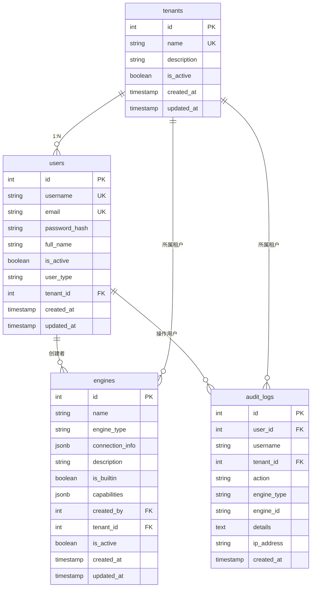

# System 模块数据库架构

> 本文记录当前数据库实现。IAM 目标模型以 `docs/concepts/addp账号与权限体系图.md` 为准；本文中的 `users.user_type`、`users.tenant_id` 和 SuperAdmin 空租户语义均为待替换实现差距，不是目标契约。

## 一、模块概览

System 模块是 ADDP 平台的核心基础模块,使用 PostgreSQL 的 `system` schema,负责用户认证、租户管理、引擎配置和审计日志。所有模块的认证和配置管理都依赖 System 模块。

### 模块定位

- **认证中心**:签发用户访问令牌并提供权威 AuthContext,所有模块通过 System 验证用户身份
- **配置中心**:管理允许跨模块共享的配置；用户令牌生命周期由 System 私有 OAuth 配置管理
- **租户中心**:提供多租户隔离机制
- **审计中心**:记录所有模块的操作日志

---

## 二、数据库表清单

| 表名 | 用途 | 核心功能 | 行数估算 |
|------|------|---------|---------|
| `users` | 用户表 | 用户认证、权限管理 | 数百-数千 |
| `tenants` | 租户表 | 多租户隔离 | 数十-数百 |
| `audit_logs` | 审计日志表 | 操作审计、安全追溯 | 数万-数百万 |
| `engines` | 引擎配置表 | 数据库/存储/计算引擎配置 | 数十-数百 |
| `oauth_clients` | OAuth 客户端 | 公共客户端、redirect URI、Scope 和 Device Flow 能力 | 数十 |
| `oauth_authorization_requests` | OAuth 授权请求 | 浏览器授权前已校验的 Client、redirect URI、Scope、PKCE、取消凭据 Hash 和一次性状态 | 短期数据 |
| `oauth_authorization_codes` | OAuth 授权码 | PKCE 单次授权码 Hash 和兑换状态 | 短期数据 |
| `oauth_device_authorizations` | 设备授权 | Device Code / User Code Hash 和审批状态 | 短期数据 |
| `refresh_token_families` | Refresh Token Family | 用户授权会话、客户端、Scope 和整体撤销状态 | 数千-数万 |
| `refresh_tokens` | Refresh Token | 轮换链、重用检测和 Token Hash | 数万 |
| `access_tokens` | Access Token | 短期用户 Token Hash 和 AuthContext 投影来源 | 数万 |
| `delegated_access_tokens` | Delegated Access Token | 单次 Agent Tool 的 owner audience、Scope、Run/Call 绑定和 Token Hash | 短期数据 |
| `resource_access_tickets` | Browser Resource Access Ticket | Owner Path 原生资源访问票据 Hash、有效期和撤销状态 | 数万 |

---

## 三、表关系图

### 3.1 ER 图(Mermaid)



### 3.2 关系说明

#### 核心关系

**租户与用户(1:N)**:
- `tenants.id` ← `users.tenant_id`
- 一个租户可以有多个用户
- SuperAdmin 用户的 tenant_id 为 NULL

**用户与引擎(1:N - 创建者)**:
- `users.id` ← `engines.created_by`
- 记录引擎创建者
- 创建者删除不影响引擎

**租户与引擎(1:N - 所属)**:
- `tenants.id` ← `engines.tenant_id`
- 租户拥有多个引擎配置
- 系统级引擎的 tenant_id 为 NULL

**用户与审计日志(1:N)**:
- `users.id` ← `audit_logs.user_id`
- 记录用户的所有操作
- 用户删除不影响日志记录(username 冗余存储)

**租户与审计日志(1:N)**:
- `tenants.id` ← `audit_logs.tenant_id`
- 按租户隔离日志
- SuperAdmin 操作的 tenant_id 为 NULL

#### 外键约束

| 子表 | 字段 | 父表 | 字段 | 约束类型 |
|------|------|------|------|---------|
| `users` | `tenant_id` | `tenants` | `id` | 可空外键 |
| `engines` | `created_by` | `users` | `id` | 可空外键 |
| `engines` | `tenant_id` | `tenants` | `id` | 可空外键 |
| `audit_logs` | `user_id` | `users` | `id` | 可空外键 |
| `audit_logs` | `tenant_id` | `tenants` | `id` | 可空外键 |

**注意**:所有外键都是可空的,允许系统级资源(tenant_id=NULL)和匿名操作(user_id=NULL)。

---

## 四、数据流向

### 4.1 用户注册和登录流程

```
1. 用户注册 (POST /api/v1/system/register)
   ↓
2. 创建 users 记录 (关联 tenant_id)
   ↓
3. 用户登录 (POST /api/v1/system/login)
   ↓
4. 验证用户名和密码 (bcrypt)
   ↓
5. 创建 Refresh Token Family、opaque Access Token、Refresh Token 和各 Owner 的 Browser Resource Access Ticket（只保存 Hash）
   ↓
6. 响应体只返回 Access Token；Refresh Token 与 Resource Access Ticket 通过 HttpOnly Cookie 下发
   ↓
7. Browser AuthSession 只在 JavaScript 内存保存 Access Token
   ↓
8. 普通 API 使用 Authorization Bearer；原生资源使用干净 URL，由浏览器携带 Owner Path Resource Ticket Cookie
   ↓
9. Owner 中间件按路由类型解析 Bearer 或 Resource Ticket，并调用 System 获取 AuthContext
   ↓
10. Owner 继续执行租户与资源权限校验
```

Agent Tool 调用不复用上述 Access Token 下游传递路径：Agent 使用当前 User Access Token 向 System 申请 `addp_dat_`，Owner 只接收绑定 audience、稳定 Tool Scope、AgentRun 和 ToolCall 的短期委托令牌。

CLI Authorization Code Flow 在打开浏览器前创建 `oauth_authorization_requests`。浏览器只携带 `request_id`，Console 从 System 读取已校验的 Client 和 Scope，并在事务内把 pending 请求转换为 approved 或 rejected；CLI 提前退出时使用内存中的取消凭据将其转换为 cancelled。批准后另建 `oauth_authorization_codes`，Authorization Request 不保存 Code、verifier 或任何 Token 明文。

### 4.2 租户创建流程

```
1. SuperAdmin 创建租户 (POST /api/tenants)
   ↓
2. 事务开始
   ↓
3. 创建 tenants 记录
   ↓
4. 创建 TenantAdmin 用户 (user_type='tenant_admin')
   ↓
5. 关联用户到新租户 (users.tenant_id)
   ↓
6. 事务提交
   ↓
7. 返回租户和管理员信息
```

### 4.3 引擎创建和审计流程

```
1. 用户创建引擎 (POST /api/v1/system/engines)
   ↓
2. AuthMiddleware 验证 Token
   ↓
3. 提取 user_id、tenant_id
   ↓
4. 加密 connection_info 敏感字段 (AES-256-GCM)
   ↓
5. 创建 engines 记录 (关联 created_by、tenant_id)
   ↓
6. 发布 Redis 事件 (system:engine:created)
   ↓
7. LoggerMiddleware 记录操作
   ↓
8. 创建 audit_logs 记录
   ↓
9. 返回引擎信息 (connection_info 脱敏)
```

### 4.4 跨模块认证流程

```
1. Manager 前端请求 (带用户访问令牌)
   ↓
2. Manager 公共认证中间件调用 System /auth/context
   ↓
3. System 验证 Token，并回查当前用户、租户和激活状态
   ↓
4. System 返回 AuthContext，Manager 注入请求 Context
   ↓
5. Manager 业务逻辑按 AuthContext 应用租户和资源权限
   ↓
6. Manager 返回响应
   ↓
7. LoggerMiddleware 记录操作到 audit_logs
```

---

## 五、关键设计决策

### 5.1 多租户隔离策略

#### 设计理念

- **Schema 共享,数据隔离**:所有租户使用同一个 `system` schema,通过 `tenant_id` 字段隔离
- **SuperAdmin 特权**:SuperAdmin 的 tenant_id 为 NULL,可跨租户访问
- **自动隔离**:中间件自动添加 `WHERE tenant_id = <当前租户>` 条件

#### 实现细节

**用户表隔离**:

```go
// TenantAdmin 查询用户
query := db.Where("tenant_id = ?", currentTenantID)

// SuperAdmin 查询用户(无限制)
query := db  // 不添加 tenant_id 过滤
```

**引擎表隔离**:

```go
// 租户用户查询引擎
query := db.Where("tenant_id = ?", currentTenantID).Or("tenant_id IS NULL")

// SuperAdmin 查询引擎(无限制)
query := db
```

**审计日志隔离**:

```go
// 租户用户查询日志
query := db.Where("tenant_id = ?", currentTenantID)

// SuperAdmin 查询日志(包括系统日志)
query := db  // 包括 tenant_id IS NULL 的系统操作日志
```

---

### 5.2 密码和敏感信息加密

#### 用户密码加密

- **算法**:bcrypt
- **Cost**:10(2^10 = 1024 次迭代)
- **存储**:`users.password_hash`
- **验证**:使用 `bcrypt.CompareHashAndPassword`

#### 引擎连接信息加密

- **算法**:AES-256-GCM
- **密钥来源**:`ENCRYPTION_KEY` 环境变量(Base64 编码,32 字节)
- **加密字段**:`connection_info` 中的 password、access_key、secret_key、token、api_key
- **存储格式**:JSON 中的敏感字段值替换为密文

**示例**:

```json
// 明文输入
{
  "host": "localhost",
  "port": "5432",
  "user": "postgres",
  "password": "secret123"
}

// 加密存储
{
  "host": "localhost",
  "port": "5432",
  "user": "postgres",
  "password": "AES256GCM:base64encodedciphertext:nonce:tag"
}
```

---

### 5.3 JSONB 字段使用

System 模块大量使用 JSONB 字段存储灵活配置:

| 表 | 字段 | 用途 |
|---|------|------|
| `engines` | `connection_info` | 存储不同类型引擎的连接参数(PostgreSQL/MinIO/S3 等) |
| `engines` | `capabilities` | 存储 `engine.capabilities/v1` 引擎能力声明 |

**优势**:
- 灵活扩展,无需修改表结构
- 支持异构数据存储
- PostgreSQL 原生支持 JSONB 索引和查询

**最佳实践**:
- 使用 Go struct 定义 JSON 结构
- 提供 JSON Schema 校验
- 避免过度嵌套(最多 3 层)

---

### 5.4 软删除 vs 硬删除

#### 当前策略

| 表 | 删除方式 | 原因 |
|---|---------|------|
| `users` | 硬删除 | 用户删除后,username 释放可重用 |
| `tenants` | 硬删除 | 租户删除为危险操作,需级联删除关联资源 |
| `engines` | 硬删除 | 引擎删除后配置不保留 |
| `audit_logs` | 永久保留 | 审计日志不可删除,仅归档 |

#### 用户删除保护

- 用户删除不影响审计日志(username 冗余存储)
- SuperAdmin 用户不可删除
- 删除用户前应检查关联资源

---

### 5.5 审计日志自动记录

#### 设计理念

- **全自动**:通过中间件自动捕获,无需业务代码调用
- **异步记录**:使用 goroutine 异步保存,不阻塞请求
- **冗余存储**:存储 username 快照,防止用户删除导致日志无法追溯

#### 记录规则

**记录的操作**:
- 所有 POST/PUT/DELETE/PATCH 请求
- 通过认证的请求(有用户 Access Token)

**不记录的操作**:
- GET 请求(查询操作)
- 内部 API 调用(`/internal/*`)
- 健康检查(`/health`)

---

## 六、性能优化

### 6.1 索引策略

#### 用户表索引

```sql
CREATE INDEX idx_users_username ON system.users(username);  -- 登录查询
CREATE INDEX idx_users_email ON system.users(email);        -- 邮箱查询
CREATE INDEX idx_users_tenant ON system.users(tenant_id);   -- 租户隔离查询
```

#### 引擎表索引

```sql
CREATE INDEX idx_engines_name ON system.engines(name);                        -- 名称查询
CREATE INDEX idx_engines_type ON system.engines(engine_type);                 -- 类型过滤
CREATE INDEX idx_engines_tenant ON system.engines(tenant_id);                 -- 租户隔离
CREATE INDEX idx_engines_builtin ON system.engines(is_builtin);               -- 内置能力过滤
CREATE INDEX idx_engines_connection_status ON system.engines(connection_status); -- 状态查询
```

#### 审计日志表索引

```sql
CREATE INDEX idx_audit_logs_user ON system.audit_logs(user_id);       -- 按用户查询
CREATE INDEX idx_audit_logs_tenant ON system.audit_logs(tenant_id);   -- 租户隔离
CREATE INDEX idx_audit_logs_created ON system.audit_logs(created_at); -- 按时间排序
```

### 6.2 查询优化

**避免全表扫描**:
- 用户列表查询:使用分页 + tenant_id 过滤
- 引擎列表查询:使用分页 + engine_type + tenant_id 过滤
- 审计日志查询:使用分页 + 时间范围 + tenant_id 过滤

**连接查询优化**:
- 避免使用 `LEFT JOIN` 查询大表
- 使用子查询代替多表连接
- 合理使用 `EXPLAIN ANALYZE` 分析查询计划

---

### 6.3 缓存策略

#### Redis 缓存

**缓存内容**:
- 用户信息:`system:user:{user_id}`,TTL 5 分钟
- 引擎配置:`system:engine:{engine_id}`,TTL 10 分钟
- AuthContext 缓存:`auth:context:{token_hash}`,TTL 不超过 Access Token 剩余有效期
- Browser Resource Access Ticket 的 AuthContext 使用同一 Hash Key 规则，TTL 不超过票据剩余有效期

**缓存更新**:
- 用户/引擎更新时主动失效缓存
- 使用 Redis Pub/Sub 通知其他服务刷新缓存

#### 应用层缓存

**Go 内存状态**:
- 加密密钥在配置加载时完成 Base64 解码并复用
- 用户令牌为 opaque 值，不存在 JWT Public Key 缓存

---

## 七、安全机制

### 7.1 认证和授权

#### 用户访问令牌与 AuthContext

- **令牌格式**:随机 opaque Token，数据库只保存 SHA-256 Hash
- **Access Token 有效期**:由 `ACCESS_TOKEN_EXPIRE_MINUTES` 配置，默认 15 分钟
- **Delegated Access Token 有效期**:由 `DELEGATED_ACCESS_TOKEN_EXPIRE_MINUTES` 配置，默认 2 分钟且不超过源 Access Token 剩余有效期
- **Refresh Token 有效期**:由 `REFRESH_TOKEN_EXPIRE_DAYS` 配置，默认 30 天
- **Browser Resource Access Ticket 有效期**:由 `RESOURCE_ACCESS_TICKET_EXPIRE_MINUTES` 配置，且不超过当前 Access Token 和 Family 剩余有效期，默认 15 分钟
- **权威解析**:`GET /api/v1/system/auth/context` 在验证 Token 后回查用户和租户激活状态
- **刷新机制**:Refresh Token Family 单次轮换；Web 刷新同步轮换资源票据，旧 Token 重用时撤销整个 family、Access Token、Delegated Access Token 和 Resource Access Ticket

#### 权限控制

- **基于角色**:SuperAdmin / TenantAdmin / User
- **基于租户**:自动应用租户隔离
- **基于资源**:用户只能访问自己的资源

### 7.2 数据加密

#### 传输加密

- **生产环境**:强制 HTTPS
- **开发环境**:支持 HTTP(仅用于测试)

#### 存储加密

- **密码**:bcrypt 哈希(不可逆)
- **连接信息**:AES-256-GCM 加密(可解密)
- **密钥管理**:环境变量存储,不提交到代码仓库

### 7.3 防护措施

#### SQL 注入防护

- 使用 GORM 的参数化查询
- 避免拼接 SQL 语句
- 验证输入参数类型

#### XSS 防护

- 前端 Vue 自动转义
- API 返回 JSON,不返回 HTML
- 设置正确的 Content-Type

#### CSRF 防护

- API 使用 JWT 认证,无需 Cookie
- 检查 Origin/Referer 头(可选)

---

## 八、监控和告警

### 8.1 关键指标

| 指标 | 说明 | 告警阈值 |
|------|------|---------|
| 登录失败率 | 失败登录次数 / 总登录次数 | > 20% |
| Token 验证失败率 | 无效 Token / 总请求数 | > 10% |
| 审计日志写入延迟 | 日志写入时间 | > 1s |
| 用户数增长 | 每日新增用户数 | - |
| 引擎数增长 | 每日新增引擎数 | - |

### 8.2 日志监控

**错误日志**:
- 登录失败(记录 IP、用户名)
- Token 验证失败(记录 Token 前缀)
- 权限拒绝(记录用户、操作)

**访问日志**:
- 所有 API 请求(记录耗时、状态码)
- 慢查询(查询时间 > 1s)

---

## 九、相关文档

### 单表文档

- [users 表](./tables/users表.md) - 用户表,认证和权限管理
- [tenants 表](./tables/tenants表.md) - 租户表,多租户隔离
- [audit_logs 表](./tables/audit_logs表.md) - 审计日志表,操作追溯
- [engines 表](./tables/engines表.md) - 引擎配置表,引擎连接管理

### 模块文档

- [System 模块说明](../CLAUDE.md) - 模块整体架构和设计理念
- [ADDP 平台架构](../../CLAUDE.md) - 平台级架构文档
