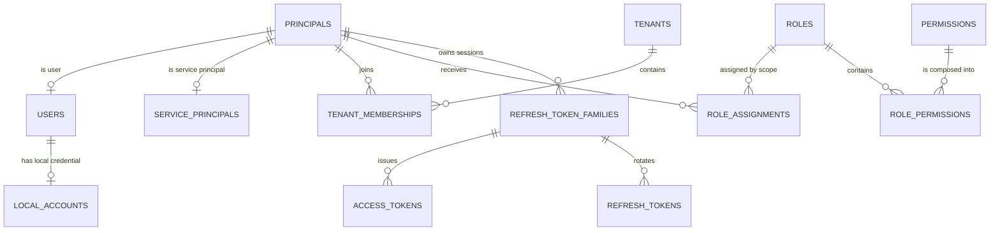
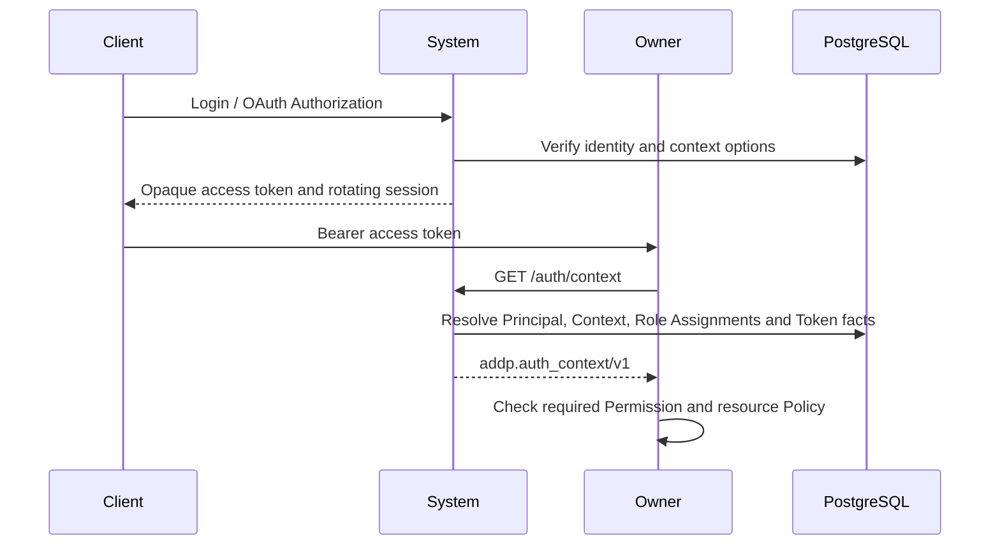

# System 模块数据库架构

System 负责身份、认证、授权目录、平台与 Tenant 上下文、OAuth/OIDC 协议事实、审计，以及引擎和应用配置。IAM 权威表统一位于 PostgreSQL `system` schema，由 `system/backend/internal/migration/sql/*.up.sql` 单向迁移；IAM 表不得进入 GORM `AutoMigrate`。

## 核心边界

- User 是全局自然人身份，不保存 Tenant 归属、Role 或密码。
- Local Account 保存本地用户名和密码 Hash；外部身份保存在 External Identity。
- Principal 是 User 与 Service Principal 的统一授权主体。
- Tenant Membership 表达 Principal 加入 Tenant 的关系。
- Role、Permission、Role Assignment 表达功能授权；Owner 模块继续执行资源级 Policy。
- 当前访问身份只由 `GET /api/v1/system/auth/context` 的 `addp.auth_context/v1` 返回，不投影旧平铺身份字段。
- 平台系统管理员、安全管理员和审计管理员是三个互斥 Role，不存在全权角色。

## 表分组

| 分组 | 主要表 | 说明 |
| --- | --- | --- |
| 身份 | `principals`, `users`, `local_accounts`, `service_principals` | 主体、自然人资料、本地凭据和服务主体 |
| 联邦认证 | `identity_providers`, `external_identities`, `tenant_idp_connections` | 外部 IdP、外部身份绑定和 Tenant 接入策略 |
| Tenant 与组织 | `tenants`, `tenant_memberships`, `departments`, `department_memberships`, `project_groups`, `project_group_memberships` | 业务隔离边界与组织/项目关系 |
| 授权治理 | `permissions`, `roles`, `role_permissions`, `role_assignments`, `role_conflicts`, `privileged_change_requests`, `privileged_change_approvals` | Permission 目录、Role 组合、Scope 分配和三员审批 |
| 会话与令牌 | `context_selection_tickets`, `refresh_token_families`, `refresh_tokens`, `access_tokens`, `delegated_access_tokens`, `resource_access_tickets` | 上下文选择、浏览器/OAuth 会话、委托令牌和资源票据 |
| OAuth/OIDC | `oauth_clients`, `oauth_authorization_requests`, `oauth_codes`, `oauth_access_tokens`, `oauth_refresh_tokens`, `oauth_device_codes`, `oauth_pkce_requests`, `oauth_openid_sessions` | Fosite Storage Adapter 的协议事实 |
| 审计与 Bootstrap | `audit_logs`, `iam_bootstrap_state`, `mfa_credentials` | 追加式审计、一次性三员初始化和 MFA |
| 平台配置 | `engines`, `applications`, `api_keys` | 非 IAM 业务配置，当前仍按各表既有迁移边界维护 |

## 关系图

## 启动与迁移

System 启动时先由唯一 migration runner 获取 PostgreSQL advisory lock，并将内嵌 SQL 升到当前版本；dirty、版本超前或 legacy IAM schema 都会阻止服务启动。非 IAM `AutoMigrate` 只能在 runner 成功后执行。

当前目录版本及每版边界见 [ADDP IAM PostgreSQL 迁移与首批 DDL 设计](../../docs/next/addp-IAM%20PostgreSQL迁移与首批DDL设计.md)。Permission 事实源位于各 owner 的 `authorization/permissions.yaml`，内置 Role 事实源位于 `system/authorization/builtin_roles.yaml`。

## 认证与授权流程

Role/Permission 变化会递增受影响 Principal 的 `authorization_version`。令牌解析必须核对签发版本；目录收缩等迁移还会撤销受影响的 Token Family。

## 数据保护

- 密码只保存自适应 Hash，不可逆加密或明文均禁止。
- MFA Secret 使用独立加密密钥加密，Bootstrap Secret 只保存 Hash。
- OAuth Code、Access Token、Refresh Token、Device Code 和浏览器 Token 只保存不可逆 Hash。
- `audit_logs` 是追加式事实，普通运行路径不得更新或删除。
- Engine `connection_info` 中的敏感字段由 System 加密后存储。

## 相关文档

- [ADDP 授权上下文规范](../../docs/spec/addp授权上下文规范.md)
- [ADDP 登录认证的统一要求](../../docs/spec/addp登录认证的统一要求.md)
- [ADDP IAM 目标数据模型设计](../../docs/next/addp-IAM目标数据模型设计.md)
- [users 表](tables/users表.md)
- [tenants 表](tables/tenants表.md)
- [audit_logs 表](tables/audit_logs表.md)
- [resource_access_tickets 表](tables/resource_access_tickets表.md)
- [delegated_access_tokens 表](tables/delegated_access_tokens表.md)
