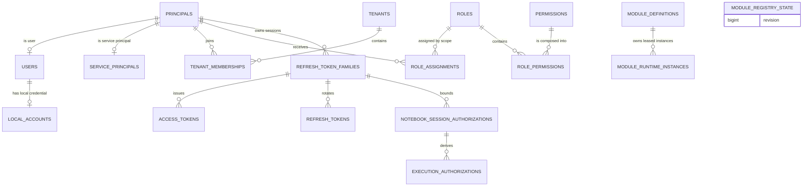
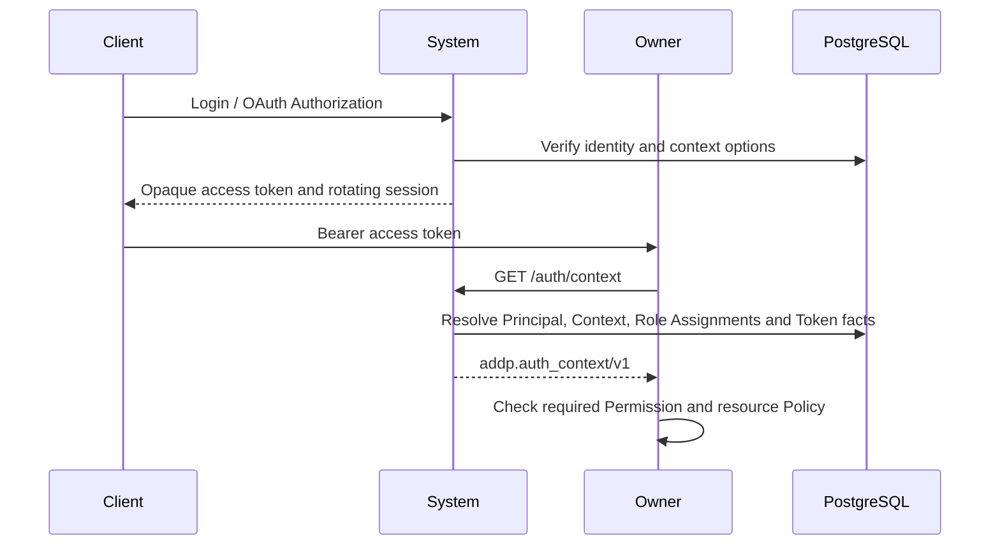

# System 模块数据库架构

System 负责身份、认证、授权目录、平台与 Tenant 上下文、OAuth 协议事实、OIDC 数据预留、审计，以及引擎和应用配置。IAM 权威表统一位于 PostgreSQL `system` schema，由 `system/backend/internal/migration/sql/*.up.sql` 单向迁移；IAM 表不得进入 GORM `AutoMigrate`。OIDC 当前未启用，预留表不代表对外协议能力。

## 核心边界

- User 是全局自然人身份，不保存 Tenant 归属、Role 或密码。
- Local Account 保存本地用户名和密码 Hash；外部身份保存在 External Identity。
- Principal 是 User 与 Service Principal 的统一授权主体。
- Tenant Membership 表达 Principal 加入 Tenant 的关系。
- Role、Permission、Role Assignment 表达功能授权；Owner 模块继续执行资源级 Policy。
- Module Definition 保存模块持久身份和管理员 `enabled` 意图；Module Runtime Instance 保存进程角色、端点、短期租约及可变生命周期历史；Module Registry State 保存可路由拓扑修订号，三者生命周期与职责分离。平台模块列表只查询有界当前投影，全部实例历史由模块下的只读分页接口查询。
- 当前访问身份只由 `GET /api/v1/system/auth/context` 的 `addp.auth_context/v1` 返回，不投影旧平铺身份字段。
- 平台系统管理员、安全管理员和审计管理员是三个互斥 Role，不存在全权角色。

## 表分组

| 分组 | 主要表 | 说明 |
| --- | --- | --- |
| 身份 | `principals`, `users`, `local_accounts`, `service_principals` | 主体、自然人资料、本地凭据和服务主体 |
| 联邦认证 | `identity_providers`, `external_identities`, `tenant_idp_connections` | 外部 IdP、外部身份绑定和 Tenant 接入策略 |
| Tenant 与组织 | `tenants`, `tenant_memberships`, `departments`, `department_memberships`, `project_groups`, `project_group_memberships` | 业务隔离边界与组织/项目关系 |
| 授权治理 | `permissions`, `roles`, `role_permissions`, `role_assignments`, `role_conflicts`, `privileged_change_requests`, `privileged_change_approvals` | Permission 目录、Role 组合、Scope 分配和三员审批 |
| 会话、令牌与短期授权 | `context_selection_tickets`, `refresh_token_families`, `refresh_tokens`, `access_tokens`, `delegated_access_tokens`, `resource_access_tickets`, `notebook_session_authorizations` | 上下文选择、浏览器/OAuth 会话、委托令牌、资源票据和 Notebook Catalog 授权事实 |
| IAM 安全策略 | `iam_security_policy` | Token、OAuth、邀请、登记与限流的 System-owned 平台安全策略 |
| OAuth/OIDC | `oauth_clients`, `oauth_authorization_requests`, `oauth_pkce_sessions`, `oauth_oidc_sessions`, `oauth_authorization_codes`, `oauth_device_authorizations` | Fosite Storage Adapter 的协议事实；Access/Refresh Token 复用统一令牌表 |
| 审计、Bootstrap 与恢复 | `audit_logs`, `iam_bootstrap_state`, `iam_recovery_attempts`, `mfa_credentials` | 追加式审计、一次性三员初始化、整体凭据恢复和 MFA |
| 平台配置 | `engines`, `applications`, `api_keys`, `module_definitions`, `module_runtime_instances`, `module_registry_state` | `engines` 与模块注册表由 System 统一 migration 管理；模块定义带并发 `version`，运行实例由租约推进健康，注册表状态维护路由拓扑 revision |

## 关系图

## 启动与迁移

System 启动时先由唯一 migration runner 获取 PostgreSQL advisory lock，并将内嵌 SQL 升到当前版本；dirty、版本超前或 legacy schema 都会阻止服务启动。该 runner 同时管理 IAM 以及 IAM 约束依赖的 System 基础资源表。剩余非基础业务表的 `AutoMigrate` 只能在 runner 成功后执行，且不得再次管理 `system.engines`。

迁移边界、启动顺序、事务和安全约束见 [System IAM 数据模型与迁移规范](IAM数据模型与迁移规范.md)。Permission 事实源位于各 owner 的 `authorization/permissions.yaml`，内置 Role 事实源位于 `system/authorization/builtin_roles.yaml`。

## 认证与授权流程

Role/Permission 变化会递增受影响 Principal 的 `authorization_version`。令牌解析必须核对签发版本；目录收缩等迁移还会撤销受影响的 Token Family。

模块定义是可变聚合根，所有管理员启停操作必须在同一事务中校验并递增 `version` 和路由拓扑 `revision`。运行实例不建立独立并发版本；注册、恢复、注销和租约到期在可路由拓扑实际变化时递增 `revision`，普通续租心跳不递增。平台管理 API 只读实例投影，不提供手工健康写入。

平台模块列表和模块详情不得预加载全部 `module_runtime_instances`：当前投影包含全部租约有效实例，并在某个角色没有有效实例时补充该角色最近一次离线观测。全部实例历史按模块分页读取，使用 `registered_at DESC, id DESC` 稳定排序；该表记录可被心跳和注销更新，不替代 `audit_logs` 的追加式审计事实。

## 数据保护

- 密码只保存自适应 Hash，不可逆加密或明文均禁止。
- MFA Secret 使用独立加密密钥加密，Bootstrap 和 Recovery 一次性 Secret 只保存 Hash；完成或过期后必须清除 Recovery Secret Hash。
- OAuth Code、Access Token、Refresh Token、Device Code 和浏览器 Token 只保存不可逆 Hash。
- `audit_logs` 是追加式事实，普通运行路径不得更新或删除。
- Engine `connection_info` 中的敏感字段由 System 加密后存储。

## 相关文档

- [ADDP 授权上下文规范](../../docs/spec/addp授权上下文规范.md)
- [ADDP 权限与角色发布规范](../../docs/spec/addp权限与角色发布规范.md)
- [ADDP 登录认证的统一要求](../../docs/spec/addp登录认证的统一要求.md)
- [System IAM 数据模型与迁移规范](IAM数据模型与迁移规范.md)
- [System OAuth 与 Fosite 实现说明](OAuth与Fosite实现说明.md)
- [users 表](tables/users表.md)
- [tenants 表](tables/tenants表.md)
- [audit_logs 表](tables/audit_logs表.md)
- [resource_access_tickets 表](tables/resource_access_tickets表.md)
- [delegated_access_tokens 表](tables/delegated_access_tokens表.md)
- [notebook_session_authorizations 表](tables/notebook_session_authorizations表.md)
- [iam_security_policy 表](tables/iam_security_policy表.md)
