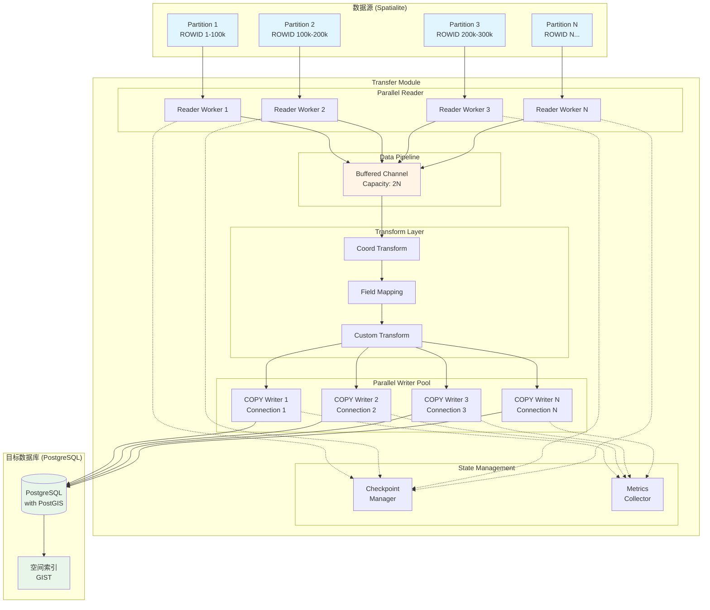
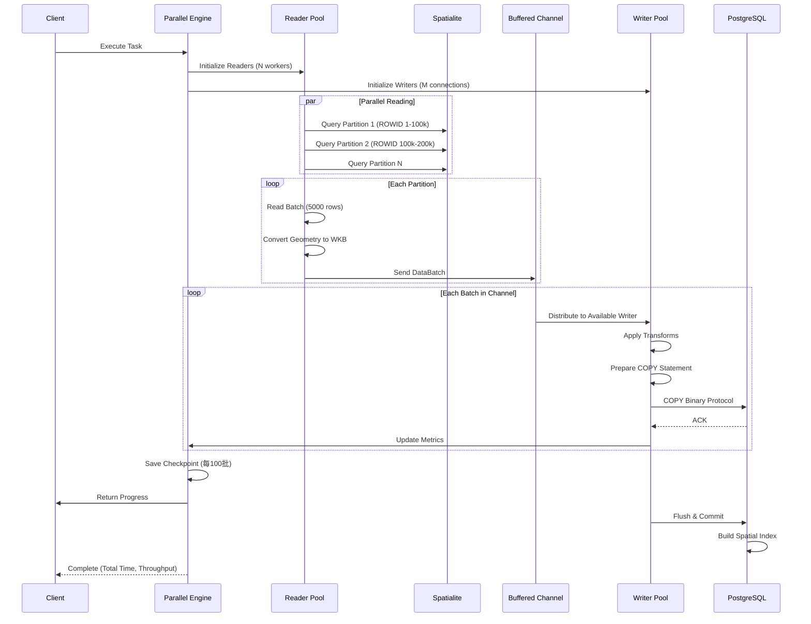
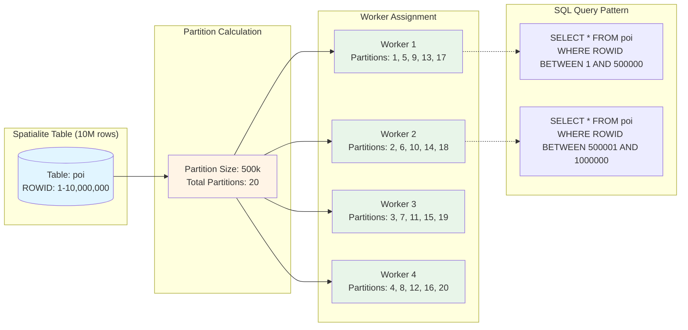
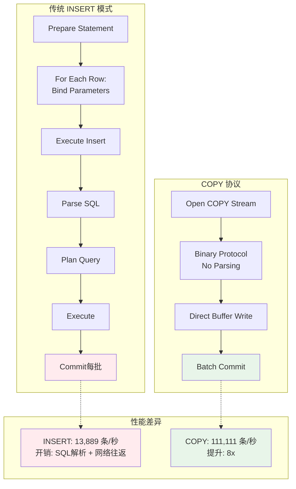
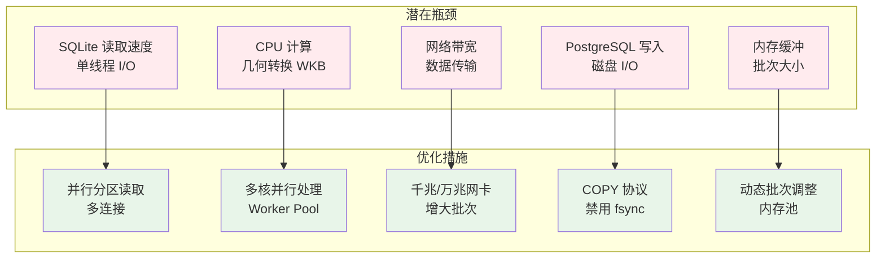
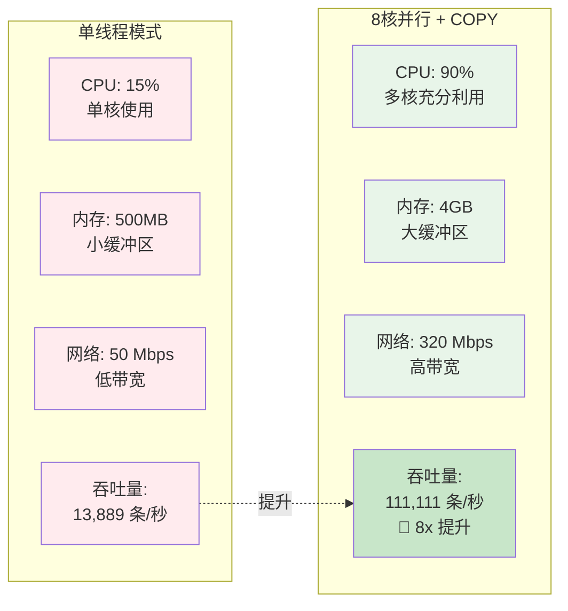
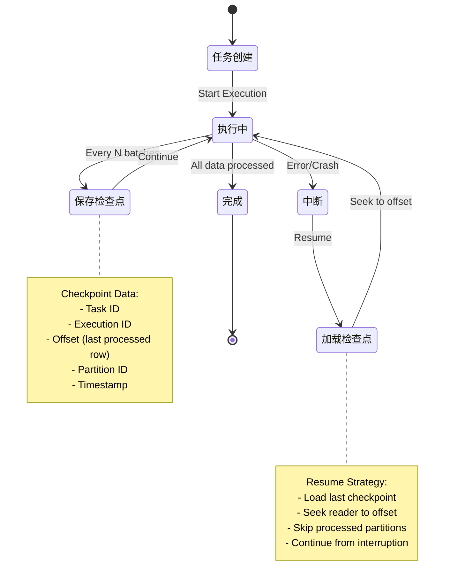
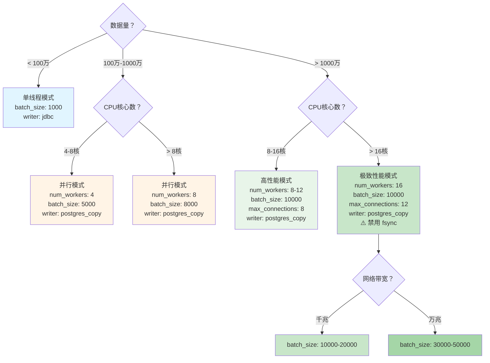
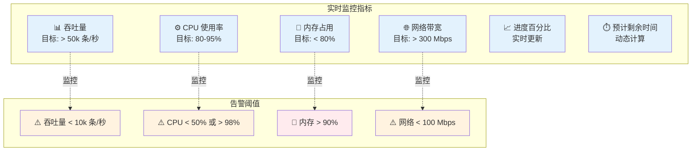

# Transfer 模块高性能架构图

## 整体架构

## 数据流详解

## 并行分区读取策略

## COPY 协议 vs INSERT 性能对比

## 性能瓶颈分析

## 资源利用率对比

## Checkpoint 断点续传机制

## 配置参数调优决策树

## 监控指标看板

---

## 说明

以上架构图展示了 Transfer 模块的高性能数据导入架构，包括：

1. **并行分区读取**：将数据源按主键分区，多线程并发读取
2. **流水线处理**：Reader 和 Writer 通过缓冲通道解耦，实现流水线并行
3. **COPY 批量写入**：使用 PostgreSQL 原生 COPY 协议，避免 SQL 解析开销
4. **断点续传**：Checkpoint 机制保证任务中断后可恢复
5. **动态监控**：实时监控吞吐量、CPU、内存、网络等关键指标

通过这些优化，Transfer 模块在千万级数据导入场景下可实现 **10x+** 的性能提升。
