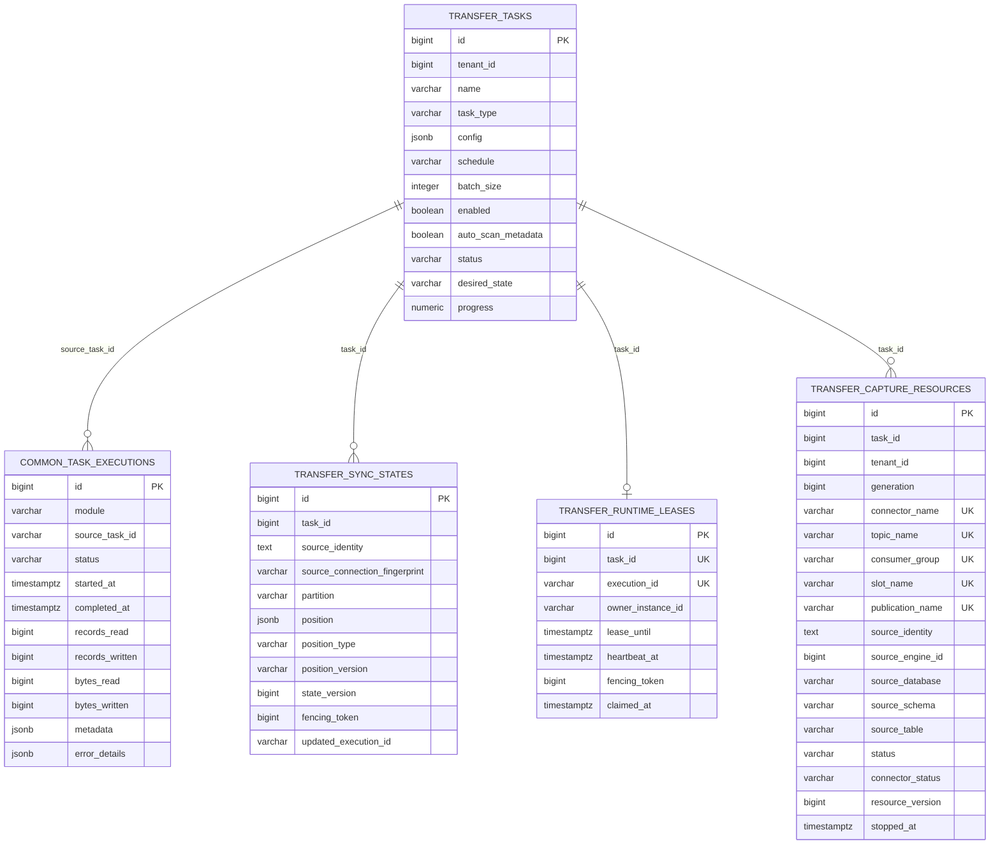

# Transfer 模块数据库架构

更新时间：2026-07-14

Transfer 模块保存传输任务定义和增量同步 committed position。引擎身份统一来自 System engine，执行记录统一写入 `common.task_executions`，不再维护 Transfer 私有执行历史主表或私有引擎表。

## 一、表清单

| 表 | 所属 schema | 用途 |
|---|---|---|
| `transfer.transfer_tasks` | `transfer` | Transfer 任务定义，核心配置在 `config` JSONB。 |
| `transfer.sync_states` | `transfer` | 增量同步主状态；按 task/source/partition 保存 position、CAS version 和 fencing token。 |
| `transfer.runtime_leases` | `transfer` | continuous runtime 所有权、heartbeat、lease deadline 与 fencing token。 |
| `transfer.capture_resources` | `transfer` | PostgreSQL CDC capture generation 及 ADDP-owned connector/topic/group/slot/publication 资源登记、状态与清理版本。 |
| `common.task_executions` | `common` | 统一执行记录表，Transfer 通过 `module=transfer`、`task_type=sync` 和 `source_task_id` 关联任务。 |

新增 Transfer 主链路不得重新引入私有 reader / writer 插件表、私有执行表或 Transfer 私有引擎路线。

## 二、关系图



## 三、任务配置存储

`transfer.transfer_tasks.config` 是当前主配置来源，使用 source / target endpoint JSON：

```json
{
  "runtime": {"boundary": "bounded"},
  "load": {"mode": "snapshot"},
  "source": {
    "locator": "addp://engine/1/path/public/roads?type=table",
    "data_type": "table",
    "representation": "native"
  },
  "target": {
    "parent_locator": "addp://engine/2/path/exports?type=directory",
    "name": "roads.csv",
    "data_type": "table",
    "representation": "encoded",
    "format": "csv",
    "policy": {"apply_mode": "replace"}
  },
  "transforms": [
    {
      "type": "field_mapping",
      "version": "v1",
      "mode": "project",
      "fields": [
        {"source": "name", "target": "road_name", "target_type": "string"}
      ]
    }
  ],
  "batch_size": 10000
}
```

旧 `source_id`、`target_id`、`connector_type`、`source_config`、`target_config`、`output_format`、`file_type`、`engine.scope` 等不再作为任务配置事实来源。
旧任务外层 `mappings`、`transfer.field_mappings` 和 `transfer.data_mappings` 已退出主路径；字段映射只写入 `config.transforms[type=field_mapping]`。

## 四、执行记录存储

Transfer 创建执行时写入 `common.task_executions`。这里的 `task_type=sync` 是对外 TaskProvider 和统一 execution 类型；`transfer.transfer_tasks.task_type` 也是任务定义侧字段，固定为 `sync`。导入、导出是 Manager 等调用方的用户动作语义，不作为 Transfer 任务类型。

| 字段 | Transfer 用法 |
|---|---|
| `module` | 固定为 `transfer`。 |
| `task_type` | 固定为 `sync`。 |
| `source_task_id` | 对应 `transfer.transfer_tasks.id`，按十进制字符串软引用写入。 |
| `status` | `pending`、`running`、`success`、`failed`、`timeout`、`cancelled`。 |
| `records_read` / `records_written` | table Transfer 行数指标；raw copy 第一版固定写入 `1/1`，表示单个 content 完成复制。 |
| `bytes_read` / `bytes_written` | 字节指标；raw copy 第一版会写入源读取和目标写入字节数。 |
| `metadata.checkpoint_offset` | checkpoint 观测偏移。 |
| `metadata.checkpoint_state` | batch 进度、source/target marker 和诊断状态。 |
| `error_details.message` | 失败错误。 |
| `error_details.logs` | 简短执行日志。 |

Transfer API 会把统一执行记录投影为模块 DTO，以保持 `/api/v1/transfer/executions` 的响应结构。

## 五、同步状态与 Checkpoint 语义

当前 checkpoint 不表示可从中断点自动续写。

| 能力等级 | 当前语义 |
|---|---|
| observable | 已支持。用于进度展示、日志和故障定位。 |
| restartable | 已支持。失败执行 retry 会创建新 execution 并从头重新执行。 |
| resumable | PostgreSQL watermark incremental 已通过 `transfer.sync_states` 支持 execution 间 resume；snapshot checkpoint 仍只可观测。 |

retry 规则：

- replace snapshot 可 retry，从头执行。
- append 模式拒绝 retry，避免重复写入。
- watermark upsert retry 创建新 execution，从 committed position resume。
- retry 不携带旧 execution 的 checkpoint_state 继续写。

`transfer.sync_states.position` 第一版为 `type=watermark`、`version=v1`，cursor values 是由 PostgreSQL Provider 解释的 canonical string 数组。每批目标 upsert 事务成功后，Transfer 才使用 `state_version + fencing_token` 做 CAS 提交；旧 worker 或并发 execution 无法覆盖新位置。

工作包 2A 已确认 Kafka continuous 仍复用 `transfer.sync_states`，但按 topic partition 分行保存 `type=kafka_offset`、`version=v1`、`next_offset`。该 position 表示下一条应消费的 offset；consumer group auto commit 不是事实源。

continuous task 还必须持有服务端生成、不可修改且不写入 config 的 `apply_identity UUID`。该身份跨 execution 保持不变，删除并重建任务时重新生成；业务目标 PostgreSQL 使用它隔离目标应用账本，不能只使用可能在其他 ADDP 实例重复的本地自增 task ID。

业务目标 PostgreSQL 由 `PartitionedTableChangeApplyProvider` 准备 `addp_transfer.apply_positions`。账本至少保存 `apply_identity`、`source_identity`、`target_identity`、`partition`、`position_type`、`position_version`、`next_offset` 和审计时间。每次只应用单 partition batch，在同一事务中锁定 ledger、过滤已应用 offset、按目标 key 保留最后状态、upsert 业务表并推进 ledger。该表位于业务目标库，不得建在 Infra PostgreSQL，也不得用业务表隐藏 offset 列替代。

`transfer.runtime_leases` 已由迁移 `013_add_continuous_runtime.sql` 建立，保存 continuous runtime session 的 task、execution、owner instance、lease deadline、heartbeat 和 fencing token；不得把 lease 写入 position JSON，也不得用 execution heartbeat 代替业务 committed position。

正式字段如下：

| 字段 | 语义 |
|---|---|
| `id` | lease 自增 ID。 |
| `task_id` | continuous task ID，必须唯一，保证同一 task 只有一个当前 lease。 |
| `execution_id` | 当前 runtime session 对应的 execution UUID。 |
| `owner_instance_id` | continuous worker 实例稳定 ID。 |
| `lease_until` | 当前 owner 的租约截止时间。 |
| `heartbeat_at` | 最近一次成功续租时间。 |
| `fencing_token` | 每次合法 claim 单调递增的 token。 |
| `claimed_at` | 本次 session 首次 claim 时间。 |
| `created_at` / `updated_at` | 审计时间。 |

claim pending execution、写入 owner、推进 lease 和递增 fencing token 必须在同一数据库事务中完成。session 首次接管 partition state 时，必须把相同 fencing token 写入对应 `transfer.sync_states` 行；后续 position CAS 同时校验 `state_version + fencing_token`。过期 owner 即使稍后恢复，也不能推进新 session 的 position。

continuous task definition 已 clean break 增加 `desired_state=running|paused|stopped` 活状态字段，初始为 `stopped`。desired state 不写入 config JSON，也不以最近 execution status 代替；bounded task 不消费该字段。

`transfer.transfer_tasks.status` 表示实际运行摘要，取值为 `idle|running|blocked`。`blocked` 当前只用于 PostgreSQL CDC schema drift：用户仍可能保持 `desired_state=running`，但当前 capture generation 已无法安全恢复；start/resume/retry 均拒绝，Stop 后状态回到 `idle` 且 generation 永久失效。

continuous runtime 已实现 claim、续租、过期接管、容量限制、严格 Kafka JSON 解码、按 partition 处理、PostgreSQL 目标原子应用与 `transfer.sync_states` position CAS。pause/stop 会先取消并等待 runtime 关闭 source/target，再结束 execution 和释放 lease；旧 owner 在 desired state 变化或 lease/fencing 失效后不能继续推进 position。业务库 `addp_transfer.apply_positions` 与 Infra 库 `transfer.sync_states` 保持不同事实边界，禁止混用。

## 六、CDC Capture Generation 与资源登记

`transfer.capture_resources` 由迁移 `014_add_capture_resources.sql` 建立，并由 `015_add_capture_source_spatial_info.sql` 增加源空间事实，是 PostgreSQL CDC 捕获控制面的唯一资源事实。每条记录按 `task_id + generation` 唯一，内部名称全部由服务端生成，不进入任务 JSON：

| 字段 | 语义 |
|---|---|
| `generation` | capture generation；start/retry/resume 复用当前 generation，stop 后永久失效。 |
| `connector_name` | ADDP-owned Debezium PostgreSQL connector。 |
| `topic_name` | 单分区任务级 Infra Kafka CDC topic。 |
| `consumer_group` | Transfer CDC consumer group 名称登记；控制面 stop/cleanup 幂等删除其 offsets。 |
| `slot_name` / `publication_name` | ADDP-owned PostgreSQL logical replication 资源，只能在 source identity 完全匹配时删除。 |
| `source_identity` / `source_connection_fingerprint` / `source_*` | 源 Engine locator、非敏感 host/port/database 指纹、数据库、schema、table 的稳定清理身份；连接事实变化后拒绝按旧登记删除 slot/publication。 |
| `source_spatial_info` | generation 创建前从源表冻结的 geometry 字段名、OGC type、SRID、维度和 nullable；continuous worker 只能使用该事实校验 Debezium geometry，并按字段映射派生目标 `SpatialInfo`。 |
| `status` | `provisioning|running|failed|cleaning|cleanup_failed|stopped`。 |
| `connector_status` / `connector_error` | Kafka Connect 最近观测状态和安全错误摘要。 |
| `resource_version` | capture state CAS 版本，避免并发控制动作覆盖。 |

capture supervisor 先登记 generation，再显式创建 topic、创建或更新 connector并等待 connector/task 进入 `RUNNING`。CDC pause 不暂停 connector，只停止目标应用；stop 先等待 continuous runtime owner 释放或 lease 过期，再删除 connector，核验并删除 slot/publication，最后删除 consumer group 和 topic。任务删除与 System cleanup 复用同一套幂等 stop，不按名称前缀猜测资源，也不删除目标业务表、目标 ledger 或统一 execution。

## 七、写后 Meta 扫描

任务成功后，如果 `auto_scan_metadata=true`，Transfer 会触发 Meta deep scan。Transfer 只提交本次实际写出的目标边界，不扩大为父目录扫描：

| 写出资源 | 扫描目标 |
|---|---|
| native table | schema / database catalog path |
| NFS encoded/raw file | 单文件 `ref_groups` |
| MinIO / S3 encoded/raw object | 单对象 `ref_groups` |
| Shapefile refs | 本次实际生成的 refs group，不补不存在的 sidecar refs |

对象存储目标的 `ref_groups.path` 必须使用完整 content path，即 `bucket/object_key`。Transfer executor 内部可以用 bucket 内 object key 写 sidecar，但写入 `common.task_executions.metadata.target_refs` 以及提交给 Meta 的 `ref_groups` 必须回到外部契约路径；否则 Meta 会把 object key 第一段误判为 bucket，导致写后扫描找不到真实对象。

Meta scan 负责重新识别目标 item 的 attributes；Transfer 不直接写目标 Meta attributes。
