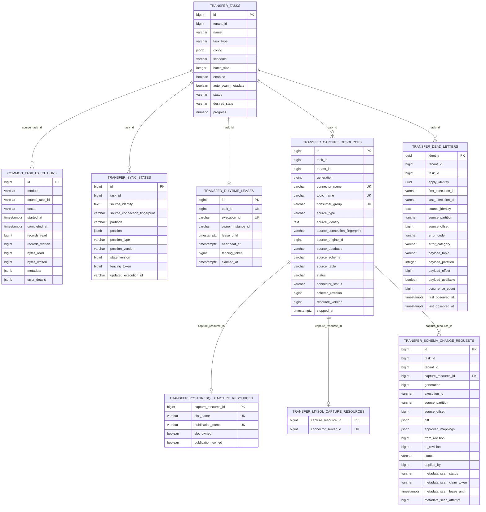

# Transfer 模块数据库架构

更新时间：2026-08-02

Transfer 模块保存传输任务定义和增量同步 committed position。引擎身份统一来自 System engine，执行记录统一写入 `common.task_executions`，不再维护 Transfer 私有执行历史主表或私有引擎表。

## 一、表清单

| 表 | 所属 schema | 用途 |
|---|---|---|
| `transfer.transfer_tasks` | `transfer` | Transfer 任务定义，核心配置在 `config` JSONB。 |
| `transfer.sync_states` | `transfer` | 增量同步主状态；按 task/source/partition 保存 position、CAS version 和 fencing token。 |
| `transfer.runtime_leases` | `transfer` | continuous runtime 所有权、heartbeat、lease deadline 与 fencing token。 |
| `transfer.capture_resources` | `transfer` | 数据库 CDC 的 engine-neutral capture generation、connector/topic/group、源身份、状态与清理版本。 |
| `transfer.postgresql_capture_resources` | `transfer` | PostgreSQL generation 独有的 ADDP-owned slot/publication 资源事实。 |
| `transfer.mysql_capture_resources` | `transfer` | MySQL generation 独有的 Debezium connector server id 与 owned schema-history topic。 |
| `transfer.oracle_capture_resources` | `transfer` | Oracle generation 独有的 owned schema-history topic；表级 supplemental logging 不属于 generation。 |
| `transfer.schema_change_requests` | `transfer` | 数据库 CDC 人工 additive migration 的阻塞位置、schema diff、mapping revision、审批和 Meta scan 审计。 |
| `transfer.dead_letters` | `transfer` | 业务 Kafka dead-letter 查询/审计控制索引；原始 payload 仅保存在 Infra Kafka。 |
| `common.task_executions` | `common` | 统一执行记录表，Transfer 通过 `module=transfer`、`task_type=sync` 和 `source_task_id` 关联任务。 |

新增 Transfer 主链路不得重新引入私有 reader / writer 插件表、私有执行表或 Transfer 私有引擎路线。

## 二、关系图



## 三、任务配置存储

`transfer.transfer_tasks.config` 是当前主配置来源，使用 source / target endpoint JSON：

```json
{
  "runtime": {"boundary": "bounded"},
  "load": {"mode": "snapshot"},
  "source": {
    "locator": "addp://engine/1/path/public/roads?type=table",
    "data_type": "table",
    "representation": "native"
  },
  "target": {
    "parent_locator": "addp://engine/2/path/exports?type=directory",
    "name": "roads.csv",
    "data_type": "table",
    "representation": "encoded",
    "format": "csv",
    "policy": {"apply_mode": "replace"}
  },
  "transforms": [
    {
      "type": "field_mapping",
      "version": "v1",
      "mode": "project",
      "fields": [
        {"source": "name", "target": "road_name", "target_type": "string"}
      ]
    }
  ],
  "batch_size": 10000
}
```

旧 `source_id`、`target_id`、`connector_type`、`source_config`、`target_config`、`output_format`、`file_type`、`engine.scope` 等不再作为任务配置事实来源。
旧任务外层 `mappings`、`transfer.field_mappings` 和 `transfer.data_mappings` 已退出主路径；字段映射只写入 `config.transforms[type=field_mapping]`。

## 四、执行记录存储

Transfer 创建执行时写入 `common.task_executions`。这里的 `task_type=sync` 是对外 TaskProvider 和统一 execution 类型；`transfer.transfer_tasks.task_type` 也是任务定义侧字段，固定为 `sync`。导入、导出是 Manager 等调用方的用户动作语义，不作为 Transfer 任务类型。

| 字段 | Transfer 用法 |
|---|---|
| `module` | 固定为 `transfer`。 |
| `task_type` | 固定为 `sync`。 |
| `source_task_id` | 对应 `transfer.transfer_tasks.id`，按十进制字符串软引用写入。 |
| `status` | `pending`、`running`、`success`、`failed`、`timeout`、`cancelled`。 |
| `records_read` / `records_written` | table Transfer 行数指标；raw copy 第一版固定写入 `1/1`，表示单个 content 完成复制。 |
| `bytes_read` / `bytes_written` | 字节指标；raw copy 第一版会写入源读取和目标写入字节数。 |
| `metadata.checkpoint_offset` | checkpoint 观测偏移。 |
| `metadata.checkpoint_state` | batch 进度、source/target marker 和诊断状态。 |
| `error_details.message` | 失败错误。 |
| `error_details.logs` | 简短执行日志。 |

Transfer API 会把统一执行记录投影为模块 DTO，以保持 `/api/v1/transfer/executions` 的响应结构。

## 五、同步状态与 Checkpoint 语义

当前 checkpoint 不表示可从中断点自动续写。

| 能力等级 | 当前语义 |
|---|---|
| observable | 已支持。用于进度展示、日志和故障定位。 |
| restartable | 已支持。失败执行 retry 会创建新 execution 并从头重新执行。 |
| resumable | PostgreSQL/MySQL watermark incremental 已通过 `transfer.sync_states` 支持 execution 间 resume；snapshot checkpoint 仍只可观测。 |

retry 规则：

- replace snapshot 可 retry，从头执行。
- append 模式拒绝 retry，避免重复写入。
- watermark upsert retry 创建新 execution，从 committed position resume。
- retry 不携带旧 execution 的 checkpoint_state 继续写。

`transfer.sync_states.position` 第一版为 `type=watermark`、`version=v1`，cursor values 是由 PostgreSQL/MySQL 源 Provider 解释的 canonical string 数组。每批目标 upsert 事务成功后，Transfer 才使用 `state_version + fencing_token` 做 CAS 提交；旧 worker 或并发 execution 无法覆盖新位置。

工作包 2A 已确认 Kafka continuous 仍复用 `transfer.sync_states`，但按 topic partition 分行保存 `type=kafka_offset`、`version=v1`、`next_offset`。该 position 表示下一条应消费的 offset；consumer group auto commit 不是事实源。

continuous task 还必须持有服务端生成、不可修改且不写入 config 的 `apply_identity UUID`。该身份跨 execution 保持不变，删除并重建任务时重新生成；业务目标 PostgreSQL 使用它隔离目标应用账本，不能只使用可能在其他 ADDP 实例重复的本地自增 task ID。

业务目标 PostgreSQL 由 `PartitionedTableChangeApplyProvider` 准备 `addp_transfer.apply_positions`。账本至少保存 `apply_identity`、`source_identity`、`target_identity`、`partition`、`position_type`、`position_version`、`next_offset` 和审计时间。每次只应用单 partition batch，在同一事务中锁定 ledger、过滤已应用 offset、按目标 key 保留最后状态、upsert 业务表并推进 ledger。该表位于业务目标库，不得建在 Infra PostgreSQL，也不得用业务表隐藏 offset 列替代。

`transfer.runtime_leases` 已由迁移 `013_add_continuous_runtime.sql` 建立，保存 continuous runtime session 的 task、execution、owner instance、lease deadline、heartbeat 和 fencing token；不得把 lease 写入 position JSON，也不得用 execution heartbeat 代替业务 committed position。

正式字段如下：

| 字段 | 语义 |
|---|---|
| `id` | lease 自增 ID。 |
| `task_id` | continuous task ID，必须唯一，保证同一 task 只有一个当前 lease。 |
| `execution_id` | 当前 runtime session 对应的 execution UUID。 |
| `owner_instance_id` | continuous worker 实例稳定 ID。 |
| `lease_until` | 当前 owner 的租约截止时间。 |
| `heartbeat_at` | 最近一次成功续租时间。 |
| `fencing_token` | 每次合法 claim 单调递增的 token。 |
| `claimed_at` | 本次 session 首次 claim 时间。 |
| `created_at` / `updated_at` | 审计时间。 |

claim pending execution、写入 owner、推进 lease 和递增 fencing token 必须在同一数据库事务中完成。session 首次接管 partition state 时，必须把相同 fencing token 写入对应 `transfer.sync_states` 行；后续 position CAS 同时校验 `state_version + fencing_token`。过期 owner 即使稍后恢复，也不能推进新 session 的 position。

continuous task definition 已 clean break 增加 `desired_state=running|paused|stopped` 活状态字段，初始为 `stopped`。desired state 不写入 config JSON，也不以最近 execution status 代替；bounded task 不消费该字段。

`transfer.transfer_tasks.status` 表示实际运行摘要，取值为 `idle|running|blocked`。`blocked` 当前只用于数据库 CDC schema drift：用户仍可能保持 `desired_state=running`，但当前消息和 committed offset 不得推进，start/resume/retry 均拒绝。只有 pending additive schema change request 审批成功后可收敛为 `status=idle, desired_state=paused`；其他变化 Stop 后状态回到 `idle` 且 generation 永久失效。

continuous runtime 已实现 claim、续租、过期接管、容量限制、严格 Kafka JSON 解码、按 partition 处理、PostgreSQL/MySQL 目标原子应用与 `transfer.sync_states` position CAS。pause/stop 会先取消并等待 runtime 关闭 source/target，再结束 execution 和释放 lease；旧 owner 在 desired state 变化或 lease/fencing 失效后不能继续推进 position。PostgreSQL 目标库 `addp_transfer.apply_positions`、MySQL 目标库 `_addp_transfer_apply_positions` 与 Infra 库 `transfer.sync_states` 保持不同事实边界，禁止混用。

## 六、CDC Capture Generation 与资源登记

`transfer.capture_resources` 由迁移 `014_add_capture_resources.sql` 建立，并由 `015_add_capture_source_spatial_info.sql` 增加源空间事实。迁移 `017_split_capture_provider_resources.sql` 将它 clean break 为 engine-neutral capture generation 主事实，并把 provider 私有资源拆到一对一子表；`021_add_oracle_capture_resources.sql` 增加 Oracle provider 子事实并将 `source_type` 收敛为 `postgresql|mysql|oracle`。每条 generation 按 `task_id + generation` 唯一，内部名称全部由服务端生成，不进入任务 JSON：

| 字段 | 语义 |
|---|---|
| `generation` | capture generation；start/retry/resume 复用当前 generation，stop 后永久失效。 |
| `connector_name` | ADDP-owned Debezium connector。 |
| `topic_name` | 单分区任务级 Infra Kafka CDC topic。 |
| `consumer_group` | Transfer CDC consumer group 名称登记；控制面 stop/cleanup 幂等删除其 offsets。 |
| `source_type` | capture provider，当前表结构只允许 `postgresql|mysql|oracle`；公开能力是否开放仍由 planner/API 契约决定。 |
| `source_identity` / `source_connection_fingerprint` / `source_*` | 源 Engine locator、非敏感 host/port/database 指纹、数据库、schema、table 的稳定清理身份；连接事实变化后拒绝按旧登记清理 provider 资源。 |
| `source_spatial_info` | generation 创建前从源表冻结的 geometry 字段名、OGC type、SRID、维度和 nullable；continuous worker 只能使用该事实校验 Debezium geometry，并按字段映射派生目标 `SpatialInfo`。 |
| `schema_revision` | 当前 generation 已提交的 field mapping revision，初始为 1；每次人工 additive migration 成功后递增 1。 |
| `status` | `provisioning|running|failed|cleaning|cleanup_failed|stopped`。 |
| `connector_status` / `connector_error` | Kafka Connect connector/task 最近观测状态和安全错误摘要，只表达复制线程。 |
| `source_status` / `source_error` | 使用 connector 实际数据库凭据执行最小只读探针的最近状态和安全错误摘要；Oracle 使用独立 CDC 账号。 |
| `source_recovery` | provider-neutral、版本化的源事务日志恢复窗口观测 JSON；Oracle 保存 connector capture SCN、当前可用 redo/archive 最早 SCN、SCN headroom、日志事实窗口秒数和可选 FRA 使用率。它不替代 `source_status` 或 Infra Kafka retention。 |
| `source_transactions` | provider-neutral、版本化的源未提交事务压力观测 JSON；Oracle 保存活跃事务数、最老事务起始 SCN/持续秒数和合计 Undo blocks/records。它不派生健康状态，也不替代 `source_recovery`。 |
| `resource_version` | capture state CAS 版本，避免并发控制动作覆盖。 |

`transfer.postgresql_capture_resources` 保存 `slot_name/publication_name` 及 ownership，只能在 source identity 完全匹配时清理；`transfer.mysql_capture_resources` 保存 MySQL Debezium `connector_server_id`、`schema_history_topic_name` 与 ownership；`transfer.oracle_capture_resources` 只保存 Oracle `schema_history_topic_name` 与 ownership。server id 由 capture generation 主键分配并通过唯一索引防冲突；schema-history topic 固定为单分区 `cleanup.policy=delete + retention.ms=-1`，因为 Debezium 3.6 history record 使用空 key，不能依赖 compact topic 提供正确的历史保留语义。三张子表都以 `capture_resource_id` 为主键并 `ON DELETE CASCADE`，不得在 generic 主表恢复 provider 字段，也不得用空字符串或伪资源名占位。Oracle 表级 `ALL COLUMN LOGGING` 是共享 source readiness，不由 generation 登记或 Stop 清理。

capture supervisor 先在同一事务登记 generation 与对应 provider 子事实，再显式创建数据 topic；MySQL/Oracle 还要创建并授权 schema-history topic，随后创建或更新 connector 并等待 connector/task 进入 `RUNNING`。CDC pause 不暂停 connector，只停止目标应用；stop 先等待 continuous runtime owner 释放或 lease 过期，再删除 connector，按 provider 清理 generation-owned 源端资源，最后删除 consumer group、数据 topic、MySQL/Oracle schema-history topic 及其 ACL。任务删除与 System cleanup 复用同一套幂等 stop，不按名称前缀猜测资源，也不删除 Oracle 表级 supplemental logging、目标业务表、目标 ledger 或统一 execution。

## 七、CDC Schema Change Request

迁移 `018_create_schema_change_requests.sql` 为 `capture_resources` 增加 `schema_revision`，并建立 `transfer.schema_change_requests`；迁移 `019_add_schema_change_meta_scan_claim.sql` 将已存在的 018 结构收敛到带 token/lease fencing 的 Meta scan claim 最终结构。request 只允许 `pending -> applied`，同一 capture generation 同时最多一个 pending request，且每个 `to_revision` 只能出现一次；外键 `capture_resource_id` 使用 `ON DELETE CASCADE`，task physical cleanup 不保留私有 request。

| 字段 | 语义 |
|---|---|
| `task_id` / `tenant_id` / `capture_resource_id` / `generation` | request 所属 task 和 capture generation。 |
| `execution_id` / `source_partition` / `source_offset` | 触发阻塞的 execution 与 Kafka 精确位置；审批和 Resume 均不能跳过该消息。 |
| `scope` / `diff` | 阻塞范围及 missing/unexpected/incompatible schema diff。 |
| `from_revision` / `to_revision` | 本次 mapping revision 边界，固定满足 `to_revision=from_revision+1`。 |
| `status` | `pending|applied`；不提供 rejected、cancelled 或兼容状态。 |
| `approved_mappings` / `applied_by` / `applied_at` | 用户逐字段确认的 additive mapping 与审批审计。 |
| `metadata_scan_status` | `pending|running|success|failed`；目标 DDL 和 Infra revision 提交后触发的 Meta deep scan 状态，失败不回滚 migration。 |
| `metadata_scan_claim_token` / `metadata_scan_lease_until` / `metadata_scan_attempt` | Meta scan 持久化 claim 的 UUID fencing token、租期和累计领取次数；非 `running` 状态清空 token/lease。 |
| `metadata_scan_execution_id` / `metadata_scan_error` | Meta scan execution ID 或安全失败摘要。 |

检测到 schema drift 时，continuous runtime 在记录 execution error metadata 的同时幂等建立 pending request。PostgreSQL/MySQL 中只有 unexpected fields 且源表复查确认均为 nullable、非主键、非 geometry 时可审批；目标 DDL 复用 `PartitionedTableChangeApplyProvider` 的幂等 prepare/evolution 路径。审批提交后任务进入 paused，由用户显式 Resume 从原 committed offset 继续。Oracle 第一期会保留阻塞 request 和 execution 审计，但 source inspection 固定返回不支持，任何 schema drift 都必须 Stop 后创建新 generation。

Meta scan claim 只允许 `pending` 或租期已过的 `running` 通过 CAS 进入新的 `running(token, lease_until)`，并递增 attempt。完成时必须匹配当前 token；旧 claimant 的迟到成功或失败不能覆盖接管者。只有相同重复审批 POST 负责触发 pending/过期 running 的有限恢复，schema change GET 始终只读；真实 Meta API 失败进入终态 `failed`，不在审批链路自动重试。

## 八、业务 Kafka Dead-letter 控制索引

`transfer.dead_letters` 由迁移 `016_create_dead_letters.sql` 建立。它只保存查询和审计字段以及 Infra Kafka payload 坐标，不保存原始 key/value/headers，也不保存伪 replay 状态。

| 字段 | 语义 |
|---|---|
| `identity` | 由 `apply_identity + source_identity + partition + record_offset` 推导的 UUID v5 主键。 |
| `first_execution_id` / `last_execution_id` | 首次和最近观测该坏记录的统一 execution ID。 |
| `source_*` | 原业务 Kafka topic、partition、offset、timestamp 和稳定 source identity。 |
| `error_code` / `error_category` / `error_message` | 可稳定分类且不得包含连接凭据的安全错误摘要。 |
| `payload_topic` / `payload_partition` / `payload_offset` | `transfer.dead_letter/v1` envelope 在 Infra Kafka 中的精确坐标。 |
| `payload_available` | payload retention 到期或读取确认不存在后显式置为 false；不能据此伪造 replay 状态。 |
| `first_observed_at` / `last_observed_at` / `occurrence_count` | 重复处理同一 source record 的审计时间和次数。 |

identity 主键之外还对 `(apply_identity, source_identity, source_partition, source_offset)` 建唯一约束，防止 identity 算法或调用错误制造第二条逻辑事实。重复观测保留首次字段，只刷新最近 execution、错误、payload reference 和次数。

原始 payload 写入 task 级 `__addp_dlq.<tenant_id>.<task_id>` topic；topic 第一版固定 1 partition，以 identity 为 Kafka key 并使用 `compact,delete`。continuous runtime 只有在 Kafka payload 和本控制索引都成功后，才允许继续提交目标 `skip` ledger 与 Infra position CAS。内部数据面已按该顺序接通并通过真实 Kafka/PostgreSQL E2E；公开任务 API 接受显式 `block|dead_letter`，Console 默认显式发送 `block`。bounded replay 从原业务 Kafka 读取，不读取本 DLQ topic。

## 九、写后 Meta 扫描

`auto_scan_metadata=true` 时，bounded 任务成功后触发一次 Meta deep scan；普通业务 Kafka continuous 任务在目标 Provider 首次成功建立目标结构后触发一次，不等待 execution 结束。数据库 CDC 必须消费同一 generation-owned 单分区 data topic 中的 Debezium `Initial Snapshot` 通知，合法通知作为目标 `skip` 推进，只有严格匹配当前 connector 的 `COMPLETED` 通知所在 offset 在目标 ledger 和 Transfer position 提交后才触发首次扫描，空源表同样触发，不依赖数据事件或 `source.snapshot=last`。continuous 首次扫描状态和 fencing claim 保存在 `transfer.transfer_tasks.initial_metadata_scan_*` 私有字段中；worker recovery/resume 不得重复提交，Meta 提交失败不阻断数据面，失败或过期 claim 由后续 runtime session 重新领取。普通 DML 或单个 batch 不触发扫描，schema 正式变化后另行扫描。

Transfer 只提交实际目标边界，不扩大为无关父级扫描：

| 写出资源 | 扫描目标 |
|---|---|
| native table | schema / database catalog path |
| NFS encoded/raw file | 单文件 `ref_groups` |
| MinIO / S3 encoded/raw object | 单对象 `ref_groups` |
| Shapefile refs | 本次实际生成的 refs group，不补不存在的 sidecar refs |

对象存储目标的 `ref_groups.path` 必须使用完整 content path，即 `bucket/object_key`。Transfer executor 内部可以用 bucket 内 object key 写 sidecar，但写入 `common.task_executions.metadata.target_refs` 以及提交给 Meta 的 `ref_groups` 必须回到外部契约路径；否则 Meta 会把 object key 第一段误判为 bucket，导致写后扫描找不到真实对象。

Meta scan 负责重新识别目标 item 的 attributes；Transfer 不直接写目标 Meta attributes。
