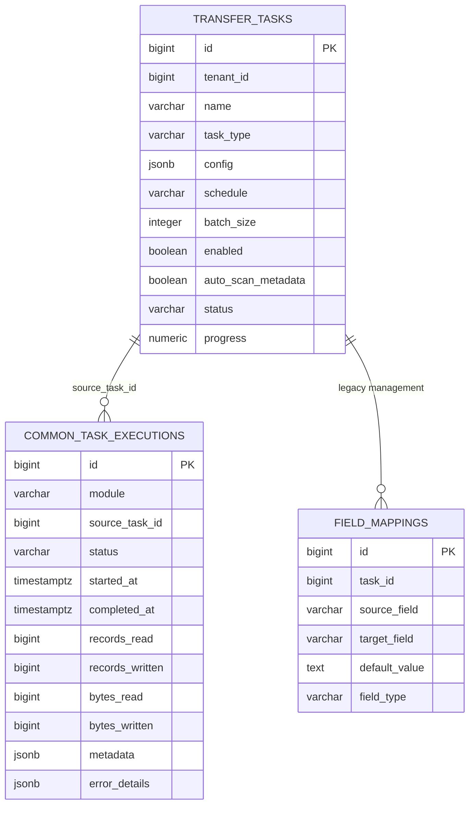

# Transfer 模块数据库架构

更新时间：2026-05-30

Transfer 模块只保存传输任务定义和少量模块级辅助配置。执行记录统一写入 `common.task_executions`，不再维护 Transfer 私有执行历史主表。

## 一、表清单

| 表 | 所属 schema | 用途 |
|---|---|---|
| `transfer.transfer_tasks` | `transfer` | Transfer 任务定义，核心配置在 `config` JSONB。 |
| `transfer.field_mappings` | `transfer` | 旧字段映射管理表；新主链路使用 `config.transforms[]`。 |
| `transfer.local_engines` | `transfer` | 旧本地引擎配置；新主链路以 System engine 为准。 |
| `common.task_executions` | `common` | 统一执行记录表，Transfer 通过 `module=transfer` 和 `source_task_id` 关联任务。 |

新增 Transfer 主链路不得重新引入私有 reader / writer 插件表、私有执行表或旧 local engine 路线。

## 二、关系图



## 三、任务配置存储

`transfer.transfer_tasks.config` 是当前主配置来源，使用 source / target endpoint JSON：

```json
{
  "mode": "batch",
  "source": {
    "engine": {"scope": "system", "id": 1},
    "resource": {
      "kind": "native_table",
      "path": {"schema": "public", "table": "roads"}
    },
    "data_type": "table",
    "representation": "native"
  },
  "target": {
    "engine": {"scope": "system", "id": 2},
    "resource": {
      "kind": "file",
      "path": {"path": "exports/roads.csv"}
    },
    "data_type": "table",
    "representation": "encoded",
    "format": "csv",
    "policy": {"write_mode": "overwrite"}
  },
  "transforms": [
    {
      "type": "field_mapping",
      "version": "v1",
      "mode": "project",
      "fields": [
        {"source": "name", "target": "road_name", "target_type": "string"}
      ]
    }
  ],
  "batch_size": 10000
}
```

旧 `source_id`、`target_id`、`connector_type`、`source_config`、`target_config`、`output_format`、`file_type` 等不再作为任务配置事实来源。

## 四、执行记录存储

Transfer 创建执行时写入 `common.task_executions`：

| 字段 | Transfer 用法 |
|---|---|
| `module` | 固定为 `transfer`。 |
| `source_task_id` | 对应 `transfer.transfer_tasks.id`。 |
| `status` | `pending`、`running`、`success`、`failed`。 |
| `records_read` / `records_written` | table Transfer 行数指标。 |
| `bytes_read` / `bytes_written` | 字节指标，后续 raw copy 会重点使用。 |
| `metadata.checkpoint_offset` | checkpoint 观测偏移。 |
| `metadata.checkpoint_state` | batch 进度、source/target marker 和诊断状态。 |
| `error_details.message` | 失败错误。 |
| `error_details.logs` | 简短执行日志。 |

Transfer API 会把统一执行记录投影为模块 DTO，以保持 `/api/v1/transfer/executions` 的响应结构。

## 五、Checkpoint 语义

当前 checkpoint 不表示可从中断点自动续写。

| 能力等级 | 当前语义 |
|---|---|
| observable | 已支持。用于进度展示、日志和故障定位。 |
| restartable | 已支持。失败执行 retry 会创建新 execution 并从头重新执行。 |
| resumable | 尚未进入主链路。需要 source seek、target 幂等提交和 provider marker 消费同时满足。 |

retry 规则：

- overwrite / 默认模式可 retry，从头执行。
- append 模式拒绝 retry，避免重复写入。
- retry 不携带旧 execution 的 checkpoint_state 继续写。

## 六、写后 Meta 扫描

任务成功后，如果 `auto_scan_metadata=true`，Transfer 会触发 Meta deep scan。扫描目标是写出资源所在容器：

| 写出资源 | 扫描目标 |
|---|---|
| native table | schema / database |
| NFS file | 父目录 |
| MinIO / S3 object | bucket/prefix |
| Shapefile refs | refs 所在目录或 prefix |

Meta scan 负责重新识别目标 item 的 attributes；Transfer 不直接写目标 Meta attributes。
