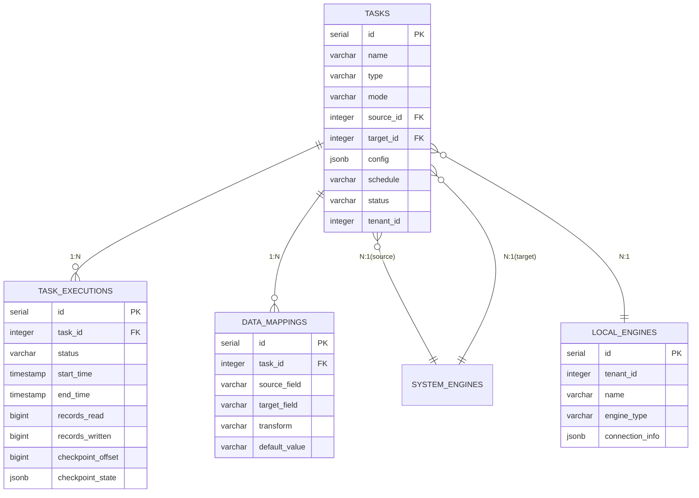

# Transfer 模块数据库架构

## 一、模块概览

Transfer 模块使用 PostgreSQL 的 `transfer` schema，负责数据导入、导出、同步功能。

### 核心职责

- **数据传输任务**：支持导入、导出、同步三种任务类型
- **执行历史追踪**：记录每次执行的详细信息和性能指标
- **字段映射**：定义源目标字段映射和转换规则
- **断点续传**：支持任务中断后从断点恢复

---

## 二、数据库表清单

| 表名 | 用途 | 行数估算 |
|------|------|---------|
| `tasks` | 传输任务定义 | 100-1000 |
| `task_executions` | 执行记录 | 10000-100000 |
| `data_mappings` | 字段映射 | 1000-10000 |
| `local_engines` | 本地引擎配置 | 10-100 |

---

## 三、表关系图

### 3.1 ER图（Mermaid）



### 3.2 关系说明

**核心关系**：
- `tasks.id` ← `task_executions.task_id` (1:N)
- `tasks.id` ← `data_mappings.task_id` (1:N)
- `tasks.source_id` → `system.engines.id` (N:1)
- `tasks.target_id` → `system.engines.id` (N:1)
- `tasks.source_id/target_id` → `local_engines.id` (N:1，可选)

---

## 四、数据流向

### 4.1 任务创建与执行流程

```
1. 用户创建任务
   ↓
2. tasks 表插入记录
   ├─ type: 'import' | 'export' | 'sync'
   ├─ source_id, target_id: 数据源
   └─ config: 任务配置
   ↓
3. 创建字段映射（可选）
   ↓
4. data_mappings 表插入记录
   ├─ source_field → target_field
   └─ transform: 转换函数
   ↓
5. 执行任务（手动或定时）
   ↓
6. task_executions 表插入记录
   ├─ status: 'pending' → 'running'
   ├─ start_time: 记录开始时间
   └─ checkpoint_offset: 0
   ↓
7. 任务执行器读取数据
   ├─ 从 source 读取数据
   ├─ 应用字段映射和转换
   ├─ 写入 target
   └─ 定期更新 checkpoint
   ↓
8. 执行完成
   ↓
9. task_executions 更新记录
   ├─ status: 'success' | 'failed'
   ├─ end_time: 完成时间
   ├─ records_read, records_written
   └─ bytes_read, bytes_written
   ↓
10. tasks 更新最后执行状态
    ├─ last_execution_id
    ├─ last_execution_status
    └─ progress: 更新进度
```

---

## 五、关键设计决策

### 5.1 任务类型与执行模式

**任务类型**：
- `import`：从外部导入数据到平台
- `export`：从平台导出数据到外部
- `sync`：双向同步数据

**执行模式**：
- `batch`：批处理，适合大数据量一次性传输
- `stream`：流式处理，适合实时数据同步
- `micro-batch`：微批次，平衡吞吐量和延迟

### 5.2 断点续传设计

**checkpoint_offset**：记录当前处理位置
**checkpoint_state**：保存断点详细状态（JSONB）

**使用场景**：
- 任务执行中断（网络故障、服务重启）
- 大数据量传输分批执行
- 增量同步（只传输新数据）

### 5.3 字段映射与转换

**灵活映射**：
- 支持字段名称映射
- 支持转换函数（如类型转换、格式化）
- 支持默认值

**转换函数示例**：
```json
{
  "transform": "UPPER(source_field)",
  "transform": "TO_DATE(source_field, 'YYYY-MM-DD')",
  "transform": "CAST(source_field AS INTEGER)"
}
```

---

## 六、相关文档

- [tasks表](tables/tasks表.md) - 任务定义表
- [task_executions表](tables/task_executions表.md) - 执行记录表
- [data_mappings表](tables/data_mappings表.md) - 字段映射表
- [local_engines表](tables/local_engines表.md) - 本地引擎表
- [Transfer 模块说明](../CLAUDE.md) - 模块整体架构
